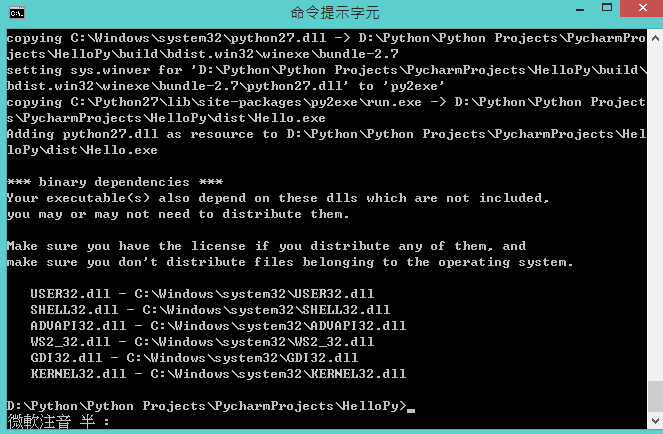
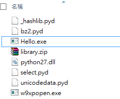
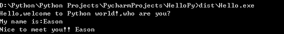
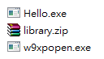
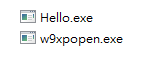
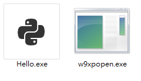

Title: Python - 使用 py2exe 製作 Python exe 執行檔
Date: 2015-01-03
Tags: Python, py2exe 
Slug: build-python-exe-using-py2exe Authors: kokokuo 
Summary: 用 Python 做開發程式，最後都會需要釋出來使用，但是一個可以給人使用的程式對使用者來說，特別是在 Windows 上，是需要可執行檔的。因此會需要把 Python 的 Script 檔案製作成 exe 執行檔。 並且最好的是，到了使用者的環境上不需要安裝任何 Python 的環境，也就是所有使用的套件包含 Python 環境都打包好了，而 Python 是一個有強大社群與 API 工具的語言，此文章這邊我先選擇 py2exe 做使用與測試。

# 前言
---
用 Python 做開發程式，最後都會需要釋出來使用，但是一個可以給人使用的程式對使用者來說，特別是在 Windows 上，是需要可執行檔的。因此會需要把 Python 的 Script 檔案製作成 exe 執行檔。
並且最好的是，到了使用者的環境上不需要安裝任何 Python 的環境，也就是所有使用的套件包含 Python 環境都打包好了，而 Python 是一個有強大社群與 API 工具的語言，而這邊我先選擇 py2exe 做使用與測試。

<br/>

# Python 的製作安裝執行檔工具介紹
---
在 PyPI 上有介紹幾款知名的製作執行檔的工具，這邊並且有支援開發 PyQt，有興趣的話可以去了解看看 – [Deploying PyQt Applications](https://wiki.python.org/moin/PyQt/Deploying_PyQt_Applications)，但是在這邊先以介紹 py2exe 為主。

<br/>
# 事前環境準備
---
我所使用的環境如下：
1. Windows 8.1 x64
2. Python 2.7.9 32bit
3. py2exe-0.6.9.win32-py2.7

<br/>

# 安裝步驟
---
1. 下載並選擇與 Python 對應的位元檔(32bit 或 64bit)，並且安裝好 py2exe。
2. 把開發的 Python 專案所在目錄打開，新建一個 setup.py 檔案在此目錄下(也就是與你編寫所要打包成 exe 的 Python .py 檔案還有你寫的 module、package 等等)，例如寫了一個 Script 是 Hello.py，並且放置在 HelloPy 目錄下，則 setup.py 也是在 HelloPy 下。

<br/>

# 製作 Console 程式的執行檔
---
py2exe 可以製作 GUI 與 Console 的 exe 執行檔，以下分別介紹：

## 撰寫 setup.py 設定檔案
### 1. 先 import 使用 p2exe 製作 setup 的所需要的 Package

```python
from distutils.core import setup
import py2exe
```

###  2. 加入要產生 exe 的 py 檔
接著對 `Hello.py` 寫了一個簡單的 Hello World 程式如下：

```python
print "Hello,welcome to Python world!,who are you?"
name = raw_input("My name is:")
print "Nice to meet you!! " + name
```

之後在 `setup.py` 中要對告訴 py2exe 要變為執行檔的是 `Hello.py`，並且再補上 `setup` 參數，變成：

```python
from distutils.core import setup
import py2exe
setup(
    console = [{'script': 'Hello.py'}]
)
```

### 3. 執行 py2exe 
進到 `setup.py` 所在的目錄下，然後在 CMD 執行：



完成後會有兩個資料夾分別叫做 `build` 與 `dist`
其中 `build` 資料夾為一些編譯過程的中間檔，而完成的結果則是在 `dist` 資料夾中，換句話說我們只需要 `dist` 目錄下的檔案。
接著打開後會如下圖，會夾帶了許多的檔案，接著我們便可以整個目錄帶走使用，這邊要切記，如果沒有這些目錄下的所有檔案，`.exe` 是無法作用的哦，如果想要解決這個問題可以接著往下看。



以下是執行 `Hello.exe` 的結果：



<br/>

# py2exe 製作 setup 的其他設定參數
---
在 py2exe 中有提供一個 Option，而 Option 中許多其他的參數用來協助你編寫 `setup.py`，可以參考此 [py2exe ListOfOptions](http://www.py2exe.org/index.cgi/ListOfOptions)。

## 打包成單一執行檔
如上的 Console 製作 exe 檔案，你會發現 `dist` 中還有許多其他的檔案存在，如果希望那些 `.pyd` 或 `.dll` 檔都打包進去，可以一個檔案著走，我們可以使用 Option 中的 `bundle_files` 參數，解說如下：

> bundle dlls in the zipfile or the exe. Valid values for `bundle_files` are: 3 = don’t bundle (default) 2 = bundle everything but the Python interpreter 1 = bundle everything, including the Python interpreter

所以我們修改一下 `setup.py`：

```python
from distutils.core import setup
import py2exe
 
setup(
    options = {'py2exe': {
        'bundle_files': 1
    }},
    console = [{'script': 'Hello.py'}]
)
```

再次執行打包後(記得先刪掉原先的打包後 `build`與 `dist` 資料夾)



這次就少了很多檔案，可是怎麼還是有 `library.zip` 呢？
這是因為剛剛那些檔案都被打包到這個 `library.zip` 檔案中了，那麼是否有辦法把 `library.zip` 也拿掉呢? 可以。

我們使用另一個參數叫做 `zipfile`，此參數如果設為 `None` 就可以打包到 exe 了!

> name of shared zipfile to generate; may specify a subdirectory; defaults to `library.zip`. If zipfile is set to None, the files will be bundled within the executable instead of `library.zip`.

所以我們再加上此行到 `setup.py` 中：

```python
from distutils.core import setup
import py2exe
 
setup(
    options = {'py2exe': {
        'bundle_files': 1
    }},
    console = [{'script': 'Hello.py'}],
    zipfile = None
)
```

結果如下：



等等!? 可是你會發現還有一個執行檔叫做 `w9xpopen.exe`，這又是什麼?
他其實是用來針對在 `Windows95`或 `Windows98` 下的可以使用 `os.popen` 所用的執行檔，透過`os.popen` 來調用外部程序，因此如果不需要在 95/98 下執行，便不需要這個檔案，所以最後這個 `Hello.exe` 就是我們可以攜帶用的執行檔囉！

### 注意
*如果安裝的 py2exe 是 64 位元，目前則無法使用 bundle_files，只能保持預設 bundle_files = 3 的模式。*

## 為你的 exe 檔案加上 Icon
為了美觀你的 exe 檔案在 Windows 上顯示時有小圖示，所以也有提供這個參數 `icon_resources`，使用方式如下：

1. 把你的 icon 放置在同樣專案的目錄下(如這裡是與 `setup.py`, `Hello.py` 一樣)
2. 加入 `icon_resources` 參數在 `console` 陣列設定中

```python
from distutils.core import setup
import py2exe
 
setup(
    options = {'py2exe': {
        'bundle_files': 1,
        'compressed': True,
    }},
    console = [{'script': 'Hello.py',"icon_resources": [(1, "your_icon.ico")]}],
    zipfile = None
)
```

結果如下圖 (圖片來源自 iconfinder)：



## error: MSVCP90.dll: No such file or directory
如果出現此問題，代表你的電腦沒有此 DLL 檔案，可以下載 `MSVCP90.dll` 並加入至 Python 目錄下的 DLLs 資料夾下即可(如我的是 `C:\Python27\DLLs`)
或是下載 [Microsoft Visual C++ 2008 Redistributable Package (x86)](https://www.microsoft.com/en-us/download/details.aspx?displaylang=en&id=29) 並安裝後，複製此 `MSVCP90.dll` 加入至 Python 目錄下的 DLLs。

<br/>

# 參考資料
---
1. [w9xpopen.exe 是干什么的](http://www.108kb.com/index.php/archives/64)
2. [List of Options](http://www.py2exe.org/index.cgi/ListOfOptions)
3. [PPT python2exe](https://www.ptt.cc/bbs/Python/M.1278481498.A.403.html)
4. [將 Python script 打包成 exe 執行檔](http://mf99coding.logdown.com/posts/206237-package-your-python-script-into-exe-executable)
5. [py2exe - generate single executable file](http://stackoverflow.com/questions/112698/py2exe-generate-single-executable-file#113014)