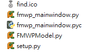
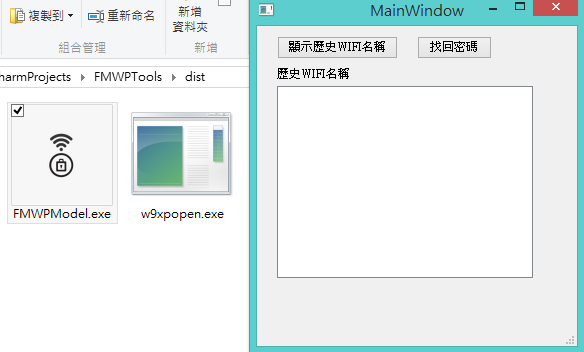

Title: Python - 使用 PyQt 與 py2exe 製作 GUI 視窗應用程式的 exe 執行檔
Date: 2015-01-04
Tags: Python, py2exe, PyQt
Slug: python-build-gui-app-pyqt-using-py2exe
Authors: kokokuo 
Summary: 在前一篇 [Python - 使用 py2exe 製作 Python exe 執行檔]({filename}/posts/20150103-build-python-exe-using-py2exe.md) 介紹了製作 exe 與初步認識，但是今天如果要製作的檔案是 GUI 執行檔，可就需要再修改了，此篇介紹如何產生 GUI 視窗程式用的 exe 執行檔，透過 PyQt 開發的視窗應用程式做一個基本的 exe 製作

# 前言
在前一篇 [Python - 使用 py2exe 製作 Python exe 執行檔]({filename}/posts/20150103-build-python-exe-using-py2exe.md) 介紹了製作 exe 與初步認識，但是今天如果要製作的檔案是 GUI 執行檔，可就需要再修改了，此篇介紹如何產生 GUI 視窗程式用的 exe 執行檔，透過 PyQt 開發的視窗應用程式做一個基本的 exe 製作

<br/>

# Python 環境
我所使用的環境如下：

1. Windows 8.1 x64
2. Python 2.7.9 32bit
3. [PyQt4-4.11.3-gpl-Py2.7-Qt4.8.6-x32](http://sourceforge.net/projects/pyqt/files/PyQt4/PyQt-4.11.3/PyQt4-4.11.3-gpl-Py2.7-Qt4.8.6-x32.exe/download)
4. [py2exe-0.6.9.win32-py2.7](http://sourceforge.net/projects/py2exe/files/py2exe/0.6.9/py2exe-0.6.9.win32-py2.7.exe/download?use_mirror=nchc&download=)

<br/>

# 使用 PyQt 製作 GUI 視窗的 `setup.py`

以下我以這隻協助尋找 Windows 上連線並儲存過 WiFi 密碼的尋找程式 - [PyQt-FMWPTools](https://github.com/kokokuo/PyQt-FMWPTools) 為例。

我需要製作成可執行檔的檔案名稱叫做 `FWMPModel.py`，而我會另外 import 同在 `FWMPModel.py` 路徑資料夾下的 `fmwp_mainwindow.py`.
`fmwp_mainwindow.py` 此檔案是 Qt 的 ui 檔，經過 PyQt 的轉換指令產生的 `.py` 檔案，檔案位在 `FWMPTools` 資料夾下，如下圖：



需要改變的地方有：
## 1. 把 console 改成 windows 程式
把原本的 console 改成 windows 後則不會有命令提示字元出現，而是只剩下程式本身的視窗，否則視窗與命令提示字元都會出現

## 2. 使用 `PyQt` 製作的 GUI 程式需要 `sip` 這個模組
要製作 `PyQt` 開發的程式需要 `sip` 這個模組。 在 [Wiki 的 PytQt](https://zh.wikipedia.org/wiki/PyQt) 中有提到 SIP 為是一個自動為 C 和 C++ 庫生成 Python 擴充功能模組的工具。 為了方便開發 PyQt，SIP 於 1998 被「Riverbank Computing」公司創造出來。不過，SIP 不專用於 PyQt，而是適用於所有的 C 和 C++庫 ( 其他介紹可以參考 [PyQt](https://riverbankcomputing.com/software/sip/intro) 網站與 [PyPI](https://wiki.python.org/moin/SIP) )。

所以 SIP 可以說是 PyQt 的底層，沒有這隻檔案便無法製作 exe 執行檔。不過我們不需要另外下載，因為 SIP 已經包含在 PyQt 中，我們只需要在 `setup.py` 中把它放到 `includes` 參數。

## 3. 加入打包的其他引入 Python 檔案
因為我有在 `FMWPModel.py` 中透過 `import` 加入視窗的 UI 定義檔案  `fmwp_mainwindow.py`，因此也需要把此檔案加入至 `includes` 中。 `includes` 只需要加入所有打包檔需要的其他 `module` 檔案即可，並且只需標示名稱 - **list of module names to include** 。

所以 `setup.py` 如下: 

```python
from distutils.core import setup
import py2exe
 
setup(
    options = {'py2exe': {
        'bundle_files': 1,
        'compressed': True,
        "includes" : ['sip','fmwp_mainwindow']
    }},
    windows = [{'script': 'FMWPModel.py',"icon_resources": [(1, "find.ico")]}],
    zipfile = None
)

```

結果畫面 :



<br/>

# 參考資料
1. [Py2exeAndPyQt](http://www.py2exe.org/index.cgi/Py2exeAndPyQt)
2. [使用 Py2exe 将 PyQt 程序打包为 exe 文件](http://www.pythoner.com/111.html)
3. [Using py2exe the right way](https://pythontips.com/2014/03/03/using-py2exe-the-right-way/)