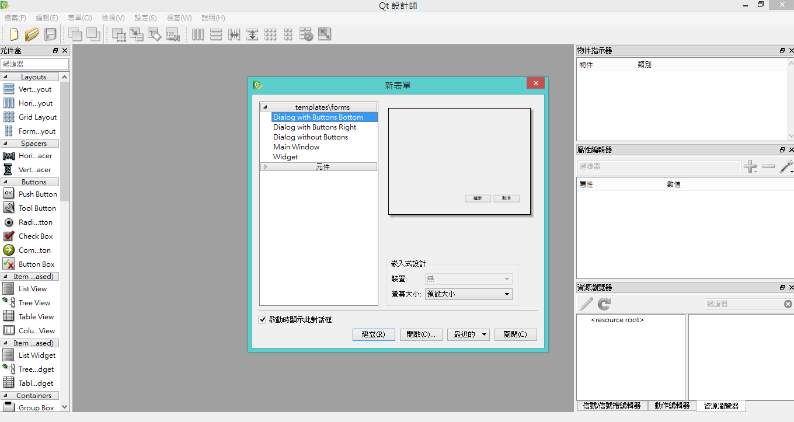

Title: Python - 在 Windows 上使用 PyQt 開發 Python 視窗程式
Date: 2015-01-05
Tags: Python, Windows, PyQt
Category: Python
Slug: windows-pyqt-install-develop-python-gui
Authors: kokokuo
Summary: Python 上最常用來開發 GUI 視窗的有 `thinker`、`PyGTK`、`wxPython` 與 `PyQt` / `PySide` 等等。
而其中由於 Qt 的資源很多，也是可以跨平台開發與使用，而 在 Python 上開發 Qt 則有 `PyQt` 可以選擇，如果有商業用途，則可以選擇 `PySide` －提供和 `PyQt` 類似的功能，並相容 API。但與 `PyQt` 不同處為使用 LGPL 授權，所以可以作為商業用途的軟體引用開發。

而本文即是使用 `PyQt` 作為 GUI 的開發。

# 前言
Python 上最常用來開發 GUI 視窗的有 `thinker`、`PyGTK`、`wxPython` 與 `PyQt` / `PySide` 等等。
而其中由於 Qt 的資源很多，也是可以跨平台開發與使用，而 在 Python 上開發 Qt 則有 `PyQt` 可以選擇，如果有商業用途，則可以選擇 `PySide` －提供和 `PyQt` 類似的功能，並相容 API。但與 `PyQt` 不同處為使用 LGPL 授權，所以可以作為商業用途的軟體引用開發。

而本文即是使用 `PyQt` 作為 GUI 的開發。

# ㄧ、安裝 PyQt
對照安裝好的 Python 版本是 2.7 還是 3.3 與位元版本 選擇對應的 PyQt，這邊我的環境是 Python 2.7.9 32bit，所以選擇 `PyQt4` 的 [PyQt4-4.11.3-gpl-Py2.7-Qt4.8.6-x32](http://sourceforge.net/projects/pyqt/files/PyQt4/PyQt-4.11.3/PyQt4-4.11.3-gpl-Py2.7-Qt4.8.6-x32.exe/download)，此安裝檔內已經包含 SIP 與 `Qt4.8.6`，所以事先不需要安裝 SIP 與 Qt

安裝完後，預設會自動在系統環境變數中加入 PyQt 的路徑:

```bash
C:\Python27\Lib\site-packages\PyQt4
```


<br/>

# 二、使用 Qt 的 `.ui` 檔做 UI 設計
如果要開發給 Python 用的 UI 檔案，可以使用 **Qt Creator** 來設計 UI，在 PyQt 中會提供 `designer.exe` 這個程式，該程式是 Qt 的一部分，一起提供進來方便做 UI 的開發，如下兩圖：


<br/>



<br/>

# 三、轉換 `.ui` 檔為 `.py` 檔作為 module 使用
產生完後的 `.ui` 檔，`PyQt` 還提供一個 Command 指令可以把 ui 檔案轉換成 `.py` 檔，方便我們直接在 Python 中調用。使用 CMD 切換到設計好的 ui 所在目錄下，執行此指令：

```python
pyuic4 your_qt_ui.ui -o output_name.py
```

即可產生出 py 檔，`pyuic4` 是 PyQt 預設代的指令，此檔案的路徑在 `C:\Python27\Lib\site-packages\PyQt4` 中，為一個 `.bat` 檔案，但是實際調用的是 `C:\Python27\Lib\site-packages\PyQt4\uic\` 下的 `pyuic.py` 檔案。

## 載入 UI 的範例
這邊我把原先的 `.ui` 檔案名稱改為 `fmwp_mainwindow.ui`，產生完的名稱是 `fmwp_mainwindow.py`，這邊我的主要 Script 檔案為 `FMWPModel.py`
於是在 `FMWPModel.py` 中一開始使用 `fmwp_mainwindow.py` 的程式如下：

```python
import fmwp_mainwindow
from fmwp_mainwindow import Ui_MainWindow
from PyQt4.QtGui import QMainWindow
 
class MainWindow(QMainWindow, Ui_MainWindow):
    def __init__(self, parent=None):
        super(MainWindow, self).__init__(parent)
        self.setupUi(self)
 
if __name__ == "__main__":
    app = fmwp_mainwindow.QtGui.QApplication(sys.argv)
    window = MainWindow()
    window.show()
    sys.exit(app.exec_())
```

如此即可完成，再執行 `FMWPModel.py` 就會顯示 GUI 視窗了！

<br/>

# 參考資料
1. [Convert pyQt UI to python](https://href.li/?http://stackoverflow.com/questions/18429452/convert-pyqt-ui-to-python)