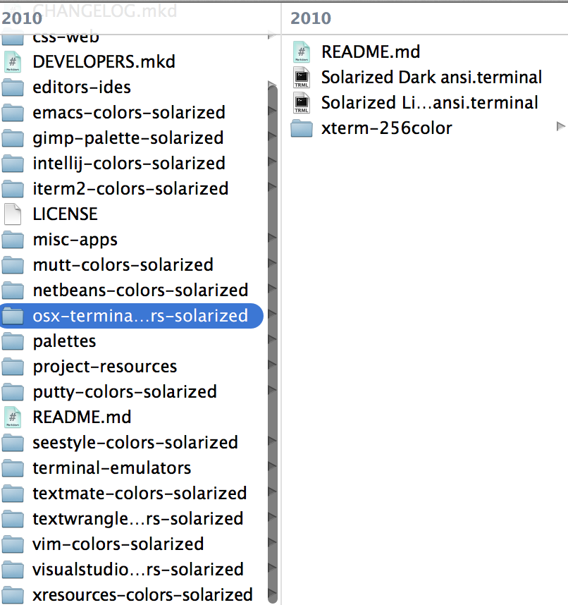
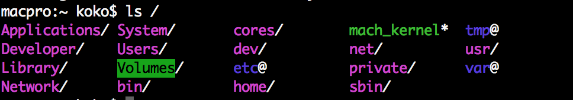
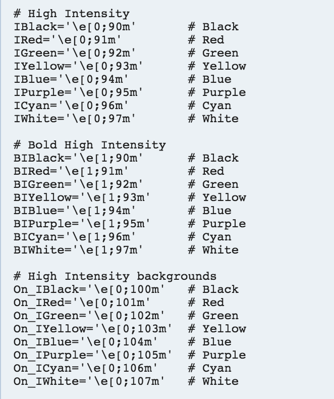

Title: Mac - 使 Mac Terminal 有顏色 ( Prompt 與 ls )
Date: 2015-01-06
Tags: Mac, Terminal
Category: 編輯器
Slug: mac-terminal-bash-color
Authors: kokokuo
Summary: 開始學習使用終端機（ Terminal ），但是預設的 Terminal 只有兩種顏色，通常都是黑白配色，而 Mac 的終端機雖然可以有編輯配色，但是依然還是很單調，所以這邊要來筆記一下，如何更改配色。

# 前言
開始學習使用終端機（ Terminal ），但是預設的 Terminal 只有兩種顏色，通常都是黑白配色，而 Mac 的終端機雖然可以有編輯配色，但是依然還是很單調，所以這邊要來筆記一下，如何更改配色。

# 使用現有的配色方案－以 solarized 為例
在網路上已經有許多提供給終端機的配色方案，而這邊以算是滿 popular 的 `solarized` 為例，介紹如何安裝網路上提供的現有配色方案。

## 1. 下載 solarized 配置檔
首先我們下載 [solarized](http://ethanschoonover.com/solarized) 配置檔並解壓縮後，會看到 `solarized` 提供了許多可以配置的環境：



## 2. 執行配色檔案
在上圖你會看到 `solarized/osx-terminal.app-colors-solarized` 這個目錄下有一些檔案。如果是使用 Terminal，則直接點擊 `Solarized Dark ansi.terminal` 與 `Solarized Light ansi.terminal`，透過安裝配色檔案到 Terminal 中即可完成了。


# 修改執行 `ls` 指令時顯示的配色
如果我們希望顯示的資料夾或檔案依據不同類型而有配色時，那我們便需要對 `ls` 這個指令做修改。

## 1. 啟動 `ls` 配色功能
首先在 Home 中開啟 `.bash_profile` ( 如果沒有則新建 )
在檔案中加入以下此行：

```bash
export CLICOLOR=true
```

儲存後，再重新開啟 Terminal 打入 `ls` 便會發現顏色不同。


## 2. 客製化 `ls`
不過上述設定 `CLICOLOR` 是開啟預設的配色，如果要客製化怎麼辦？ 那麼我們就可以透過 `LSCOLORS` 來手動修改，如下：

```bash
export LSCOLORS="fxexbxdxcxegedabagacad"
```

不過上述這很長的字串是什麼呀？ 這是 Terminal 的 `ls` 指令配色格式， `LSCOLORS` 需要照著順序設定顏色，依序是：

1. directory
2. symbolic link
3. socket
4. pipe
5. executable
6. block special
7. character special
8. executable with setuid bit set
9. executable with setgid bit set
10. directory writable to others, with sticky bit
11. directory writable to others, without sticky bit

顏色的對應值如下，例如 `a` 表示黑色，`b` 表示紅色，以此類推。

- a = black
- b = red
- c = green
- d = brown
- e = blue
- f = magenta
- g = cyan
- h = light grey
- A = bold black, usually shows up as dark grey
- B = bold red
- C = bold green
- D = bold brown, usually shows up as yellow
- E = bold blue
- F = bold magenta
- G = bold cyan
- H = bold light grey; looks like bright white
- x = default foreground or background

而因為每種類型文件都有兩種顏色 - **前景色**與**背景色**，所以上述這串 `LSCOLORS` 的設定如果數算下來會是剛好 22 個字元長度。

```bash
export LSCOLORS="fxexbxdxcxegedabagacad"
```

像是的開頭 `fx` 表示目錄的前景色是 **magenta**，背景底色是原先 Terminal 的底色以此類推，設定完後如下圖：


另外，如果覺得這長串的配色很難設定，也可以參考此[網站](http://geoff.greer.fm/lscolors/)，透過所見即所得來協助產生 `LSCOLORS` 的配色字串。

# 顯示執行 `ls` 時，各種檔案目錄所夾帶的額外訊息

其實也就是預設包含 `-F` 指令，使其輸入 `ls` 時，如果是目錄可以看到 **slash(/)**，如果是執行檔可以看到 **(*)** 等功能，一樣編輯 `.bash_profile` 並加入：

```bash
alias ls='ls -Fh'
```

最後重新開啟 Terminal 即可，如下



# 修改 Termnial bash Prompt 的顯示內容與順序

這部分是可以用來修改 Terminal 的 Prompt 顏色與順序，原先如下圖：


首先我們可以改變顯示的順序與規則，例如我要修改成下圖這樣的排列：


我們要從修改 `.bash_profile` 檔案動刀，開啟此檔案並編輯加入此行：

```bash
export PS1='[\u@\h:\w] $ '
```
完成後再重新開啟 Terminal 即會完成。

其中這些符號代表的意思如下：

- `PS1`: 主要的 Prompt，其他還有 `PS2`、`PS3` 與 `PS4`
- `\u`: 代表現在操作的使用者名稱
- `\h`: 主機名稱
- `\w`: 表示目前所在的目錄

至於 `@`, `:`, `$` 還有 `[]`只是用來分隔使用者名稱、主機名稱與目錄用的符號而已。
更多的參數如下圖，來源 [Color Bash Prompt](https://wiki.archlinux.org/index.php/Color_Bash_Prompt)


# 修改 Prompt 的顏色
而修改顏色的部分，則是在上述的參數在另外補上顏色參數：

```bash
export PS1='[\[\e[0;96m\]\u\[\e[0m\]@\[\e[0;92m\]\h\e[0m\]:\w] \e[0;93m\]$\[\e[0m\] '
```

使用的顏色有：

- Cyan: `\e[0;96m`
- Green: `\e[0;92m`
- Yellow: `\e[0;93m`
- Text Rest: `\e[0m`

此外要使用顏色需要在上述的顏色符號前後加上 `[` 與 `]` 來作為一個標記，所以如果要在 `\u` 也就是操作使用者字串上加上顏色，會變成如下的格式 :

```bash
\[\e[0;96m\]\u
```

但是上述還會造成一個問題，就是 Cyan 這個顏色會影響到 `＠` 符號，因為顏色會被繼續使用下去，此時便會需要使用到 Text Rest 來重置。
如果你只想要某個符號只有 Cyan，當你配好顏色後要記得在後面補上 `\e[0m`，同時也要在前後加上 `[` 與 `]` 變成所以最後結果會是：

- `\u` 變成 => `[\e[0;96m]\u[\e[0m]`
- `\h` 變成=> `[\e[0;92m]\h\e[0m]`
- `$` 變成=> `\e[0;93m]$[\e[0m]`

其他部分保持不變。


完成。

更多的顏色配色參數如下 ( 來源 [Color Bash Prompt](https://href.li/?https://wiki.archlinux.org/index.php/Color_Bash_Prompt) ):


<br/>



<br/>

# 參考資料
1. [在 Mac OS X 终端里使用 Solarized 配色方案](http://www.vpsee.com/2013/09/use-the-solarized-color-theme-on-mac-os-x-terminal/)
2. [Mac 讓終端機 ls 有顏色](http://sodahau.logdown.com/posts/18879-mac-ls)
3. [Simple Tricks to Improve the Terminal Appearance in Mac OS X](http://osxdaily.com/2013/02/05/improve-terminal-appearance-mac-os-x/)
4. [How to: Change / Setup bash custom prompt (PS1)](http://www.cyberciti.biz/tips/howto-linux-unix-bash-shell-setup-prompt.html)
5. [Color Bash Prompt](https://wiki.archlinux.org/index.php/Color_Bash_Prompt)
