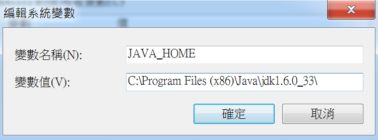
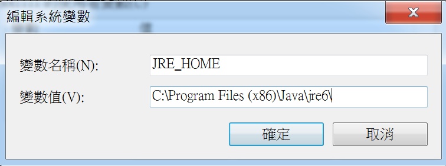
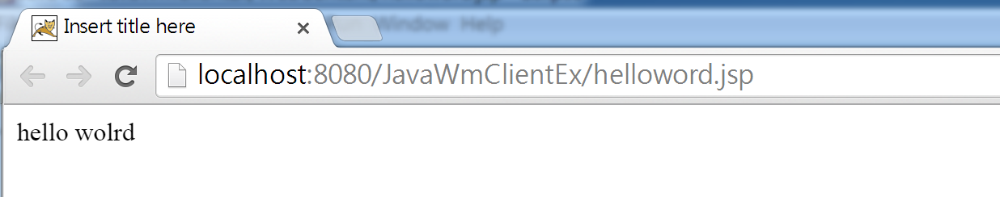

Title: Windows - 透過 Eclipse 建置 JSP 網頁在 Tomcat 上
Date: 2015-01-18
Tags: Windows, JSP, Servlet, Tomcat, Eclipse
Slug: build-your-first-jsp-servlet-page-witch-tomcat-on-eclipse
Authors: kokokuo
Summary: 因為專案的關係，第一次觸碰 JSP，所以筆記一下如何在 Windows 上建置環境，並且藉由 Eclipse 執行 Tomcat 啟動 JSP 網頁

# 前言
因為專案的關係，第一次觸碰 JSP，所以筆記一下如何在 Windows 上建置環境，並且藉由 Eclipse 執行 Tomcat 啟動 JSP 網頁。

# 環境準備
為了在使用 Java 開發 JSP 網頁，並且透過 Tomcat 啟動，所以我們需要以下工具：
1. **JDK** : Java 的開發環境，基本上使用 SE 就可以，需要多的功能再安裝 EE，這裡我是配合專案的環境使用 [JDK 6u33](http://www.oracle.com/technetwork/java/javase/downloads/java-archive-downloads-javase6-419409.html)
2. **Tomcat** : 去 Tomcat 官網下載 Core 版本，依照作業系統選擇，這邊也是為了配合專案使用 [6.0.43](http://tomcat.apache.org/download-60.cgi)
3. **IDE 工具** : 市面上有很多好用的開發工具，這邊先以 Eclipse IDE for J2EE 版本為主。

# 安裝環境與設定

## 1. 安裝 JDK
下載並安裝完 JDK 後，首先我們需要來設置環境變數，分別設置 `JAVA_HOME` 與 `JRE_HOME`，使系統找得到 Java SDK 與執行 JAVA 程式的路徑。

`JAVA_HOME` 如下：



`JRE_HOME` 如下：




## 2. 啟動 Tomcat
下載的 Tomcat 在解壓縮後會直接包含執行檔與相關檔案，此時只要啟動 `bin` 目錄底下的 `startup.bat` 腳本，便會開始執行，成功後會如下圖：


預設的 Tomcat 會使用 `8080` Port，因此輸入網址 [http://127.0.0.1:8080](http://127.0.0.1:8080) 會出預設的 Tomcat 的伺服器啟動畫面 :


接著我們來設置 IDE 的 Eclipase 環境，讓我們在透過 Eclipse 在開發 Java 的 Web 程式時，可以執行使 Eclipse 找到 Tomcat 並啟動 Tomcat 來除錯 Java 的 Web。

## 3. 在 Eclispe 上設置 Tomcat Server
如上所述，為了開發與 Debug 的便利性，我們直接透過 Eclipse 設定 Tomcat，方便我們直接透過 Eclispe 來執行 Tomcat Server 並看到執行結果。

### (1.) 設定 Runtime Server
開啓 Eclipse 後，選擇 `Windows` > `Preferences` > 點選 `Server` 展開後，選擇 `Runtime Environments` > 點選 `Apache` 目錄，選擇你下載 `Apache Tomcat` 的版本，勾選 `Create a new local server`:


### (2.) 指定 Tomcat 目錄位置
如下圖，指定你下載的後解開的目錄路徑，Eclispe 預設可選的 Tomcat 版本名稱，並非是所下版的版本號的話，不用擔心可以照樣指定：


之所以會有預設版本號，只是當 Eclipse 沒有找到時，會預設下載此版。

完成後便會在 `Project Explorer` 看到 `Servers` 資料夾，裡面存放 Eclipse 所用的 Tomcat Local 端 config 資料，如 `web.xml`, `server.xml` 等。

### (3. ) Eclispe 的 Tomcat Server 設定
再來，我們可以為這個 Eclipse 上的 Server 做一些設定，因為這個 Server 是 Eclipse 另外產生的一份，所以編寫好的程式專案不會預設放在真的 Tomcat Server 上，而且 Server 的一些 `server.xml` 與 `web.xml` 等設定檔案也是另外 copy 的一份，不會影響到原先真正的 Tomcat Server，除非你指定，那麼這部分便是做 Tomcat 的細部設定，在這裏有做部分轉載備份，更多詳細的教學可以參考此 [Eclispe 與 Tomcat 結合使用文章](https://dotblogs.com.tw/alantsai/archive/2013/09/30/eclipse-work_with_tomcat.aspx)。

首先我們開啟 Servers 的 view，如果找不到，則透過 `Windows` > `Show View` 去尋找 Servers，如下：


便會開啟此畫面：


在上圖中可以稍微注意一下幾個設定：

#### Server Locations
如果改成 `Tomcat Installation`，則會把預設放在 `workspaces` 下的 `.metadata/.plugins/org.eclipse.wst.server.core/tmp0` 內指向的預設網站位置直接改成在 Tomcat Server 底下。

而發佈的路徑如果沒有修改，則是放在 Eclipse 預設的 `wtpwebapps` 目錄下，而這樣修改後我們就可以在 Eclipse 外面啟動 Tomcat Server ( startup.bat 檔案 ) 直接來瀏覽我們的網站。

如果不能夠修改放置位置，那是因為你那個 Server 目前有 Module，只要把 Module 刪除了就能夠修改，而 Module 的路徑便是原先指定的 `metadata/.plugins/org.eclipse.wst.server.core/tmp0` 下。

以下稍微介紹一下 Tomcat 子目錄：
- `lib` : 存放 JAVA 的類別庫
- `bin` : 存放各種平臺下啟動和關閉 Tomcat 的指令檔
- webapps : 實際要部署的 WEB 應用程式存放的地方。 Java 開發的 Web 網站或 war 檔放入這個目錄下就可以通過 Tomcat 伺服器訪問
- `conf` => Tomcat server 的主要設定檔，如 `web.xml`, `server.xml`, `tomcat-user.xml` 檔案
- `work` => JSP 網頁編譯為 Servlet 過後的 `.java` 檔案與 `.class` 執行檔案

更多細節可以參考此文章 [tomcat 各個資料夾的作用](https://fecbob.pixnet.net/blog/post/38258415-tomcat%E5%90%84%E5%80%8B%E8%B3%87%E6%96%99%E5%A4%BE%E7%9A%84%E4%BD%9C%E7%94%A8)


#### Server Options
如果無勾選 **「 Serve modules without publishing 」** 表示直接在 Eclispe 下執行專案時，會先複製該專案資源一份，並提供給 Server 會使用。
這樣的好處是如果我們網站有修改某個資源，例如更新設定檔案 `web.xml`、`server.xml` 或是 `tomcat-user.xml` 時不會真的影響到我們專案；而如果勾選了，則是直接使用專案的資源而不另外拷貝一份。

#### 修改 Port
預設 Tomcat 的 Port 是 `8080`，如果想要更換 Port 時可以透過此位置修改，或是直接開啟 `server.xml` 檔案，修改也可。

#### Publishing
是否當專案資源修改後便會自動更新部署到 Server 上面。

#### Timeout
當專案比較大的時候，然後又有啟動 Debug 模式時，很容易會因為建置時間過長，使 Tomcat 發生 Timeout 導致啟動失敗，所以可以在此調整時間。

## 4. 第一個 JSP 網頁
當完成上述的設定後，我們便可以進入網頁的開發。在 Eclispe 新增專案，選擇 `Web` > `Dynamic web project`，然後會看到 `Project Explorer` 中有 `WebContent` 目錄，在此目錄下新增 JSP 網頁。

接著在 `body` 標籤中，輸入 `JSP` 標籤，如下：

```java
<body>
    <%=
        "hello world"
    <%
</body>
```
上述的是 JSP 的表達式標簽，會把資訊透過字串的方式直接顯示在網頁上，完成後點選執行便會如下圖結果：



