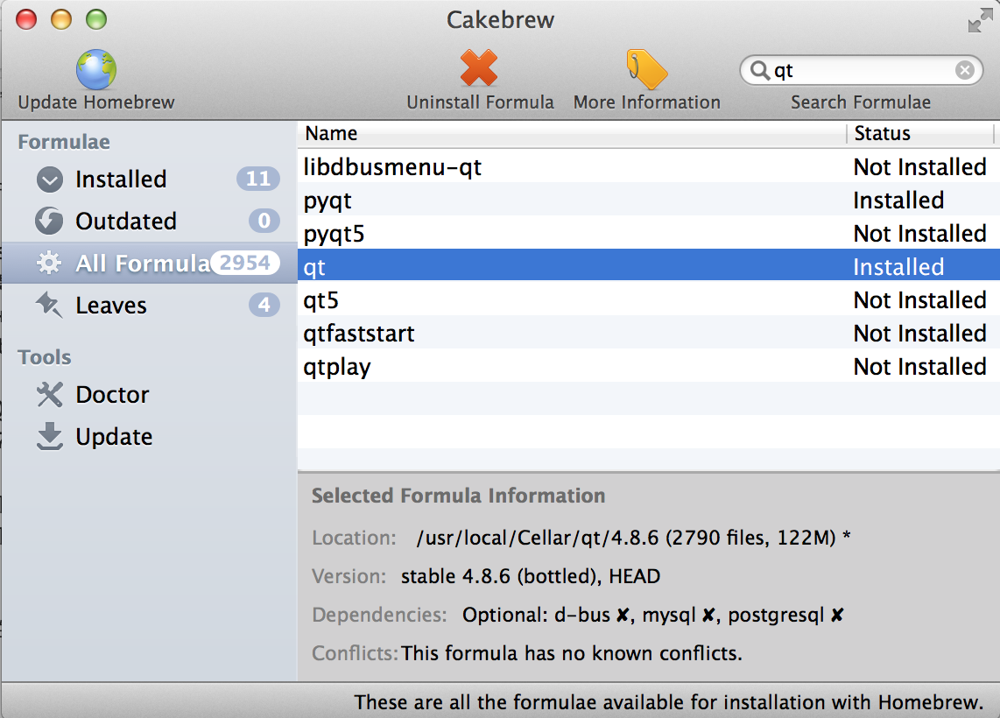
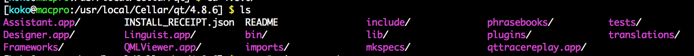

Title: Python - 在 Mac 上安裝 PyQt 開發 GUI 視窗程式
Date: 2015-02-14
Tags: Mac, Python, PyQt
Category: Pelican
Slug: mac-install-pyqt-develop-python-gui
Authors: kokokuo
Summary: 在前一篇 [Python - 在 Windows 上使用 PyQt 開發 Python 視窗程式]({filename}/posts/20150105-windows-pyqt-install-develop-python-gui.md) 介紹了在 Windows 上開發 PyQt 的視窗程式，而因為本人也有在使用 Mac 所以也要筆記一下如何安裝囉。

# 前言
在前一篇 [Python - 在 Windows 上使用 PyQt 開發 Python 視窗程式]({filename}/posts/20150105-windows-pyqt-install-develop-python-gui.md) 介紹了在 Windows 上開發 PyQt 的視窗程式，而因為本人也有在使用 Mac 所以也要筆記一下如何安裝囉。

<br/>

# 事前安裝須知
在 Mac 上安裝 PyQt 不像在 Windows 上方便可以直接到 PyQt 官網下載整合在一起的安裝檔，必須要額外自行安裝一些工具才行，包含 :

1. **Qt** : Qt 開發工具，因為 PyQt 是建構在 Qt 上所以需要相依函式庫
2. **Sip** : SIP 是一個自動為 C 和 C++ 庫生成 Python 擴充功能模組的工具。為了方便開發 PyQt 用，因此 PyQt 官網也有提到需要先安裝 SIP

因此我們需要先安裝完上述兩個套件後才能安裝 PyQt。

另外，PyQt 中目前分成 PyQt4 與 PyQt5，對應到的是 Qt4 與 Qt5 兩個版本；而 Python 的版本上目前分成 `2.7` 與 `3.4` 兩種，`2.7` 主要是可以在 Qt4 上執行，`3.4` 則是對應 Qt5。

所以在版本的考量上我們可以選擇：

- 選擇 Python 2.7 : 下載 Qt4 與 PyQt4 
- 選擇 Python 3.4 : 下載 Qt5 與 PyQt5

了解後，我們便準備開始在 Mac 上安裝吧。

而此文章會使用架構在 Homebrew 上的 Cakebrew 套件來做方便我們以圖形化的軟體瀏覽與安裝套件，當然如果覺得沒有 GUI 呈現的 Cakebrew 也沒差，直接安裝 Homebrew 在下指令即可。

在本篇文章中，選擇安裝 Python2.7.9，所以在 PyQt 的版本選擇 PyQt4，而且目前 Resource 也是 PyQt4 相對好找。

<br/>

# 安裝流程

## 1. 安裝 Homebrew 

到 Homebrew 官網複製下載的代碼，然後開啟 Terminal 輸入以這段下載的代碼 :

```bash
ruby -e "$(curl -fsSL https://raw.githubusercontent.com/Homebrew/install/master/install)"
```

由於 Mac 內建 Ruby 的指令，所以可以直接執行。

## 2. 安裝 Cakebrew 
到 [Cakebrew 官網](https://www.cakebrew.com/) 下載 Cakebrew 並安裝。安裝好後接著如下圖，搜尋 Qt 並選擇 `qt`，預設是下載 `qt4.8.6`



透過 Cakebrew 下載的套件會統一放在 `/usr/local/Cellar/` 這個路徑的目錄下做方便管理，如這邊 `qt` 則是安置在 `/usr/local/Cellar/qt/`

## 3. 安裝 SIP
如下圖，安裝 SIP :


## 4. 最後安裝 PyQt
選擇 `pyqt` 下載 `pyqt4` 的版本 :


一樣可以到 `/usr/local/Cellar/` 下尋找有無 `pyqt` 的目錄，並且 `/usr/local/Cellar/pyqt/4.11.1/bin` 中是否有 `pyuic4` ( 此時的版本剛好是 `4.11.1` )


<br/>

# 透過 Qt4 的 QtDesigner 設計視窗程式的 UI 介面
在我們安裝好 Qt4 後，可以在路徑 `/usr/local/Cellar/qt/4.8.6` 找到 `QtDesigner.app` 這個軟體。



如同 `QtDesigner.app` 的功用，藉由 `QtDesigner.app` 協助我們直接設計視窗程式的 UI 介面，如下：


或是若已經有安裝 `Qt Creator` 開發環境，也可以直接使用裡面的 `QtDesigner` 來設計 UI 介面並保存該檔案。

<br/>

# 轉換 Qt Designer UI 檔案為 `.py` 擋
`pyuic4` 協助我們把透過 Qt Creator 或是 ``QtDesigner.app`` 產生好的 UI 元件定義檔案，轉換成 Python 的元件定義檔案。 因此我們可以透過 PyQt 提供的指令 `pyuic4` 來做轉產生 `.py` 檔案作為 Module。

指令如下：

```bash
$> pyuic4 <yourUI.ui> -o <yourUI.py> 
$> pyuic4 pyqtminwindow.ui -o pyqtminwindow.py # 範例
```

藉由把上述的 `pyqtminwindow.ui` 轉換為 `pyqtminwindow.py` 檔案後，再把這 Python 的 UI 元件定義檔案，以 `import` 的方式提供給主程式使用 :

```python
import sys
import pyqtminwindow
from pyqtminwindow import  Ui_MainWindow
from PyQt4.QtGui import QMainWindow
class MainWindow(QMainWindow, Ui_MainWindow):
    def __init__(self, parent=None):
        super(MainWindow, self).__init__(parent)
        self.setupUi(self)
 
 
if __name__ == "__main__":
    app = pyqtminwindow.QtGui.QApplication(sys.argv)
    window = MainWindow()
    window.show()
    sys.exit(app.exec_())
```

<br/>

# 參考資料
1. [INSTALL PYQT4, QT 4.7 ON MAC OSX LION](http://stevenyue.com/2011/10/27/install-pyqt4-qt-4-7-on-mac-osx-lion/)
2. [What is PyQt?](http://www.riverbankcomputing.com/software/pyqt/intro)
3. [Setup qmake for Qt Creator on Mac](http://stackoverflow.com/questions/13103879/setup-qmake-for-qt-creator-on-mac)
4. [Cannot make new project in QT on mac osx](http://stackoverflow.com/questions/15713682/cannot-make-new-project-in-qt-on-mac-osx)