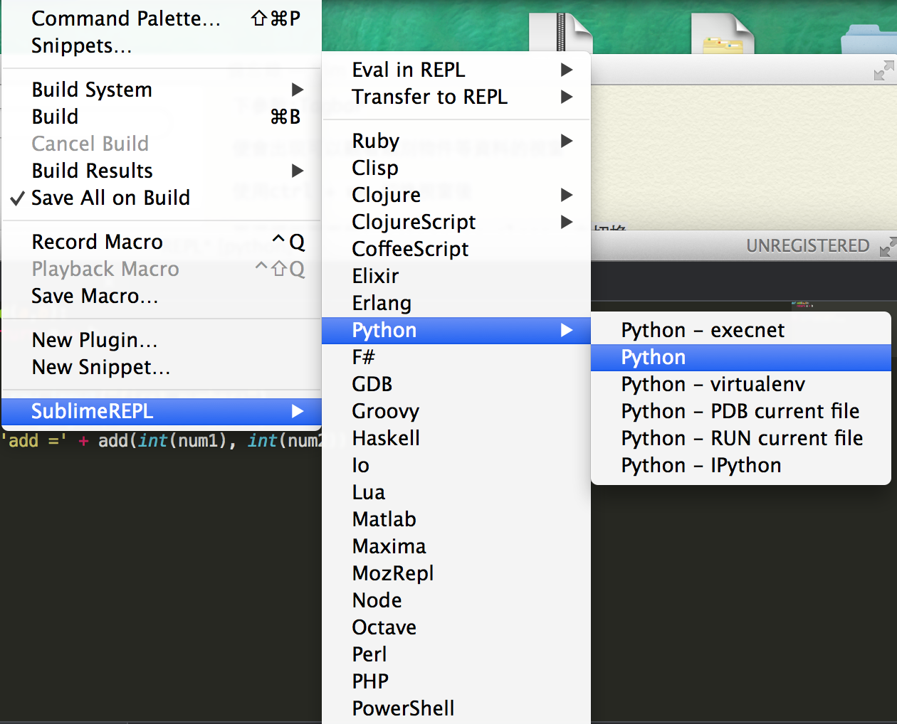
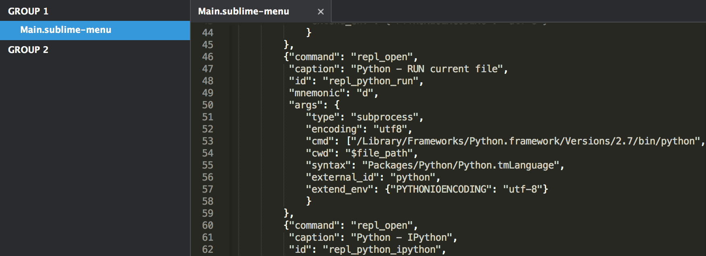

Title: 使用 SublimeREPL 解決 Python 在 Sublime 內操作 Termial 控制台時出現 EOF when reading a line
Date: 2015-02-18
Tags: Mac, Python
Slug: sublime-python-eof-when-reading-line-sublimerepl
Authors: kokokuo
Summary: 使用 Sublime 撰寫 Python 程式時，若使用 `raw_input` 函式，當操作 Sublime 內建的 Termial ( 透過 `Command + B` ) 啟用 Sublime 的 Python 控制台時，會出現以下錯誤 `EOF when reading a line`，而本篇會介紹如何解決此問題。

# 前言
---
使用 Sublime 撰寫 Python 程式時，若使用 `raw_input` 函式，當操作 Sublime 內建的 Termial ( 透過 `Command + B` ) 啟用 Sublime 的 Python 控制台時，會出現以下錯誤 `EOF when reading a line`，而本篇會介紹如何解決此問題。

<br/>

# 如何處理
---
其實上述中提到的問題 `EOF when reading a line` 是因為 Sublime 沒有支援輸入的參數。


其實這個問題可以透過一個插件 - [SublimeREPL](https://github.com/wuub/SublimeREPL) 來處理。
**SublimeREPL** 中的 REPL 全名為 **read-evaluation-print-loop**，負責處理解釋型語言編譯運行的過程。裝了 SublimeREPL 插件後也支持了編輯器上直接的編譯運行和交互。

<br/>

# 安裝 SublimeREPL
SublimeREPL 是一個可以提供許多 Sublime 可以執行許多腳本語言的直譯器環境，在套件官網的介紹有提到，像是 `Lua`, `NodeJS`, `Python`, `R`, `Ruby`, `Scala` ... 等皆可：

> Run an interpreter inside ST2 (Clojure, CoffeeScript, F#, Groovy, Haskell, Lua, MozRepl, NodeJS, Python, R, Ruby, Scala, shell or configure one yourself) 

因此也提供了可以在 Sublime 中執行 Python 直譯器的環境，也可以如在 Terminal 下執行。

## 安裝步驟與使用方式
1. 在 Sublime 的控制台中安裝 `Package Control`
2. 鍵盤按下 `Shift + Command + P` 開啟指令面板 ( Command Palette )，輸入 `Install Package` 並按下確認後，再輸入 `SublimeREPL` 安裝並重啟即可。

開啟後在點選 `Tool` > `選擇 SublimeREPL` > `Python`，如果要執行現在的檔案 選擇 `run current file` 或是直些啟動 Python 終端機 :



<br/>

# Python 版本設定
---
因為 Mac 本身內建 Python，而其版本並非後來安裝的版本，因此如果你想要使用自己下載的 Python 可以做一些設定來修改應的版本。

## 1. 開啟 `Main.sublime-menu` 檔案
點選 `Browse Package`，並進入到 `Package` 目錄下，接著依序尋找 `SublimeREPL` > `config` > `Python` > `Main.sublime-menu`，找到 `Main.sublime-menu` 後開啟。

若是在 Mac 中路徑如下 :


## 2. 編輯 `cmd` 的參數
開啟此份文件後，你會發現他有四個 `caption Key` 值，分別對應到的變數 Sublime 中 SublimeREPL 列表下 Python 顯示的六種執行直譯器方式，如下圖：


因此我們可以針對不同執行 Python 直譯器的使用方式選擇所要的 Python 版本，並修改 `cmd` 的第一個參數值即可。

## 3. 修改 Sublime 中的 `PythonTerminal` 直譯器版本
例如，若要直接修改 Sublime 中啟用的 Python 直譯器（類似 Terminal 的方式)。

### (1.) 尋找 `caption` 為 Python 的數值
`caption` 的數值便是顯示在在 Sublime 中實際顯示在軟體上的文字，因此變透過此文字尋找你要修改的類型。

### (2.) 修改 cmd 第一個參數
`cmd` 的第一個參數是 Python 直譯器的路徑，並且預設的 Python 參數會去撈取預設的 Mac Python，因此若有需要，可以把第一個參數修改成自己安裝的 Python 版本，例如自己安裝的 Python 版本所在的路徑是：

```bash
/Library/Frameworks/Python.framework/Versions/2.7/bin/python
```


## 4. 修改 Sublime 中的目前 Python 檔案執行所要的版本
若是要修改目前正在開發的 Python 檔案所使用的 Python 直譯器版本，可以選擇 `Python – RUN current file` 的 `caption` 數值，並且一樣的修改 `cmd` 參數即可，如下：



完成後，再透過 `Tool` > `SublimeREPL`，選擇 `Python` 或是 `Python – RUN current file` 執行一次即可 :


<br/>

# 附註 – 使 Python 直譯器的執行畫面不會開視窗的處理
---
這樣另開一個視窗不太方便，此時便可以選擇 `View` > `Layout` 來選擇想要切分的畫面。自己習慣分成上下兩個的視窗，所以選 ROW

或是輸入：

```bash
shift + alt + command + 2
```

亦可以切割成上下兩個視窗。

<br/>

# 補上參數 `-i` 進行終端機互動
---
如果補上參數 `-i` 則可以使程式在直譯完後，進入終端機的互動模式。

以下是官方介紹：

> When a script is passed as first argument or the -c option is used, enter interactive mode after executing the script or the command, even when sys.stdin does not appear to be a terminal. The PYTHONSTARTUP file is not read.
> 
> This can be useful to inspect global variables or a stack trace when a script raises an exception. See also PYTHONINSPECT.

因此我們可以開啟 `Main.sublime-menu` 並在 `cmd `指令的參數中，加上 `-i` 來與 Terminal 互動。


<br/>


<br/>

# 參考資料
---
1. [【已解决】Sublime 中运行带 input 或 raw_input 的 Python 代码出错：EOFError: EOF when reading a line](http://www.crifan.com/python_sublime_text_2_eoferror_eof_when_reading_a_line/)

2. [Directing Sublime Text 2 Packages to the correct python installation](http://stackoverflow.com/questions/10712390/directing-sublime-text-2-packages-to-the-correct-python-installation)

3. [SublimREPL 文件](https://sublimerepl.readthedocs.org/en/latest/)

4. [四步將 sublime 打造成 python 開發 IDE](http://www.99ya.net/234.html)

5. [【計算機】SublimeREPL 配置 python 交互式終端快捷鍵](http://blog.sina.com.cn/s/blog_6476250d0101a881.html)

