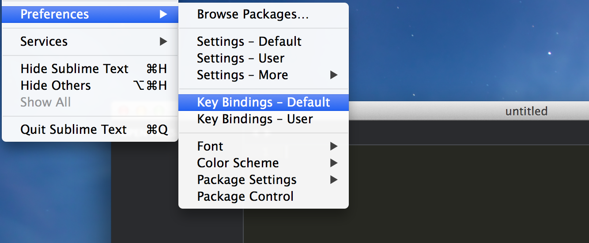
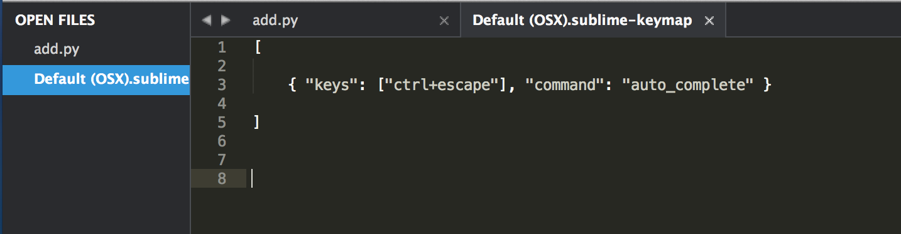
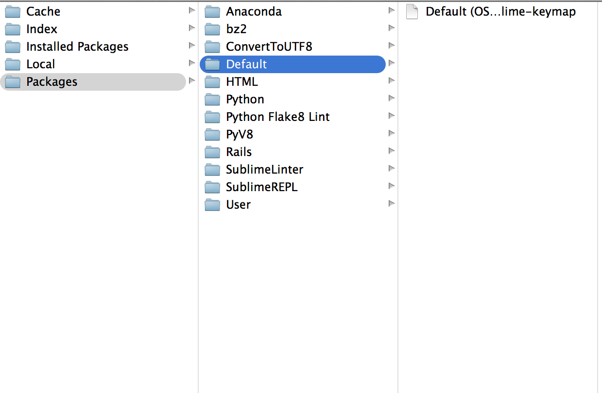
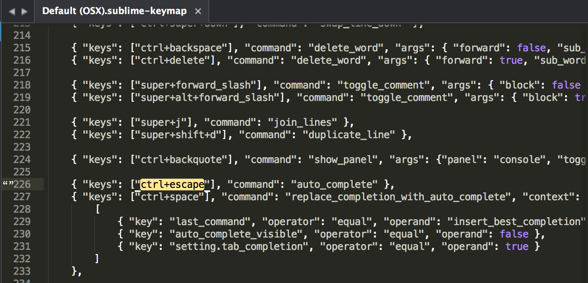

Title: 解決在 Mac 下使用 Sublime 無法處理 Ctrl + Space 的自動補齊與提示功能
Date: 2015-02-28
Tags: Mac, Sublime
Category: 編輯器
Slug: mac-sublime-ctrlspace-auto-completeion
Authors: kokokuo
Summary: Sublime 本身內建基本的 **Auto Complete** 功能，不過主要是的使用過的單字才會提示，而且如果現在打到一半，通常想要顯示提示時，Sublime 會有快捷鍵可以叫出，但是這個快捷鍵的指令是 **Ctrl + Space** 好巧不巧的與 Mac 的快捷鍵衝突到，會叫出 **Spotlight** 搜尋...

而且很多插件，也會預設使用 Sublime 的 **Auto Complete** 快捷鍵，所以我們需要來處理一下在 Mac 中如何使 Sublime 能夠順利的使用 Auto Complete 功能。

# 前言
---
Sublime 本身內建基本的 **Auto Complete** 功能，不過主要是的使用過的單字才會提示，而且如果現在打到一半，通常想要顯示提示時，Sublime 會有快捷鍵可以叫出，但是這個快捷鍵的指令是 **Ctrl + Space** 好巧不巧的與 Mac 的快捷鍵衝突到，會叫出 **Spotlight** 搜尋...

而且很多插件，也會預設使用 Sublime 的 **Auto Complete** 快捷鍵，所以我們需要來處理一下在 Mac 中如何使 Sublime 能夠順利的使用 Auto Complete 功能。

<br/>

# 解決方式
---
處理方式不外乎就是修改預設的 **Ctrl + Space** 比較保險，而 Sublime 中修改快捷鍵的位置在 `Preference` > `Key Binding – Default` 底下。



開啟後會是預設的指令設定，而且該內容是**唯讀不可編輯**，但如果從一般的目錄檔案下硬去更改編輯的話也是可以，只不過會影響到整個 Sublime。
因此 Sublime 對每一個 settings 都會提供一個給 User 的設定，所以我們可以開啟 **Key Binding User** 然後把 **Key Binding – Default** 中的 `command` 為 `auto_complete` 的整行指令複製到 **Key Binding – User** 中並修改 `key` 值，如這邊我是修改成 `ctrl + escape`：

```json
[
 
    { "keys": ["ctrl+escape"], "command": "auto_complete" }
     
]
```



<br/>

# 直接修改 Default
---
上述有提到 **Key Binding – Default** 中的內容是 Sublime 預設的設定，而且**唯讀不可編輯**，可是我們卻可以從一般的目錄檔案下硬去更改編輯的話也是可以，只不過會影響到整個 Sublime。

那麼如果要編輯究竟要去哪改呢？

只要把 Default 檔案另存新檔 ( Save As ) 到 `Packages` > `Default` 目錄下，檔案名稱不變即可，若是沒有 `Default` 目錄則新建目錄並放置 :



然後便可以編輯了 :



接著重新開啟後，按下 `ctrl + escape` 就會彈出自動補齊的彈出匡了。

<br/>

# 參考資料
---
1. [Unmap ctrl+space in Sublime Text 3](https://stackoverflow.com/questions/17413163/unmap-ctrlspace-in-sublime-text-3)