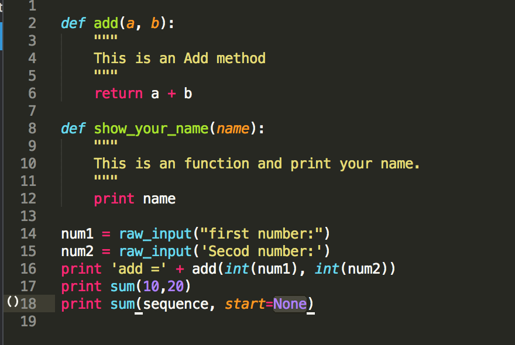

Title: Sublime - 使用 Anaconda 打造 Python 開發環境
Date: 2015-03-03
Tags: Mac, Sublime
Slug: sublime-python-with-anaconda
Authors: kokokuo
Summary: 因為 Sublime 有著很彈性的擴充插件可以打造開發環境，而自己為了往後的 Python 學習，所以選擇了 Anaconda 加上 Sublime Text3 作為開發的環境，因此本篇會介紹為何選擇這套 Anaconda 以及還有其他哪幾套也不錯的 Python 開發環境插件 ( 結果 VSCode 在一個月後出來我就索性換掉了 )。

# 前言
---
因為 Sublime 有著很彈性的擴充插件可以打造開發環境，而自己為了往後的 Python 學習，所以選擇了 Anaconda 加上 Sublime Text3 作為開發的環境，因此本篇會介紹為何選擇這套 Anaconda 以及還有其他哪幾套也不錯的 Python 開發環境插件 ( 結果 VSCode 在一個月後出來，我摸一摸後就索性跳過去了 XD )。

<br/>

# 需求
---
因為以前是寫 `C#` 和 `.Net` 長大的，所以被 `Visual Studio` 養的太好...，所以會希望在 Sublime 上使用插件加入以下這些能力協助開發，包含：

### A. 自動提示與補齊功能 ( Auto Complete )
可以提示可能有的方法，或是推測後續可能的字串的方法，並顯示出來，同時可以透過 Tab 鍵或是其他見補齊。
> Autocomplete, or word completion, is a feature in which an application predicts the rest of a word a user is typing. In graphical user interfaces, users can typically press the tab key to accept a suggestion or the down arrow key to accept one of several.


### B. 語法檢測 ( Lint )
可以動態，或是在存檔時，檢查有無錯誤的語法，或是不存在的函數，方法，未使用到的 Library 等等的能力。

> In computer programming, lint was the name originally given to a particular program that flagged some suspicious and non-portable constructs (likely to be bugs) in C language source code. The term is now applied generically to tools that flag suspicious usage in software written in any computer language

### C .Docstring
可以閱讀 `Pydoc` 的文件以及自己 Function 或是 Class Method 定義的 Doc 文件解釋。

### D. Goto Definition and Find Usage
可以跳至定義或是尋找有使用此函式、方法的所有位置。

依據這些需求，以下來介紹個人覺得在 Sublime Text2/3 上不錯且適合的套件。

<br/>

# Sublime 上不錯的 Python 插件

### SublimeJedi
SublimeJedi 來自 [Jedi](https://github.com/davidhalter/jedi)。
Jedi 是一套工具，不僅有著的 Auto Complete 功能，並且也有支援 PyDoc 的 Docstring 功能，很棒的是可以實現在多種開發環境下，例如 `vim` 上面透過 `Jedi-plugin` 即可在 `vim` 上使用這項功能。個人有使用過 Jedi 還滿不錯的，而在 Sublime 上也有實現了 Jedi 的套件，也就是 **SublimeJedi**

- 支援 : ST2,ST3 ( ST3 上個人比較推薦其他套)
- 滿足需求 : A, C, D

### SublimeRope
[SublimeRope](https://packagecontrol.io/packages/SublimeRope) 也是另一套強大的 Python 開發工具。SublimeRope 來自 Rope，也具備了 AutoComplete 與 PyDoc 的閱讀功能，而且在 Refactor 上的表現也很好，下重構功能包含了：`Refactor->Rename`, `Refactor->Extract Method`, `Refactor->Extract Variable`, `Refactor->Inline Variable`, `Refactor->Restructure`

- 支援 : ST2
- 滿足需求 : A, C, D ( 但是 D 的部分預設沒有 Shortcut 可以使用 Goto Defintion，另外貌似沒有提供 Find Usage 功能 ) 以及 Refactor 需求

使用文件: [SublimeRope Readthedocs](https://sublimerope.readthedocs.io/en/latest/)

### SublimePythonIDE
[SublimePythonIDE](https://packagecontrol.io/packages/SublimePythonIDE) 是 ST3 上的 SublimeRope，所以支援重構，Autocomplete 與 PyDoc 功能。

- 支援 : ST3
- 滿足需求 : A, C, D ( 但是 D 的部分預設沒有 Shortcut 可以使用 Goto Defintion，另外貌似沒有提供 Find Usage 功能 ) 以及 Refactor 需求

### Anaconda
[Anaconda](http://damnwidget.github.io/anaconda/) 是在 ST3 上才有的 Python IDE 功能，其功能可以做到 Autocomplete、語法檢測、使用 PyDoc 讀取文件、Goto Definition and Find Usage 以及簡單的 Refactor Name。

其上述所有功能皆來自其他不同的插件組成，如透過 Jedi 來達成 Autocomplete 與 PyDoc 還有 Goto Definition and Find Usage，透過 PyFlakes, pep8, PyLint, pep257 與 McCabe 來達到語法檢測，並且可以選擇要開啟或關閉哪一種上述的檢測規則。

其官方的簡述如下 :

> Anaconda turns your Sublime Text 3 in a full featured Python development IDE including autocompletion, code linting, IDE features, autopep8 formating, McCabe complexity checker and Vagrant for Sublime Text 3 using Jedi, PyFlakes, pep8, PyLint, pep257 and McCabe that will never freeze your Sublime Text 3

所以這也是個人目前認為算是整合性高的 Python IDE，也是要採用的版本，但是在語法檢測這部分，自己採用另一套叫做 [Python Flake​8 Lint](https://packagecontrol.io/packages/Python%20Flake8%20Lint)，之後會在介紹語法檢測的部分與安裝。

- 支援 : ST3
- 滿足需求 : A,B,C,D

**注意 :** 另外這套 Anaconda 是 Sublime 上的插件，跟另一個 Python 有名的數據科學和套件管理發布板[Anaconda](https://www.anaconda.com/) 不同。

# SublimeCodeIntel
[SublimeCodeIntel](https://www.sublimecodeintel.com/SublimeCodeIntel/) 是一套強大的 AutoComplete 叉介，支援非常多的語言，包含：
JavaScript, Mason, XBL, XUL, RHTML, SCSS, Python, HTML, Ruby, Python3, XML, XSLT, Django, HTML5, Perl, CSS, Twig, Less, Smarty, Node.js, Tcl, TemplateToolkit, PHP.

但是只提供 AutoComplete 功能，而其他的功能需要再額外安裝。此外沒有 PyDoc 的功能也是本人覺得可惜的部分，所以沒有採用他在 Python 上，不過若是其他語言要使用時仍可能會使用。

- 支援 : ST2,ST3
- 滿足需求 : A ( 但支援非常多的語言 )

# Anaconda 插件安裝與設定

## 1. 安裝插件
透過 `Packae Control` 輸入 `Anaconda` 後即可安裝完成。


## 2. 設定檔參數
設定一些想要的參數功能，首先把 Default 參數複製到 User 中。


### (1.) 設定 Python 的直譯器版本與來源
首先是 Python 直譯器的版本，要修改成後來額外安裝在 Mac 上的來來源版本而不是 Mac 原先內建的版本

尋找 `python_interpreter` 的 `key` 值會看到預設的參數是 `python`，並把此值修改成自己安裝的 Python 直譯器位置。

```json
{
"python_interpreter": "/usr/local/bin/python",
}
```

### (2.) 使用 Anaconda 自動帶入函式參數
如果有在設定檔 settings 中，將 `complete_parameters` 設成 `true` 的話，就會在鍵入函式名稱加上左括號 `(` 時自動帶入函式的參數。如果是 `complete_all_parameters` 設成 `true` 的話會連有預設值的參數也都帶進來。

```json
{
    "complete_parameters": true,
    "complete_all_parameters": true,
}
```



### (3.) Docstring 顯示
預設的開啟方式是滑鼠右鍵 > `Anaconda` > `Show Documentation` 或是輸入 `Ctrl + Alt + d` 即可顯示。


上圖中下方是依照 Python 的 Convetion 所寫的註解文件顯示出來。

### (4.) 輸入特殊的關鍵字時也可以有 AutoComplete
在輸入像是 `import`, `def` 這些關鍵字時，Sublime 本身預設的 Python Package 會取消 AutoComplete ，此外在 `import module` 時由於 module 過多可能也會導致顯示浮框尋找的功能失效。

而在 Anaconda 的 [Github](https://github.com/DamnWidget/anaconda#auto-complete-for-import-behaves-badly) 的 Readme 中有一段內文 - **Auto-complete for import behaves badly.** 有提出解決方式。

也就是下載 [Completion Rules.tmPreferences](https://raw.githubusercontent.com/DamnWidget/anaconda/master/Completion%20Rules.tmPreferences) 檔案，然後放置 `Packages` 目錄下，並新建 `Python` 目錄並放進去。

再修改檔案名稱，並於字尾再加上 `.cache` 變成 `Completion Rules.tmPreferences.cache` 檔名，使得與 `Cache` 目錄下的 Python 目錄的檔案名稱一致，如下圖：


之後重開再次測試一次，輸入 `import` 便可以解決：


如果還有其他想知道的設定，可以前往 [Anaconda Python IDE](http://damnwidget.github.io/anaconda/) 官網，有更詳細的設定。

<br/>

# 參考資料
---
1. [Wiki-Lint (software)](https://en.wikipedia.org/wiki/Lint_%28software%29)
2. [Wiki-Autocomplete](https://en.wikipedia.org/wiki/Autocomplete)
3. [PyPi-Jedi](https://pypi.org/project/jedi/)
4. [PyPi-Rope](https://pypi.org/project/rope/)
5. [Anaconda Python IDE](http://damnwidget.github.io/anaconda/)
6. [Sublime Text 3 for Python, JavaScript and web developers](http://opensourcehacker.com/2014/03/10/sublime-text-3-for-python-javascript-and-web-developers/#SublimePythonIDE)
7. [Setting Up Sublime Text 3 for Full Stack Python Development](https://realpython.com/setting-up-sublime-text-3-for-full-stack-python-development/)
8.  [精通編輯器！Sublime Text 2 – Plugins 好用插件整理](https://chentsu.wordpress.com/2014/01/09/sublime-text-2-plugins-%E5%A5%BD%E7%94%A8%E6%8F%92%E4%BB%B6%E6%95%B4%E7%90%86/)