Title: 在 Mac 上使用 Python 的 Pelican 建立靜態個人網誌
Date: 2019-01-13
Tags: Python, Pelican
Category: Pelican
Slug: mac-using-pelican-build-static-website
Authors: kokokuo
Summary: 以前雖然使用 Wordpress 作為網誌，但是由於自己的網誌用途單純以寫作為主，加上先前遇到架設的 Wordpress 後來有轉移主機的情形，但轉移與重建過程繁瑣外，再次架設還需要還原資料庫，甚至新的 Wordpress 格式跑掉。

因此這次決定採用 **markdown 格式撰寫為主的靜態網誌產生器 ( Static Site Generator )** 來產生部落格，這樣的好處除了未來要轉移時檔案都會以 markdown 檔案攜帶保存外，在本機端也能隨時編輯與閱讀，呈現格式也比較不用擔心跑掉需要重新設定（例如 Wordpress 升級或是主題更新或更換主題跑版）！

這麼神奇的方式要怎麼使用，接著們我就來了解。

# 前言
---
自從工作超過一年後便開始停擺了自己的習慣，不過伴隨著逐漸的累積過程，最近有了想要重新撰寫網誌的想法，再加上自己不僅喜歡分享外，也認為取之網路回饋網路。

以前雖然使用 Wordpress 作為網誌，但是由於自己的網誌用途單純以寫作為主，加上先前遇到架設的 Wordpress 後來有轉移主機的情形，但轉移與重建過程繁瑣外，再次架設還需要還原資料庫，甚至新的 Wordpress 格式跑掉。

因此這次決定採用 **markdown 格式撰寫為主的靜態網誌產生器 ( Static Site Generator )** 來產生部落格，這樣的好處除了未來要轉移時檔案都會以 markdown 檔案攜帶保存外，在本機端也能隨時編輯與閱讀，呈現格式也比較不用擔心跑掉需要重新設定（例如 Wordpress 升級或是主題更新或更換主題跑版），程式語言也只要稍微了解一些就好（像是以前的無名小站）。

所以我們接著來學習吧！

<br/>

# 使用 Pelican 靜態網站產生器架設靜態網站
---
目前靜態網站產生器的選擇上非常多樣化，參考 [StaticGen](https://www.staticgen.com/) 可以看到許多使用不同程式語言開發的產生器，並且每個產生器都有特別的特色。

而自己則是使用熟悉的 Python 語言所開發的 Pelican 作為個人的網誌，同時該產生器提供的樣式主題豐富外，在設定上也只需要編輯 `pelicanconf.py` 與 `publishconf.py` 即可，能夠自己定義新的頁面（如 About Me, 作品集...等)，擁有標籤與分類目錄的工能，並能安插 Google Analystic、 Twitter, Facebook 、留言版、RSS 等外部功能，非常豐富，也只要透過一個 `Makefile` 檔案就可以生成靜態網站，或是在自己的本機電腦產生預覽模式觀看。

那麼以下來介紹安裝與使用步驟：

## 1.安裝 Pelican 套件
在安裝 Pelican 前請先確認自己的 Mac 環境具有 Python 2.6 以上或是 Python 3.3 以上，由於未來 Python 2.x 將會淘汰，建議直接使用 Python 3.x 版本。

### (1.) 建立網誌目錄

首先準備要用來建立網誌的目錄，如下為 `kokokuo-note`，另外為了避免不影響主要電腦的 Python 環境，當我們進入到目錄中會接下著建立 Pelican 用的虛擬環境再安裝 Pelican 套件。

```bash
> mkdir kokokuo-note
> cd kokokuo-note
kokokuo-note/>
```

當進入目錄後，我們便可以安裝虛擬環境，並且裝載 Pelican ，以下的安裝步驟會分別紀錄採用 `virtualenv` 與 `pipenv` 兩種不同的虛擬環境工具。

### (2.1) 建立虛擬環境 Virtualenv 安裝 Pelican

如果你採用 `virtualenv` 作為虛擬環境，那麼首先我們要透過 `virtualenv` 的指令建立虛擬環境的目錄，並進入虛擬環境中，才能 `pip` 指令安裝 Pelican，若對 Python 的虛擬環境 virtualenv 有更多想要知道的部分可以參考此篇 [Python - 隔離開發環境的利器，安裝虛擬環境工具 virtualenv]({filename}/posts/20190307-python-virtualenv-install-and-usage.md)

```bash
kokokuo-note/> virtualenv venv # 採用 virtualenv 建立虛擬環境目錄
kokokuo-note/> source venv/bin/activate  # 進入虛擬環境
(venv)kokokuo-note/> pip install pelican # 當顯示 (venv) 後表示我們已經在許你環境中，安裝 Pelican 
(venv)kokokuo-note/> pip install markdown # 安裝 markdowan ，使 Pelican 的 markdown 語法作用，務必安裝
(venv)kokokuo-note/> pip install typogrify # 安裝 typogrify，使 Pelican 的網誌在生成 HTML 時可以有更多樣化的排版，務必安裝
```
如下圖：

### (2.2) 建立虛擬環境 Pipenv 安裝 Pelican

如果你採用 `pipenv` 作為操作虛擬環境指令工具，則採用以下步驟：
```bash
kokokuo-note/> mkdir .venv # 建立等等 Pipenv 安裝虛擬環境時所存放的目錄
```

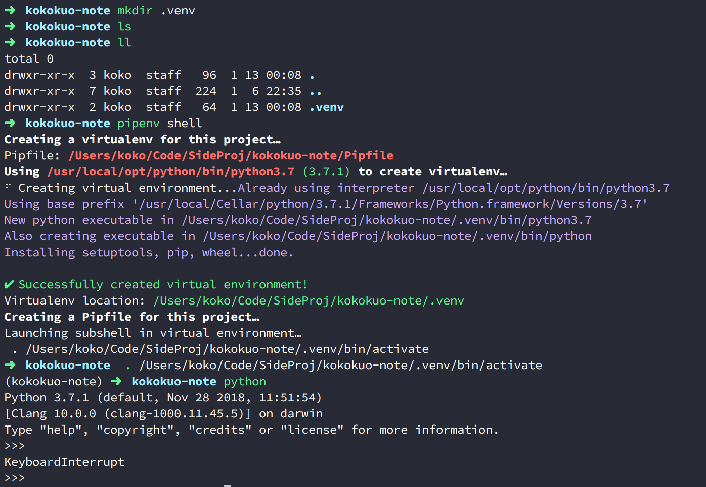

```bash
kokokuo-note/> pipenv shell # 進入虛擬環境
(kokokuo-note)kokokuo-note/> pipenv install pelican # 當顯示 (kokokuo-note) 後表示我們已經在 kokokuo-note 這個專案目錄的虛擬環境中，安裝 Pelican 
```


再來還需要安裝 markdown 與 typogrify：

```bash
(kokokuo-note)kokokuo-note/> pipenv install markdown # 安裝 markdowan ，使 Pelican 的 markdown 語法作用，務必安裝，務必安裝
(kokokuo-note)kokokuo-note/> pipenv install typogrify  # 安裝 typogrify，使 Pelican 的網誌在生成 HTML 時可以有更多樣化的，務必安裝排版
```

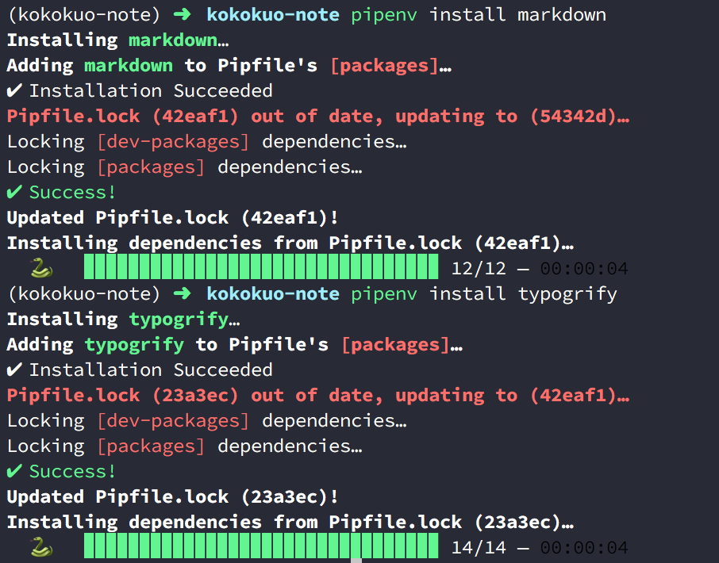


若是想要更多了解 `pipenv`，可以參考此篇 [Python - 使用 Pipenv 建立虛擬環境與安裝套件]({filename}/posts/20190308-python-pipenv-install-and-usage.md)


### (3.) 透過 Pelican 指定產生靜態網站檔案
當我們安裝好 Pelican 與所需要的套件後，再來便可以透過 Pelican 提供的指令 `pelican-quickstart` 來產生後續我們要的靜態網站範本：

```bash
(kokokuo-note)kokokuo-note/> pelican-quickstart
```

之後 Pelican 會如下圖，依序詢問幾個問題，來幫忙建立屬於你要的範本：

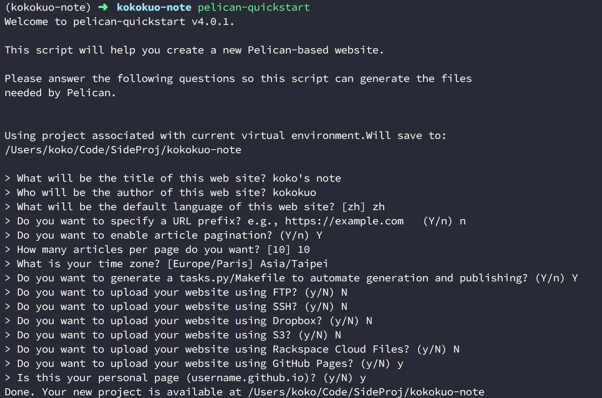

上圖中的幾個問題分別是解說如下：

```bash
> What will be the title of this web site?  # 輸入你的網站名稱，未來也可以再改
> Who will be the author of this web site? # 輸入網站的作者名稱，未來也可以再改
> What will be the default language of this web site? [zh] # 輸入你的預設語系 e.g 這邊預設是 zh，未來也可以再改
> Do you want to specify a URL prefix? e.g., https://example.com   (Y/n) n  # 是否要指定網誌的網址 URL，若目前沒有可以輸入 n，未來也可以再改
> Do you want to enable article pagination? (Y/n) Y # 是否要設定分頁功能，未來也可以再改
> How many articles per page do you want? [10] 10  # 分頁功能的預設頁數，未來也可以再改
> What is your time zone? [Europe/Paris] Asia/Taipei # 設定所在時區，例如這裡我設定 亞洲台北時區，未來也可以再改
> Do you want to generate a tasks.py/Makefile to automate generation and publishing? (Y/n) Y # 是否要有 Makefile 或 task.py 等腳本檔案，幫變你自動產生靜態 HTML 網站與協助部署，建議要
> Do you want to upload your website using FTP? (y/N) N # 網站是否要透過 FTP 上傳呈現，因為之後要用 Github Page 所以這裡回答 N
> Do you want to upload your website using SSH? (y/N) N # 網站是否要透過 SSH 上傳呈現，因為之後要用 Github Page 所以這裡回答 N
> Do you want to upload your website using Dropbox? (y/N) N # 網站是否要透過 Dropbox 上傳呈現，因為之後要用 Github Page 所以這裡回答 N
> Do you want to upload your website using S3? (y/N) N # 網站是否要透過 AWS 的 S3 儲存庫 上傳呈現，因為之後要用 Github Page 所以這裡回答 N
> Do you want to upload your website using Rackspace Cloud Files? (y/N) N # 網站是否要透過 Rackspace Cloud 上傳呈現，因為之後要用 Github Page 所以這裡回答 N
> Do you want to upload your website using GitHub Pages? (y/N) y # 網站是否要透過 Github Pages 上傳呈現，因為這是本篇網誌的架設方式，所以選擇 y
> Is this your personal page (username.github.io)? (y/N) y # 因為採用 Github Page 作為個人網誌，所以為y，如果你架設的目的是專案文件，則輸入 N
```
上述關於時區的部分，可以參考 [wikipedia 的 List of tz database time zones](https://en.wikipedia.org/wiki/List_of_tz_database_time_zones)，裡面詳列的各國的時區碼供設定參考。

完成後便會看到產生的檔案：

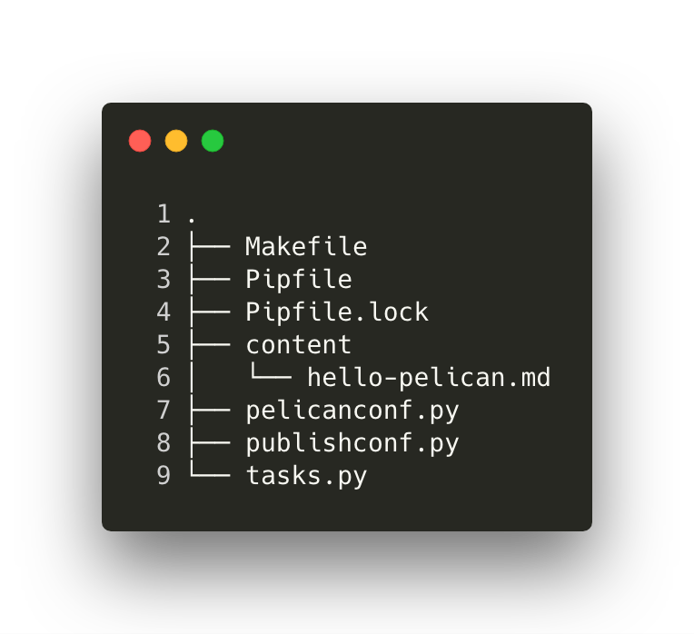


### (4.) Pelican 目錄檔案功用介紹
在上圖中，會看到 `pelican-quickstart` 執行並回答完問題後，會產生一些檔案與目錄，這些檔案與目錄便是之後這個網誌的架構，以下分別介紹每個目錄與檔案的作用：

- **content** : 此目錄為 Pelican 預設提供給我們用來存放 markdown 邊寫完的網誌，因為是預設，也代表我們可以額外更改擺放位置。
- **output** : 因為靜態網站產生器的構造是透過 markdown 撰寫我們的網誌內容後，在透過一些功能，產生具有 HTML/CSS/JS 的網頁呈現，因此會需要有一個目錄擺放這些 HTML/CSS/JS 檔案，而在 Pelican 便是 `output` 這個目錄。
- **task.py 與 Makefile** : 則是剛剛在回答 `pelican-quickstart` 的問題中詢問的問題，這兩個檔案很有用，Pelican 提供他們來協助我們寫完每篇網誌後，可以用來產生 HTML/CSS/JS 這些靜態檔案，除此之外還能在自己的本機電腦跑出類似預覽功能觀看與檢查的**本機端伺服器**作測試，也能協助我們把完成並測試預覽後的網誌直接的以 FTP, SSH, 或是 Github Page 等方式放上去。
- **pelicanconf.py** : 這也是一個很重要的檔案，該檔案是 `.py` 結尾，也就是 Python 的程式碼。剛剛在回答 `pelican-quickstart` 中的問題如設定網站名稱、作者、語言、時區、分頁等等功能，包含未來其他的更換網誌樣板，或是設定網址要擺放的目錄，都會在此設定。
- **publishconf.py** : 這個檔案會作用在我們要把網誌擺到伺服器上時，如剛剛問題中提問的  FTP, SSH, 或是 Github Page 等方式，因此只有在部署時會需要。


### (5.) 開始使用 Pelican 撰寫第一篇網誌
完成上半部分後，我們終於可以開始編寫網誌了，一個 Pelican 用 Markdown 寫的網誌，簡易結構會如下：


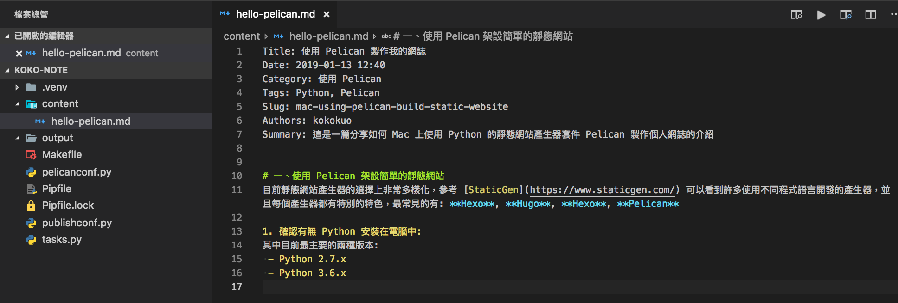


下半部的部分就是我們一般的 markdown 內容，也就是我們要寫的文章，而上半部的 Title, Date, Category, Tags, Slug, Authors, Summary 都是 Pelican 的 Metadata 關鍵字，這些關鍵字可以有也可以不提供，每一個關鍵字都會有其特殊的用途，以下常用的有：

- **Title** : 文章的表題
- **Date** : 文章的發表日期
- **Modified** : 文章的修改日期
- **Category** : 此篇文章所屬的分類目錄名稱
- **Tags** : 此篇文章的標籤
- **Slugs** : 文章的連結路徑名稱
- **Summary** : 使用 RSS 或是網站目錄時呈現的簡介

其他更多的設定可以參考 [Pelican Document - Write Content](https://docs.getpelican.com/en/stable/content.html)


### (6.) 產生 HTML 的靜態網頁
當寫好我們的第一個範例後，我們便可以開始來預覽我們寫的文章了，這個步驟很容易，只要在我們所建立的專案目錄下，如我是 `kokokuo-note` 輸入以下指令：

```bash
(kokokuo-note)kokokuo-note/> make html # 產生 HTML 檔案
```

透過上述的指令 `make html`  會幫助我們把剛剛所寫完的 markdown 文章，轉換並生出成 HTML 網頁，如下圖：

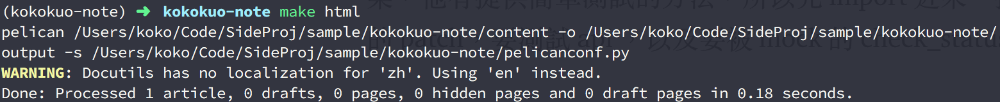

而產生後，我們可以進一步到 **output** 目錄下，會看到生出了許多的子目錄與檔案，包含 HTML/CSS 與 圖像檔案。

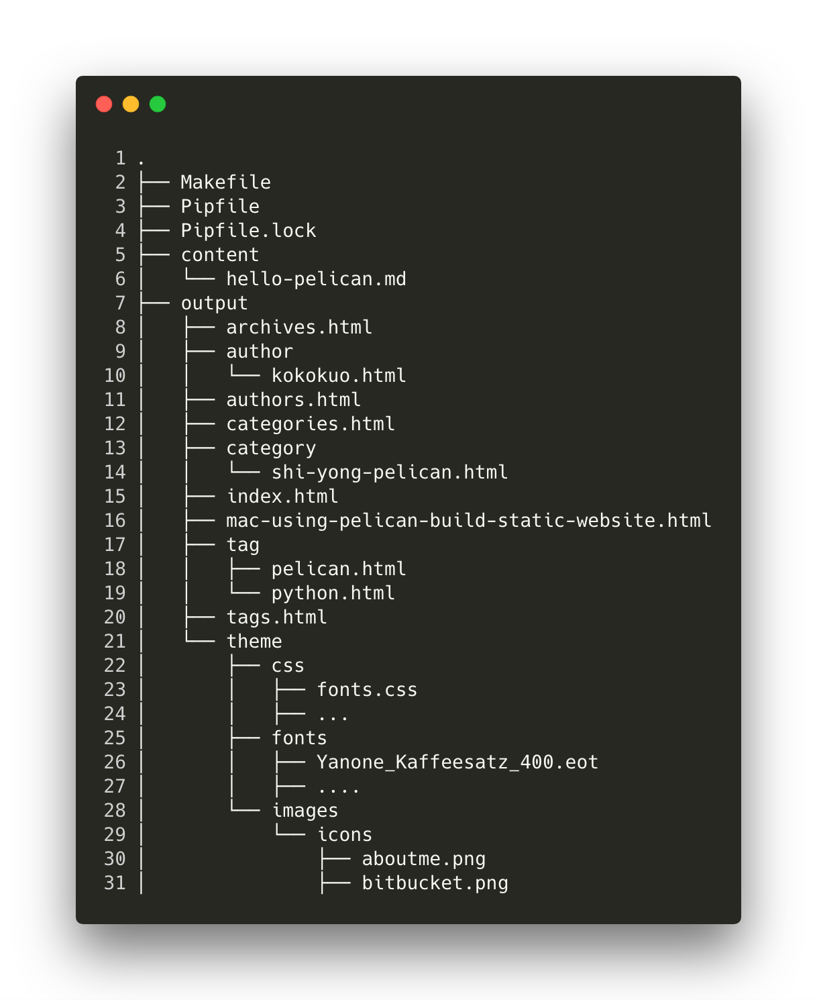

在 `output` 目錄中，會看到一個檔案是 `mac-using-pelican-build-static-website.html` ，這個檔案便是我們剛剛在寫 `hello-pelican` 第一篇網誌時，所設定的 `Slug` 網址名稱，而 Pelican 會幫我們以此為檔名產生出來。

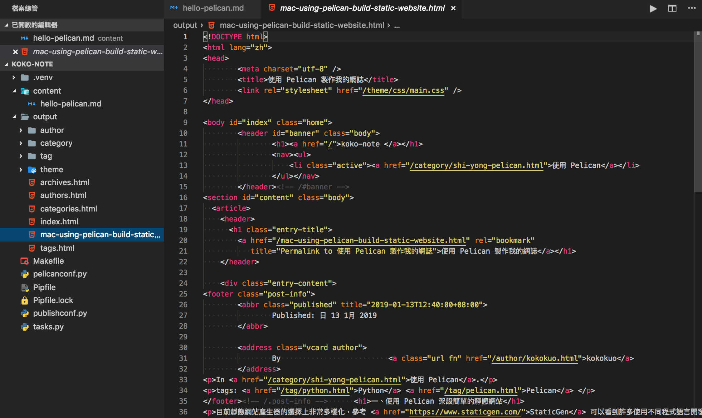

而這個 `make html` 實際上便是最早在回答 `pelican-quickstart` 問題時其中提到的 *Do you want to generate a tasks.py/Makefile to automate generation and publishing? (Y/n)*，由於回答了 Yes，所以 `Pelican` 協助我們提供了 `task.py` 與 `Makefile` 。

而上述的這兩個檔案是相輔相成的，核心功能寫在 `task.py`，並再透過 `Makefile` 來產生 `make html` 的功能。

另外除了 `make html` 以外，這個 `task.py` 與 `Makefile` 還提供了很多其他的能力，我們可以在目錄下輸入 `make` 即可看到：


```bash
(kokokuo-note)kokokuo-note/> make  # 顯示 Help 功能，所有的指令與用途。
```

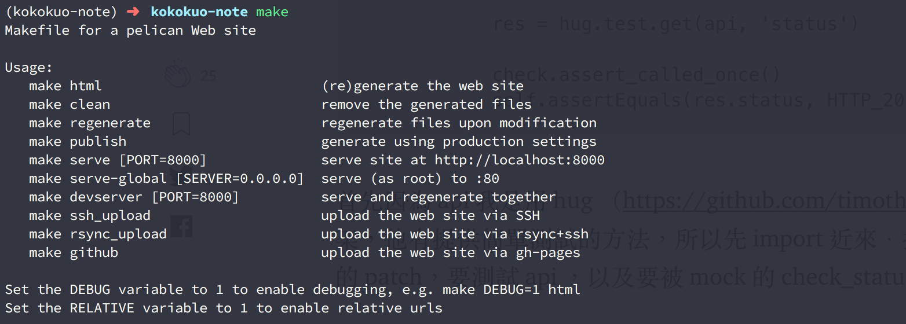

以下介紹最常用的有幾個：

* **make html** : 把 **content** 下所有的 Markdown 檔案轉為 HTML 網頁。
* **make publish** : 如同 `make html` 指令一樣是把 **content** 下所有的 Markdown 檔案轉為 HTML 網頁，但唯一的差異在於透過此指令，會使用 `publishconf.py` 的設定檔案，這個好處是幫助我們可以把撰寫測試中的設定與正式發佈網站的設定隔離。
* **make clean** : 清除掉 **output** 目錄下的所有內容，另外會建議如果檔案更新了，要確認是否有輸出到 `output` 目錄的話，先執行一次 `make clean` 再執行 `make html` 或 `make publish`。
* **make regenerate** : 若是使用 `make html` ，則每次更改 Markdown 文章內容或寫新的文章時，都要再次執行 `make html` 才能產生看到的 HTML 內容並被看到，有時還需要搭配 `make clean` 才會乾淨會頗麻煩，因此透過 `make regenerate` 可以讓 Pelican 自動偵測檔案的改變並產生出 HTML 內容，如此便可以節省手動建置 HTML 的時間。
* **make serve PORT=[port]** : 建立本機端的伺服器(Local Server)，方便可以在網頁上透過 https://localhost:[port] 來預覽與測試文章有無格式或排版問題，如果不指定 `PORT` 的話預設會是 `8000`。
* **make devserver** : 啟動開發用的本機伺服器，`與 make serve` 的差別在於，每次修改 Markdown 或是新增刪除文章時，Pelican 都會自己偵測並更新重跑伺服器，相當於合併 `make regenerate` 與 `make serve`。

### (7.) 預覽編寫完的 Markdown 網誌
當完成 `make html` 產生網頁後，再來只要輸入 `make serve` 便可以預覽寫完的網頁：

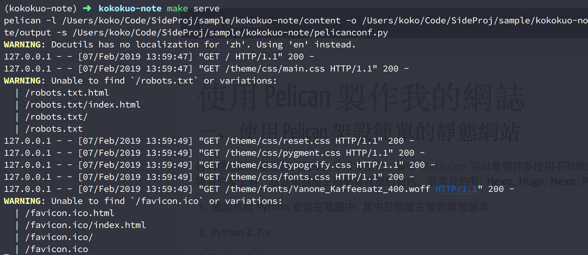

透過瀏覽器輸入 https://localhost:8000 便可以看到呈現的網頁：

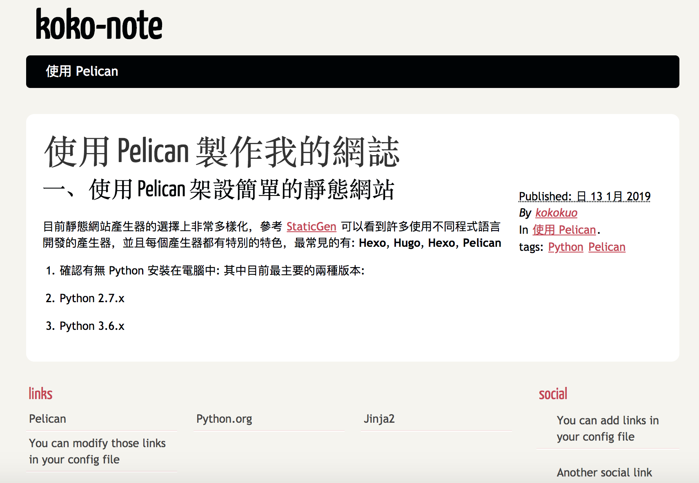

至此變完成的安裝 Pelican > 撰寫 Markdown 文章 > 產生 HTML 與預覽 的過程。

<br/>

# 後記
---
雖然上述介紹了如何使用 Pelican 來編寫 Markdown 與產生的 HTML 網頁。

但是這一切都是在自己的電腦本機端，我們仍然需要真的伺服器空間，來把我們的網誌與文章放上去才行。

因此接下來我們會介紹一開始在執行 `pelican-quickstart` 時，選擇使用 **Github Page** 的後續部署網誌步驟，請參考 [使用 Github Page 作為靜態網誌的空間 - 以 Pelican 為例]({filename}/posts/20190205-deploy-pelican-static-website-to-github-page.md)。

<br/>

# 參考文章
---
1. [Pelican 入门指南](http://chenjiee815.github.io/pelicanru-men-zhi-nan.html)
2. [使用 Pelican 和 GitHub Pages 搭建个人博客 —— 基础篇](http://www.xycoding.com/articles/2013/11/21/blog-create/)
3. [Pelican Tutorial](https://docs.getpelican.com/en/stable/content.html)