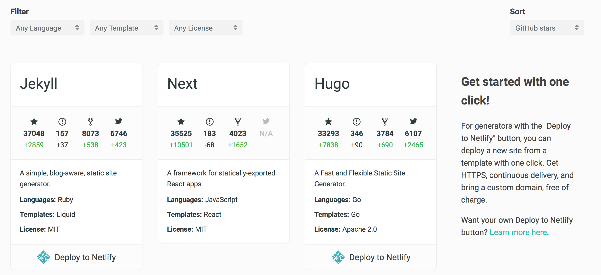

Title: 什麼是靜態網站 (Static Site) 與 靜態網站產生器 (Static Site Generator)
Date: 2019-01-28
Tags: Static Site Generator
Slug: what-is-static-site-generator-and-when-to-use
Authors: kokokuo
Summary: 當我們要架設一個網站時，一定或多或少會去想一下，這個網站是什麼用途，要怎麼架設與架設在哪裡。

而如果你的網站只是要單純呈現內容與介紹資訊為主，那麼你的網站可能有單純的靜態內容，此時我們也稱這類型的網站為 **靜態網站 (Static Site)**，此時你可以考慮使用 **靜態網站產生器 (Static Site Generator)** 來製作。

那麼什麼是 **靜態網站 (Static Site)**，什麼又是 **靜態網站產生器 (Static Site Generator)** 呢？

以下我們就來談談與介紹。

# 前言
---
當我們要架設一個網站時，一定或多或少會去想一下，這個網站是什麼用途，要怎麼架設與架設在哪裡。

而如果你的網站只是要單純呈現內容與介紹資訊為主，那麼你的網站可能有單純的靜態內容，此時我們也稱這類型的網站為 **靜態網站 (Static Site)**，此時你可以考慮使用 **靜態網站產生器 (Static Site Generator)** 來製作。

那麼什麼是 **靜態網站 (Static Site)**，什麼又是 **靜態網站產生器 (Static Site Generator)** 呢？

以下我們就來談談與介紹。

# 靜態網站產生器 (Static Site Generator)
---
要談到「靜態網站產生器」，需要先分別介紹何謂「靜態網站」、「內容管理系統 CMS」。

### 靜態網站 (Static Site) 
雖然英文是寫 Static Site，但是其實這裡的 Site 是指 WebSite ，一般所謂的靜態網站通常是指該網站的網頁與資料組成都是以 HTML/CSS/JS 檔案組成。

除此之外，像是能有資料庫儲存，或是其他複雜功能如會員功能、用戶登入、發布文章，或是如購物結帳刷卡等功能，由於都是透過後端語言（諸 PHP, Ruby, Python, Java, Node.js, C# ...等等）完成的，因此也不是靜態網站能做到的事情。 通常具備上述這些特色的都稱動態網站。

所以像是一般耳熟能詳的 Wordpress 因為具備後台編寫、會員購物車等擴充功能、使用 PHP 語言，需要資料庫等條件，就不屬於靜態網站，而是所謂的動態網站。

### 內容管理系統 (CMS)
內容管理系統可以新增、編輯與發佈內容文章外，也能透過目錄與標籤等功能協助分類管理，並能選擇主題來呈現不同的外觀，如 Wordpress ，通常內容管理系統會透過後端程式語言與資料庫來建置與運作。

然而上述的內容管理系統(CMS) 正需因要有資料庫與後端語言搭建的服務，因此在建置與使用上需要額外花些時間學習與維護，也有不好遷移或轉移到不同的 CMS 管理系統，因此才有了靜態網站產生器的出現。

### 靜態網站產生器 (Static Site Generator)
靜態網站產生器一樣擁有能做到新增，編輯與發佈文章，也能標籤與分類管理或更換主題樣式，但是這一切只要由 Markdown 格式的檔案編寫，再透過產生器產出只需要 HTML/CSS/JS 檔案組成靜態網站即可，因此所有的文章都只要以 Markdown 格式的檔案保存在目錄即可，也能直接編輯，在透過產生器自動建置產生即可。

# 使用靜態網站的優點
----

## 優點
### 操作簡單
你不需要學習後端程式語言，學習資料庫語法，或是複雜的架設伺服器等方式，你只需要 HTML / CSS 或是許多靜態網站的工具會使用 Markdown 語法撰寫，因此非常快上手。

### 快速
因為靜態網站的內容都是 HTML/CSS/JS 等檔案，所以不需要有資料庫，也不需要從資料庫查詢資料，也沒有伺服器做請求，頁面也不用樣板渲染，因此速度上會非常快速。

### 安全
你不用擔心伺服器與資料庫被攻擊，因為你只有前端的靜態檔案，而且這些檔案因為是 HTML 所以你再架設時的內容自然都是對外的資訊。

### 便宜
因為不用架設資料庫，也不用架設動態網站所需要的伺服器，所以擺設你的靜態網站檔案的主機費用可以很低，甚至有許多的服務提供免費的架設，如 Github Page。

## 缺點

### 功能極度受限
因為是靜態網站，只有 HTML/CSS/JS，所以能做的事情非常受限，例如沒有辦法製作會員功能，提供註冊、登入與登出，沒有辦法輸入資料保存，也沒有辦法提供像是購物、刷卡等功能等等；靜態網站只能拿來以顯示內容為主，加上一些簡易的網頁前端的動態效果（如漸層、滑動...等等）。

### 沒有 real-time content
因為都是靜態的內容，所以也沒會有自動出現或產生的內容存在，不像一般的網站可以在網頁上新增、編輯或刪除內容。

# 何時選擇使用靜態網站
---
若你的網站只要呈現個人的基本資訊作為履歷，或是以呈現、寫文章 Blog 等內容為主，那麼可以選擇使用靜態網站來快速建置達成你的蜜標。

# 如何選擇靜態網站產生器
---
雖然靜態網站產生器都有 CMS 的功能，不過在預設的用途定義上還是有些區分，例如有些是用在專案的文件製作，而有些是以網誌為主自己選擇由熟悉，有些除了 Markdown 外還支援別的格式編寫，或是有其他的功能特色，如回覆留言，RSS 訂閱，Google Analytics ..等。

並且產生器所使用的程式語言都不太相同 (e.g: Ruby, Node.js, Python, PHP ...)，因此會建議參考 [StaticGen](https://www.staticgen.com/) 網站來選擇，並對每一個靜態網站研究。

# 參考文章
---
1. [StaticGen](https://www.staticgen.com/)
2. [Why use a static site generator?](https://learn.cloudcannon.com/jekyll/why-use-a-static-site-generator/)
3. [What is a Static Site Generator?](https://wsvincent.com/what-is-a-static-site-generator/)
