Title: 使用 Github Page 作為靜態網誌的空間 - 以 Pelican 為例
Date: 2019-02-05
Tags: Python, Pelican, Github, 靜態網站產生器
Slug: deploy-pelican-static-webiste-to-github-page
Authors: kokokuo
Summary: 在前一篇 [在 Mac 上使用 Python 的 Pelican 建立靜態個人網誌]({filename}/posts/20190113-mac-using-pelican-build-static-website.md) 中介紹了如何在本機端，安裝 Pelican 並建立自己的個人網誌，但是這個網誌卻只能在自己的電腦中呈現，並沒有放到網路上，因為我們缺少了可以存放 Pelican 網誌的伺服器。

這篇我們特別記錄了使用 Pelican 靜態網站時，如何部署到 Github Page 的過程，因為只要把檔案上傳即可，並且還不用花費任何半毛錢，接著我們就來了解。

# 前言
---
在前一篇 [在 Mac 上使用 Python 的 Pelican 建立靜態個人網誌]({filename}/posts/20190113-mac-using-pelican-build-static-website.md) 中介紹了如何在本機端，安裝 Pelican 並建立自己的個人網誌，但是這個網誌卻只能在自己的電腦中呈現，並沒有放到網路上，因為我們缺少了可以存放 Pelican 網誌的伺服器。

不過因為靜態網站只有 HTML/CSS/JS 這類單純的檔案結構，需要建置資料庫，也沒有後端的語言因此可以選擇架設的選擇性也比較多樣，因為只需要一個空間與簡單的伺服器軟體即可，所以我們可以架設一台自己的伺服器電腦透過 SSH 或 FTP 上傳，又或是使用 Dropbox 空間，雲端 AWS 與 Google Cloud, Azure 提供的服務。

但是上述中，要自己架設主機花時間也需要一些專業知識，使用 Dropbox、雲端服務的空間或多或少會需要收取一些費用，如果我們希望簡單又能夠不花費的話，要怎麼辦呢？

因此這裡我們就要選擇 **Github Page** ，因為只要把檔案上傳即可，並且還不用花費任何半毛錢，以及因為 **Github Page** 是 **Github** 的服務之一，因此支援版本控制系統，簡單來說就是能夠幫你記錄每一次上傳更新的所有紀錄，能方便你還原上一版。

而這篇我們特別記錄了使用 Pelican 靜態網站時，如何部署到 Github Page 的過程。


# 一、創建一個 Github Page 的倉儲庫 (Repository)
首先我們需要在 Github 建立一個 Github Page 用的 Repository ，第一次使用 Github 的朋友可以先去註冊一個。

這個 Github Page 用的 Repository 會專門用來放置的靜態網誌的檔：


需要特別注意的部分是，我們的 Repository 名稱需要照個 Github Page 的教學指示，建立一個格式為 username.github.io 的名稱，而這個 `username` 必須是你的 Github 使用者名稱，如此 Github Page 才會知道你要建立屬於自己的個人網站並且作用，例如我的名稱是 `kokokuo` 所以我建立的 Repository 名稱為 `kokokuo.github.io`，如果不照著此方式，是無法作用建立的。

而 Repository 的權限、 `README` 與 `.gitignore`，看個人需要，例如我設定為 Public，定且有 README 與 Python 的 .gitnore (因為使用 Pelican)。

建立完後，你的 Repository 會如此畫面：

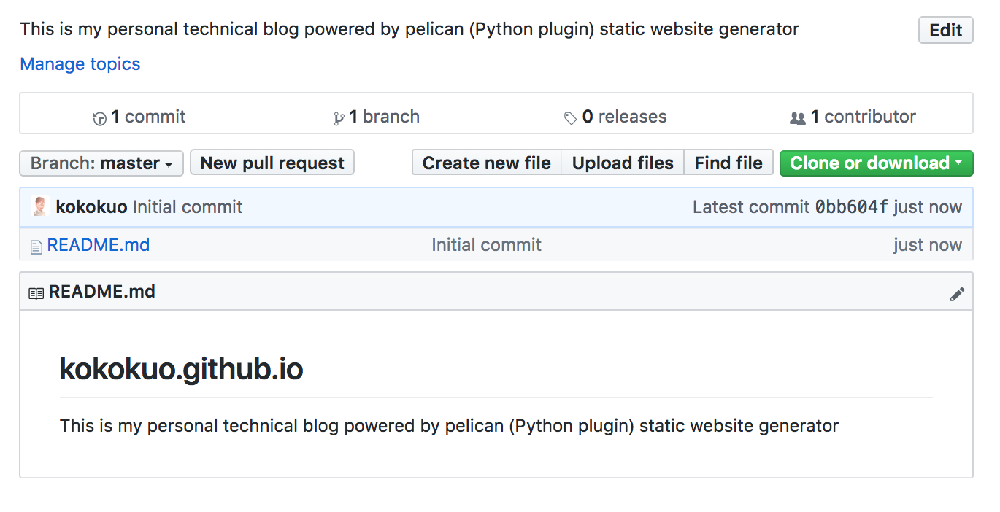

*附註：因為我有使用 README，Github Repository 的 README 會把剛剛建立時輸入的 Description 直接自動填上。*

完成後這個網站便可以馬上作用囉，只要在網址上輸入你建立的 `username.github.io` 名稱，例如我是 `kokokuo.github.io`，則輸入 https://kokokuo.github.io，就會看到這個 Github Page 的網站呈現了我剛剛建立的 `README` 內容。


<br/>

# 二、 Git 版管與 Repository 來源設定
再來就是第二部步驟，上傳檔案，而 Github 提供了兩種方式，第一種是透過 **終端機(Terminal)** 下指令，另外一種是下載他們提供的工具 **Github Desktop**，以視窗介面的形式上傳。

不過在操作上，由於 Pelican 有提供一些指令的部署工具，因此在此部分我們統一使用 Terminal 以指令的方式操作。

開始之前我們先確認是否有進到靜態網誌的專案目錄下，並且透過 Pipenv 或 Virtualenv 進入到虛擬環境下（這裡以 Pipenv 為例子），同時確認是否有執行或把 **output** 目錄中的 HTML 檔更新到最新，如果沒有則再次執行 `make html`：

```bash
> cd kokokuo-note
kokokuo-note> pipenv shell
(kokokuo-note)kokokuo-note> make html
```

## 1. 安裝 Git 指令工具
首先我們要安裝 Git 指令工具，由於本人使用的是 Mac ，所以我們採用 **Homebrew** 下載，不曉得 Homebrew 的人可以看一下我的這篇文章 [Homebrew (1) - Mac 上安裝 Homebrew 套件管理工具]({filename}/posts/20190306-mac-install-homebrew.md)

```bash
> brew install git
```

## 2. 設定 Github Page Repository 的來源位置至 Git 中
再來我們要把在 Github 上我們剛建立好的 Github Page Repository 與我們的 Pelican 網誌做一個繫結。

首先點選建立的 Repository 的 **Clone or Download**，並複製顯示的 URL:

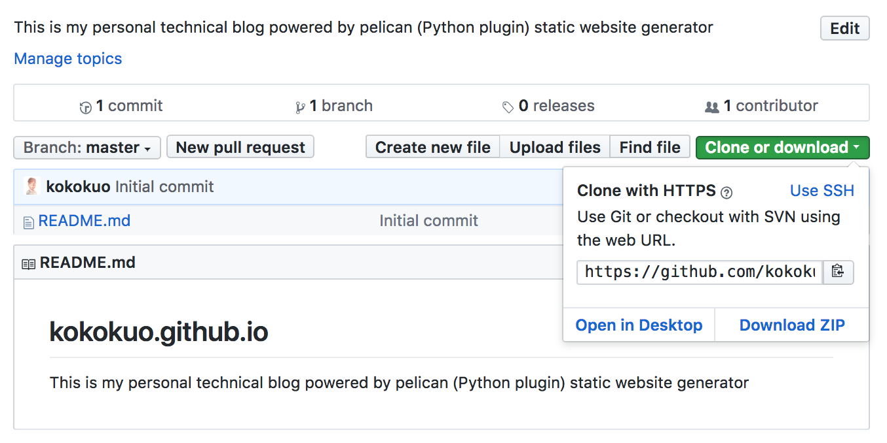

回到 Terminal 下，輸入以下指令，先在自己的 Pelican 網誌目錄下透過 `git init` 建立 Git 版本控管功能，Git 會預設幫我們建立一個 `master` 分支並在此分支下工作。

之後把剛剛的 URL 透過 `git remote add origin` 把網誌專案與 Repository 完成繫結：

```bash
(kokokuo-note)kokokuo-note> git init
(kokokuo-note)kokokuo-note(master)> git remote add origin https://github.com/kokokuo/kokokuo.github.io.git
(kokokuo-note)kokokuo-note(master)> git status # 確認是否有新增修改編輯刪除的檔案動作還沒被提交
```

如下圖，其中我們透過 `git status` 確認是否 `git init` 有無作用，或是來確認此次的變動修改有哪些檔案： 

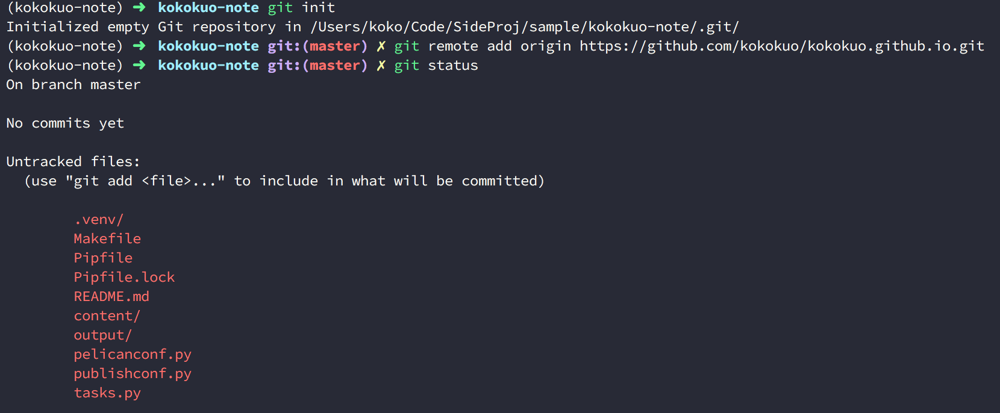


完成上述步驟，這個網誌目錄就與剛剛建立的 Github Repository 有了一個聯繫，之後我們便可以開始把整個 **kokokuo** 目錄透過 Git 提交儲存，再提交之前，我們先在專案目錄下建立一個 `.gitignore` 檔案並填入以下來榮。透過這個 `.gitignore` 檔案來過濾掉一些不必要上傳的檔案：

```bash
# 過濾掉 Mac 的 DS_Store
.DS_Store

# 過濾掉 VSCode 的設定檔案
.vscode/*

# 過濾 Pipenv 的虛擬環境
.venv/
```

完成上述的 `.gitignore` 後便可以開始透過以下指令步驟提交，可以發現再次下 `git status` 時，我們原本的 `.venv` 這個目錄消失了，因為我們把它也放在 `.gitignore` 中讓此目錄不需要被提交存擋：

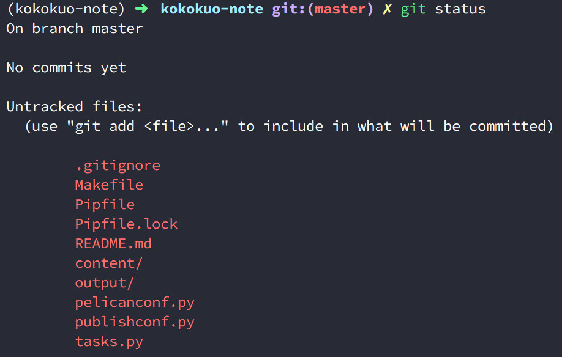

再來我們要設定 `git config`，因為需要告訴 Git 這個提交的作者是誰，才能追朔後續的歷史紀錄與變動，因此如果沒有設定，後半段的 Commit 也無法成功。

另外如果這個作者的信箱有註冊在 Github 中，那麼後續上傳到 Github 上時也能看到這個使用者。

```bash
(kokokuo-note)kokokuo-note(master)> git config local --email "你註冊的 Github 信箱"
(kokokuo-note)kokokuo-note(master)> git config local --name "你註冊的 Github 用戶名稱 Username"
```

接下來我們就要接著提交，並且發布上傳到 Github Page 上。

<br/>

# 三、Github Page 發布的分支設定

之所以我們的 Github Page 能顯示 `README` 檔案的內容，是因為 Github Page Repository 預設會去尋找 `master` 或 `gh-pages` 分支底下的 `index.html` 檔案，作為 https://username.github.io 呈現的內容。

不過對於個用戶或組織的帳戶建立的 Github Page 網頁，只能在 `master` 分支生效 (e.g: `username.github.io` 這種格式），而 `gh-pages`，則針對在程式碼專案的部分

另外若是都沒有 `index.html` 的話，則會優先顯示 `README` 這個檔案的內容。

而在此篇我們介紹個人用戶的靜態網站，所以會以 `master` 為主，至於專案的 `gh-pages` 以後會再介紹。

## 使用 master 作為發布分支的設定
由於 Pelican 產生出來的 HTML/CSS 這些靜態檔案是放在 **output** 目錄中的，因此如果整個 Pelican 專案上傳到預設的 `master` 分支 時，因為靜態檔案被放在 **output** ，所以會無法讀取顯示成功。

因此我們需要把這些 **output** 中的靜態檔案放到 `master` 中，而原本包含了 **content** 目錄、Makefile 與 pelicanconf.py 等的這些建立 Pelican 檔案時的來源檔案，我們要放到另外一個分支作為網存與記錄用。

在這邊我們會以 `develop` 作為我們 Pelican 靜態網站的來源檔案：

### (1.) 建立 Pelican 來源檔案變動與保存的分支 - 以 `develop` 分支為例
首先透過 `git checkout -b` 建立 `develop` 分支：

```bash
(kokokuo-note)kokokuo-note(master)> git checkout -b develop # 建立一個新的分支 develop，並把現在的檔案都遷移到此分支下。
(kokokuo-note)kokokuo-note(develop)> git status # 查看現在狀態
```

如下圖會看到我們已經搬移到 `develop` 中了：

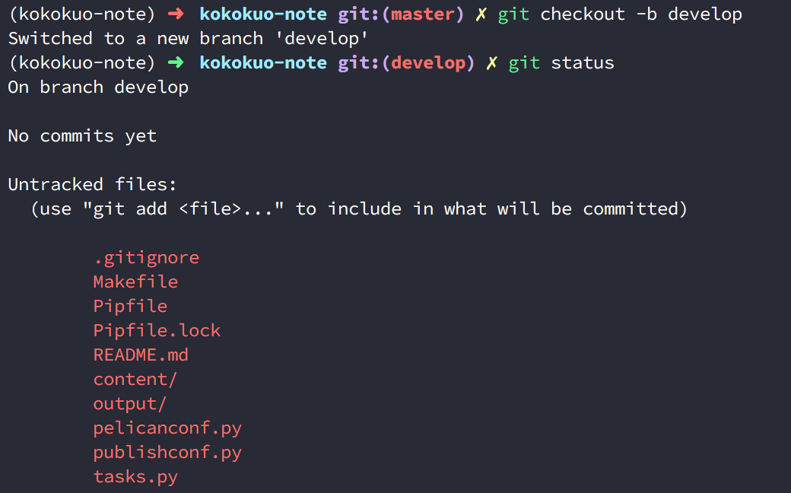

再來我們要把這些檔案 Commit 到此 `develop` 分支上：

```bash
(kokokuo-note)kokokuo-note(develop)> git add . # 告訴 Git 這個目錄下所有的檔案將要被上傳到 Repository 上
(kokokuo-note)kokokuo-note(develop)> git commit -m "生成所有 Pelican 網誌的檔案" # 準備提交所有的編輯動作完成存擋，透過 -m 給予此次提交的訊息內容
```

提交完後，上傳這個 `develop` 分支與存檔到 Repository 上，來保存我們的來源內容：

```bash
(kokokuo-note)kokokuo-note(develop)> git push origin develop
```

### (2.) 使用 `make github` 指令把 output 靜態檔案上傳到 `master`
當我們建立了 develop 分支並提交到 Repository 保存好我們的 Pelican 專案來源檔案後，再來我們就要使用到 Pelican 提供的 Makefile 檔案中的一個指令 `make github`。透過這個 `make github` 會自動執行 `make html` 產生在 **output** 目錄下的靜態 HTML 檔案，獨立推送上傳到 `master` 分支中。

不過為何會是推送到 `master` 呢？ 因為這個 `make github` 是讀取 Makefile 中設定好的預設上傳分支參數 `GITHUB_PAGES_BRANCH`，而預設就是 `master`：

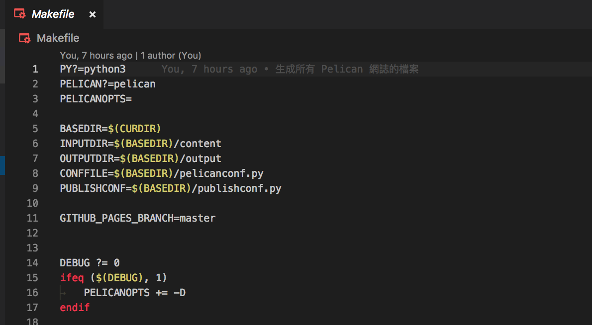


接下來在正式使用 `make github` 指令前，我們需要先安裝這個 Makefile 在執行 `make github` 所使用到的一個套件，叫做 `ghp-import` ，這個套件需要用到 `pip` 安裝，而因為我使用 Pipenv 所以如下執行：

```bash
(kokokuo-note)kokokuo-note(develop)> pipenv install ghp-import
```

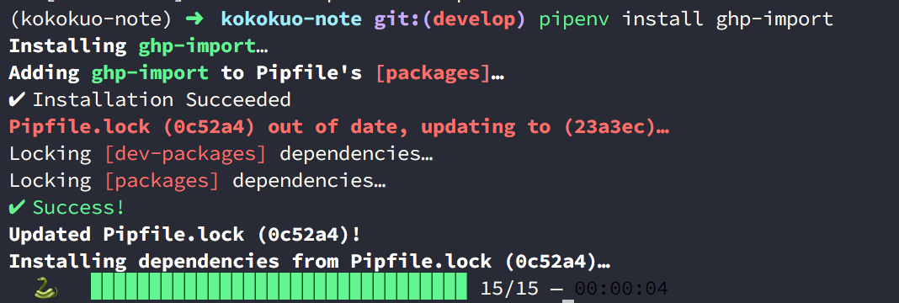

安裝完後我們再次更新 Commit 提交：

```bash
(kokokuo-note)kokokuo-note(develop)> git add .
(kokokuo-note)kokokuo-note(develop)> git commit -m "安裝 ghp-import"
```

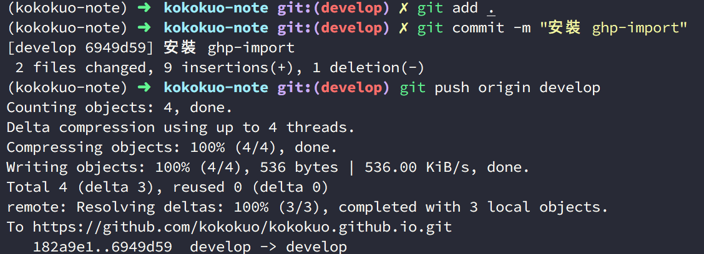

提交完後，我們便可以開始執行 `make github` ：

```bash
(kokokuo-note)kokokuo-note(develop)> make github
```

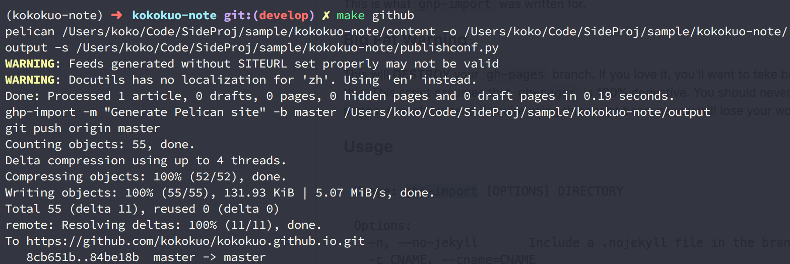

你會看到 `make github` 以 Makefile 中指定的 `master` 作為分支參數，自己幫我們把輸出的 **output** 檔案推送到 Makefile 中指定的 `master` 分支上。

之後切換到 Github Page 的 Repository 查看，如下圖你會看到 **output** 目錄下的 HTML 等靜態檔案都已在此 `master` 的 Repository 中：

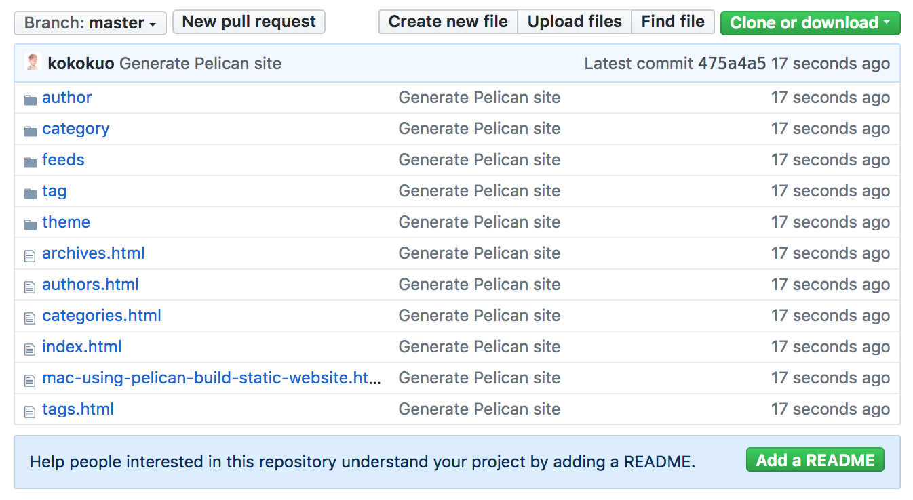

同時輸入網址，會看到我們的網頁內容，例如我是 https://kokokuo.github.io：

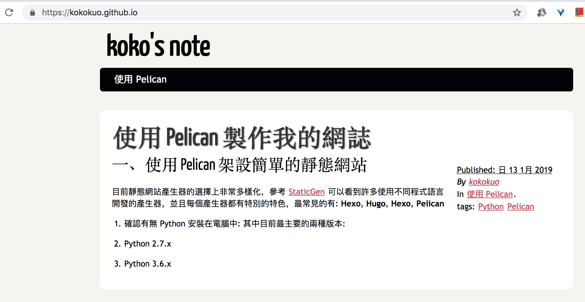

到此大功告成囉！

*補充：在執行 `make github` 指令時，會在本機端建立 `master` 分支並提交推送，如果在 Github Page 的 Repository 有較早推送的檔案，會一併刪除舊檔案請注意。*


# 參考來源
---
1. [Configuring a publishing source for GitHub Pages](https://help.github.com/articles/configuring-a-publishing-source-for-github-pages/)
2. [PUBLIC Stack Overflow Tags Users Jobs Teams Q&A for work Learn More Unable to change source branch in GitHub Pages](https://stackoverflow.com/questions/39978856/unable-to-change-source-branch-in-github-pages)
3. [Pelican 入门指南](http://chenjiee815.github.io/pelicanru-men-zhi-nan.html)
4. [使用 Pelican 和 GitHub Pages 搭建个人博客 —— 基础篇](http://www.xycoding.com/articles/2013/11/21/blog-create/)
5. [Pelican Tutorial](https://docs.getpelican.com/en/stable/content.html)