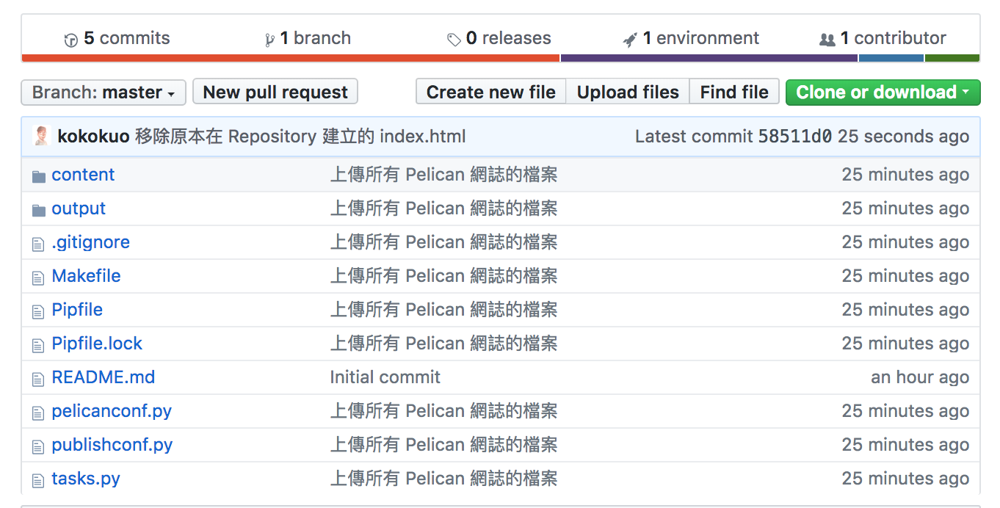

Title: 使用 Github Page 作為靜態網誌的空間 - 以 Pelican 為例
Date: 2019-02-05 01:40
Category: Python
Tags: Python, Pelican, Github, Static Site Generator
Slug: deploy-pelican-static-webiste-to-github-page
Authors: kokokuo
Summary: 使用 Github Page 作為靜態網誌的空間 - 以 Pelican 為例

# 前言
---
在前一篇 TODO [在 Mac 上使用 Python 的 Pelican 建立靜態個人網誌]() 中介紹了如何在本機端，安裝 Pelican 並建立自己的個人網誌，但是這個網誌卻只能在自己的電腦中呈現，並沒有放到網路上，因為我們缺少了可以存放 Pelican 網誌的伺服器。

不過因為靜態網站只有 HTML/CSS/JS 這類的檔案，因此能夠架設的伺服器空間選擇比較多。

因為不需要建置資料庫，也沒有後端的語言，只需要一個空間與簡單的伺服器軟體即可，所以會我們可以透過架設一台自己的伺服器電腦，透過 SSH 或 FTP 上傳，又或是使用 Dropbox 空間，雲端 AWS 與 Google Cloud, Azure 提供的服務。

但是上述中，要自己架設主機花時間也需要一些專業知識，使用 Dropbox、雲端服務的空間或多或少會需要收取一些費用，如果我們希望簡單又能夠不花費的話，要怎麼辦呢？

因此這裡我們就要選擇 **Github Page** ，因為當只要把檔案上傳即可，並且還不用花費任何半毛錢，以及因為 **Github Page** 是 **Github** 的服務之一，因此支援版本控制系統，簡單來說就是能夠幫你記錄每一次上傳更新的所有紀錄，能方便你還原上一版。

而這篇我們特別記錄了使用 Pelican 靜態網站時，如何部署到 Github Page 的過程。


# 一、創建一個 Github Page 的倉儲庫 (Repository)
首先我們需要在 Github 建立一個 Github Page 用的 Repository ，第一次使用 Github 的朋友可以先去註冊一個。

這個 Github Page 用的 Repository 會專門用來放置的靜態網誌的檔：


需要特別注意的部分是，我們的 Repository 名稱需要照個 Github Page 的教學指示，建立一個格式為 username.github.io 的名稱，而這個 `username` 必須是你的 Github 使用者名稱，如此 Github Page 才會知道你要建立屬於自己的個人網站並且作用，例如我的名稱是 `kokokuo` 所以我建立的 Repository 名稱為 `kokokuo.github.io`，如果不照著此方式，是無法作用建立的。

而 Repository 的權限、 `README` 與 `.gitignore`，看個人需要，例如我設定為 Public，定且有 README 與 Python 的 .gitnore (因為使用 Pelican)。

建立完後，你的 Repository 會如此畫面：


*附註：因為我有使用 README，Github Repository 的 README 會把剛剛建立時輸入的 Description 直接自動填上。*

完成後這個網站便可以馬上作用囉，只要在網址上輸入你建立的 `username.github.io` 名稱，例如我是 `kokokuo.github.io`，則輸入 https://kokokuo.github.io，就會看到這個 Github Page 的網站呈現了我剛剛建立的 `README` 內容。



<br/>

# 二、 Git 版管與 Repository 來源設定
再來就是第二部步驟，上傳檔案，而 Github 提供了兩種方式，第一種是透過 **終端機(Terminal)** 下指令，另外一種是下載他們提供的工具 **Github Desktop**，以視窗介面的形式上傳。

不過在操作上，由於 Pelican 有提供一些指令的部署工具，因此在此部分我們統一使用 Terminal 以指令的方式操作。

## 1. 安裝 Git 指令工具
由於本人使用的是 Mac ，所以我們採用 **Homebrew** 下載，不曉得 Homebrew 的人可以看一下我的這篇文章 TODO [Homebrew (1) - Mac 上安裝 Homebrew 套件管理工具]()

```bash
> brew install git
```

## 2. 設定 Github Page Repository 的來源位置至 Git 中

再來依照前一篇 TODO [在 Mac 上使用 Python 的 Pelican 建立靜態個人網誌]() 進到靜態網誌的專案目錄下，並且透過 Pipenv 或 Virtualenv 進入到虛擬環境下（這裡以 Pipenv 為例子），同時確認是否有執行或把 **output** 目錄中的 HTML 檔更新到最新，如果沒有則再次執行 `make html`：

```bash
> cd kokokuo-note
kokokuo-note/> pipenv shell
(kokokuo-note)kokokuo-note/> make html
```

確認更新到最新的 HTML 檔案後，再來我們要把在 Github 上我們剛建立好的 Github Page Repository 與我們的 Pelican 網誌做一個繫結。

首先點選建立的 Repository 的 **Clone or Download**，並複製顯示的 URL:


再來回到 Terminal 下，輸入以下指令，先在自己的 Pelican 網誌目錄下透過 `git init` 建立 Git 版本控管功能，並把剛剛的 URL 透過 `git remote add origin` 把網誌專案與 Repository 完成繫結：

```bash
(kokokuo-note)kokokuo-note/> git init
(kokokuo-note)kokokuo-note/> git remote add origin https://github.com/kokokuo/kokokuo.github.io.git
(kokokuo-note)kokokuo-note/> git status # 確認是否有新增修改編輯刪除的檔案動作還沒被提交
```

如下圖，其中我們透過 `git status` 確認是否 `git init` 有無作用，或是來確認此次的變動修改有哪些檔案： 


完成上述步驟，這個網誌目錄就與剛剛建立的 Github Repository 有了一個聯繫，之後我們便可以開始把整個 **kokokuo** 目錄透過 Git 提交儲存，再提交之前，我們先在專案目錄下建立一個 `.gitignore` 檔案並填入以下來榮。透過這個 `.gitignore` 檔案來過濾掉一些不必要上傳的檔案：

```bash
# 過濾掉 Mac 的 DS_Store
.DS_Store

# 過濾掉 VSCode 的設定檔案
.vscode/*

# 過濾 Pipenv 的虛擬環境
.venv/
```

完成上述的 `.gitignore` 後便可以開始透過以下指令步驟提交，可以發現再次下 `git status` 時，我們原本的 `.venv` 這個目錄消失了，因為我們把它也放在 `.gitignore` 中讓此目錄不需要被提交存擋：


再來我們要設定 `git config`，因為需要告訴 Git 這個提交的作者是誰，才能追朔後續的歷史紀錄與變動，因此如果沒有設定，後半段的 Commit 也無法成功。

另外如果這個作者的信箱有註冊在 Github 中，那麼後續上傳到 Github 上時也能看到這個使用者。

```bash
(kokokuo-note)kokokuo-note/> git config local --email "你註冊的 Github 信箱"
(kokokuo-note)kokokuo-note/> git config local --name "你註冊的 Github 用戶名稱 Username"
```

接下來我們就要接著提交，並且發布上傳到 Github Page 上。

<br/>

# 三、發布的分支設定

## 1. Github Page 的分支建立順序
之所以我們的 Github Page 能顯示 `README` 檔案的內容，是因為 Github Page Repository 預設會去尋找 `master` 或 `gh-pages` 分支底下的 `index.html` 檔案，作為 https://username.github.io 呈現的內容。

不過因為剛開始建立的 Repository 都只有 `master`，因此會先以 `master` 為主，若未來想要改用 `gh-pages`，則可以建立並作設定。

另外若是都沒有 `index.html` 的話，則會優先顯示 `README` 這個檔案的內容。

而接下來我們分別介紹 `master` 與 `gh-pages` 兩種方式。

## 2. 使用 master 作為發布分支的設定
由於 Pelican 產生出來的 HTML/CSS 這些靜態檔案是放在 **output** 目錄中的，因此如果整個 Pelican 專案上傳到預設的 `master` 分支 時，因為靜態檔案被放在 **output** ，所以會無法讀取顯示成功。

因此我們需要把這些 **output** 中的靜態檔案放到 `master` 中，而原本包含了 **content** 目錄、Makefile 與 pelicanconf.py 等的這些建立 Pelican 檔案時的來源檔案，我們要放到另外一個分支作為網存與記錄用。

在這邊我們會以 `develop` 作為我們 Pelican 靜態網站的來源檔案：

### (1.) 使用 develop 作為 Pelican 來源檔案
首先透過 `git checkout -b` 建立 `develop` 分支：

```bash
(kokokuo-note)kokokuo-note/> git checkout -b develop # 建立一個新的分支 develop，並把現在的檔案都遷移到此分支下。
(kokokuo-note)kokokuo-note/> git status # 查看現在狀態
```

如下圖會看到我們已經搬移到 `develop` 中了：


再來我們要把這些檔案 Commit 到此分支上：

```bash
(kokokuo-note)kokokuo-note/> git add . # 告訴 Git 這個目錄下所有的檔案將要被上傳到 Repository 上
(kokokuo-note)kokokuo-note/> git commit -m "生成所有 Pelican 網誌的檔案" # 準備提交所有的編輯動作完成存擋，透過 -m 給予此次提交的訊息內容
```


提交完後，上傳這個 `develop` 分支與存檔到 Repository 上，來保存我們的來源內容：

```bash
(kokokuo-note)kokokuo-note/> git push origin develop
```

### (2.) 使用 make github 指令把 output 靜態檔案上傳到 master
在我們建立了 develop 分支保存好我們的 Pelican 專案來源檔案後，再來我們就要使用到 Pelican 提供的 Makefile 檔案中的一個指令 `make github`，透過這個 `make github` 可以幫我們把 `make html` 產生在 **output** 目錄下的靜態 HTML 檔案區獨立推送上傳到 `master` 分支中。

這個 `make github` 會自己檢查有無設定 git config 並且讀取 Makefile 設定好的預設上傳分支，而預設就是 `master`：


TODO 繼續撰寫


完成上述的 Commit 提交儲存後，才能把檔案上傳推送到 Repository 上面：


但是在推送上去後你會看到一個拒絕的資訊：*「error: failed to push some refs to 'https://github.com/kokokuo/kokokuo.github.io.git'」* ...

這個原因不用擔心，這是 Git 在 2.9 版本時出現的，主要是告訴你這個要放到 Github Repository 的目錄檔案與原先在 Github 上的 Repository 是兩個不同的專案，因為沒有關聯所以才會拒絕你。

如果要解決這個問題，只要輸入 `git pull origin master` 並在後面加入 `--allow-unrelated-histories` 這個指令就好，如下：

```bash
> git pull origin master --allow-unrelated-histories
```

這個指令表示，我要把在 Github Repository 上的這些檔案先抓下來跟我本機上的 Pelican 專案先合併一版，但是因為彼此不相關，所以補上 `--allow-unrelated-histories` 表示我允許你們不相關沒關係，給我合併就對了。

如此就會看到在 Github Repository 上我們原先建立好的 README 與 index.html 與我們的 Pelican 專案合再一起放到 Pelican 網誌專案的目錄中，之後我們再次執行 `git push origin master` 就可以了，如下圖：


完成後讓我們移動到 Github Page 所放的 Repository 上，你會看到剛剛在自己電腦上的 Pelican 專案中所有的檔案被放上去了：




# 參考來源
---
[1. Configuring a publishing source for GitHub Pages](https://help.github.com/articles/configuring-a-publishing-source-for-github-pages/)