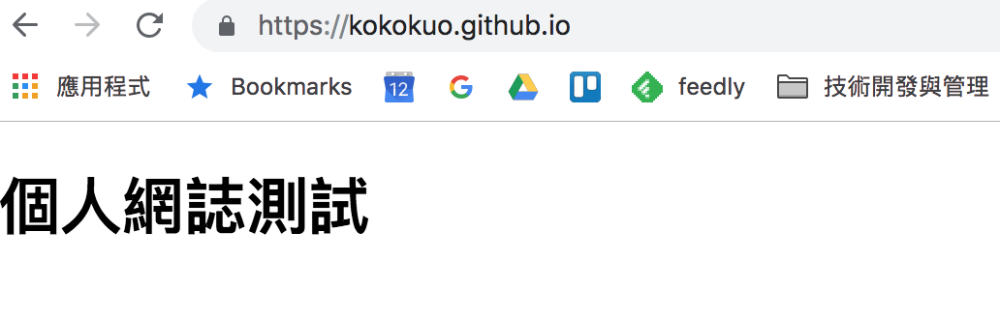

Title: 使用 Github Page 作為靜態網誌的空間 - 以 Pelican 為例
Date: 2019-02-05 01:40
Category: Python
Tags: Python, Pelican, Github
Slug: deploy-pelican-static-webiste-to-github-page
Authors: kokokuo
Summary: 使用 Github Page 作為靜態網誌的空間 - 以 Pelican 為例

# 前言
---
在前一篇 TODO [在 Mac 上使用 Python 的 Pelican 建立靜態個人網誌]() 中介紹了如何在本機端，安裝 Pelican 並建立自己的個人網誌，但是這個網誌卻只能在自己的電腦中呈現，並沒有放到網路上，因為我們缺少了可以存放 Pelican 網誌的伺服器。

而如同在前一篇一開始的 `pelican-quickstart` 中提問的問題，其實只有 HTML/CSS/JS 這類的靜態網誌，能夠架設的伺服器空間選擇比較多，因為不需要建置資料庫，也沒有後端的語言，只需要一個空間與簡單的伺服器軟體即可，所以會我們可以透過架設一台自己的伺服器電腦，透過 SSH 或 FTP 上傳，又或是使用 Dropbox 空間，雲端 AWS 與 Google Cloud, Azure 提供的服務。

但是上述中，要自己架設主機花時間也需要一些專業知識，使用 Dropbox、雲端服務的空間或多或少會需要收取一些費用，如果我們希望簡單又能夠不花費的話，要怎麼辦呢？

是的，這就是在這裡我介紹 **Github Page** 的原因，因為當只要把檔案上傳即可，並且還不用花費任何半毛錢，以及因為 **Github Page** 是 **Github** 的服務之一，因此支援版本控制系統，簡單來說就是能夠幫你記錄每一次上傳更新的所有紀錄，能方便你還原上一版。

# 二、透過 Github Page 作為網誌空間並上傳
---
[Github Page](https://pages.github.com/) 是全球最多開發者使用的版本控管程式碼託管服務 - Github 旗下的產品服務。


之所以會有 Github Page ，是因為 Github 雖然託管了許多來自世界各地的程式碼專案，但 Github 更希望這些程式碼專案能被開放開源給任何人使用，可由於程式碼本身便不易理解，再加上每個開發的程式都有著不同的用意。

因此若是沒有一些說明的文件實在難以閱讀理解，所以也才有 Github Page。

希望提供一個可以簡單架設介紹網頁的服務，讓這些程式碼都有自己的網頁介紹，除了這些程式碼專案外，Github 也提供了給每個用戶或是組織企業，架設自己的簡易介紹網頁。也因為只要作為介紹網頁用，所以只有 HTML/CSS/JS 等靜態網站的檔案可以作用。

並且要把我們的靜態網站檔案放到 Github Page 非常容易，只要三個步驟即可。


### (1.) 創建一個存放靜態網站的 Github 倉儲庫 (Repository)
再來我們需要在 Github 建立一個 Repository ，第一次使用 Github 的朋友可以先去註冊一個。

這個 Repository 是專門用來放我們網誌的靜態檔案的空間， Github Page 的網誌檔案也是放在 Github 的 Repository 中：


需要特別注意的部分是，我們的 Repository 名稱需要照個 Github Page 的教學指示，建立一個格式為 username.github.io 的名稱，而這個 `username` 必須是你的 Github 使用者名稱，如此 Github Page 才會知道你要建立屬於自己的個人網站並且作用，例如我的名稱是 `kokokuo` 所以我建立的 Repository 名稱為 `kokokuo.github.io`，如果不照著此方式，是無法作用建立的。

而 Repository 的權限、 `README` 與 `.gitignore`，看個人需要，例如我設定為 Public，定且有 README 與 Python 的 .gitnore (因為使用 Pelican)。

建立完後，你的 Repository 會如此畫面：


附註一下，因為我有使用 README，Github Repository 的 README 會把剛剛建立時輸入的 Description 直接自動填上。

完成後這個網站便可以馬上作用囉，只要在網址上輸入你建立的 `username.github.io` 名稱，例如我是 `kokokuo.github.io`，則輸入 https://kokokuo.github.io，就會看到這個 Github Page 的網站呈現了我剛剛建立的 `README` 內容。



再來我們也來測試一下上傳一個 HTML 檔案作為該靜態網站的預設頁面。

點擊在 Repository 中的一個 **create new file** 按鈕，並建立一個叫做 `index.html` 的網頁檔案， Github Page 會偵測名為 `index.html` 自動作為 https://username.github.io 的預設讀取入口檔。


如上所述，我們建立一個簡單的 HTML 檔案，並且輸入要 Commit 的描述與內容，來完成建立。

這邊稍微提一下，所謂的 Commit 表示提交，也就是提交此次新增、編輯或刪除的動作，而 Git 版本控管會記錄你每一次的 Commit，換句話說就是紀錄你每次的修改，有點像是遊戲的存擋，或是 Google 文件與 Word 會記錄你每次的新增、編輯或刪除的動作，因此未來你也可以讀取回到原先的動作與紀錄。

至於想要深入了解的人可以查一查 **Git 版本控管系統** 的用途。

上傳完後，會看到以下的檔案內容：


再次輸入網址 https://kokokuo.github.io，如下顯示的內容也改變了：



那麼再來我們就要認真的把 Pelican 的靜態網誌上傳了。

### (2.) 透過 Git 版本控管上傳你的靜態網誌檔案
再來就是第二部步驟，上傳檔案，而 Github 提供了兩種方式，第一種是透過 **終端機(Terminal)** 下指令，另外一種是下載他們提供的工具 **Github Desktop**，以視窗介面的形式上傳。

不管是使用 Terminal 或是 **Github Desktop**，都需要安裝 Git 指令工具，但只有使用 Terminal 需要手動下載一下，至於 **Github Desktop** 會順便安裝進去，以下我們分別介紹：

#### (2.1) 透過終端機 Terminal 指令上傳檔案
由於本人使用的是 Mac ，所以我們採用 **Homebrew** 下載，不曉得 Homebrew 的人可以看一下我的這篇文章 TODO [Homebrew (1) - Mac 上安裝 Homebrew 套件管理工具]()

```bash
> brew install git
```

