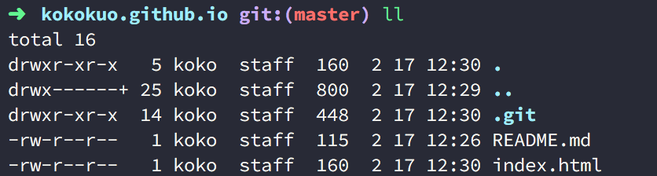

Title: 透過 Github Page 上傳靜態網站
Date: 2019-02-28
Category: Web
Tags: Static Site Generator
Slug: why-use-static-site-generator
Authors: kokokuo
Summary: 透過 Github Page 架設個人靜態網站

# 前言
---
TODO 在[什麼是靜態網站 (Static Site) 與 靜態網站產生器 (Static Site Generator)]() 中，我們提到了要架設一個網站時，一定或多或少會去想一下，這個網站是什麼用途，要怎麼架設與架設在哪裡，以及什麼是 **靜態網站 (Static Site)** 與 **靜態網站產生器 (Static Site Generator)**。

**靜態網站 (Static Site)** 也因為檔案結構單純( 只有 HTML/CSS/JS 這類檔案 )，架設的伺服器空間選擇比較多，因為不需要建置資料庫，也沒有後端的語言，只需要一個空間與簡單的伺服器軟體即可。

我們可以架設一台自己的伺服器電腦並透過 SSH 或 FTP 上傳檔案架設完成，又或是使用 Dropbox 空間，雲端 AWS 與 Google Cloud, Azure 提供的服務完成架設。

但是上述中，要自己架設主機花時間也需要一些專業知識，使用 Dropbox、雲端服務的空間或多或少會需要收取一些費用，如果我們希望簡單又能夠不花費的話，要怎麼辦呢？

是的，這就是在這裡我介紹 **Github Page** 的原因，因為透過 **Github Page** 不僅容易，並且還不用花費任何半毛錢，另外因為 **Github Page** 是 **Github** 的服務之一，因此支援版本控制系統，簡單來說就是能夠幫你記錄每一次上傳更新的所有紀錄，能方便你還原上一版。

# 什麼是 Github Page
---
[Github Page](https://pages.github.com/) 是全球最多開發者使用的版本控管程式碼託管服務 - Github 旗下的產品服務。


之所以會有 Github Page ，是因為 Github 雖然託管了許多來自世界各地的程式碼專案並起開源給任何人使用，但由於程式碼本身便不易理解也難以知道其意圖外，Github 更希望不僅是這些程式碼，有任何的點子或想法的人也能夠在上面分享。

因此有了 Github Page - 希望提供一個可以簡單架設靜態網站的服務，不僅讓這些程式碼專案都有自己的網頁介紹外，Github Page 也提供給每個用戶或是組織企業的帳號可以架設一個自己帳號用的的靜態網站，來分享自己在做的事情或是想法、經歷，而且不用自己架設架設伺服器維護，只要把想放上去呈現的檔案上傳就好，也不用花錢不是該來試試看嗎？


在本篇我們會以介紹如何架設個人帳號的靜態網站為主，專案用的靜態網站會在下一篇 []() 中介紹。


# 一、創建一個存放靜態網站的 Github 倉儲庫 (Repository)
首先我們需要在 Github 建立一個 Github Page 用的 Repository ，第一次使用 Github 的朋友可以先去註冊一個。

這個 Github Page 用的 Repository 會專門用來放置的靜態網誌的檔案：


需要特別注意的部分是，我們的 Repository 名稱需要照個 Github Page 的教學指示，建立一個格式為 username.github.io 的名稱，而這個 `username` 必須是你的 Github 使用者名稱，如此 Github Page 才會知道你要建立屬於自己帳戶用的靜態網站，例如我的名稱是 `kokokuo` 所以我建立的 Repository 名稱為 `kokokuo.github.io`，如果不照著此方式，是無法作用建立的。

而 Repository 的權限、 `README` 與 `.gitignore`，看個人需要，例如我設定為 Public，並且有 README。

建立完後，你的 Repository 會如此畫面：


附註一下，因為我有使用 README，Github Repository 的 README 會把剛剛建立時輸入的 Description 直接自動填上。

完成後這個網站便可以馬上作用囉，只要在網址上輸入你建立的 `username.github.io` 名稱，例如我是 `kokokuo.github.io`，則輸入 https://kokokuo.github.io，就會看到這個 Github Page 的網站呈現了我剛剛建立的 `README` 內容。



再來我們也來測試一下上傳一個 HTML 檔案作為該靜態網站的預設頁面。

點擊在 Repository 中的一個 **create new file** 按鈕，並建立一個叫做 `index.html` 的網頁檔案， Github Page 會偵測名為 `index.html` 自動作為 https://username.github.io 的預設讀取入口檔。


如上所述，我們建立一個簡單的 HTML 檔案，並且輸入要 Commit 的描述與內容，來完成建立。

這邊稍微提一下，所謂的 Commit 表示提交，也就是提交此次新增、編輯或刪除的動作，而 Git 版本控管會記錄你每一次的 Commit，換句話說就是紀錄你每次的修改，有點像是遊戲的存擋，或是 Google 文件與 Word 會記錄你每次的新增、編輯或刪除的動作，因此未來你也可以讀取回到原先的動作與紀錄。

至於想要深入了解的人可以查一查 **Git 版本控管系統** 的用途。

上傳完後，會看到以下的檔案內容：


再次輸入網址 https://kokokuo.github.io，如下顯示的內容也改變了：


不過上述的方式只是單純在 Github Page 的 Repository 上做一個簡單的測試而已，接下來我們要在自己電腦本機上建立與編輯的檔案，並上傳到 Github Page 的 Repository 上。

# 二、透過 Git 版本控管上傳靜態網站的檔案
在 Github 中提供了兩種方式，第一種是透過 **終端機(Terminal)** 下指令，另外一種是下載他們提供的工具 **Github Desktop**，以視窗介面的形式上傳。

不管是使用 Terminal 或是 **Github Desktop**，都需要安裝 Git 指令工具，但只有使用 Terminal 需要手動下載一下，至於 **Github Desktop** 會順便安裝進去，以下我們分別介紹：

## 1. 透過終端機 Terminal 指令上傳檔案
由於本人使用的是 Mac ，所以我們採用 **Homebrew** 下載，不曉得 Homebrew 的人可以看一下我的這篇文章 TODO [Homebrew (1) - Mac 上安裝 Homebrew 套件管理工具]()

```bash
> brew install git
```

安裝完後，我們來把我們在 Github 上的 Repository 抓下來，點選 Reposiotry 右側的 **Clone or download** 並複製字串：


在我們的終端機找好一個目錄位置把他抓下來，例如 Desktop 下面：

```bash
$> cd ~/Desktop
Desktop/> git clone https://github.com/kokokuo/kokokuo.github.io.git
```


此時你便可以發下  `koko.github.io` 這個目錄與檔案被抓下來：



再來我們便可以在這個目錄下新增或編輯我們要的網頁，在這裡我使用 VSCode 這套工具來編輯，我們嘗試加入一個檔案叫做 `about.html` 在同層目錄下，並且讓 `index.html` 加入一個連結可以跳到這個 `about.html` 中：

加入 `about.html`：


設定 `about.html` 的連結：


再來我們把修改過的結果往 `kokokuo.github.io` 的 Repository 丟上去。

```bash
Desktop/(master)> add .
Desktop/(master)> git config local --email "你註冊的 Github 信箱"
Desktop/(master)> git config local --name "你註冊的 Github 用戶名稱 Username"
Desktop/(master)> commit -m "加入 about.html 並從 inde.html 建立 Link 到 about.html"
```

## 2. 透過 Github Desktop 軟體上傳靜態網站的檔案