Title: 透過 Github Page 上傳靜態網站
Date: 2019-02-28
Category: Web
Tags: Static Site Generator
Slug: why-use-static-site-generator
Authors: kokokuo
Summary: 透過 Github Page 架設個人靜態網站

# 前言
---
我們提到了要架設一個網站時，一定或多或少會去想一下，這個網站是什麼用途，要怎麼架設與架設在哪裡。

如果你要架設的網站功能會比較複雜，例如你需要會員註冊、一些預約功能、購物車下單、線上刷卡、即時訊息、編輯檔案並保存等功能，那麼就會需要有資料庫，此外需要透過後端的網頁語言，專門的伺服器來處理，本篇無法為你解決困擾。

但若你只要單純的呈現訊息，例如個人網頁、部落格、公司官網，那麼也許你只需要架設一個 **靜態網站 (Static Site)** ，此時你可以繼續往下閱讀。

**靜態網站 (Static Site)** 因為檔案結構單純( 只有 HTML/CSS/JS 這類檔案 )，架設的伺服器空間選擇比較多，因為不需要建置資料庫，也沒有後端的語言，只需要一個空間與簡單的伺服器軟體即可。

我們可以架設一台自己的伺服器電腦並透過 SSH 或 FTP 上傳檔案架設完成，又或是使用 Dropbox 空間，雲端 AWS 與 Google Cloud, Azure 提供的服務完成架設。

但是上述中，要自己架設主機花時間也需要一些專業知識，使用 Dropbox、雲端服務的空間或多或少會需要收取一些費用，如果我們希望簡單又能夠不花費的話，要怎麼辦呢？

是的，這就是在這裡我介紹 **Github Page** 的原因，因為透過 **Github Page** 不僅容易，並且還不用花費任何半毛錢，另外因為 **Github Page** 是 **Github** 的服務之一，因此支援版本控制系統，簡單來說就是能夠幫你記錄每一次上傳更新的所有紀錄，能方便你還原上一版。

# 什麼是 Github Page
---
[Github Page](https://pages.github.com/) 是全球最多開發者使用的版本控管程式碼託管服務 - Github 旗下的產品服務。


之所以會有 Github Page ，是因為 Github 雖然託管了許多來自世界各地的程式碼專案並起開源給任何人使用，但由於程式碼本身便不易理解也難以知道其意圖外，Github 更希望不僅是這些程式碼，有任何的點子或想法的人也能夠在上面分享。

因此有了 Github Page - 希望提供一個可以簡單架設靜態網站的服務，不僅讓這些程式碼專案都有自己的網頁介紹外，Github Page 也提供給每個用戶或是組織企業的帳號可以架設一個自己帳號用的的靜態網站，來分享自己在做的事情或是想法、經歷，而且不用自己架設架設伺服器維護，只要把想放上去呈現的檔案上傳就好，也不用花錢不是該來試試看嗎？


# 一、創建一個存放靜態網站的 Github 倉儲庫 (Repository)
---
首先我們需要在 Github 建立一個 Github Page 用的 Repository ，第一次使用 Github 的朋友可以先去註冊一個。

這個 Github Page 用的 Repository 會專門用來放置的靜態網誌的檔案：


需要特別注意的部分是，我們的 Repository 名稱需要照個 Github Page 的教學指示，建立一個格式為 username.github.io 的名稱，而這個 `username` 必須是你的 Github 使用者名稱，如此 Github Page 才會知道你要建立屬於自己帳戶用的靜態網站，例如我的名稱是 `kokokuo` 所以我建立的 Repository 名稱為 `kokokuo.github.io`，如果不照著此方式，是無法作用建立的。

而 Repository 的權限、 `README` 與 `.gitignore`，看個人需要，例如我設定為 Public，並且有 README。

建立完後，你的 Repository 會如此畫面：


附註一下，因為我有使用 README，Github Repository 的 README 會把剛剛建立時輸入的 Description 直接自動填上。

完成後這個網站便可以馬上作用囉，只要在網址上輸入你建立的 `username.github.io` 名稱，例如我是 `kokokuo.github.io`，則輸入 https://kokokuo.github.io，就會看到這個 Github Page 的網站呈現了我剛剛建立的 `README` 內容。



再來我們也來測試一下上傳一個 HTML 檔案作為該靜態網站的預設頁面。

點擊在 Repository 中的一個 **create new file** 按鈕，並建立一個叫做 `index.html` 的網頁檔案， Github Page 會偵測名為 `index.html` 自動作為 https://username.github.io 的預設讀取入口檔。


如上所述，我們建立一個簡單的 HTML 檔案，並且輸入要 Commit 的描述與內容，來完成建立。

這邊稍微提一下，所謂的 Commit 表示提交，也就是提交此次新增、編輯或刪除的動作，而 Git 版本控管會記錄你每一次的 Commit，換句話說就是紀錄你每次的修改，有點像是遊戲的存擋，或是 Google 文件與 Word 會記錄你每次的新增、編輯或刪除的動作，因此未來你也可以讀取回到原先的動作與紀錄，這又稱作 **「版本控制系統」**。

而整個 Github 的服務都是以 **Git** 這套版本控制系統為核心的，所以不管是架設 Github Page 還是把程式碼放到 Repository 上都需要稍微了解一下 **Git 版本控制系統** ，而同時 **Git 版本控制系統** 也是目前全世界最多人用的版本控制系統。

若想要深入了解的人可以查一查 **Git 版本控管系統** 的用途。

上傳完後，會看到以下的檔案內容：


再次輸入網址 https://kokokuo.github.io，如下顯示的內容也改變了：


不過上述的方式只是單純在 Github Page 的 Repository 上做一個簡單的測試而已，接下來我們要在自己電腦本機上建立與編輯的檔案，並上傳到 Github Page 的 Repository 上。

# 二、透過 Git 版本控管上傳靜態網站的檔案
---
在 Github 中提供了兩種方式，第一種是透過 **終端機(Terminal)** 下指令，另外一種是下載他們提供的工具 **Github Desktop**，以視窗介面的形式上傳。

不管是使用 Terminal 或是 **Github Desktop**，都需要安裝 Git 指令工具，但只有使用 Terminal 需要手動下載一下，至於 **Github Desktop** 會順便安裝進去，以下我們分別介紹：

## 1. 透過終端機 Terminal 指令上傳檔案
由於本人使用的是 Mac ，所以我們採用 **Homebrew** 下載，不曉得 Homebrew 的人可以看一下我的這篇文章 TODO [Homebrew (1) - Mac 上安裝 Homebrew 套件管理工具]()

首先我們要安裝 `git` 這個指令工具，`git` 也就是前面提到的「版本控制系統」，而由於在 Github 上其網站的核心與提供的功能都已經包含，所以不用特別安裝。

但是在我們自己的電腦上，為了可以跟 Github 溝通並上傳檔案，所以需要安裝，不過因為 `git` 這套系統其實只需要指令就可以執行，所以在 Mac 上我們可以直接以指令工具的形式安裝即可。

```bash
> brew install git
```

安裝完後，我們來把我們在 Github 上的 Repository 抓下來，點選 Reposiotry 右側的 **Clone or download** 並複製字串：


在我們的終端機找好一個目錄位置把他抓下來，例如 Desktop 下面：

```bash
$> cd ~/Desktop
Desktop/> git clone https://github.com/kokokuo/kokokuo.github.io.git
```


此時你便可以發現  `koko.github.io` 這個目錄與檔案被抓下來：


再來我們便可以在這個目錄下新增或編輯我們要的網頁，在這裡我使用 VSCode 這套工具來編輯，我們嘗試加入一個檔案叫做 `about.html` 在同層目錄下，並且讓 `index.html` 加入一個連結可以跳到這個 `about.html` 中：

加入 `about.html`：


設定 `about.html` 的連結：


再來我們把修改過的結果往 `kokokuo.github.io` 的 Repository 丟上去，透過以下幾個指令：


```bash
Desktop/(master)> git status
Desktop/(master)> git add .
Desktop/(master)> git config local --email "你註冊的 Github 信箱"
Desktop/(master)> git config local --name "你註冊的 Github 用戶名稱 Username"
Desktop/(master)> commit -m "加入 about.html 並從 inde.html 建立 Link 到 about.html"
Desktop/(master)> push origin master
```

這邊來稍微介紹一下上述這些指令的用途，首先是 `git status` ，這個可以透來檢查目前你做了哪些修改，所以他你輸入後，你會看到如下圖，紀錄了我們修改一個檔案 `index.html` ，另外有一個是新加入還沒有被紀錄追蹤的檔案 `about.html`：

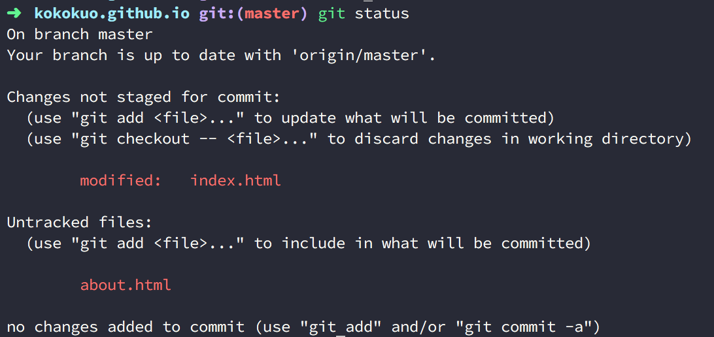

然後 `git add` 就可以用來告訴 Git 哪些變更的動作要被放到暫存區準備提交保存的，其中 `git add .` 表示所有變更的動作都要保存：

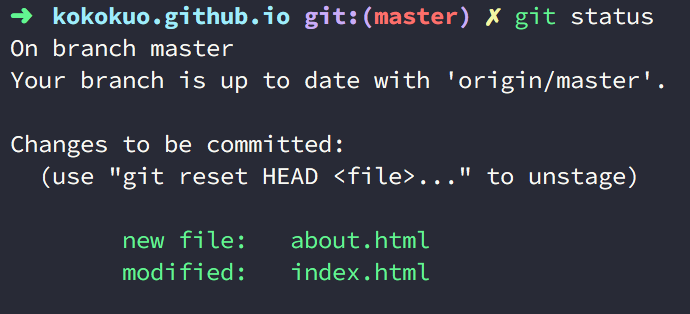

接著透過 `git config local --email` 與 `git config local --name` 來設定在我們這個本機上對這個專案變更的用戶是誰，另外若設定的用戶名稱與 Email 是 Github 上註冊過的帳戶，上傳後還會顯示這個帳號在 Github 的資訊與連結哦！

設定完後再透過 `git commit` 把剛剛因為 `git add` 指令，放到暫存區的所有變更動作提交保存，這樣未來要是出了什麼問題，只要本機上的整個專案目錄不刪除，都能回到之前的版本哦。

最後我們以 `git push origin master` 指令把這些提交變更上傳到我們剛剛抓下來的 Github Repository 上傳回去 Github Repository：

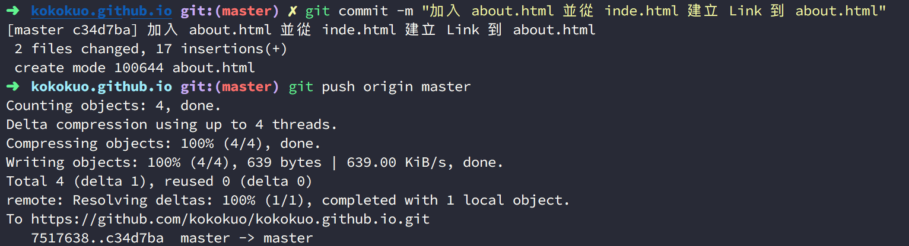

接著我們回到 Github Page 存放的 Repository ，此時修改與新的檔案已經在此，輸入 https://kokokuo.github.io 也能看到新的內容出現了！

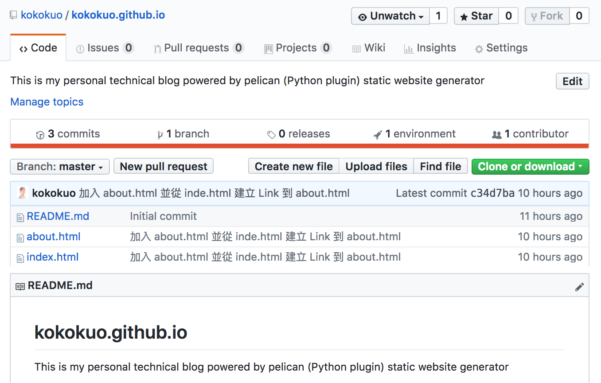

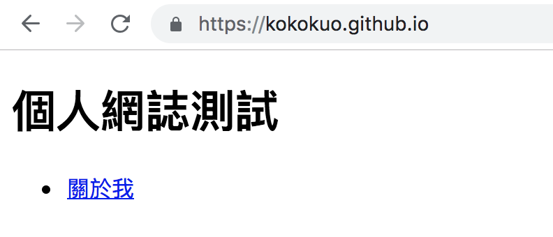

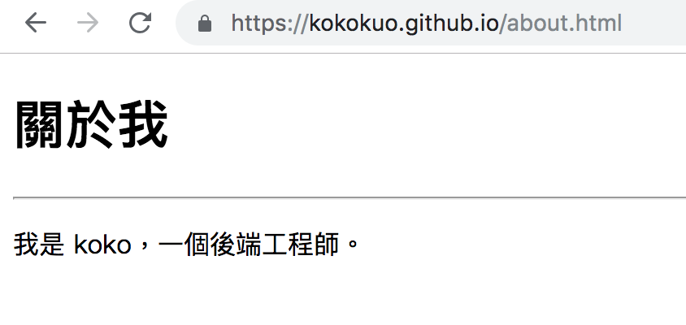

而且使用 `git push` 指令上傳到 Github Repository 還能幫忙備份檔案，讓你在本機上刪除專案目錄後，也能再次下載還原，一舉數得。

好的，到此完成使用 **Terminal 終端機與指令** 上傳與架設靜態 Github Page 網站囉，再來我們要介紹比較簡單的 **Github Desktop** ，讓不熟悉或懼怕指令的朋友們也能輕鬆上手。


## 2. 透過 Github Desktop 軟體上傳靜態網站的檔案
在上半部我們講完了如何使用 **Terminal 終端機與指令** 上傳與架設靜態 Github Page 網站，接下來我們要介紹如何使用 **Github Desktop** 軟體一樣做到上傳檔案與架設靜態的 Github Page 網站。

不使用指令的人可以在 **一、創建一個存放靜態網站的 Github 倉儲庫 (Repository)** 完成後，不於電腦上安裝 `git` ，而是選擇安裝 Github 提供的一個圖形化的版本控制軟體，叫做 **Github Desktop** 來加入檔案、 Commit 提交或是推送到 Github Respository 上。( 如果你對這類工具很熟悉，你也可以選擇其他類的工具，例如： SourceTree )。

首先開始搜尋 Github Desktop 會進入下載的連結頁面，如下圖你會看到一個 Mac OS 的版本可以下載。

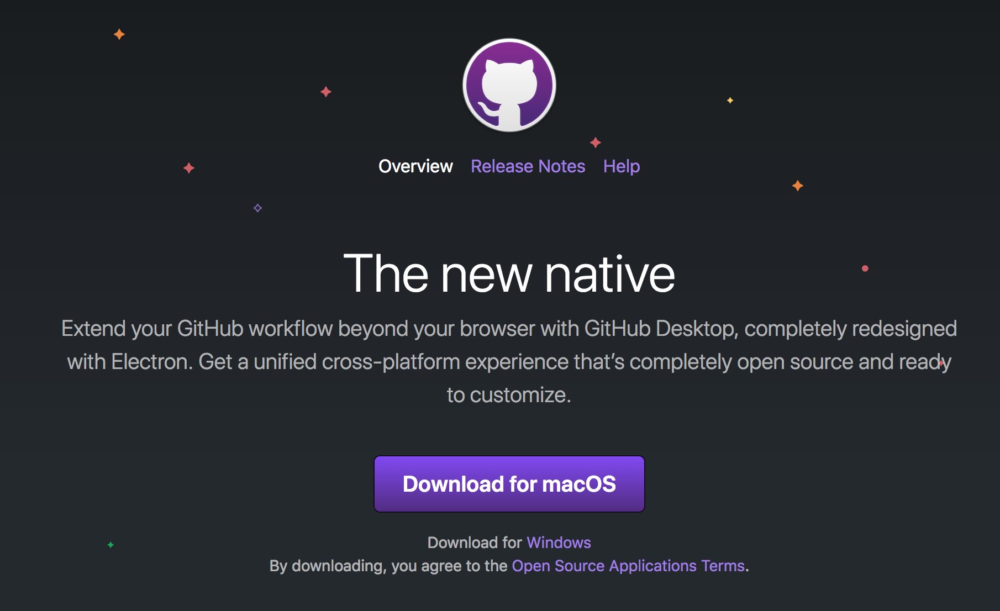

安裝後開啟程式，會需要你登入自己的 Github 帳戶，如下圖：


再來選擇你放在 Github 上要 Clone 抓下來的 Repository，在這邊我們選擇自己 Github Page 所存放的 Repository：

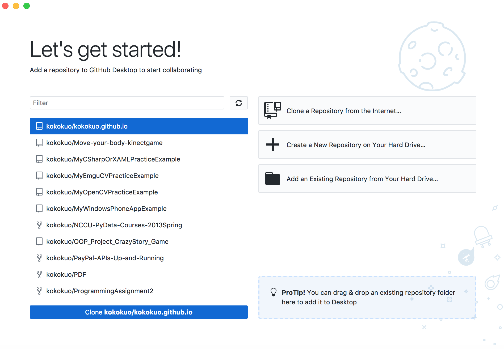

選擇後可以設定抓下來放在本機端的位置：

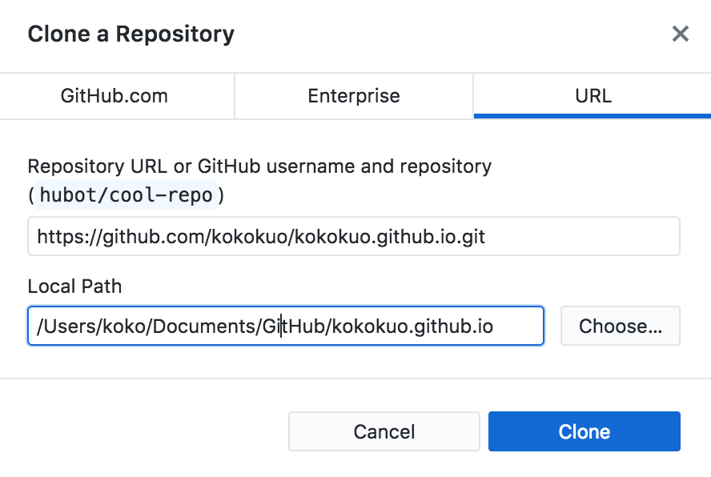

抓下來後 Github Desktop 會進入工作畫面（如下圖），此頁面會告知若專案更改時，會有哪些變動的檔案，我們可以點選 **Show in Finder** 直接找到下載下來的 Repository 目錄並接著編輯：

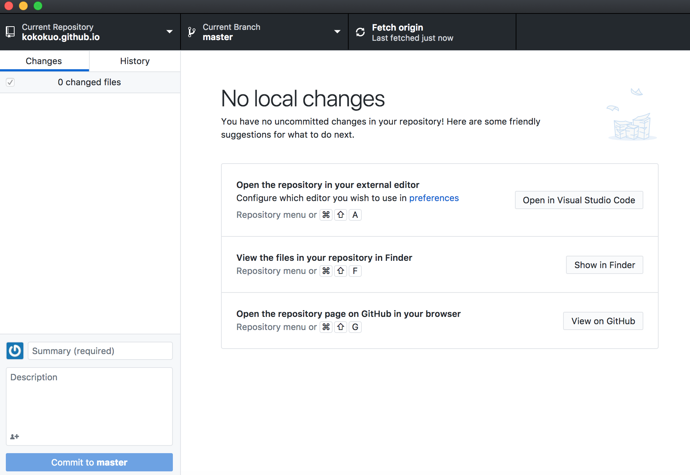


我們繼續編輯 **1. 透過終端機 Terminal 指令上傳檔案** 之後的檔案內容：

加入一個 `profolio.html` 並且在 `index.html` 頁面加入一個作品集的連結，在更新一下 `README.md` 檔案

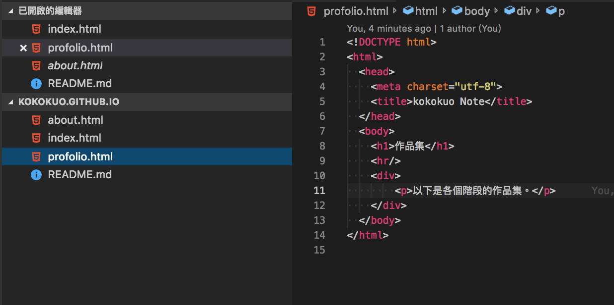

回到 Github Desktop，你會看到更動的檔案與結果會被呈現出來，接著在左下角輸入要 Commit 的訊息並 Commit 提交此次的變更：

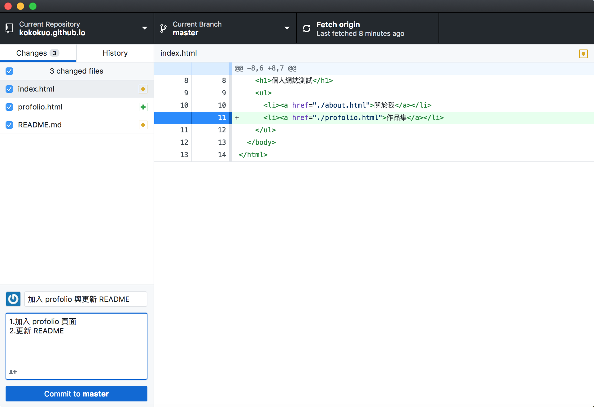

提交後再按下 **Push Origin** 送出到 Repository 上就大功告成囉。

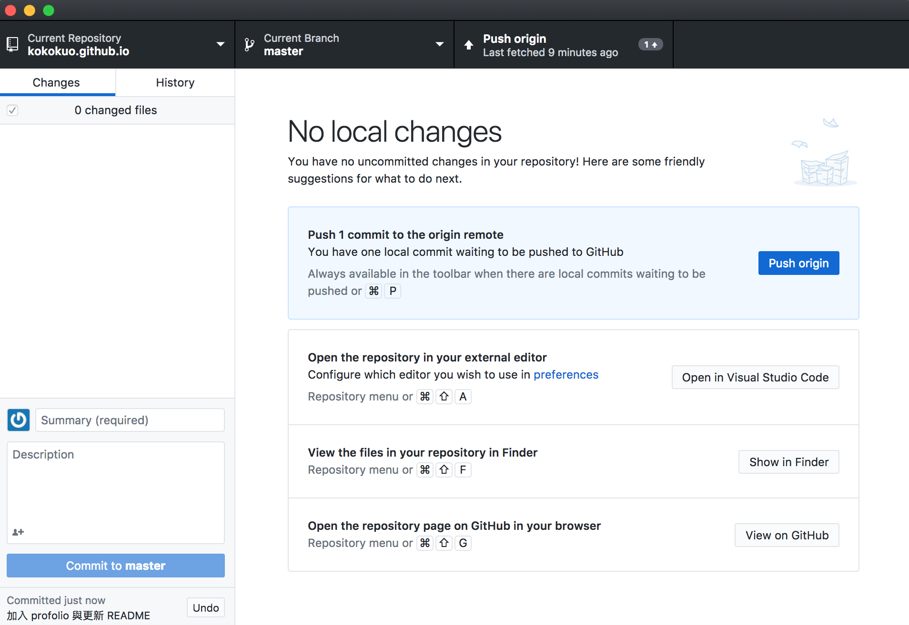

最後輸入 Github Page 的網址，例如我的是 https://kokokuo.github.io 就會看到更新的結果：

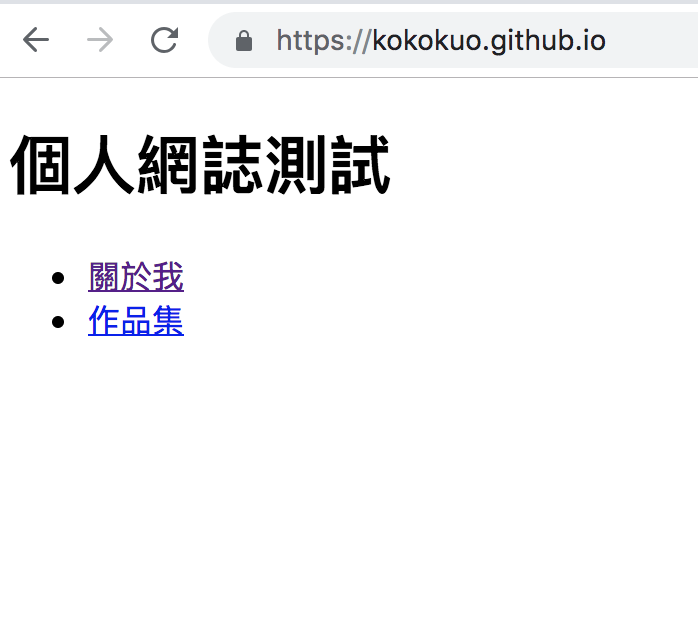


# 後記
---
透過 Github Page 你可以快速且免費的搭建簡易的靜態網站，不過上述自己撰寫 HTML/CSS 等網頁是比較費時間的，此時你不妨可以考慮使用 **態網站產生器 (Static Site Generator)** 來快速搭建你的靜態網站，在直接上傳到 Github Page 上。

而且目前靜態網站產生器的選擇上非常多樣化，如果你想要知道哪裡可以選擇靜態網站，以及更加認識什麼是靜態網站，可以接著閱讀 TODO [什麼是靜態網站 (Static Site) 與 靜態網站產生器 (Static Site Generator)]() 來了解更多。


