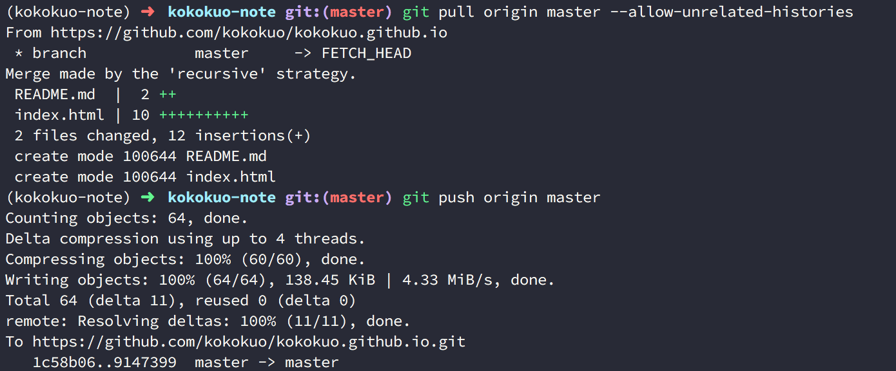
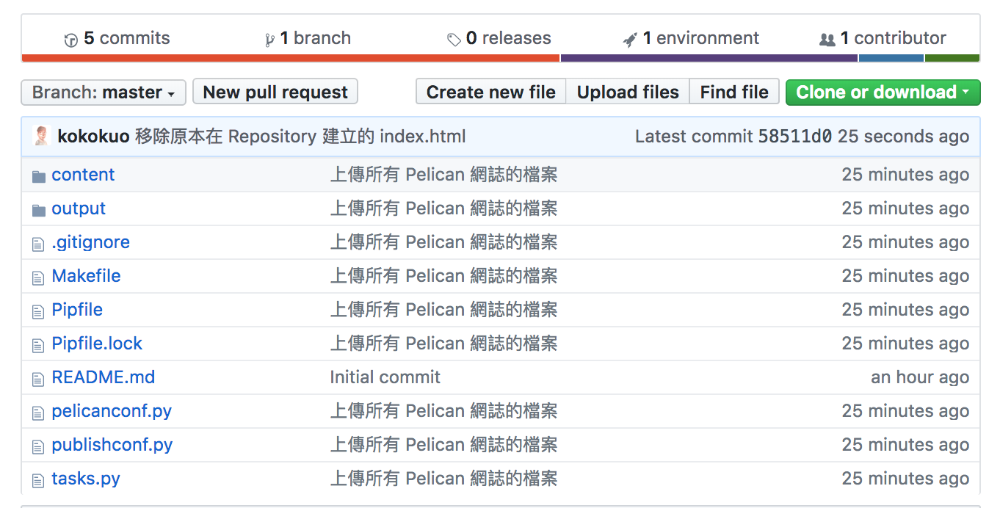

## 方式二：使用 `gh-pages` 作為發布分支的設定
在方法二，  **output** 靜態網頁檔案會被我們透過 `make github` 放到 Github Page Repository 上，而因為 Github Page 除了支援讀取 `master` 外，也支援讀取 `gh-pages`，因此 HTML 等靜態網頁檔案的內容會同樣呈現，而在這裡 `master` 分支會被我們作為 Pelican 靜態網頁生成前的來源檔案存放空間，因為 `master` 是 Git 版本控管預設便存在的分支。

### (1.) 使用 `master` 作為 Pelican 來源檔案變動與保存用的分支
在這裡我們需要做的就是把已經完成的網誌內容直接提交，並推送到 `master` 上，ㄧ樣先提交 Commit 在做 Push 推送：

```bash
# 先設定 config
(kokokuo-note)kokokuo-note(master)> git config local --email "你註冊的 Github 信箱"
(kokokuo-note)kokokuo-note(master)> git config local --name "你註冊的 Github 用戶名稱 Username"

# 開始提交過程
(kokokuo-note)kokokuo-note(master)> git add . 
(kokokuo-note)kokokuo-note(master)> git commit -m "上傳所有 Pelcian 網誌的檔案"
(kokokuo-note)kokokuo-note(master)> git push origin master
```


但是在推送上去後你會看到一個拒絕的資訊：*「error: failed to push some refs to 'https://github.com/kokokuo/kokokuo.github.io.git'」* ...

再來因為在 Github Page Repository 上的 `master` 中已經有一些內容了，所以我們要先做 `git pull` 下來，與目前自己電腦上的最新版的 Pelican 檔案做合併：

```bash
(kokokuo-note)kokokuo-note(master)> git pull origin master
```

不過如果你的 Git 在 2.9 版以上時你有可能會看到新的錯誤訊息， 如下：


這是 Git 在 2.9 版本時出現的，主要是告訴你這個要放到 Github Repository `master` 的檔案與原先在 Github 上的 Repository 是兩個不同的專案，因為來源不同沒有關連才拒絕你。

如果要解決這個問題，只要輸入 `git pull origin master` 並在後面加入 `--allow-unrelated-histories` 這個指令就好，表示我允許你們不相關沒關係，給我合併就對了，如下：

```bash
(kokokuo-note)kokokuo-note(master)> git pull origin master --allow-unrelated-histories
```

如此就會看到在 Github Repository 上我們原先建立好的 README 與 index.html 與我們的 Pelican 專案合再一起放到 Pelican 網誌專案的目錄中，之後我們再次執行 `git push origin master` 就可以了，如下圖：



完成後讓我們移動到 Github Page 所放的 Repository 上，你會看到剛剛在自己電腦上的 Pelican 專案中所有的檔案被放上去了：



### (2.) 修改 `Makefile` 建立 `gh-pages`
當我們完成提交 `master` 後，再來我們就要處裡 `gh-pages` 分支了，在處理之前如同方法一，我們需要安裝 `ghp-import` 套件，因為我們也會使用到 `make github` 指令：

```bash
(kokokuo-note)kokokuo-note(master)> pipenv install ghp-import
```
再來我們要打開 `Makefile`  檔案，並且修改 `GITHUB_PAGES_BRANCH` 參數為 `gh-pages`，如下：


完成後一起提交並推送更新 `master` 的 Repository：

```bash
(kokokuo-note)kokokuo-note(master)> git add . 
(kokokuo-note)kokokuo-note(master)> git commit -m "安裝 ghp-import"
(kokokuo-note)kokokuo-note(master)> git push origin master
```

之後執行 `make github`，你會看到 `make github` 建立了 `gh-pages` 分支推送到 Github Page Repository 上：

```bash
(kokokuo-note)kokokuo-note(master)> make github
```
