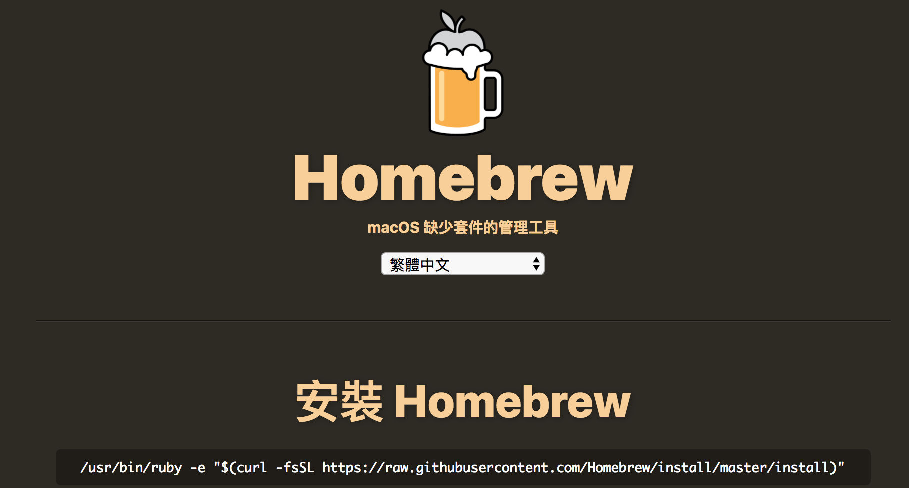
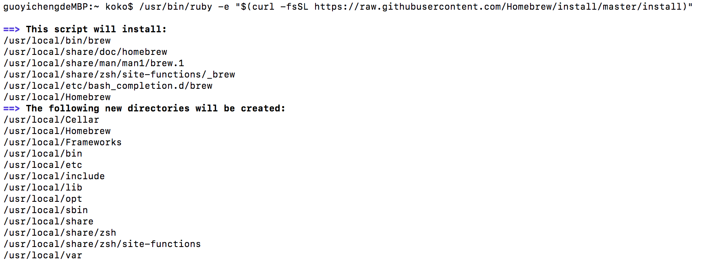
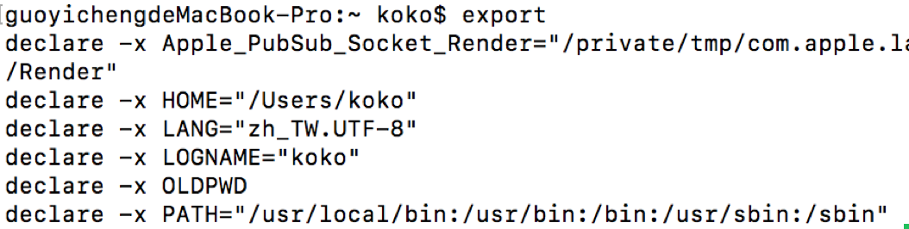
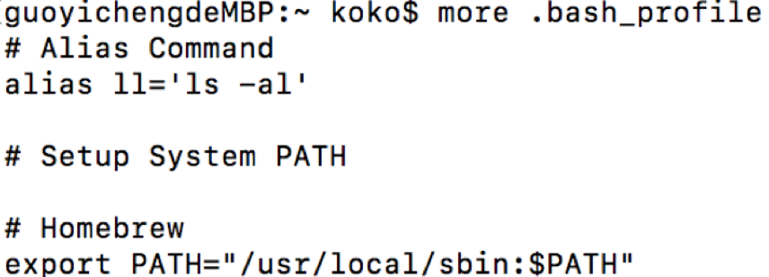
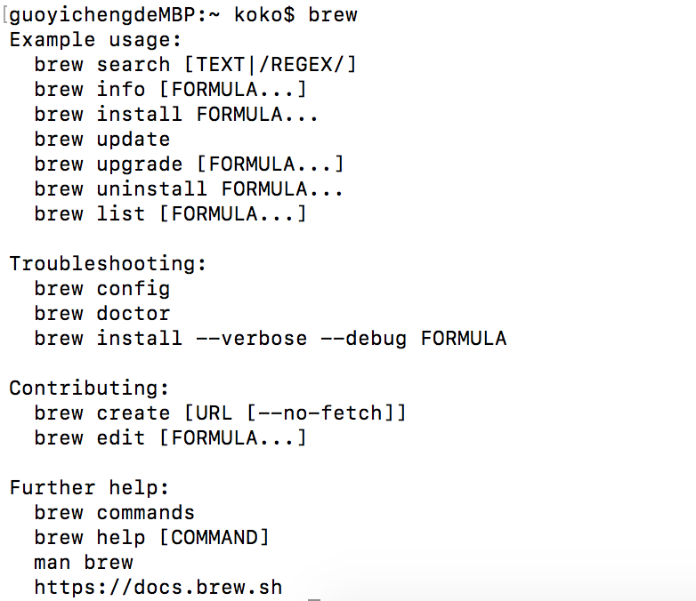
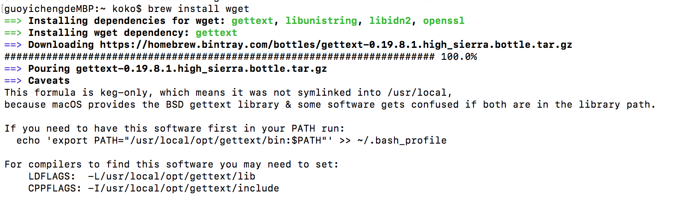

Title: Homebrew (1) - Mac 上安裝 Homebrew 套件管理工具
Date: 2019-03-06
Tags: Mac, Homebrew
Slug: mac-install-homebrew
Authors: kokokuo
Summary: Homebrew 是 Mac 專用的套件管理工具，如同 Linux 中的 apt 或是 yum 工具，許多的套件工具都可以透過 Homebrew 安裝，並且管理（如列出安裝的套件、更新套件、修正套件、移除套件等等）上非常方便，即便要尋找也都會放在相同的目錄下。

# 前言
---
Homebrew 是 Mac 專用的套件管理工具，如同 Linux 中的 apt 或是 yum 工具，許多的套件工具都可以透過 Homebrew 安裝，並且管理（如列出安裝的套件、更新套件、修正套件、移除套件等等）上非常方便，即便要尋找也都會放在相同的目錄下。

<br/>

# 安裝步驟
---

## 步驟一：下載 Homebrew
安裝步驟非常簡單，進入 [Homebrew 官網](https://brew.sh/index_zh-tw)，依照步驟，在 Terminal 輸入下列此串：



```bash
$> /usr/bin/ruby -e "$(curl -fsSL https://raw.githubusercontent.com/Homebrew/install/master/install)"

```

安裝過程如下圖：



## 步驟二：建立環境變數

安裝完後，為了要使 Homebrew 的指令可以被 Mac 的 Terminal 中的 Bash 程式讀取到，需要設定 `/usr/local/bin` 與 `/usr/local/sbin` 至環境變數。

建立一個 `.bash_profile` 或是 `.profile` （如果已有其中一個檔案則不需再次建立）在自己的家目錄下：

```bash
$> cd ~ # 移動到家目錄
$> vim .bash_profile
```

並且在檔案中新增此行：

```bash
export PATH=/usr/local/bin:/usr/local/sbin:$PATH
```

或是可以透過 Shell 的另一種語法雙引號來設定，如下
```bash
export "PATH=/usr/local/bin:/usr/local/sbin:$PATH"
```

設定完成後，**關閉 Terminal 應用程式重開** 或是 **直接在 Terminal 中輸入以下指令啟動** `.bash_profile` 或 `.profile` 啟動即可（以下以 `.bash_pofile` 為例 ）：

```bash
$> source ~/.bash_pofile # 以 source 指令啟動檔案執行並生效
```

如果原先 Mac 中的預設 PATH 環境變數已有其中一個路徑則可以只需要把剩餘沒有的補上即可，或是兩個皆有即可忽略。

例如我的 Mac 透過 `export` 指令發現 PATH 系統環境變數中缺少 `/usr/local/sbin`：



則編輯 `~/.bash_profile` 補上去，如下圖：



完成後，重新開啟 Terminal 應用程式，再次透過 export 檢查，會發現剛剛補上去的 `/usr/local/sbin` 已經作用在系統環境中：


## 步驟三：測試 brew 指令

可以透過輸入 brew 來做所有跟 Homebrew 有關的套件管理操作行為，如下圖：



到此即表示安裝順利完成囉！

## 安裝套件：以 wget 為例
如果要安裝套件裝在 Mac 上，可以透過 `brew install` 指令再補上要安裝的套件名即可，例如以下以 `wget` 可為例，`wget` 是一個可以用來直接在終端機上安裝網路上的檔案內容指令工具：

```bash
$> brew install wget
```



<br/>

# Homebrew 資料夾目錄介紹
---
在上述中所提到的環境變數設定步驟，Homebrew 會在安裝完後放在 `/usrl/local` 下，所以透過 Homebrew 下載安裝或管理套件時，實際上會影響到的有  `/usrl/local`  下這幾個目錄：

```bash
Caskroom  Frameworks  bin  include  opt   share
Cellar    Homebrew    etc  lib      sbin  var
```

* `Cellar`：此文件夾存放的是所有包安裝所在路徑，包括二進制，文檔和配置文件。並且會依照 `Cellar/套件名稱/版本號/` 的形式與為規範放置
* `opt`：由於版本號隨著跟新而改變的，所以需要一個固定不變的路徑作為我們訪問二進制和文檔的路徑，這就是 `opt` 的作用。
* `Homebrew`：brew 程序所在路徑.
* `bin`：所有包安裝之後二進制都會鏈接到這個路徑下
* `share`：所有包安裝之後的文檔都會鏈接到這個路徑下
* `etc`：同上，所有套件的配置文件
* `lib`：同上，所有套件相關庫文件
* `Caskroom`：使用 Homebrew Cask 安裝的應用程式 app 的相關資訊或設定的文件


## 參考文件
1. [Homebrew 总结](https://www.jianshu.com/p/8ad7056b243f)
