Title: Python - 隔離開發環境的利器，安裝虛擬環境工具 virtualenv
Date: 2019-03-07
Tags: Python, 虛擬環境
Category: Python
Slug: python-virtualenv-install-and-usage
Authors: kokokuo
Summary: 在開發 Python 的程式時，時不時就會透過 `pip` 從 PyPI 上安許多的套件來 `import` 使用，但是因為 Python 是裝在整個電腦的系統環境的，所以當我們之後寫的專案變多，每個不同的專案都因為有各自的需要 `pip install` 了不同的套件，最後整個 Python 的系統環境所安裝的套件就會非常多且雜亂！ 那麼要如何讓每個專案安裝的套件都只有自己的專案擁有，且不會弄亂系統的 Python 環境呢？ 這時候就需要虛擬環境了！

# 前言
---
在開發 Python 的程式時，時不時就會透過 `pip` 從 PyPI 上安許多的套件來 `import` 使用，但是因為 Python 是裝在整個電腦的系統環境的，所以當我們之後寫的專案變多，每個不同的專案都因為有各自的需要 `pip install` 了不同的套件，最後整個 Python 的系統環境所安裝的套件就會非常多且雜亂！ 那麼要如何讓每個專案安裝的套件都只有自己的專案擁有，且不會弄亂系統的 Python 環境呢？ 這時候就需要虛擬環境了！

<br/>

# 虛擬環境介紹
---
虛擬環境的目的使我們可以依據我們每個專案為一個單位，建立出不同虛擬的 Python 環境，來隔離系統的主 Python 環境以及其他專案的 Python 環境。因此當我們在開發不同的專案時，只要進入每個專案所屬的虛擬環境中，接下來所有安裝的插件都會只裝在這個環境中並且被作用，下圖為示意圖：

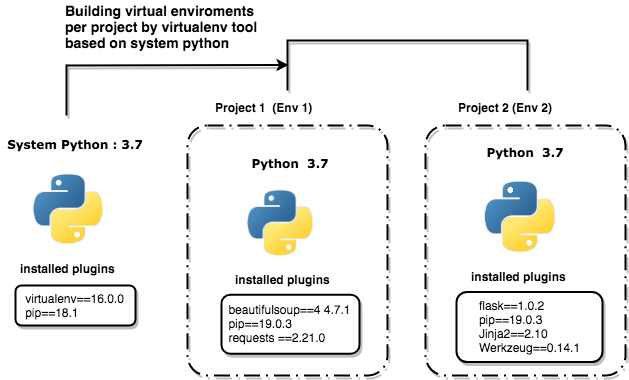

我的主系統 Python 環境中只有安裝 `pip` 與 `virtualenv` 這個虛擬環境工具套件，而透過 `virtualenv` 所分別在這三個專案產生的 `env1`, `env2`, `env3` 除了都有各自獨立的 Python 環境與各自的 `pip` 套件外，也都安裝彼此所屬專案在開發上所需要的插件。

另外若是你的電腦主環境有兩種不同的 Python 版本，例如 `Python 2.7` 與 `Python 3.7`，那麼在建立虛擬環境時，還可以指定要產生的虛擬環境要以哪個 Python 版本為基底哦！

另外虛擬環境這個概念不是只有在 Python 中才有，每個程式語言都有類似或自己的虛擬環境工具，而在 Python 中目前最熱門的就是 `virtualenv` 以及之後會介紹在 `virtualenv` 之後新推出的 `pipenv`。

<br/>

# 安裝與使用 virtualenv
---
首先透過 Python 內建的 `pip` 套件指令下 `pip install` 來安裝 `virtualenv` 套件：

```bash
$> pip install virtualenv
```

安裝完後要怎麼使用呢？ 以下一個例子，我的專案是一個爬蟲的專案叫 `parser`，我會在這個專案中安裝 `requests`, `beautifulsoup4` 這兩個套件，那麼首先進入到你要開發的專案目錄下。

```bash
~/> mkdir parser
~/> cd parser
```

再透過 `virtualenv` 指令來建立一個存放 Python 虛擬環境的目錄，例如下面我透過 `virtualenv` 建立了一個 `venv` 的目錄，那麼 `virtualenv` 就會在這個目錄中把系統的 Python 且是乾淨沒有安裝其他套件的 Python 環境複製裝進去，如此這個虛擬環境就誕生了：

```bash
parser/> virtualenv venv # 這個 venv 是用來存放虛擬環境建立的 Python 虛擬環境的目錄
parser/> ls
```

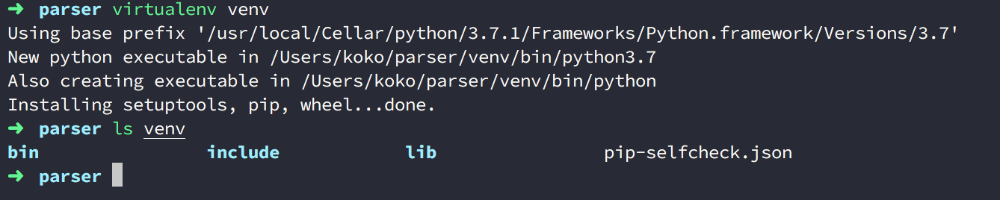


你會看到在 `venv` 中是安裝 Python 時產生的目錄與檔案。

<br/>

# 使用 virtualenv
---
建立好 `parser` 專用的虛擬環境後，此時先不要太快直接透過 `pip` 安裝套件，因為我們只是建立好環境，但我們「還未進入」到這個虛擬環境中，因此若此時直接安裝，還是會以系統中使用 Python 的 `pip` 插件安裝下去。我們要先進入到虛擬環境中，也就是 `venv` 所建立的 Python 下，再用虛擬環境中內建的 `pip` 安裝套件，這些套件才會被裝在虛擬環境下。

```bash
parser/> source/bin/activate
(venv)parser/> pip list
```

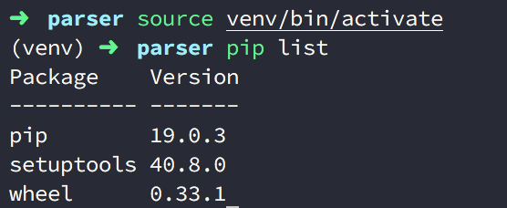


如上圖你會看到這個 `pip list` 出來的套件都是一開始安裝 Python 時最乾淨的環境，即便你作業系統中安裝的 Python 已經有裝了其他套件，在這裡都會以最乾淨的方式呈現，因為 `virtualenv` 只會複製一份 Python 核心，不會連作業系統中的 Python 所安裝的套件也一併抓過來，此時我們可以透過 `python --version` 來看看 Python 的路徑以及版本，以下我的 Python 是安裝 `3.7.1` 版本的，此時透過進入 Python 環境下，透過 `sys.path` 就可以看到來源是 `venv` 中：

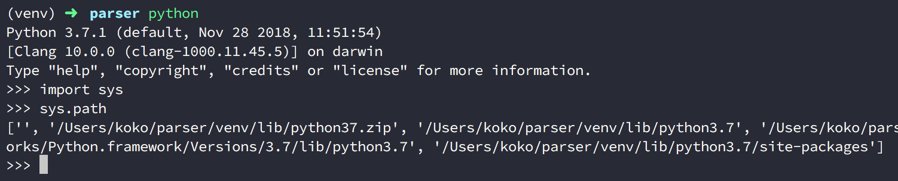


接著回過頭來，我們來安裝套件 `requests` 與 `beautifulsoup4`：

```bash
(venv)parser/> pip install requests
(venv)parser/> pip install beautifulsoup4
(venv)parser/> pip list
Package        Version
-------------- ----------
beautifulsoup4 4.7.1
certifi        2018.11.29
chardet        3.0.4
idna           2.8
pip            19.0.3
requests       2.21.0
setuptools     40.8.0
soupsieve      1.8
urllib3        1.24.1
wheel          0.33.1
```

大功告成囉！對了對了如果我們使用完專案想要離開怎麼辦？那麼我們只需要透過 `deactivate` 退出虛擬環境就好囉。

```bash
(venv)parser/> deactivate
parser/> pip list
```

退出後你就會看到 `(venv)` 的標示不存在了，就是退出虛擬環境成功，此時你可以在透過 `pip list` 看看，就會發現虛擬環境中安裝的套件不在了：

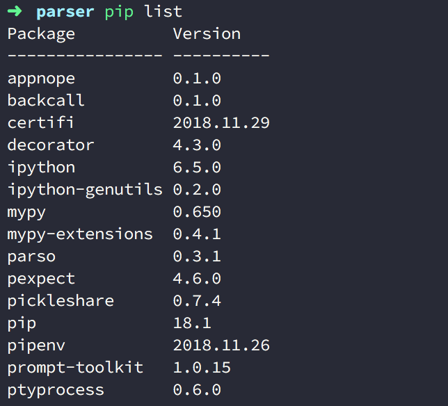


但是因為他好好的放在 `venv` 目錄下，所以下次要使用只要再透過 `source venv/bin/activate` 進入即可囉！

另外若是你今天在使用虛擬環境時完髒了，要刪除要怎麼做呢？ 我們只要先用 `deactivate` 退出虛擬環境後，在做 `rm -rf` 把虛擬環境的目錄刪掉就好，豈不是很容易？

```bash
(venv)parser/> deactivate
parser/> rm -rf venv
```

<br/>

# 紀錄專案在 virtualenv 中所安裝的所有套件
---
安裝了 Python 的套件在虛擬環境中雖然很好，但是如果要做版本控制放到 Github, Bitbucket, GitLab 上，又或是專案的檔案要攜帶著走、分享給別人，那麼這些安裝好的環境要如何也攜帶走呢？ 可能你會說，那我們把剛剛建立放置虛擬環境的目錄 `venv` 也一起丟到版本控管空間呀，轉移專案目錄時也是一起帶著走就好了，但是這是不行的，因為兩個原因：

1. **虛擬環境目錄認「絕對路徑」**：換句話說，即便你有一起把 `venv` 帶著走，但若你的專案目錄改名了、把自己的目錄檔案放到別的位置下或複製傳給別人，都會因為絕對位置跑掉，導致下次再透過 `source` 進入虛擬環境時找不到路徑而失敗！

2. **虛擬環境目錄檔案太大**：虛擬環境目錄因為要保存隔離 Python 的整個核心檔案以及未來安裝的 Python 套件，會導致目錄的檔案越來越多，所以一般來說就算路徑都不改，我們也不會攜帶走或丟到版本控管空間，因為會很大很肥。

那麼不帶著虛擬環境的目錄走，要怎麼保有這些安裝套件的紀錄呢？ 這裡就要仰賴到 `pip freeze` 這個指令了！ 透過 `pip freeze > 保存的檔名` 來建立一份所有該虛擬環境所安裝的套件：

```bash
(venv)parser/> pip freeze > requirements.txt
```

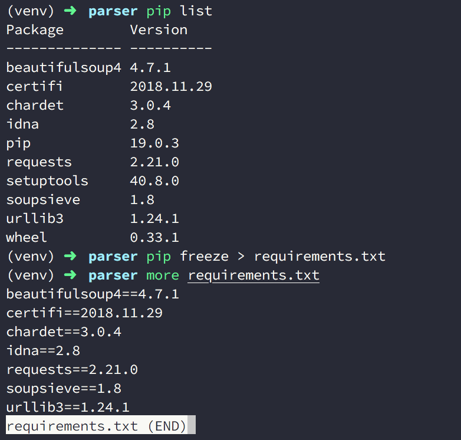


如上圖，會建立了 `requriements.txt` 檔案，這個檔名可以隨意命名，不過一般在使用 `virtualenv` 中，使用 `requriements.txt` 已經變成 Python 的一種 Convention ，所以若是去瀏覽大多是 Github 的 Reposiotry 都會看到。

當我們產生了 `requriements.txt` 後，專案變只要帶著這個 `requriements.txt` 即可，上傳版控也一樣，並可以用 `.gitignore` 過濾掉 `venv` 目錄。

<br/>

# 使用 `requirements.txt` 
---
當該專案來到新的環境下或從 Github 上 Clone 下來時，要使用虛擬環境並再次安裝套件的話，就只要再次把虛擬環境的目錄建立，進入後，透過以下指令，就可以還原該專案原先所以用的 Python 套件囉，以下再次以乾淨的 `parser` 專案為例：

```bash
# 假設目前在新的環境下，先建立虛擬環境，在安裝套件
parser/> virtualenv venv
parser/> source venv/bin/activate
(venv)parser/> pip install -r requirements.txt
```

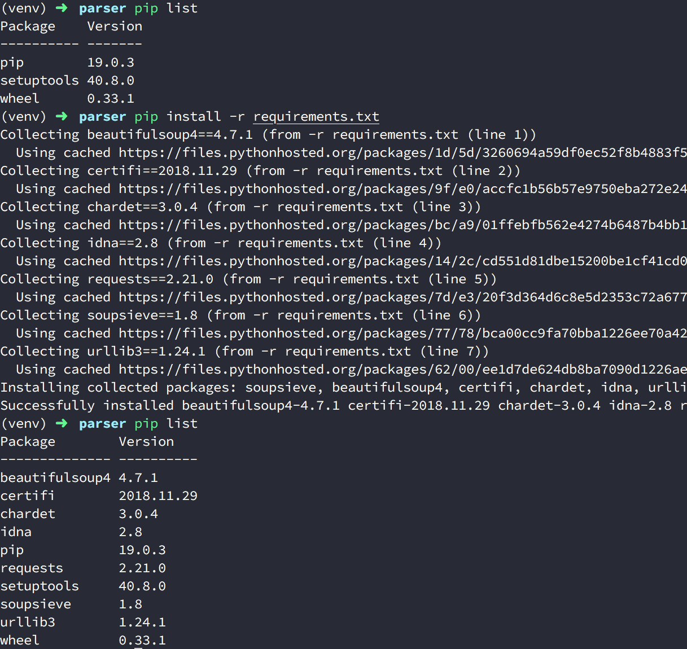


如上圖，再次安裝 Python 套件完成囉。

<br/>

# 指定 Python 版本的虛擬環境
---
如果今天你的作業系統中有多個 Python 版本，例如我一開頭提到的 `Python 2.7` 與 `Python 3.7`，那麼在建立虛擬環境時，還可以指定要產生的虛擬環境要以哪個 Python 版本為基底哦！ 以下接著介紹如何設定：

首先先看到一下範例：以下是我的 `Python 2.7.15` 版本以及 `Python 3.7.1`：

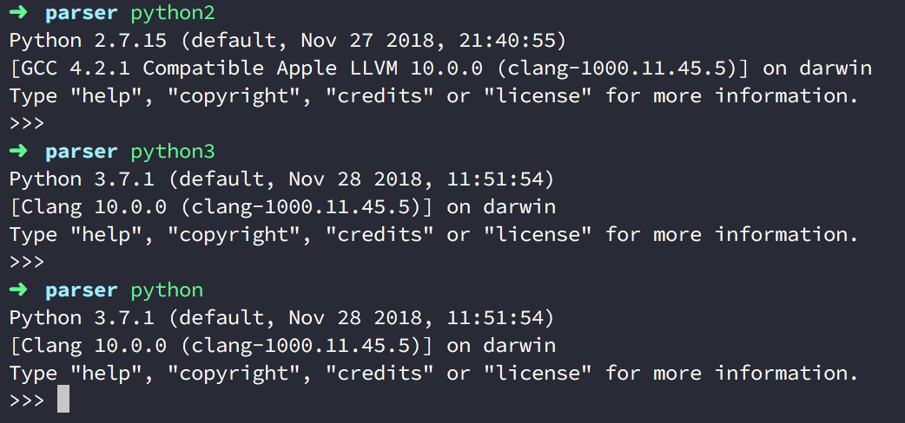


在上述因為我預設的優先讀取版本是 Python 3.7.1 ，所以輸入 `python` 會是呈現 `3.7.1` 版本（因此我的系統下 `pip` 時出來的也會是以放在預設的 `Python 3.7.1` 中套件)

除此之外當我在創建虛擬環境時，也因此我的預設 Python 環境會是 `3.7.1`，例如先前的 `partser` 專案。

那麼今天如果要指定虛擬環境中要用的 Python 版本要如何設定？ 很容易地只要透過 `-p` 參數後面帶入你指定的 Python 執行檔所在的路徑就好，不過因為路徑往往不好記。

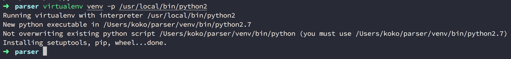


所以只要以指令代替即可，例如因為我的環境只有 `2.7.15` 與 `3.7.1` ，因此執行的 Python 指令就只有 `python2` 與 `python3` 而已，因此我要指定 `Python 2.7.15`

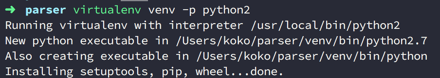


最後以 `parser` 專案以及另外一個新建的 `flask-sample` 專案作為作為不同專案各有自己的虛擬環境的例子，如下 `parser` 以 `python 2.7.15` 為環境安裝了 `requests` 與 `beautifulsoup4` ；而 `flask-sample` 以 `Python 3.7.1` 為環境並安裝了 `flask`，如下圖：

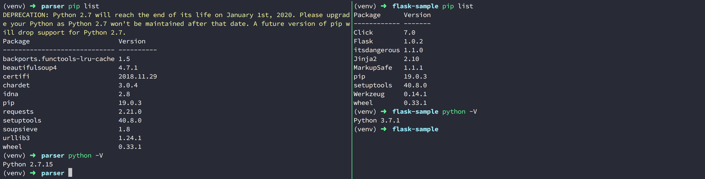
