Title: Python - 結合 pip 與 virtualenv 的虛擬環境與套件管理的二合一新利器 Pipenv
Date: 2019-03-08
Tags: Python, Pipenv
Category: Python
Slug: python-pipenv-install-and-usage
Authors: kokokuo
Summary: 使用 Python 做開發的人，多數都會使用虛擬環境，特別是 `virtualenv` 作為建立開發並隔離環境的方式，但是使用一段時間後都會遇到一些管理或是協作上的問題，為了解決這些困擾，新的套件 **Pipenv** 誕生了，不僅解決了所有問題，在使用上還非常方便，此篇就來深入了解與學習如何使用  **Pipenv**  吧

# 前言
---
使用 Python 做開發的人，多數都會使用虛擬環境，特別是 `virtualenv` 作為建立開發並隔離環境的方式，而且這個工作的流程不外乎就是：

1. 透過建立虛擬環境 `virtualenv` 來隔離 Python 的開發環境
2. 進入虛擬環境後，透過 `pip` 下載套件
3. 為了方便後續專案的保存、上版控與移轉，透過建立 `requirements.txt` 來保存虛擬環境中透過 `pip` 所安裝的套件

但是現有透過建立虛擬環境隔離與產生 `requirements.txt` 保存該虛擬環境中所安裝的套件都會有一些問題：

1. `requirements.txt` 是需要手動更新的，所以當透過 `pip` 下載或更新套件後，`requirements.txt` 是不會自動更新。因此專案移轉時，若忘記更新 `requirements.txt` 會導致新安裝的套件或是更新的套件都沒有被記錄下來，拿到你專案的人也會無法跑起來。
<br/>
1. 你安裝的套件 A 與套件 B 都相依了套件 C 的 `1.1` 版，但某一天你更新了套件 B ，因為套件 B 需要套件 C 的 `1.2` 版，所以一併更新了相依的套件 C 到 `1.2` 版，但是你的套件 A 卻仍相依套件 C 的 `1.1` 版，導致套件 A 反而無法使用。
<br/>
1. 你透過 `pip` 所安裝的套件，並不會特別紀錄哪些是屬於該套件的相依套件，例如今天你下載了一個套件 D ，而套件 D 因為相依所以也下載安裝了套件 E 與 F，但是當你透過 `pip list` 查閱時，`pip` 卻不會告知你他是相依套件，所以若是此套件的相依一多就無法整理。
<br/>
4. 因此同事協作開發時，同事若想要查詢你所安裝的套件的文件與手冊，也會因為無法知道你所用的主要套件是哪些，因此難以查尋該套件的相關文章協助開發。

因此雖然 `virtualenv` 是一個可以幫助我們在開發 Python 專案時，隔離主系統與其他專案環境的好工具，但是 `virtualenv` 依然不夠好用。

所以 **[Pipenv](https://pipenv.readthedocs.io/en/latest/)** 便隨之誕生了，一套更強的虛擬環境與套件管理的工具利器。

# 什麼是 Pipenv


**[Pipenv](https://pipenv.readthedocs.io/en/latest/)**  是為了解決上述所有現存套件管理與虛擬環境的問題而誕生了，正如其名，Pipenv 整合了 `pip` 與 `virtualenv`，是一套具備了建立虛擬環境同時能管理件的利器，他能做到並解決原本存在的問題：


1. 只需要 `pipenv` 指令，不在需要分別使用 `pip` 與 `virtualenv`
2. 改透過 `Pipfile` 與 `Pipfile.lock` 來自動更新並維護安裝的套件，完全取代原先不完善的 `requirements.txt`
3. 透過對套件做 hash 來做安全性檢查確認，當 hash 的結果不相同，跳出錯誤，防止惡意套件透過安裝侵入你的程式碼。
4. 可以透過建立一份 `.env` 檔案在專案目錄下，來自動載入不同環境變數為你的專案直接使用。
5. 你安裝的套件 A 與套件 B 即便都相依了套件 C 的 `1.1` 版，這個套件 C 也會被隔離成兩份，即便套件 B 的更新連帶更新了套件 C，也不會影響套件 A 所相依安裝的套件 C。

不過上述的感動都沒有親自看到來的高潮，所以讓我們接著來安裝與使用 Pipenv 套件吧！


# 安裝 Pipenv
---

讓我們先在 Python 系統環境下安裝 `pipenv`:

```bash
~/> pip install pipenv
Usage: pipenv [OPTIONS] COMMAND [ARGS]...

Options:
  --where             Output project home information.
  --venv              Output virtualenv information.
  --py                Output Python interpreter information.
  --envs              Output Environment Variable options.
  --rm                Remove the virtualenv.
  --bare              Minimal output.
  --completion        Output completion (to be eval'd).
  --man               Display manpage.
  --support           Output diagnostic information for use in GitHub issues.
  --site-packages     Enable site-packages for the virtualenv.  [env var:
                      PIPENV_SITE_PACKAGES]
  --python TEXT       Specify which version of Python virtualenv should use.
  --three / --two     Use Python 3/2 when creating virtualenv.
  --clear             Clears caches (pipenv, pip, and pip-tools).  [env var:
                      PIPENV_CLEAR]
  -v, --verbose       Verbose mode.
  --pypi-mirror TEXT  Specify a PyPI mirror.
  --version           Show the version and exit.
  -h, --help          Show this message and exit.

Commands:
  check      Checks for security vulnerabilities and against PEP 508 markers
             provided in Pipfile.
  clean      Uninstalls all packages not specified in Pipfile.lock.
  graph      Displays currently-installed dependency graph information.
  install    Installs provided packages and adds them to Pipfile, or (if no
             packages are given), installs all packages from Pipfile.
  lock       Generates Pipfile.lock.
  open       View a given module in your editor.
  run        Spawns a command installed into the virtualenv.
  shell      Spawns a shell within the virtualenv.
  sync       Installs all packages specified in Pipfile.lock.
  uninstall  Un-installs a provided package and removes it from Pipfile.
  update     Runs lock, then sync.
```

由於 Pipenv 會依賴 `virtualenv` 與 `pip` 套件，所以若是你沒有安裝 `virtualenv` 也會一併安裝下來（ `pip` 是原本已經內建在 Python 的套件 )

# 使用 Pipenv
---
Pipenv 是一套強大但入手時卻容易混淆的套件，由於 Pipenv 會很貼心的檢查許多狀況，所以使用時許多指令都會連貫性的完成其他單一動作的指令功能，因此你會發現許多指令都會 **達到相同的結果**，如建置虛擬環境、產生 `Pipfile.lock` 等等，導致反而對於指令原有的用途產生混淆。

以下我們透過一個 `parser` 專案做來例子來介紹 Pipenv 中常用的指令，以及觀察 Pipenv 為我們做了什麼神奇的現象。

## 1. 建立虛擬環境
進入要開發並準備建立虛擬環境的專案，透過 `pipenv install` 來建立虛擬環境，此時 `pipenv install` 會偵測你系統預設的 Python 版本環境，並且依照此版本建立虛擬環境：

```bash
~/> cd parser
parser/> pipenv install
```

如下圖你會看到在建置虛擬環境的過程中，Pipenv 使用了系統所提供的 `3.7.1` 版，並且建立了虛擬環境出來，只不過與 `virtualenv` 不同的是，Pipenv 會自動產生一個 `.local/share/ virtualenvs/` 在你的家目錄下，並且把所有專案的虛擬環境統一放置在其中管理，例如 `parser` 的虛擬目錄是 `parser-hvDw_3KS` 。

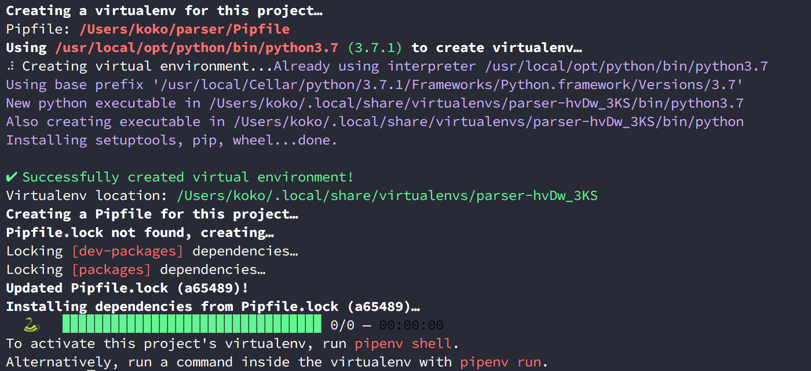


### 查詢虛擬環境所在位置
如果往後你忘了你的虛擬目錄所在位置，可以透過 `--venv` 指令查詢哦，進到該目錄看，裡面放了從系統中複製過來 Python 的核心。

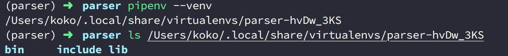


<br/>

當虛擬環境完成後，你會接著發現，`pipenv install` 這個指令自動產生了兩個檔案在你的專案中，分別是 `Pipfile` 與 `Pipfile.lock`，這兩個檔案是圍繞著 Pipenv 的整個核心，以下分別來介紹。

### Pipfile 

`Pipfile` 取代了過去的 `requirements.txt`，採用 [TOML](https://zh.wikipedia.org/zh-tw/TOML) 語法格式，讓紀錄安裝過的套件資訊可以更豐富。

開頭的 `[source]` 記錄了套件安裝的網路來源位置，預設為 PyPI 官網來源，但是也意味著你可以取代成你團隊自己的私有 PyPI 位置，並且可以設定是否使用 SSL 加密協定。下方的 `[dev-packages]` 紀錄了只有開發才會用到的安裝套件。 `[packages]` 則如同過去我們開發與部署都需要用到的套件，並且紀錄的版本號。最後 `[requires]` 紀錄了 Python 的版本號，因此 `Pipfile` 的主要目的是用來幫助 Pipenv 紀錄套件的來源與下載的套件版本資訊以及 Python 的環境等設置檔案。

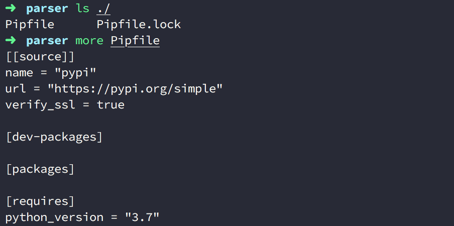


### Pipfile.lock 
一般而言當 `Pipfile` 產生或是更新後，Pipenv 也會自動也更新 `Pipfile.lock`，這是因為 `Pipfile.lock` 會依據 `Pipfile` 紀錄的套件來源來抓取套件下來，並計算 Hash 值保存和記錄目前的版本號，同時也會把相依而下載的套件一併記錄在此，作為往後再次建立環境抓取套件安裝的依據。

透過 Hash 計算紀錄作為安全性驗證，避免未來再次下載時，因遠端來源被竄改下載使用入侵系統，同時也能作為往後是否下載新版本的比較依據。這個 Hash 的機制以 pip  8.0 版後的 [Hash-Checking Mode](https://pip.pypa.io/en/stable/reference/pip_install/#hash-checking-mode) 為基礎實現，可以參考 [Pipfile.lock Security Features](https://pipenv.readthedocs.io/en/latest/basics/#pipfile-lock-security-features)。

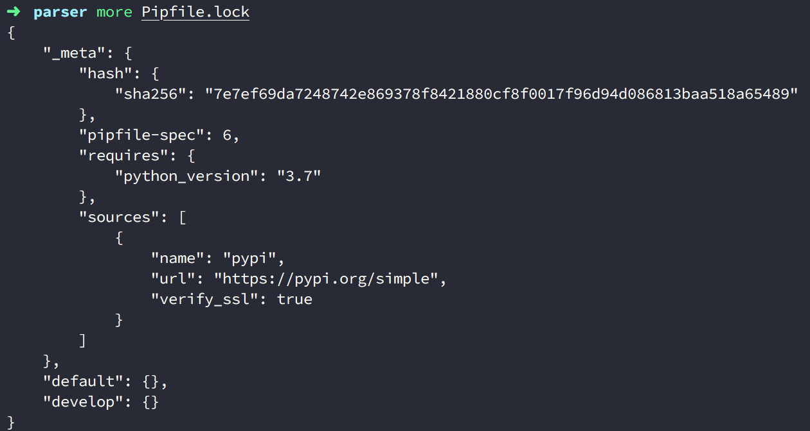


<br/>

## 2. 啟動虛擬環境
當建立好虛擬環境以及 `Pipfile`, `Pipfile.lock` 後，接著就是要進入虛擬環境中來在環境之下操作，在 Pipenv 中提供了 `pipenv shell` 這個指令能使用我進入環境中：

```bash
parser/> pipenv shell
(parser)parser/>
```

進入後會以 `(專案名稱)` 為前綴字表示在虛擬環境中，如下圖顯示的是 `(parser)parser/` ，此時我們使用 `pip list` 可以查閱到該環境下尚未安裝套件。

然而系統的 Python 環境實際上是安裝了許多套件：

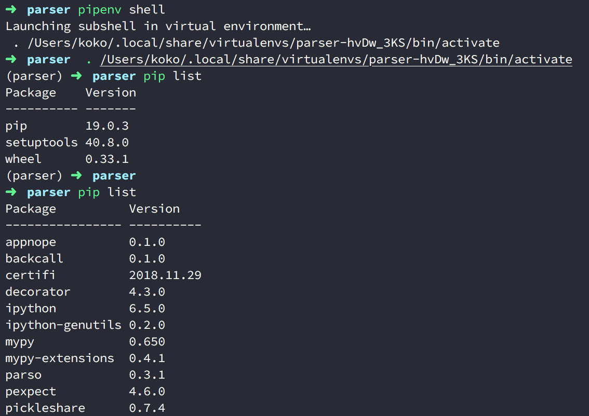


### 以 `pipenv shell` 指令建立與進入虛擬環境
其實，`pipenv shell` 這個指令會檢查目前的專案是否有建立虛擬環境，如果沒有的話是會為你的專案直接建立好，並且進入環境中，如下圖：

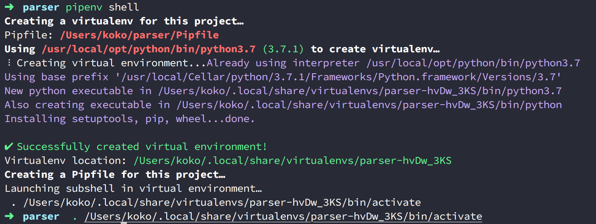


不過比較特別的是，他不會為你也產生 `Pipfile.lock`，因為 `shell` 的主要動作是進入虛擬環境，所以他最多只會產生 `Pipfile` 而已，需要你透過其他指令，來生成 `Pipfile.lock` 檔案。

### 退出虛擬環境
如果你在虛擬環境中，想要退出的話，可以輸入 `deactivate` 或是按下 `Ctrl + D` 即可。

使用 `deactivate`：
```bash
(parser)parser/> deactivate
parser/>
```

按下 `Ctrl + D`：
```bash
(parser)parser/>
parser/>
```


<br/>

## 3. 安裝套件在虛擬環境中
在一開頭我們提到了 `pipenv install` 這個指令，其實這個指令還夠安裝套件，只要下 `pipenv install [套件名稱]` 便可以幫助我們安裝想要的套件到虛擬環境中，以下我們以安裝 `requests` 與 `beautifulsoup4` 為例子：

```bash 
(parser)parser/> pipenv install requests
(parser)parser/> pipenv install beautifulsoup4
```

Pipenv 也能夠一次對多個操件做相同的行爲，如下一次對多個套件安裝：

```bash
(parser)parser/> pipenv install requests beautifulsoup4
```

### Pipfile 與 Pipfile.lock 的變化
接著打開 Pipfile， 你會在 `[packages]` 看見剛剛安裝的 `requests` 與 `beautifulsoup4` 都記錄在此並包含版本號：

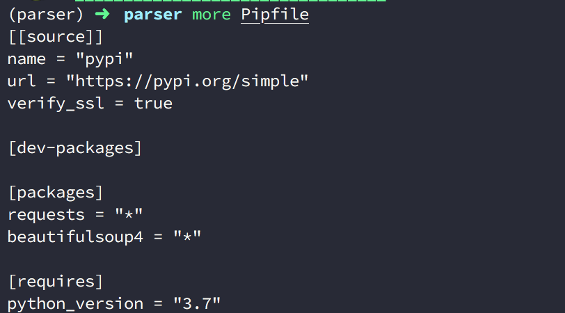


而且和以往的 `requirements.txt` 眾不同的是，這次他不會再把相依的套件資訊也記錄上去，你會發現 `requests` 安裝時會下載的相依套件不在此，這讓我們更一目瞭然的區分哪些才是我們開發與部署都會使用到的套件，並且提升協作時查閱套件的文件效率。

相依的套件會被詳細記錄在 `Pipfile.lock`。

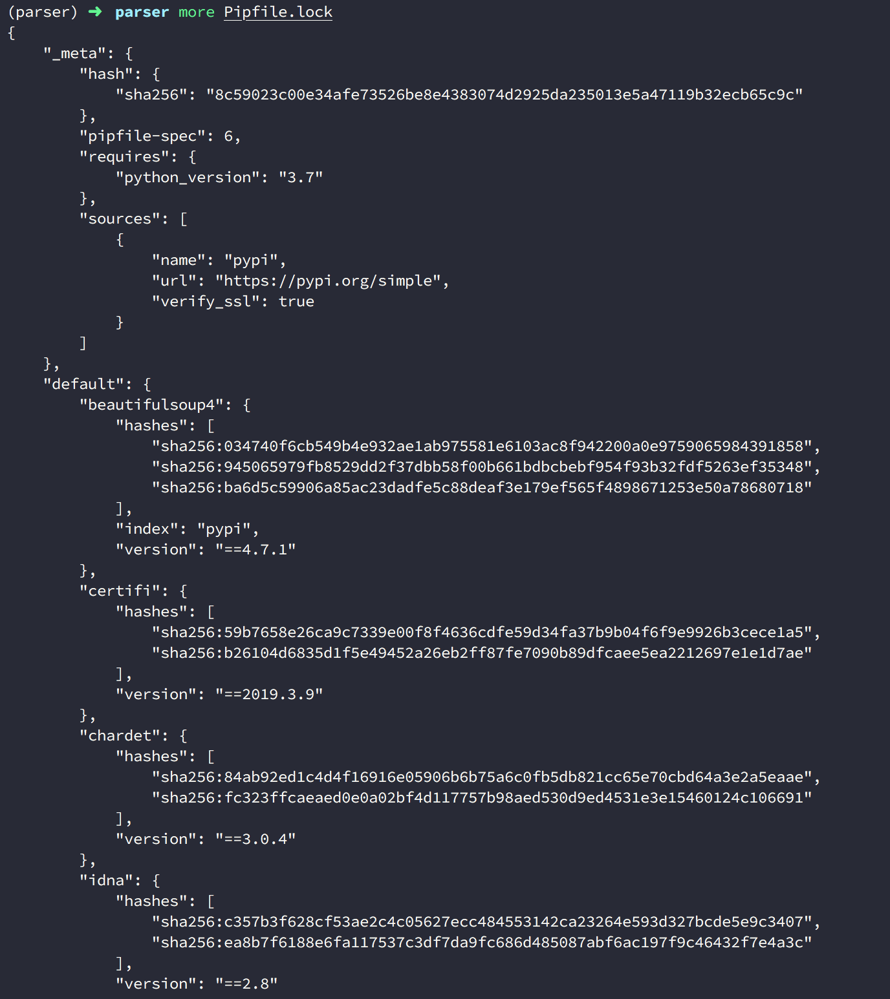

### 透過 `--dev` 安裝開發環境需要的套件
在 Pipenv 中，我們還能區分並安裝只有在開發時才會用到的套件，以避免部署時下載了不需要的套件在其中使專案容量變大，例如 `mypy`, `pytest` 等套件都是只有開發時才會使用到：

```bash
(parser)parser/> pipenv install pytest --dev
```

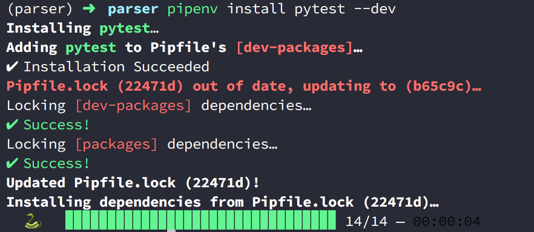

只要透過 `pipenv install [套件名稱] --dev` 就可以告訴 Pipenv 這個套件我只會在開發時使用，因此安裝後，該套件也會被記錄在 `Pipfile` 中的 `[dev-packages]` 區塊：

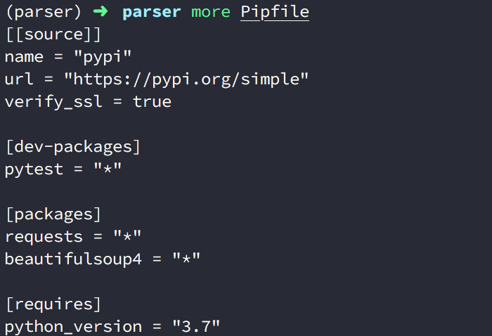

### 更多的認識 `pipenv install` 
從前面使用 `pipenv install` 這個指令觀察下來，你會注意到這個指令的功用是其實有兩個：

1. 安裝套件到虛擬環境中
2. 當指令後面不寫套件名稱時，就會檢查是否有 `Pipfile` 存在，並且讀取 `Pipfile` 更新 `Pipfile.lock` ( `Pipfile.lock` 不存在則建立 ) 安裝到虛擬環境中；如果沒有 `Pipfile` 則會檢查是否有 `requirements.txt`，所的話也會讀取安裝的套件並轉換到 `Pipfile`。

如果上述行為，虛擬環境原本就不存在便會建立環境，若是都沒有 `Pipefile`, `Pipfile.lock` 與虛擬環境目錄，就會建立全新的虛擬環境。

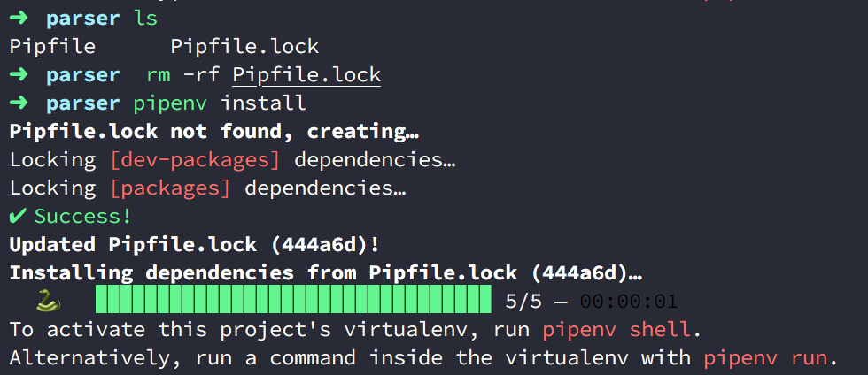

若你不希望 `requirements.txt` 因為 `pipenv install` 而被讀取安裝到 `Pipfile` 的話，建議你先把該檔案移到外面哦！

<br/>

## 4. 查看安裝的套件
在 Pipenv 中查看安裝的套件很簡單，只要透過 `pipenv graph` 即可，而且還會顯示套件以及相依套件的關聯：

```bash
(parser)parser/> pipenv graph
```

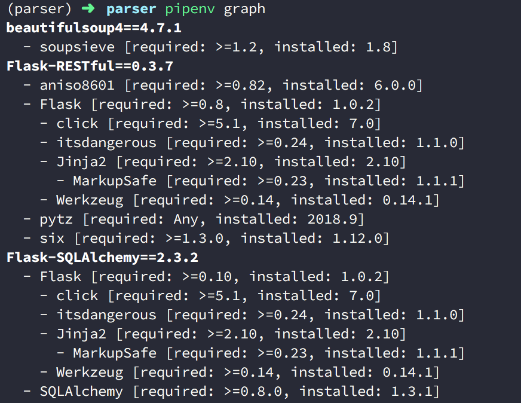

而且你會看到 `Flask-SQLAlchemy` 與 `Flask-Restful` 都有依賴 `Flask`，但是他們安裝的 `Flask` 是彼此獨立的，因此這也是開頭提到的，Pipenv 解決了套件彼此相依所產生的版本升級時困擾。

<br/>

## 5. 更新套件
如果你要檢查有無新的套件並更新，可以輸入 `pipenv update`。 此時 `pipenv update` 會先執行 `lock` 指令，檢查是否有新的套件，如果有那麼 `Pipfile` 與 `Pipfile.lock` 都會更新為新的套件紀錄，並且接著透過 `sync` 同步下載新套件到虛擬環境中：

```bash
(parser)parser/> pipenv update
```

<br/>

## 6. 解除安裝的套件
如果今天想要解除安裝過的套件怎麼辦？ 我們可以透過 `pipenv uninstall [套件名稱]` 來做：

```bash
(parser)parser/> pipenv uninstall Flask-SQLAlchemy 
```

你也可以一次解安裝多個：
```bash
(parser)parser/> pipenv uninstall Flask-SQLAlchemy Flask-Restful
```

不過相依的套件並不會一併被移除，所以需要一個一個解掉。

### 移除 `--dev` 的套件
如果你想要移除從 `Pipfile` 中的 `[dev-packages]` 區塊的套件，可以輸入 `pipenv uninstall [套件名稱] --dev`：

```bash
(parser)parser/> pipenv uninstall pytest --dev
```

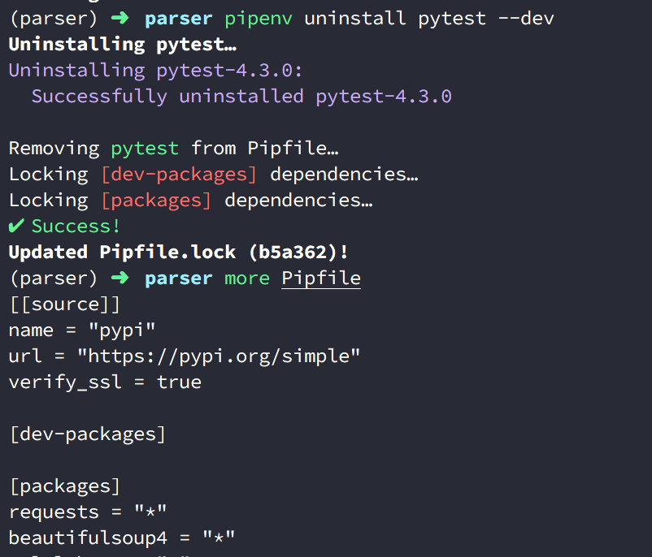

<br/>

## 7. 還原安裝過套件到虛擬環境
如果手上拿到了別人的專案，或是專案要重新建立虛擬環境，只要有 `Pipefile`，就能透過 `pipenv install` 讀取 `Pipefile` 、產生或更新 `Pipfile.lock` 後安裝套件還原環境。

```bash
# 如果 parser 專案是
parser/> ls
Pipfile Pipfile.lock
parser/> pipenv install # 讀取 Pipfile 並且安裝套件還原虛擬環境
```

這也就是 `Pipefile` 取代 `requiremnets.txt` 的好處。

過往的 `requiremnets.txt` 在安裝新套件後也要下指令手動更新，建立環境時，也要下指令來讀取 `requiremnets.txt` 建立與還原，但是這些步驟都會因為遺忘而漏掉；但是 `pipenv install [套件名稱]` 安裝套件時不用怕忘記手動更新，因為 `Pipfile` 會自動更新，並連同產生與更新`Pipfile.lock`，要建立環境時只要有 `Pipfile` 也不用在像過去下指令讀取讀取建立。

順帶一題，使用 `pipenv install` 只會讀取 `Pipfile` 中 `[packages]` 區塊的套件，如果你要為你的專案安裝 `[dev-packages]` 的套件到虛擬環境，你要下：

```bash
parser/> pipenv install --dev
```

### 執行 `Pipfile` 與 `Pipfile.lock` 的過程
建立虛擬環境時，如果有 `Pipfile` 、 `Pipfile.lock` ，那麼 Pipenv 會有一個讀取與執行的順序：

1. 如果沒有 `Pipfile` 而只有 `Pipfile.lock`，那麼建立虛擬環境時，會因為沒有 `Pipfile` 產生了新的 `Pipfile` 並把沒有安裝套件的 `Pipfile` 資訊更新覆蓋掉原本有安裝套件資訊的 `Pipfile.lock`
   
2. 如果有 `Pipfile` 卻沒有 `Pipfile.lock`，那麼建立虛擬環境時，會從 `Pipfile` 的資訊中讀取下載套件產生 Pipfile.lock ，所以資訊會保留。


## 8. 移除虛擬環境
在 Pipenv 中有提供 `--rm` 這個參數給 Pipenv 可以直接移除建立的虛擬環境，只要輸入 `pipenv --rm` 即可，但是若你在虛擬環境之中，需要先退出才會正常。

```bash
(parser)parser/> deactivate
parser/> --venv
parser/> pipenv --rm
```

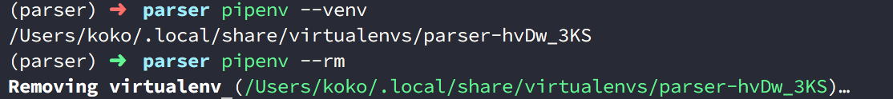

<br/>

## 9. 使用與產生 requirements.txt
前面篇幅提到的都是 `Pipfile` 與 `Pipfile.lock` ，那如果今天想要從原本的 `virtualenv` 換成 `pipenv` 指令來使用的話，有沒有辦法讀取原本的 `requirements.txt` 來建立 **Pipenv** 的虛擬環境又能還原本來的套件呢？

這是可以的，前面提到若是你在執行 `pipenv install` 建立虛擬環境時，專案有 `requirements.txt` 便會自動被讀取安裝，不過 **Pipenv** 也提供了 `-r` 參數讓你透過 `pipenv install` 來指定你要讀取的 `requirements.txt` 檔案來還原虛擬環境，並轉移記錄到 `Pipfile` 與 `Pipfile.lock` 中：

```bash
parser/> pipenv install -r [你的 `requirements.txt` 路徑位置]
```

相反的，如果你想要透過 Pipenv 產生 `requirements.txt`，可以透過 `pipenv lock -r requirements.txt`:

```bash
parser/> pipenv lock -r requirements.txt
```

使用 `pipenv lock` 是因為 `lock` 這個指令原本的用途就是拿來產生 `Pipfile.lock` 而 `Pipfile.lock` 會包含安裝且正確的套件資訊，所以才會使用此指令生成。


## 10. 直接根據虛擬環境執行 Python 指令
如果想要測試專案的某個檔案，或是直接進入虛擬環境的 Python 中測試，可以使用 `pipenv run [指令]` 來執行。

例如我要進入虛擬環境中的 Ｐython 下：

```bash
(parser)parser/> pipenv run python
```

我要查看虛擬環境中的 Python 版本：

```bash
(parser)parser/> pipenv run python # 進入虛擬環境中的 Python
(parser)parser/> pipenv --py # Pipenv 提供的方式
```

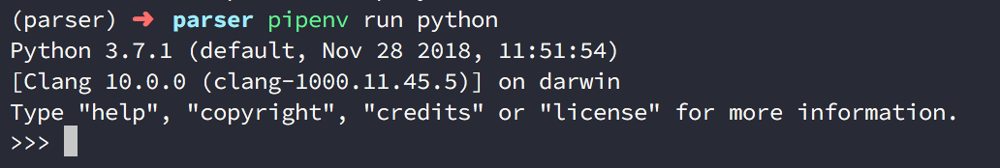

<br/>

## 11. 指定 Python 版本建立虛擬環境
如果你的系統中有安裝了多個 Python 版本，例如 `Python 2.7.10`, `Python 2.7.15`, `Python 3.7.1`，如下圖：

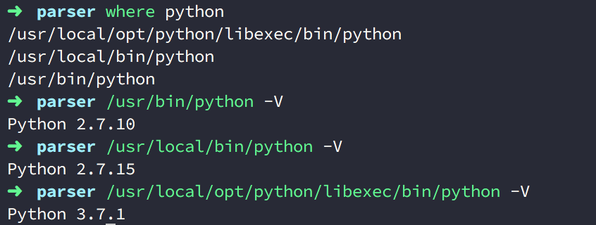

因此今天想要指定該專案虛擬環境所用的 Python 版本的話，可以在 `pipenv install` 後面透過子參數來設定：

```bash
parser> pipenv install --two # 指定系統有安裝，優先使用的 Python 2
parser> pipenv install --three # 指定系統有安裝，優先使用的 Python 3
parser> pipenv install --python 2.7.10 # 指定系統有安裝，明確的 Python 版本
```

在上述中 `--two` 與 `--three` 會分別尋找你系統中，優先指定的 Python 2 與 Python 3 版本，因為我的 Python 3 只有一個版本號所以會是 `3.7.1`，如下圖：


但是 Python 2 在我的主系統中就有 `Python 2.7.10`, `Python 2.7.15` 兩個版本，因此 `pipenv` 會去抓取我系統中我設定優先讀取的 Python 2 版本：


而如果你想要明確指定版本號，可以透過 `--python [系統存在的版本號]` 來指定：


除此之外，因為前面提到了 `pipenv shell` 也會偵測你的專案中有無虛擬環境並自動為你建立，因此你也可以拿 `pipenv shell` 建立虛擬環境並指定版本：

```bash
parser> pipenv shell --two # 指定系統有安裝，優先使用的 Python 2
parser> pipenv shell --three # 指定系統有安裝，優先使用的 Python 3
parser> pipenv shell --python 2.7.10 # 指定系統有安裝，明確的 Python 版本
```

甚至 Pipenv 來能讓你不用下 `install` 或 `shell` ，而是直接指定 `--two`, `--three`, `--python [系統存在的版本號]`：

```bash

parser> pipenv --two # 指定系統有安裝，優先使用的 Python 2
parser> pipenv --three # 指定系統有安裝，優先使用的 Python 3
parser> pipenv --python 2.7.10 # 指定系統有安裝，明確的 Python 版本
```

<br/>

## 虛擬環境和 `Pipfile`, `Pipfile.lock` 建立法則
看到了這裡可能有些人為疑惑，這樣子指令的功用不就有些重複了嗎？ 前面的 `pipenv install` 與 `pipenv shell` 也是，甚至指定版本的部分不需要有 `install` 與 `shell`，只要直接帶版本號也行？

這樣的感覺對我當初來說，每個指令的行為非常沒有職責分一的感覺。

這也就是我在一開頭提到的，Pipenv 很強大，但是對於剛上手的人會在使用中容易混淆。


其實建立虛擬環境而言，在 Pipenv 中，***除了 `pipenv graph` 這個指令外，所有其他的指令在執行時，都會檢查現有的專案目錄下有沒有虛擬環境存在，如果沒有就會為你建立。***

所以指定版本號也是，除了 `pipenv graph` 這個指令外，所有其他的指令在執行時也能指定版本號，那麼沒有虛擬環境時，就會為你建立這個版本的虛擬環境。

而且呢，對於建立虛擬環境（或是還原虛擬環境），每個指令也不會都產生 `Pipfile.lock` 就像 `pipenv shell` 的情況一樣。

- 會更新與產生 `Pipfile`,  `Pipfile.lock` 的指令有 `install`, `update`, `uninstall`, `lock`, `clean` 。
- 只會產生 `Pipfile` 的有 `shell`, `check`, `run`, `open` , `sync` 。


## 個人習慣模式
因為上述有許多種方式建立虛擬環境，所以可能有人看完會不太知道自己想要怎麼做，因此分享一下自己的做法，個人習慣使用 `pipenv shell` 建立虛擬環境，同時進入到虛擬環境中，再透過 `pipenv install [套件名稱]` 安裝名稱，並且透過 `pipenv install` 指令直接產生 `Pipfile.lock`；如果本身有 `Pipfile`，則透過 `pipenv install` 來安裝與產生 `Pipfile.lock`。

```bash
(parser)parser/> pipenv shell
(parser)parser/> pipenv install # 如果已經存在 Pipfile
(parser)parser/> pipenv install [套件名稱 ]# 如果不存在Pipfile
```

# 後記
---
寫這篇文章真的花了很多心思 ＠＠ ，因為 **Pipenv** 雖然貼心與強大，但是也因為指令中很多相似的行為都能做到，導致在思考文章結構與流程上花了很多心思，因為彷彿從任何地方都能切入說，但是很容易迷失在其中，如果有一個順序，又會因為許多方式都能做到，導致越看越模糊。

雖然還是完成了，但很美中不足啊，不過也希望或多或少能幫助到他人或是未來忘記的自己，對了一但使用 **Pipenv** 後，建議不要在使用 `pip` 指令又在 **Pipenv** 建立好的虛擬環境下安裝或移除套件，那會讓 Pipenv 的環境管理與 `pip` 不同步，也混淆自己哦。

# 參考文章
---
1. [Pipenv: A Guide to the New Python Packaging Tool](https://realpython.com/pipenv-guide/)
2. [用 pipenv 來管理 Python 開發環境](https://codinganimal.info/%E7%94%A8-pipenv-%E4%BE%86%E7%AE%A1%E7%90%86-python-%E9%96%8B%E7%99%BC%E7%92%B0%E5%A2%83-ce9f619825a2)
3. [Pipenv 更簡單、更快速的 Python 套件管理工具](https://medium.com/@chihsuan/pipenv-%E6%9B%B4%E7%B0%A1%E5%96%AE-%E6%9B%B4%E5%BF%AB%E9%80%9F%E7%9A%84-python-%E5%A5%97%E4%BB%B6%E7%AE%A1%E7%90%86%E5%B7%A5%E5%85%B7-135a47e504f4)
4. [Pipfile.lock Security Features](https://pipenv.readthedocs.io/en/latest/basics/#pipfile-lock-security-features)
5. [Hash-Checking Mode in pip](https://pip.pypa.io/en/stable/reference/pip_install/#hash-checking-mode)
6. [pipenv 的高级用法了解一下](https://www.jianshu.com/p/8c6ae288ba48)
7. [pipenv 使用指南](https://crazygit.wiseturtles.com/2018/01/08/pipenv-tour/)
8. [pip 与 Pipfile](https://blog.windrunner.me/python/pip.html)
