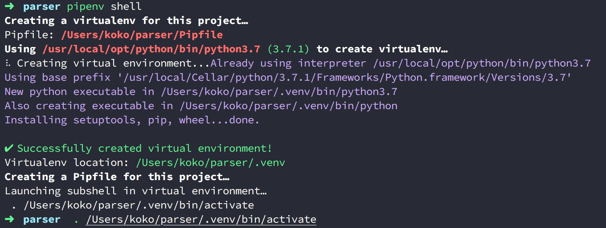
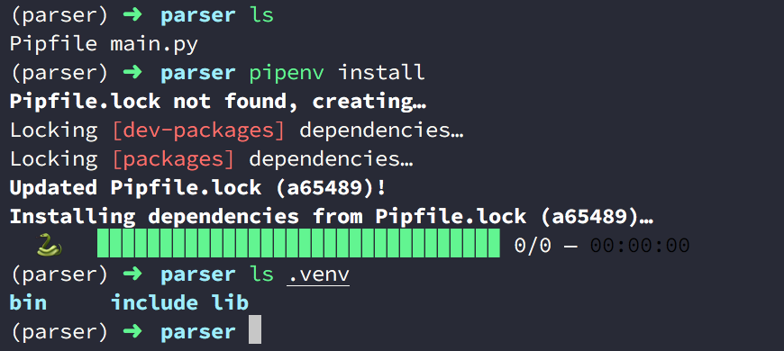

Title: Python - 透過 .venv 管理 Pipenv 虛擬環境的來源
Date: 2019-03-11
Tags: Python, Pipenv
Category: Python
Slug: pipenv-use-dot-venv-folder
Authors: kokokuo
Summary: 在前一篇 [Python - 結合 pip 與 virtualenv 的虛擬環境與套件管理的二合一新利器 Pipenv]({filename}/posts/20190308-python-pipenv-install-and-usage.md) 中提到透過 Pipenv 建立好的虛擬環境都會放在家目錄下的隱藏路徑統一管理，但是開發時如果使用編輯器像是 VSCode ，則需要一個一個設定以外，如果想要查看檔案也不方，所以能不能夠把建立好的專案虛擬目錄放在自己的專案下呢？答案是可以的，如果你正需要的話可以參考此篇。


# 前言
---
在前一篇 [Python - 結合 pip 與 virtualenv 的虛擬環境與套件管理的二合一新利器 Pipenv]({filename}/posts/20190308-python-pipenv-install-and-usage.md) 中提到透過 Pipenv 建立好的虛擬環境都會放在用戶家目錄下的 `.local/share/ virtualenvs/` 路徑，並且統一管理。

但是如果用編輯器像是 VSCode 開發時，還要設定虛擬目錄的來源很麻煩（因為每個虛擬目錄的命名都不同）所以能不能夠把建立好的專案虛擬目錄放在自己的專案下呢？答案是可以的，如果你正需要的話可以參考此篇。

# 建立 `.venv` 管理你的虛擬環境目錄
---
作法很簡單，只要在建立虛擬環境前，先在你的專案目錄下建立一個 `.venv` 的目錄，在照一般建立虛擬環境的方式就好，不管你是用 `pipenv install`, `pipenv shell` 或是其他指令讓 Pipenv 偵測沒有虛擬環境而建立都可。

```bash
parser/> mkdir .venv
parser/> pipenv shell
```

如下圖，你會看到虛擬環境被建立在 `parser` 這個專案下的 `.venv`



因為 `pipenv shell` 只會建立 `Pipfile`，所以我們再透過 `pipenv install` 或是 `pipenv lock` 建立 `Pipfile.lock`




此時你會虛擬環境的檔案被建置在 `.venv` 下。

# 參考資料
---
1. [Windows + Python 3.6 + PipEnv + Visual Studio Code でPython 開発環境](https://qiita.com/youkidkk/items/b6a6e39ee3a109001c75)