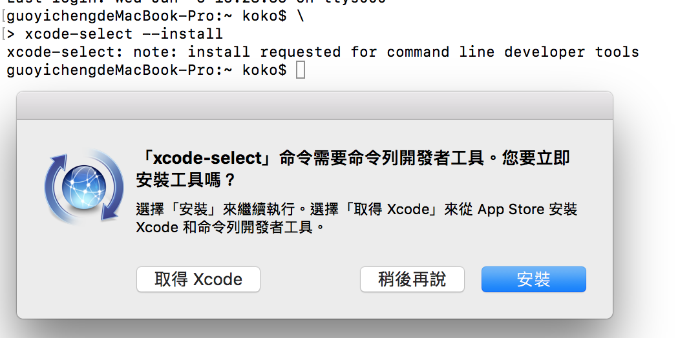
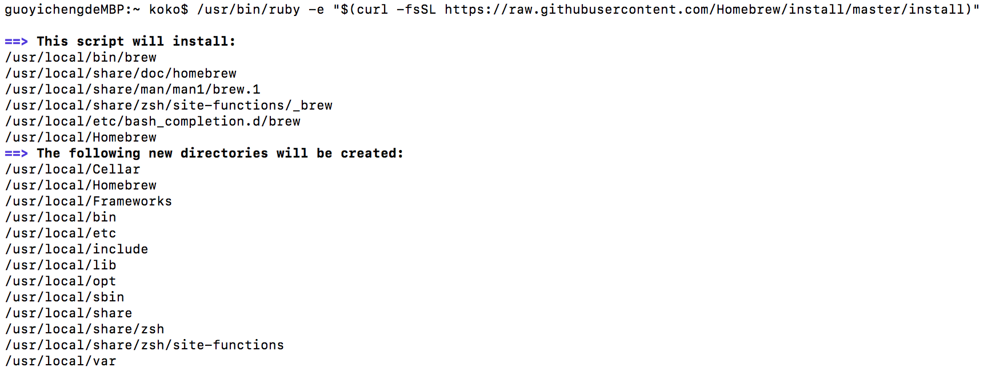
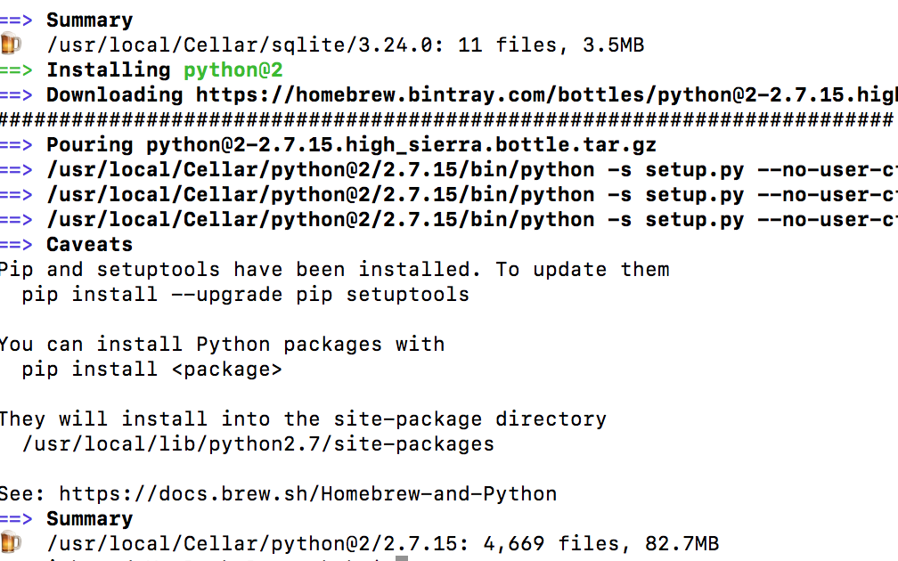
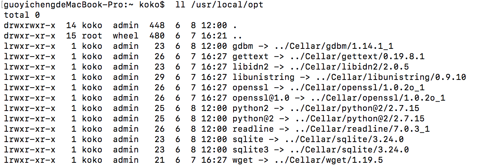
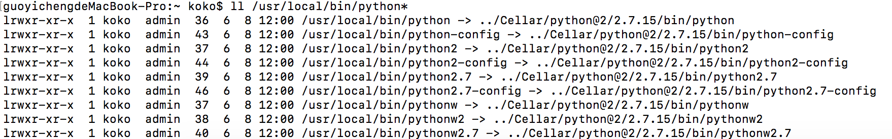
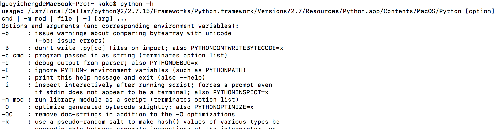

Title: 安裝 Python 2 在 Mac 上 (Python2.7.15 為例）
Date: 2019-03-12
Tags: Python, Mac, Python2
Category: Python
Slug: python-install-python2-on-mac
Authors: kokokuo
Summary: 對於使用 Mac 的開發者而言，雖然 Python 都會有內建在系統中，但是可能因為 Mac 出產時間，所以版本會過舊，如果想要自己安裝 Python 的話，可以參考此篇文章，如何在 Mac 上安裝 Python 2 到系統中，並且可以被讀取到安裝的 Python 版本，而不是系統原本內建的。

# 前言
---
對於使用 Mac 的開發者而言，雖然 Python 都會有內建在系統中，但是可能因為 Mac 出產時間，所以版本會過舊，如果想要自己安裝 Python 的話，可以參考此篇文章，如何在 Mac 上安裝 Python 2 到系統中，並且可以被讀取到安裝的 Python 版本，而不是系統原本內建的。

<br/>

# 安裝步驟
---
## 步驟一：安裝 XCode 或 Xcode 命名行工具
這是開發 Mac 或 iPhone 等 iOS 程式所用的開發工具，安裝此工具的原因是因為，在安裝 XCode 時， 也會依同安裝 C 編譯器，而 Python 的底層是以 C 編寫成，所以會需要 C 的 Compiler 來驅動。

開啟 Terminal App ，並且輸入以下指令安裝 Xcode 的命名行工具：

```bash
$> xcode-select --install
```



除了上述的方式，也可以透過 Mac 上的 App Store 安裝完全版的 XCode 開發工具。

## 步驟二：安裝 Homebrew 
Homebrew 是 Mac 專用的套件管理工具，如同 Linux 中的 `apt` 或是 `yum` 工具，後續透過 Homebrew 來安裝 Python ，進入 Homebrew 官網，依照步驟，在 Terminal 輸入下列此串：

```bash
$> /usr/bin/ruby -e "$(curl -fsSL https://raw.githubusercontent.com/Homebrew/install/master/install)"
```



## 步驟三：設定讀取 Homebrew 指令的環境變數

安裝完後，為了要使 Homebrew 的指令可以被 Mac 的 Terminal 中的 Bash 程式讀取到，需要設定 `/usr/local/bin` 與 `/usr/local/sbin` 至環境變數。

建立一個 `.bash_profile` 或是 `.profile` （如果已有其中一個檔案則不需再次建立）並且在檔案中新增此行：

```bash
export PATH=/usr/local/bin:/usr/local/sbin:$PATH
```

或是可以透過 Shell 的另一種語法雙引號來設定

```bash
export "PATH=/usr/local/bin:/usr/local/sbin:$PATH"
```

設定完成後，關閉 Terminal 應用程式重開 或是直接在 Terminal 中輸入以下指令啟動 `.bash_profile` 或 `.profile` 啟動即可（以下以 `.bash_pofile` 為例 ）：

```bash
$> source ~/.bash_pofile
```

接著便可以透過輸入 `brew` 來做所有跟 Homebrew 有關的套件管理操作行為了！ 

例如要對 Homrbew 診斷可以輸入以下指令：

```bash
$> brew doctor
```

更詳細的 Hombrew 安裝可以參考 [Homebrew (1) - Mac 上安裝 Homebrew 套件管理工具]({filename}/posts/20190306-mac-install-homebrew.md)。

## 步驟四：透過 Homebrew 安裝 Python
安裝 Python 其實除了透過 Homebrew 的方式外，也可以透過 Python 官方網站，下載 `.pkg` 的安裝包，但是因為安裝完後檔案的路徑會分別在：


**位置一：** `/Library/Frameworks/Python.framework`
**位置二：** `/usr/local/bin/`


這兩個位置，位置二是一個 symlink。另外，安裝包也會附帶 IDLE、PythonLauncher 這兩個軟體，安裝在 Application 資料夾。

因此需要除了自己紀錄位置外，刪除時，也要自己去找尋上述兩個位置與 IDLE、PythonLauncher 分別刪除，所以不推薦。

而透過 Homebrew 安裝除了， Homebrew 會列出 Python 的安裝位置外，也會把其他未來安裝的套件放在同一處，移除與升級都可以透過指令達成，因此非常便利，所以推薦在 Mac 上使用 Homebrew 安裝。

在 Homebrew 中， 目前 Python 2 會以 `python@2` 的套件名稱呈現，如下執行：

```bash
$> brew install python@2
```

Homebrew 會一同連 `pip` 也安裝進去，如下安裝完的結果與訊息：



安裝完後 Homebrew 會自動為放在 `Cellar` 的 `Python@2` 在 Mac 的 `/usr/local/opt` 與 `/usr/local/bin` 分別建置 link 檔案，如下為 `/usr/local/opt`：



`/usr/local/bin` 也有：



因此，雖然在另一篇在 [Mac OS X 上安装 Python 2](http://pythonguidecn.readthedocs.io/zh/latest/starting/install/osx.html) 有提及需要設定以下 `/usr/local/opt/python@2` 在環境變數：

```bash
export PATH="/usr/local/opt/python@2/libexec/bin:$PATH"
```

但因為 Homebrew 也會在 `/usr/local/bin` 中建立 Python2 的 Link 環境，因此其實不需要再去設定 `/usr/local/opt/python@2`

除非今天環境中也有安裝 Python 3 ，並且希望可以透過 `.bash_profile` 明確區分 Mac 優先以 python 讀取的指令是來自 Python 3 或 Python 2 時，可以放進去，參考 [Python2 與 Python 3 共存的設定 (以 Mac 為例)]({filename}/posts/20190312-python2-python3-run-on-mac.md) 中文章

而當安裝完後， 重新開啟 Terminal 直接輸入 Python 時，會讀取到 Homebrew 安裝的 Python 嗎？ 

答案是根據在 `~/.bash_profile` 中 PATH 設定的順序。

因為再設定環境變數時，系統內建的環境變數 `$PATH` 是放在後頭， /`usr/local/bin` 是在前面，因此輸入 Python 指令時 Bash 讀取 `~/.bash_profile` 會先讀到 `/usr/local/bin` 底下 `python@2` 的 `python` 指令 Link 檔，因而找到 Homebrew 安裝的 Python 2。

因此我們透過透過 `python -h` 查看後會發現目前的確讀到 Homebrew 安裝的 Python：



至此已經完成 Python2 的安裝。

<br/>

# 參考文章
---
1. [MacOS 上的 Python 路徑問題＆安裝方法](https://medium.com/denix-daily/macos%E4%B8%8A%E7%9A%84python%E8%B7%AF%E5%BE%91%E5%95%8F%E9%A1%8C-%E5%AE%89%E8%A3%9D%E6%96%B9%E6%B3%95-a10c01cc42a)
2. [在 Mac OS X 上安装 Python 2](http://pythonguidecn.readthedocs.io/zh/latest/starting/install/osx.html)

