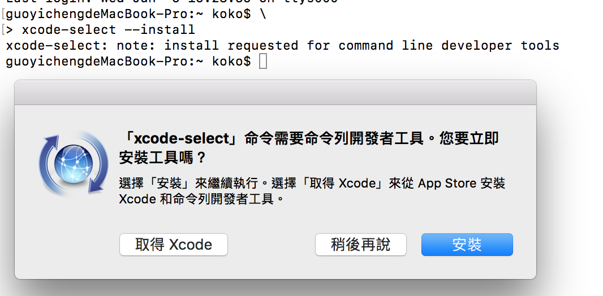
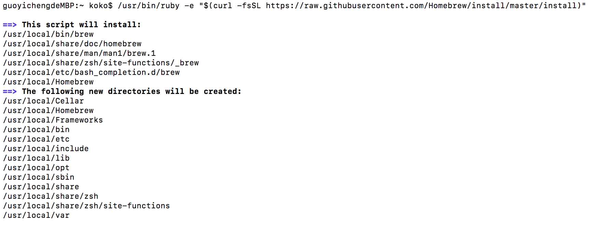

Title: Python - 安裝 Python3 在 Mac 上 (Python 3.6.5 為例）
Date: 2019-03-12
Tags: Python, Mac, Python3
Slug: python-install-python3-on-mac
Authors: kokokuo
Summary: Python - 安裝 Python3 在 Mac 上 (Python 3.6.5 為例）


# 前言
---
由於 Python 2.7 的核心開發團隊公布 2020 年確定會捨棄 2.7 版本，因此會有越來越多人開始轉移到 Python 3 版本，所以下面我們來介紹安裝 Python 3 在 Mac 的話如何處理。

# 安裝步驟
---

## 步驟一：安裝 XCode 或 Xcode 命名行工具
這是開發 Mac 或 iPhone 等 iOS 程式所用的開發工具，安裝此工具的原因是因為，在安裝 XCode 時， 也會依同安裝 C 編譯器，而 Python 的底層是以 C 編寫成，所以會需要 C 的 Compiler 來驅動。

開啟 Terminal App ，並且輸入以下指令安裝 Xcode 的命名行工具：

```bash
$> xcode-select --install
```



除了上述的方式，也可以透過 Mac 上的 App Store 安裝完全版的 XCode 開發工具。

## 步驟二：安裝 Homebrew 
Homebrew 是 Mac 專用的套件管理工具，如同 Linux 中的 `apt` 或是 `yum` 工具，後續透過 Homebrew 來安裝 Python ，進入 Homebrew 官網，依照步驟，在 Terminal 輸入下列此串：

```bash
$> /usr/bin/ruby -e "$(curl -fsSL https://raw.githubusercontent.com/Homebrew/install/master/install)"
```



## 步驟三：設定讀取 Homebrew 指令的環境變數

安裝完後，為了要使 Homebrew 的指令可以被 Mac 的 Terminal 中的 Bash 程式讀取到，需要設定 `/usr/local/bin` 與 `/usr/local/sbin` 至環境變數。

建立一個 `.bash_profile` 或是 `.profile` （如果已有其中一個檔案則不需再次建立）並且在檔案中新增此行：

```bash
export PATH=/usr/local/bin:/usr/local/sbin:$PATH
```

或是可以透過 Shell 的另一種語法雙引號來設定

```bash
export "PATH=/usr/local/bin:/usr/local/sbin:$PATH"
```

設定完成後，關閉 Terminal 應用程式重開 或是直接在 Terminal 中輸入以下指令啟動 `.bash_profile` 或 `.profile` 啟動即可（以下以 `.bash_pofile` 為例 ）：

```bash
$> source ~/.bash_pofile
```

接著便可以透過輸入 `brew` 來做所有跟 Homebrew 有關的套件管理操作行為了！ 

例如要對 Homrbew 診斷可以輸入以下指令：

```bash
$> brew doctor
```

更詳細的 Hombrew 安裝可以參考 [Homebrew (1) - Mac 上安裝 Homebrew 套件管理工具]({filename}/posts/20190306-mac-install-homebrew.md)。

## 步驟四：透過 Homebrew 安裝 Python3
安裝 Python 其實除了透過 Homebrew 的方式外，也可以透過 Python 官方網站，下載 `.pkg` 的安裝包，但是因為安裝完後檔案的路徑會分別在：

**位置一：** `/Library/Frameworks/Python3.framework`
**位置二：** `/usr/local/bin/`

這兩個位置，位置二是一個 symlink。另外，安裝包也會附帶 IDLE、PythonLauncher 這兩個軟體，安裝在 Application 資料夾。

因此需要除了自己紀錄位置外，刪除時，也要自己去找尋上述兩個位置與 IDLE、PythonLauncher 分別刪除，所以不推薦。

而透過 Homebrew 安裝除了， Homebrew 會列出 Python 的安裝位置外，也會把其他未來安裝的套件放在同一處，移除與升級都可以透過指令達成，因此非常便利，所以推薦在 Mac 上使用 Homebrew 安裝。

在 Homebrew 中， 目前 Python 3 會以 python 的套件名稱呈現，如下執行：

```bash
$> brew install python
```

Homebrew 會一同連 `pip` 也安裝進去，而在 Python3 中 `pip` 名稱為 `pip3`，如下安裝完的結果與訊息：


安裝完後 Homebrew 會自動為放在 `Cellar` 的 Python 3，並在 Mac 的 `/usr/local/opt` 與 `/usr/local/bin` 分別建置 link 檔案，如下為 `/usr/local/opt`：


`/usr/local/bin` 也有：


## 步驟五：設定 Python 3 作為預設執行的指令
若先前沒有以 Homebrew 安裝 Python 2 的話，那麼當下安裝 Python 3 時，如果從 Terminal 中直接輸入 `python`，如下：

```bash
$> python 
```

會出現的是內建的 Mac Python 2.7，這是為何呢？


我們來查看 `/usr/local/bin` 目錄下，你會發現並沒有  Python 3 提供的  `python` 可執行檔，而只有 `python3` 執行檔，因此當你輸入 `python` 時， Mac 因為來到 `/usr/local/bin` 目錄下沒有找到 `python` 可執行檔，才會保持原先的狀態，近一步往下一個位置找，並找到內建的版本，直接使用內建的 python 2.7。

只有當輸入 `python3`，你才會顯示 Homebrew 的 Python3.6.5

```bash
$> python3
```

如果想要讓 Mac Terminal 在輸入 `python` 指令時，會自動開啟 Homebrew 安裝的 Python 3，解決辦法是設定 `/usr/local/opt` 下的 Homebrew Python 3 來源到系統環境變數前，使 PATH 先讀到 Homebrew 的 Python3：


```bash
export PATH="/usr/local/opt/python/libexec/bin:$PATH"
```

完成後重開 Terminal 或透過 `source` 執行，即可成功，如下圖。


到此，因為先讀取到的 `/usr/local/opt/python/libexec/bin` 下方有提供 Python 3 的 `python` 可執行檔案，即可以透過原本的 `python3` 或設定好的 `python` 指令啟動 Python 3 。另外此設定也會影響到 `pip` 指令：


在 [Python2 與 Python 3 共存的設定 (以 Mac 為例)]({filename}/posts/20190312-python2-python3-run-on-mac.md) 此篇中亦有介紹如何設定預設 Mac 的 `python` 指令讀取來源。


# 參考文章
---
1. [MacOS 上 的 Python 路徑問題＆安裝方法](https://medium.com/denix-daily/macos%E4%B8%8A%E7%9A%84python%E8%B7%AF%E5%BE%91%E5%95%8F%E9%A1%8C-%E5%AE%89%E8%A3%9D%E6%96%B9%E6%B3%95-a10c01cc42a)
2. [在 Mac OS X 上安装 Python 3](http://pythonguidecn.readthedocs.io/zh/latest/starting/install3/osx.html)
