Title: Python2 與 Python 3 共存的設定 (以 Mac 為例）
Date: 2019-03-12
Tags: Python2, Mac, Python3
Slug: python2-python3-run-on-mac
Authors: kokokuo
Summary: 當你的 Mac 系統要同時使用到 Python 2 與 Python 3 的專案時，就會遇到需要同時安裝多個 Python 版本在電腦中，可是此時要如何設定透過指令啟動不同的版本，以下我們以 **Python 2.7.15** 與 **Python 3.6.5** 為例子，並舉出兩個常見的 Python 2 與 Python 3 例子。


# 前言
---
當你的 Mac 系統要同時使用到 Python 2 與 Python 3 的專案時，就會遇到需要同時安裝多個 Python 版本在電腦中，可是此時要如何設定透過指令啟動不同的版本，以下我們以 **Python 2.7.15** 與 **Python 3.6.5** 為例子，並舉出兩個常見的 Python 2 與 Python 3 例子。


# 解決方法
---
## 例子一：Mac 內建 Python 2 與 安裝 Homebrew 的 Python 3 

若先前沒有以 Homebrew 安裝 Python 2 的話，那麼當下安裝 Python 3 時，如果從 Terminal 中直接輸入 `python`，如下：

```bash
$> python 
```

會出現的是內建的 Mac Python 2.7：


這是為何呢？

我們來查看 `/usr/local/bin` 目錄下，你會發現並沒有  Python 3 提供的  `python` 可執行檔，而只有 `python3` 執行檔，因此當你輸入 `python` 時， Mac 因為來到 `/usr/local/bin` 目錄下沒有找到 `python` 可執行檔，才會保持原先的狀態，近一步往下一個位置找，並找到內建的版本，直接使用內建的 python 2.7。

只有當輸入 `python3`，你才會顯示 Homebrew 的 Python3.6.5

```bash
$> python3
```

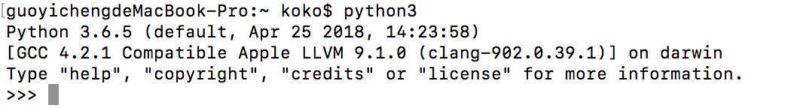

如果想要讓 Mac Terminal 在輸入 `python` 指令時，會自動開啟 Homebrew 安裝的 Python 3，解決辦法是設定 `/usr/local/opt` 下的 Homebrew Python 3 來源到系統環境變數前，使 PATH 先讀到 Homebrew 的 Python3：

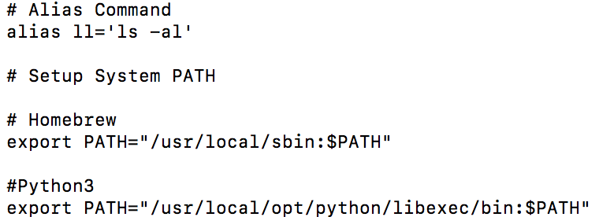

```bash
export PATH="/usr/local/opt/python/libexec/bin:$PATH"
```

完成後重開 Terminal 或透過 `source` 執行，即可成功，如下圖。


到此，可以透過 `python3` 或設定好的 `python` 指令啟動 Python 3 。

## 例子二： Homebrew 安裝 Python 2 與 Python 3 時

當透過 Homebrew 安裝了 Python2 與 Python 3 後，分別查看 `/usr/local/bin` 與 `/usr/local/opt` 時會發現 `/usr/local/bin` 下的 `python` 是導向 Homebrew 安裝 Python 2.7.15，如下圖：

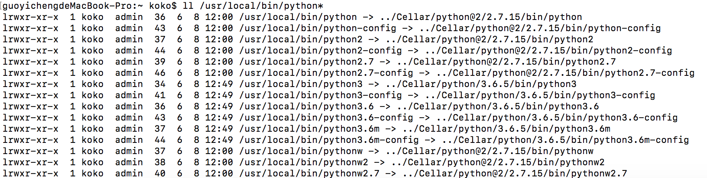

然而 `/usr/local/opt` 則是 `python` 位置導向 Python3：

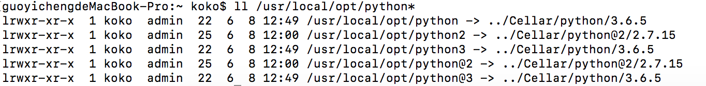

因此當我們分別輸入以下三種指令情況

```bash
$> python
$> python2
$> python3
```

會發現內建的 Python 指令會指定 Homebrew 安裝的 Python 2.7.15:

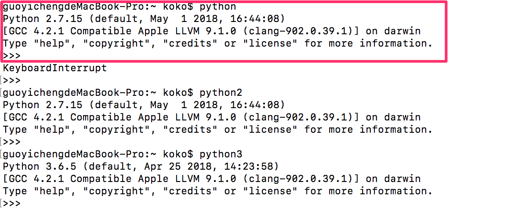

此原因透過 `export` 會發現， 因為系統 `PATH `中會先讀取到的 `/usr/local/bin` ，因此 Homebrew 的 Python 會取代掉 Mac 內建的 Python 。
再來因為  `/usr/local/bin` 下的 `python` 指令是 Link 到 Homebrew 的 `python@2` ，因此會是執行 Python 2.7 而非 Python 3。

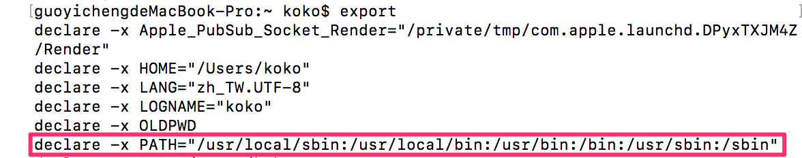

此時，如果想要把預設的 python 替換成 Homebrew 的 Python3 ，那麼便是如同例子一依樣設定 Python 3 所在的位置 

```bash
export PATH="/usr/local/opt/python/libexec/bin:$PATH"
```

到環境變數中，如下後再重新開啟 Terminal 或是透過 `source` 啟動即可。


此時 `PATH` 環境變數會先讀取到 Python 3 的位置，並抓取 `python` 可執行檔。

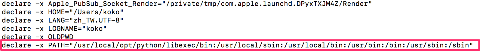

因此當再次測試 `python` 指令會發現預設的 `python` 已經變為 Python 3 的位置。

```bash
$> python
$> python2
$> python3
```

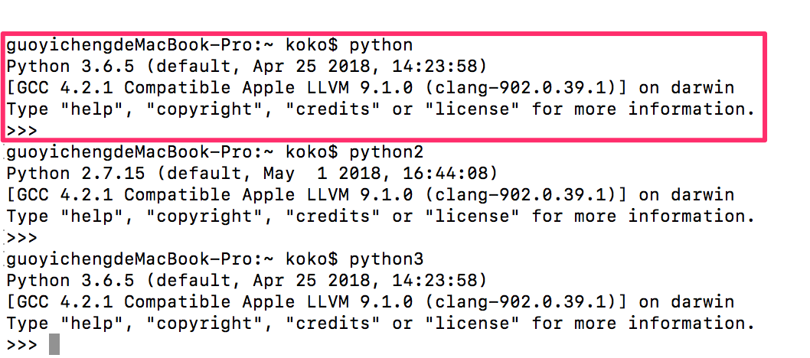

可以透過 `python -h` 查看路徑：

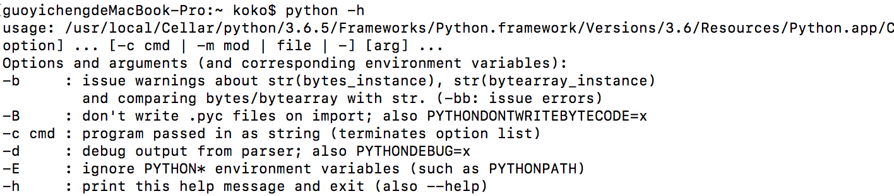

即可設定完成。

# 預設 python 指令對 pip 的影響
---
上述的 `python` 指令同時也會對 `pip` 造成影響，如果現在預設的 `python` 是讀取 Python 3 那麼 `pip` 也會是 Python 3 的 `pip`，如下：

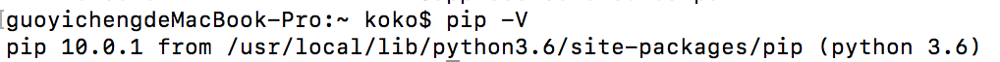

如果預設的 `python` 是讀取 Python 2 ，那麼 `pip` 則會是 Python 2 的 `pip` 。

## 明確區分 Homebrew Python 2 的來源
---
上述的設定中，如果想要明確區分  `python` 指令加入環境變數的來源，也可以對 Homebrew 的 `python@2` 加入環境變數，如下：

```bash
export PATH="/usr/local/opt/python@2/libexec/bin:$PATH"
```

因此未來便可以透過修改 `.bash_profile` 去做預設 `python` 指令讀取設定的開關：

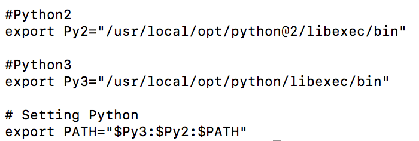

最後觀察一下環境變數，分別設定完成。

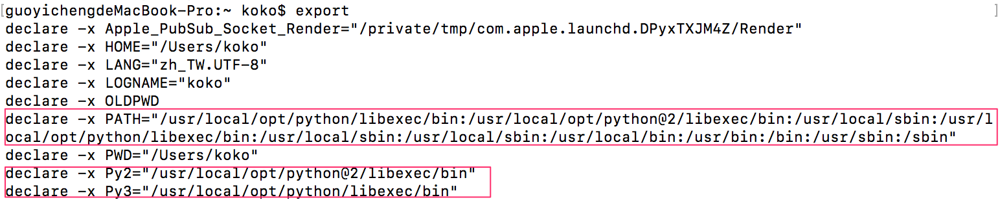

