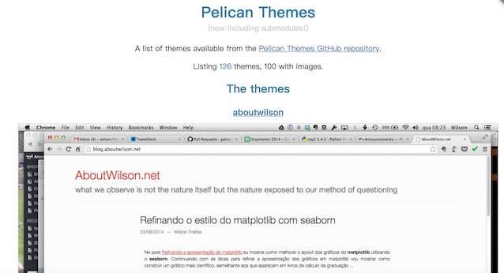
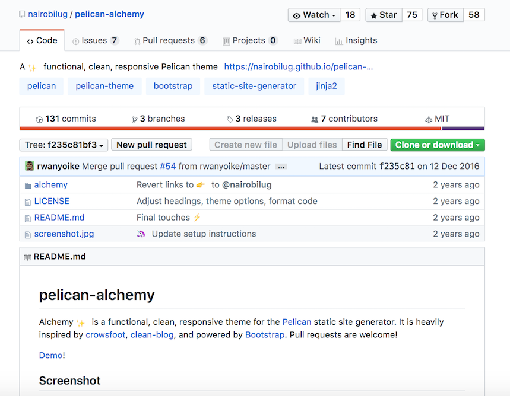
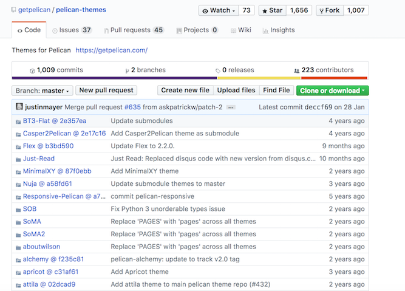
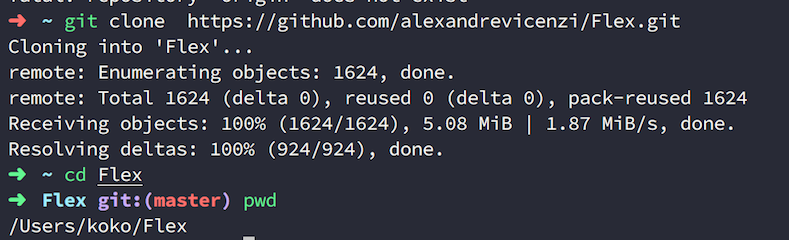
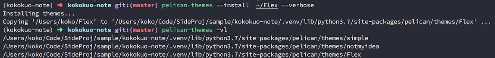
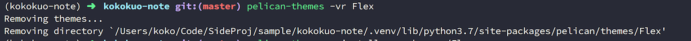
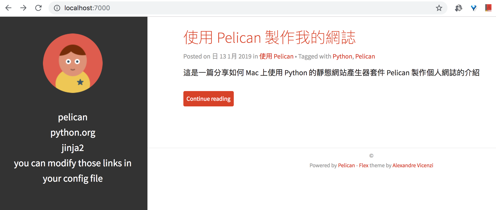
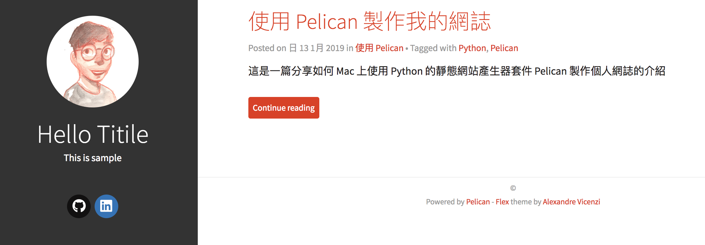

Title: Python - 安裝 Pelican Theme 來改變你的靜態網站主題
Date: 2019-03-15
Tags: Python, Mac, Python3
Slug: nstall-pelican-theme
Authors: kokokuo
Summary: Python - 安裝 Pelican Theme 來改變你的靜態網站主題


# 前言
---
由於使用 Pelican 靜態網站產生器架設好的網誌所提供的預設版面與外觀並不好看，因此想要更換，但是要怎麼更換呢？ Pelican 會不會有像 Wordpress 一樣能夠更換的功能了？ 還是...難不成要用程式寫一個？

放心，Pelican 有提供給我們更換網誌外觀的功能哦，以下我們接著來設定。

<br/>

# 安裝與設定 Pelican Theme
---
在 Pelican 中提供了許多可以更換你靜態網站的樣式外觀，這些樣式與外觀被稱作 **「主題」( Theme )**，許多的靜態產生器或是網站可能也都使用相同的詞彙。

而在 Pelican 中要安裝與設定非常容易，讓我們來執行以下步驟。

## 1. 挑選你喜歡的 Pelican Theme
有許多設計師設計了許多出色的主題，並且統一放在 [Pelican 官網的 Theme 頁面中](http://www.pelicanthemes.com/)，如下圖：



當你從中挑選了你喜歡的主題，你可以點擊此主題的名稱連結，該連結多半會導到其主題的個人設計師官網或是這些主題所存放的 Github Repository，如下：



除此之外這些主題的 Repository 也有提供一個連結讓 [Pelican Themes 的 Repository](https://github.com/getpelican/pelican-themes) 統一管理，這個 Repository 你可以從 Pelican Themes 的官網中找到其連結。



進入到挑選的主題的 Repository 後，透過 `git clone` 或是點擊 **Clone or download** 下載檔案解壓縮。

## 2. 安裝到你的 Pelican 網站中
下載後把你下載的位置與目錄記錄下來，例如選擇了 [Flex](https://github.com/alexandrevicenzi/Flex) 這個主題，透過 `git clone` 放在家目錄下：

```bash
~/> git clone https://github.com/alexandrevicenzi/Flex
~/> cd Flex
~/(master)Flex/>
```



之後回到你的 Pelican 網站，並且進入你的虛擬環境後確保 Pelican 的套件有安裝，Pelican 的指令能夠作用下，輸入以下指令

```bash
(kokokuo-note)kokokuo-note/> pelican-themes -h
usage: pelican-themes [-h] [-l | -p | -V] [-i theme path [theme path ...]]
                      [-r theme name [theme name ...]]
                      [-U theme path [theme path ...]]
                      [-s theme path [theme path ...]] [-c] [-v]

Install themes for Pelican

optional arguments:
  -h, --help            show this help message and exit
  -l, --list            Show the themes already installed and exit
  -p, --path            Show the themes path and exit
  -V, --version         Print the version of this script
  -i theme path [theme path ...], --install theme path [theme path ...]
                        The themes to install
  -r theme name [theme name ...], --remove theme name [theme name ...]
                        The themes to remove
  -U theme path [theme path ...], --upgrade theme path [theme path ...]
                        The themes to upgrade
  -s theme path [theme path ...], --symlink theme path [theme path ...]
                        Same as `--install', but create a symbolic link
                        instead of copying the theme. Useful for theme
                        development
  -c, --clean           Remove the broken symbolic links of the theme path
  -v, --verbose         Verbose output
```

這個是 Pelican 套件提供的主題指令，協助你查詢你用 Pelican 架設的靜態網站中，你如你可以透過 `pelican-themes -l` 來查詢你目前所有安裝的套件：

```bash
(kokokuo-note)kokokuo-note/> pelican-themes -l
simple
notmyidea
```

你會發現原來 Pelican 有預設幫你安裝了兩個主題，並且設定使用其中一個，所以你再啟動網站時才會看到，而在指令中也有提到安裝主題，這也是我們剛剛下載主題的原因，因為 pelican-themes 是許要指定安裝的路徑來源，因此不能從網路上指定，需要先下載那來才行，所以如下我們指令他的路徑，並安裝：

```bash
(kokokuo-note)kokokuo-note/> pelican-themes --install ~/Flex --verbose # 使用 --verbose 查看細節過程資訊
```

透過 `--verbose` 參數來查看安裝的過程資訊，如果沒有這個參數的話，安裝時你會看不到安裝的過程與安裝到哪裡，除此之外你也可以透過縮寫指令來安裝：

```bash
(kokokuo-note)kokokuo-note/> pelican-themes -vi ~/Flex # --install 與 --verbose 的簡短輸入方式
```

然後安裝完，你可以透過 `pelican-themes -l` 查看是否有安裝，只不過如果你想知道他安裝在哪裡，你可以也加入 `--verbose` 或 `-v` 看到：



你會發現，不管是預設的主題，還是安裝的主題，都會被放置到虛擬環境下 `pelican/themes/` 的位置。

另外，如果你要移除主題，你可以使用 `--remove` 或是 `-r` 短指令來指定你要移除的主題名稱移除：



## 3. 設定 Pelican 網站使用的主題
當你安裝好主題後，此時我們需要讓我們的 Pelican 網站採用此主題才行，打開 `pelicanconf.py`，並添加此行：

```python
Theme = 'Flex' # Flex 是你透過 pelican-themes 指令安裝的主題名稱
```

此參數的設定來自 [Pelican Setttings](https://docs.getpelican.com/en/stable/settings.html#themes) 文件中的介紹，在 Pelican 的教學文件中有列出對於安裝的主題，有哪些參數可以使用。

在 `pelicanconf.py` 加上 `Theme = 'Flex'` 後，再來我們就可以重新輸出一次 HTML 網頁並來預覽查看，透過 `make html` 與 `make serve [port]` 指令來生出新的 HTML 檔案，並開啟一個測試用的簡易伺服器協助測試與預覽：

```bash
(kokokuo-note)kokokuo-note/> make html && make serve 8000
```

如下圖，你會看到修改後的畫面，成功！



如果你對 Flex 這個主題有興趣，你可以去查看 Flex 主題提供的 [文件 wiki](https://github.com/alexandrevicenzi/Flex/wiki)，在其中有 [Custom Settings](https://github.com/alexandrevicenzi/Flex/wiki/Custom-Settings)) 的參數是 Flex 有提供可以設定的部分。

例如以下是我的一些簡易設定：

```python
THEME = "Flex"
SITETITLE = "Hello Titile"
SITESUBTITLE = "This is sample"
SITELOGO = "https://avatars3.githubusercontent.com/u/5389253?s=460&v=4"

SOCIAL = (('github', 'https://github.com/kokokuo'),
          ('linkedin', 'www.linkedin.com/in/easonkuo'),)
```

這些參數有些是 Pelican Settings 中提到的，有些是 Flex 這個主題客製化提供的，然後讓我們再次透過 `make html` 與 `make serve [port]` 指令來生出新的 HTML 檔案並測試：



大功告成！

<br/>

# 後記
---
除了這個範本教學的 Theme，在 Pelican 中還有許多其他的 Theme 有興趣的話可以都下載來體驗看看。

另外在 Pelican 中除了主題以下，還有許多其他的插件可以使用，如果後續有機會，會在撰寫文章分享給大家，以及如何在 Github Page 上設定個人買的網域這件事。

<br/>

# 參考連結
---
1. [Pelican Documents - pelican-themes](https://docs.getpelican.com/en/stable/pelican-themes.html)
2. [Pelican Settings - Theme](https://docs.getpelican.com/en/stable/settings.html#themes)
3. [Pelican Theme Website](http://www.pelicanthemes.com/)
4. [Flex - pelicanconf.py](https://github.com/alexandrevicenzi/blog/blob/master/pelicanconf.py)
