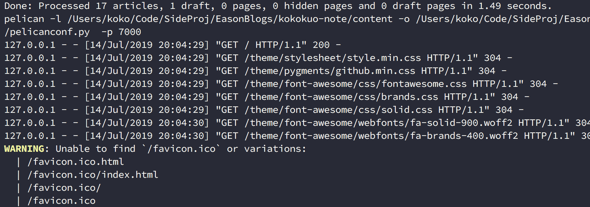
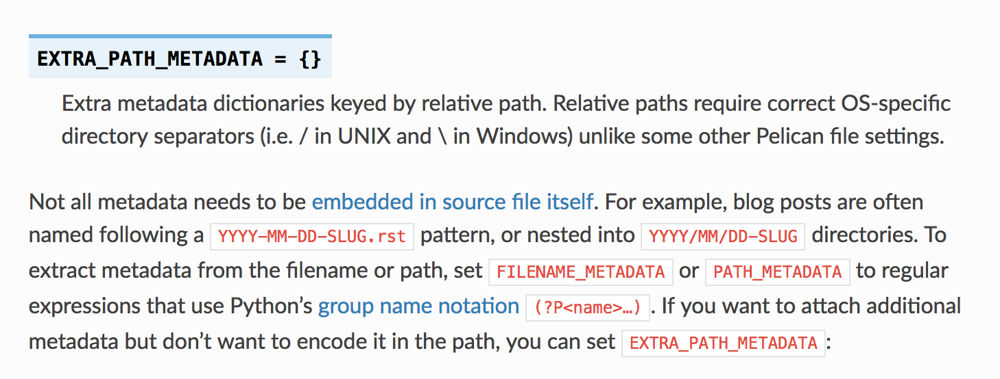
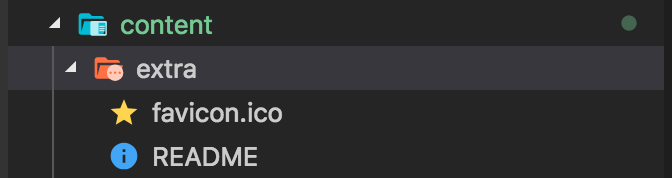

Title: Pelican - 常用參數設定介紹與功能設定
Date: 2019-03-15
Tags: Pelican, Python
Slug: pelican-settings-parameter-introudction
Authors: kokokuo
Summary: 如果你的 Pelican 剛架好，並且正在苦思一些設定，例如 Favicon 、客製化頁面、設定分類與標籤頁面、如何安裝留言板與 Google Analystic 與 robot.txt 等等，那麼此篇非常歡迎你來瞧瞧，介紹一些常用的 Pelican 的設定參數用途。

# 前言
---
如果你的 Pelican 靜態網站剛架好，並且正在苦思一些設定，例如 Favicon 、客製化頁面、設定分類與標籤頁面、如何安裝留言板與 Google Analystic 與 robot.txt 等等，那麼此篇非常歡迎你來瞧瞧，接著會介紹一些常用的 Pelican 的設定參數用途，希望能幫助到你。

另外如果你對如何架設 Pelican 、部署網站、使用 Pelican 的主題...等有疑慮的話，也歡迎你閱讀我前幾篇寫的文章，來幫助你更多認識唷。

1. [在 Mac 上使用 Python 的 Pelican 建立靜態個人網誌]({filename}/posts/20190113-mac-using-pelican-build-static-website.md)
2. [使用 Github Page 作為靜態網誌的空間 - 以 Pelican 為例]({filename}/posts/20190205-deploy-pelican-static-website-to-github-page.md)
3. [Python - 安裝 Pelican Theme 來改變你的靜態網站主題]({filename}/posts/20190314-install-pelican-theme.md)

接著我們來進入正題！

<br/>

# 設定 Favicon
---
在使用 Pelican 時如果有注意到的話，會發現當我們透過 `make serve PORT=[number]` 後，每當開啟網頁請求時，都會跳出，找不到 Favicon 的警告，如下圖：



Favicon 是網站圖示，主要被用在瀏覽器的網址搜尋列圖示或是書籤列圖示等等，尺寸通常在 100 多或 100 以下 Pixel 的大小 ( 更多介紹可以查看 [Wiki](https://zh.wikipedia.org/wiki/Favicon) )，副檔名為 `ico`。 而在 Pelican 中雖然不會影響，但是會被作為不完全的警告，因此我們接著來把 Favicon 加入進去。

另外 Favicon 有許多網站有在提供免費的圖像格式檔案轉換 ( png, jpg 轉 ico  )，例如我在這邊使用的是 [Favicon 線上製作轉換工具](http://tw.faviconico.org/)，另外 Favicon 有不同的尺寸，有興趣的可以看此篇 - [Does a favicon have to be 32x32 or 16x16?](https://stackoverflow.com/questions/4014823/does-a-favicon-have-to-be-32x32-or-16x16)。


 接著要開始設定 Pelican 的 Favicon 並顯示，有我們需要借助在 Pelican 文件中提到的 `EXTRA_PATH_METADATA` 設定參數：



透過 `EXTRA_PATH_METADATA` 參數加入想要的特定的檔案到來源目錄 `content` 下，並在 `make html` 輸出成 HTML 後，自動產生在輸出目錄 `output` 指定的位置中。

不過 `EXTRA_PATH_METADATA` 需要與 `STATIC_PATHS` 搭配，因為 `STATIC_PATHS` 會告知 Pelican 哪些檔案或目錄屬於靜態文件，唯有指定後，才會在輸出時複製檔案並且生效。

這個原因是因為一般的靜態網站，通常分為 HTML 內容與靜態文件 (Static Files)，這些文件則是資源檔案（圖片、影片、影訊檔案）、CSS 與 JS 檔案，而在 Pelican 中，因為也是靜態網站，所以 Pelican 需要知道哪些檔案或目錄，會被歸類成靜態文件，才能在輸出成 HTML 時作用並複製放到到輸出 HTML 的目錄下。

如下例子 `EXTRA_PATH_METADATA` 中的 `'static/robots.txt'` 是指在 `content` 下 `static` 的檔案，其投射到 HTML 時，被放置在 `output` 的根目錄。

但是因為有指定該來源路徑的內容要被歸類在 `STATIC_PATHS` 中，因此輸出才會作用，Pelican 才會複製該檔案，並藉由 `EXTRA_PATH_METADATA` 得知要放到根目錄中。

```python
STATIC_PATHS = [
    'static/robots.txt',
    ]
EXTRA_PATH_METADATA = {
    'static/robots.txt': {'path': 'robots.txt'},
    }
```

因此接著我們先把 Favicon 放到在 `content` 底下建立的 `extra` 目錄中（如果沒有建立直接建立此目錄）:


```python
# 設定哪些目錄或檔案，要被視為靜態文件，並且放置到輸出目錄下
STATIC_PATHS = [
    "images",
    "extra/favicon.ico"
]
# 用來設定複製到輸出目錄時，該 extra/favicon.ico 會被投放對應的位置，這邊設定在根目錄下
EXTRA_PATH_METADATA = {
    "extra/favicon.ico": {"path": "favicon.ico"},
}
```

因為 Pelican 預設會把 `images` 目錄視為靜態文件放置輸出目錄下，所以在設定 `extra/favicon.ico` 時不能省略。

之後設定 `EXTRA_PATH_METADATA`，並指定要求輸出目錄後，放到根目錄下，如此在 HTML 輸出目錄後便會出現在根目錄當中。

接著我們 `make clean` 後再輸入 `make html && make serve PORT=[number]` 執行，便會看到原本在 `content/extra/` 的 `favicon.ico` 也出現在 `output` 下：


之所以會放到根目錄的原因是因為在 Pelican 中有提到像 `favicon.ico`、`robot.txt` 可以放在根目錄會直接作用，所以在上述的 `favicon.ico` 在使用 `EXTRA_PATH_METADATA` 設定路徑時，`path` 直接放在最上層，所以在 `make html` 時才會直接出現在 `output` 下，接著透過 `make serve` 執行後也會顯示該 `favicon.ico` :


<br/>

# 在 master 分支加入 README
---
在使用 Pelican 建置靜態網站時，因為預設是使用 Markdown 來撰寫，所以 Pelican 會有功能協助我們在網站發佈成網頁時都需要轉換成 HTML 這個便利性。
可是如果你的網站是放在 Github Page 中的 Repository `master` 分支，那你可能也會希望如同往常使用 Github 一樣，當別人逛到該 Repository 也可以有一個 `README` 認識該 Repository。

但現在卻因 Pelican 會需要轉換 Markdown 成 HTML 呈現網頁而造成衝突，那該如何是好呢？

不用擔心，在這裡我們一樣透過 `EXTRA_PATH_METADATA` 與 `STATIC_PATHS` 參數，讓我們的網站的 `README` 可以不被放在文章的 `content/posts`。

接著因為 Pelican 會檢查 markdown 副檔名的檔案，所以一開始也不能把檔案的副檔名也標示出來，最後藉由 Pelican 轉換時自己轉換檔案名稱就可以搞定囉，以下我們來看一下：

首先建立一個 `README` 檔案，並放到 `content/extra` 下，此時該 `README` 不能有副檔名（ 但是內容需保持 Markdown 格式 ）:



接著我們在 `pelicanconf.py` 中添加此段：

```python
# 設定哪些目錄或檔案，要被視為靜態文件，並且放置到輸出目錄下
STATIC_PATHS = [
    "images",
    "extra/README",
    "extra/favicon.ico"
]
# 用來設定複製到輸出目錄時，該 extra/README 會被投放對應的位置，這邊設定在根目錄下，並且關鍵是 Path 設定為 .md 副檔名
EXTRA_PATH_METADATA = {
    "extra/README": {"path": "README.md"},
    "extra/favicon.ico": {"path": "favicon.ico"},
}
```

以會看到我們添加了 `README` 的部分，並且關鍵在於 `path` 設定為 `.md` 副檔名，之後一樣的 `make clean` 再 `make html` 就會看到檔案在 `output` 這個根目錄下囉：


最後我們在透過 `make github` 把這個新版的內容部署到 Github 的 `master` 上：


也可以點擊我的 [Github Page](https://github.com/kokokuo/kokokuo.github.io) 查看。

<br/>

另外由於先前我們把 `favicon.ico` 與這個 `README` 檔案都放在 `extra` 底下，因此當有多個檔案時，如果這些檔案未來都是要顯示設為靜態文件，可以直接對 `STATIC_PATHS` 改成指定目錄 ( 如同 `images` ) ：

```python
STATIC_PATHS = [
    "images",
    "extra"
]
```

<br/>

# 參考資料
---
1. [How to add a favicon to a Pelican blog?](https://stackoverflow.com/questions/31270373/how-to-add-a-favicon-to-a-pelican-blog)
2. [Does a favicon have to be 32x32 or 16x16?](https://stackoverflow.com/questions/4014823/does-a-favicon-have-to-be-32x32-or-16x16)
3. [Pelican - Tips](http://docs.getpelican.com/en/3.6.0/tips.html?highlight=favicon)

