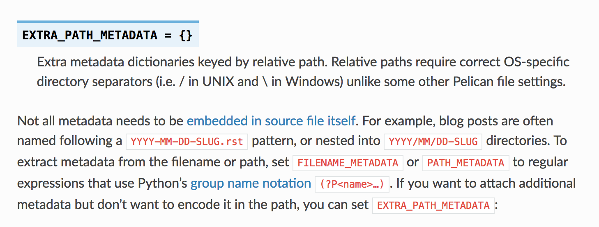
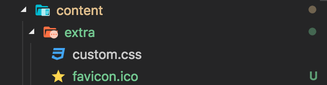
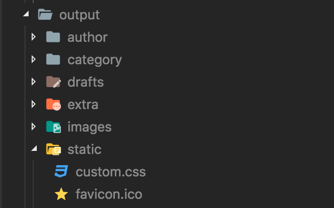
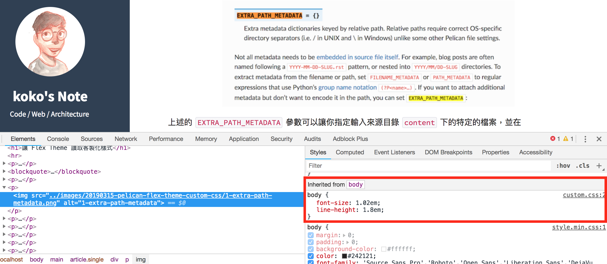
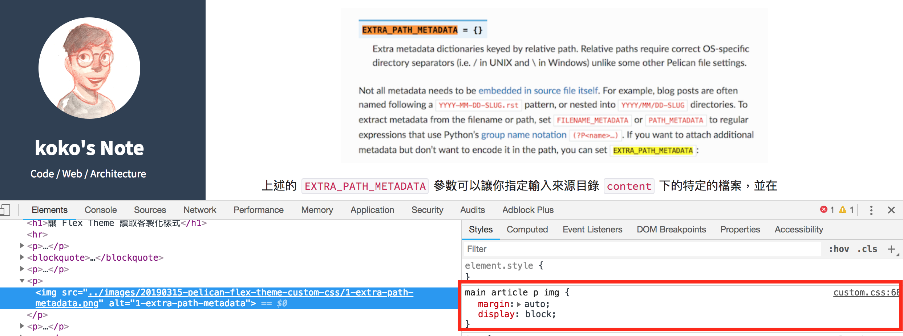
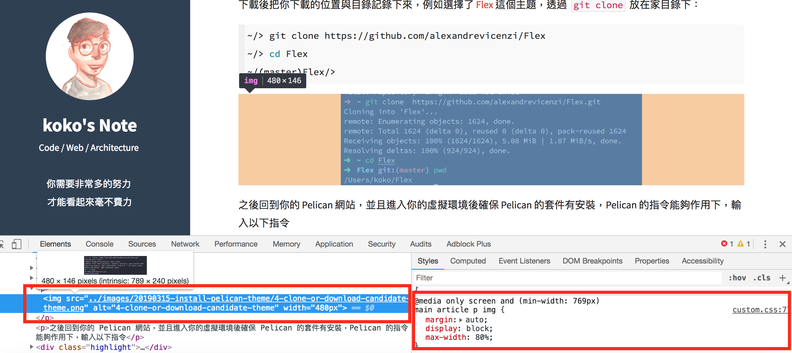
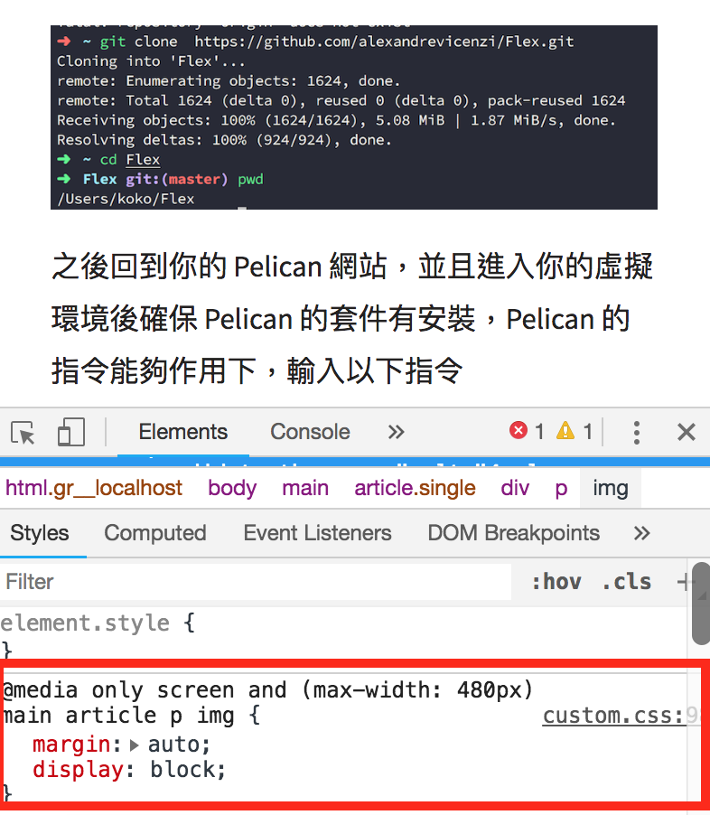
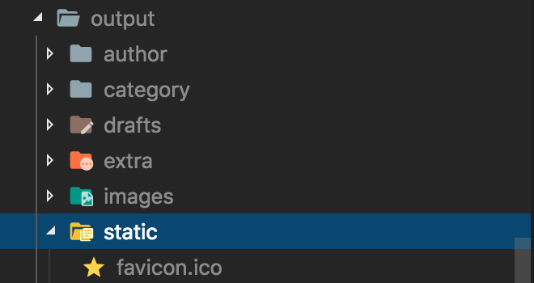
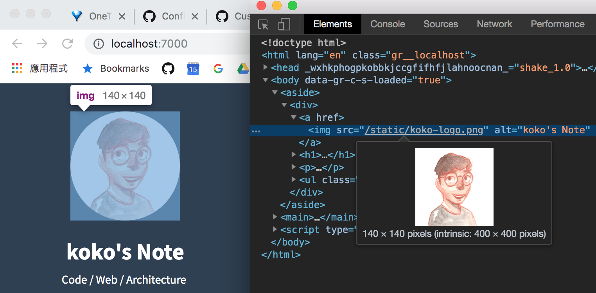

Title: Pelican - 如何客製化 Pelican Theme 的 Flex 樣式
Date: 2019-03-18
Tags: Pelican, Python
Category: Pelican
Slug: custom-pelican-theme-flex-style
Authors: kokokuo
Summary: 如果你使用 Pelican 靜態產生器，剛好也選擇 Flex 這個主題，你可能會想要對該主題做一些調整。例如 Flex 主題預設的樣式，在文字的排版上，行與行之間會比較擠，文字會比較小會顯得比較擠，因此如果你想要調整一下預設的樣式的話，那你可以參考此篇。


# 前言
---
在前一篇 [Python - 安裝 Pelican Theme 來改變你的靜態網站主題]({filename}/posts/20190314-install-pelican-theme.md)，分享了如何在 Pelican 上安裝主題，而如果你使用 Pelican 靜態產生器，剛好也選擇 Flex 這個主題，你可能會想要對該主題做一些調整。例如 Flex 主題預設的樣式，在文字的排版上，行與行之間會比較擠，文字會比較小會顯得比較擠，因此如果你想要調整一下預設的樣式的話，那你可以參考此篇。

<br/>

# 讓 Flex Theme 讀取客製化樣式
---
在 Flex 主題提供的 [Wiki](https://github.com/alexandrevicenzi/Flex/wiki) 文件中， Custom Settings 有提及一個 `CUSTOM_CSS` 設定參數，該參數的意思如下：

> Path to a CSS file. Need to be used with [EXTRA_PATH_METADATA](http://docs.getpelican.com/en/stable/settings.html#path-metadata).

可以讓你指定你要客製化的 CSS 檔案位置，而且 `CUSTOM_CSS` 的位置是指在輸出 HTML 的目錄下位置，但是該參數與要與 Pelican 本身的 `EXTRA_PATH_METADATA` 搭配使用：



關於 `EXTRA_PATH_METADATA` 有在 [Pelican - 常用參數設定介紹與功能設定]({filename}/posts/20190315-pelican-setting-introduction.md) 介紹到。

透過 `EXTRA_PATH_METADATA` 參數加入想要的特定的檔案到來源目錄 `content` 下，並在 `make html` 輸出成 HTML 後，自動產生在輸出目錄 `output` 指定的位置中。

 `EXTRA_PATH_METADATA` 需要需要與 `STATIC_PATHS` 搭配使用，藉由 `STATIC_PATHS` 告知 Pelican 哪些檔案或目錄屬於靜態文件，並在指定後才會在輸出時複製檔案並且生效。

藉由在 [Pelican - 常用參數設定介紹與功能設定]({filename}/posts/20190315-pelican-setting-introduction.md) 提到 `favicon.ico` 與 `robot.txt` 的例子參考。

把接下來要客製化的 CSS 檔案 `custom.css` 一同放置 `content` 下的 `extra` 子目錄並在該檔案中編輯要修改的 CSS，例如我的是：



```css

body {
    font-size: 1.02em;
    line-height: 1.8em;
}

h1,
h2,
h3,
h4,
h5,
h6 {
  font-weight: 600;
  line-height: 1.1;
}

h1{
  font-size: 1.8em
}

h2 {
  font-size: 1.52em
}

h3 {
  font-size: 1.36em
}

h4 {
  font-size: 1.2em
}

h5 {
  font-size: 1.1em
}

h6 {
  font-size: 1.08em
}

main article *:not(pre)>code {
  font-size: .9em;
  white-space: nowrap;
  color: #c25;
  padding: 1px 3px;
  background-color: #f7f7f9;
  border: 1px solid #e1e1e8;
  border-radius: 3px;
  margin: .2em;
}
```

完成後，接著到 `pelicanconf.py` 中設定剛剛提到的參數：

```python
# 設定哪些目錄或檔案，要被視為靜態文件，並且放置到輸出目錄下
STATIC_PATHS = [
  "images", 
  "extra",
]
# 用來設定複製到輸出目錄時，該 extra/custom.css 會被投放對應的位置，這邊設定在 static
EXTRA_PATH_METADATA = {
    "extra/README": {"path": "README.md"},
    "extra/favicon.ico": {"path": "favicon.ico"},
    "extra/custom.css": {"path": "static/custom.css"},
}
# CUSTOM_CSS 是輸出成 HTML 時的該客製化 CSS 檔案的位置
CUSTOM_CSS = "static/custom.css"
```

之後設定 `EXTRA_PATH_METADATA`，並指定要求輸出目錄後，放到 `static` 下，設定 `CUSTOM_CSS` 參數時在指定此 `custom.css` 在 HTML 輸出目錄下的所在位置。

最後再透過 `make html` 與 `make serve [port]` 測試，如下圖，你會看到該 `custom.css` 被複製到了 `output` 目錄下，並且放在指定的 `static` 目錄中：




<br/>

接著開啟網站看預覽畫面，如下圖 `custom.css` 生效囉！



之後喜歡這個主題的人就可以開始對這個 CSS 大改特改了。

<br/>


# 調整 Flex 內文中的圖像樣式
---
由於在 Markdown 中，預設並沒有可以直接調整圖像的參數，因此若要調整大小或置中的效果，因此需要另外的設定。

首先對於圖片的置中部分，我們一樣可以透過 Flex 主題提供的 `CUSTOM_CSS` 設定，開啟 `custom.css` 檔案，並貼上，設定置中的段落：

```css
/* 調整文章的圖片置中 */
main article p img {
  margin: auto;
  display: block;
}
```

完成後再次輸出 HTML 查看：



然而圖片的尺寸大小部分，雖然也有一些 Pelican 的 Plugin 有提供，但是都沒有辦法個別調整尺寸，因此還是要回歸到透過 HTML 的 `` 標籤，並對每張圖片透過屬性個別設定會是比較好的方式。

此外由於 Flex 對於圖片只有設定 `max-width: 100%;` ，因此如果如果圖片尺寸太大的話，會整個版面佔滿被放大，所以透過 `@media` 來設定不同尺寸下各自的設定模式，以下是讓尺寸在寬小於 480 時， `max-width` 為預設的 `100%`，若不是，則依照各個寬度縮放。

```css
 /* Media Query ，也就是當寬度 > 769 px 時將載入下面這段 CSS : */
 @media only screen and (min-width: 769px) {
  /* 調整文章的圖片置中 */
  main article p img {
    margin: auto;
    display: block;
    max-width: 80%;
  }
}

 /* Media Query ，也就是當 481px < 寬度 < 768px 時將載入下面這段 CSS : */
 @media only screen and (min-width: 481px) and (max-width: 768px) {
  /* 調整文章的圖片置中 */
  main article p img {
    margin: auto;
    display: block;
    max-width: 85%;
  }
}

 /* Media Query ，也就是當寬度 < 480 px 時將載入下面這段 CSS : */
@media only screen and (max-width: 480px) {
  /* 調整文章的圖片置中 */
  main article p img {
    margin: auto;
    display: block;
  }
}
```

若是仍有圖片過大，在各自調整 `` 中的 `width` 尺寸，最後如下：



當把瀏覽器拉窄後，畫面會看到 `@media` 變為適用寬度小於 `max-width` 為 480px：



<br/>


# 指定 Favicon 輸出路徑
---
在 [Pelican - 常用參數設定介紹與功能設定]({filename}/posts/20190315-pelican-setting-introduction.md) 中有介紹到如何設定 Favicon 並讓瀏覽器搜尋與書籤列顯示圖示，但是 Pelican 預設只能放在根目錄下，因此若不想放在根目錄下，就要看不同的 Theme 是否可以指定目錄（ 否則就要額外寫一些腳本程式 ）。

而剛好的 `Flex` 這套 Theme 就可以在 `pelicanconf.py` 中設定參數 `FAVICON`，參考 [Flex - Custom Settings](https://github.com/alexandrevicenzi/Flex/wiki/Custom-Settings)。

```python
# 設定哪些目錄或檔案，要被視為靜態文件，並且放置到輸出目錄下
STATIC_PATHS = [
    "images", 
    "extra"
]
# 用來設定複製到輸出目錄時，該 favicon.ico 會被投放對應的位置，這邊設定在 static 下，在透過 Flex 提供的參數讀取
EXTRA_PATH_METADATA = {
  "extra/README": {"path": "README.md"},
  "extra/favicon.ico": {"path": "static/favicon.ico"},
  "extra/custom.css": {"path": "static/custom.css"}
}
```

如上這次把 `favicon` 指定在輸出時放到 `static` 目錄下，並再次清除並重新輸出 HTML 與執行 Server，會看到 `favicon.ico` 放在 `static` 目錄下了，並且也會發現瀏覽器上沒有顯示 `favicon` 的圖案。



此時要怎麼辦呢？ 如果使用 `Flex` 樣板，我們可以直接指定所在目錄下，就會再次看到。

```python
FAVICON = "/static/favicon.ico"
```

<br/>

# 指定 Flex 樣式使用本地端的 Logo
---
在前一篇 [Python - 安裝 Pelican Theme 來改變你的靜態網站主題]({filename}/posts/20190314-install-pelican-theme.md) 文章安裝 `Flex` 時，因為 `Flex` 可以透過 `SITELOGO` 參數設定個人的大頭貼，因此當時直接使用了放置在雲端的路徑路徑。

但是因為我們現在知道了 `EXTRA_PATH_METADATA` 與 `STATIC_PATHS` ，所以我們也可以存取網站的資源目錄下要用的 LOGO，在這邊我準備了原先的大頭貼並放到 `content/extra` 目錄下，並接著使用 `EXTRA_PATH_METADATA` 與 `STATIC_PATHS` 來把檔案輸出到 HTML 的 `static` 目錄下：

```python
# 設定哪些目錄或檔案，要被視為靜態文件，並且放置到輸出目錄下
STATIC_PATHS = [
  "images", 
  "extra"
]
# 用來設定複製到輸出目錄時，該 extra/koko-logo.png 會被投放對應的位置，這邊設定在 static
EXTRA_PATH_METADATA = {
    "extra/README": {"path": "README.md"},
    "extra/favicon.ico": {"path": "static/favicon.ico"},
    "extra/custom.css": {"path": "static/custom.css"},
    "extra/koko-logo.png": {"path": "static/koko-logo.png"},
}
```

接著設定原先的 `SITELOGO` 參數指向 `static/koko-logo.png`:

```python
SITELOGO = "/static/koko-logo.png"
```

`make clean` 後再次輸入 `make html && make serve PORT=[number]` 執行：



完成。

<br/>

# 後記
---
雖然樣式調整設定好了，但是在 Pelican 中還有許多可以設定的參數，以後若是會使用新的參數會再跟大家分享。

到此 Pelican 相關的靜態網站主題會告一段落，若有想要詢問的人歡迎來在詢問。

<br/>

# 參考文章
---
1. [Pelican Settings - Metadata](https://docs.getpelican.com/en/stable/settings.html#metadata)
2. [利用 Pelican 和 GitHub Pages 打造个性化博客(二)](http://blog.game18.net/posts/2015/10/li-yong-pelicanhe-github-pagesda-zao-ge-xing-hua-bo-ke-er/)
3. [Windows 下使用 Pelican 搭建静态博客](https://maxwell-nc.github.io/blog/pelicanBuildBlog.html)


