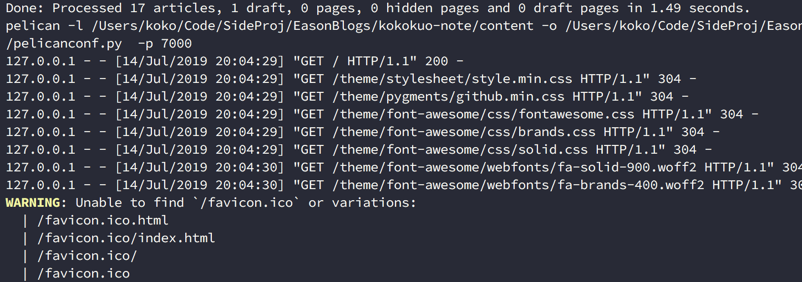

Title: Pelican - 常用參數設定介紹與功能設定
Date: 2019-03-18
Tags: Pelican, Python
Slug: pelican-settings-parameter-introudction
Authors: kokokuo
Summary: 如果你的 Pelican 剛架好，並且正在苦思一些設定，例如 Favicon 、客製化頁面、設定分類與標籤頁面、如何安裝留言板與 Google Analystic 與 robot.txt 等等，那麼此篇非常歡迎你來瞧瞧，介紹一些常用的 Pelican 的設定參數用途。

# 前言
---
如果你的 Pelican 靜態網站剛架好，並且正在苦思一些設定，例如 Favicon 、客製化頁面、設定分類與標籤頁面、如何安裝留言板與 Google Analystic 與 robot.txt 等等，那麼此篇非常歡迎你來瞧瞧，接著會介紹一些常用的 Pelican 的設定參數用途，希望能幫助到你。

另外如果你對如何架設 Pelican 、部署網站、使用 Pelican 的主題...等有疑慮的話，也歡迎你閱讀我前幾篇寫的文章，來幫助你更多認識唷。

1. [在 Mac 上使用 Python 的 Pelican 建立靜態個人網誌]({filename}/posts/20190113-mac-using-pelican-build-static-website.md)
2. [使用 Github Page 作為靜態網誌的空間 - 以 Pelican 為例]({filename}/posts/20190205-deploy-pelican-static-website-to-github-page.md)
3. [Python - 安裝 Pelican Theme 來改變你的靜態網站主題]({filename}/posts/20190315-install-pelican-theme.md)

接著我們來進入正題！

# 設定 Favicon
在使用 Pelican 時如果有注意到的話，會發現當我們透過 `make serve PORT=[number]` 後，每當開啟網頁請求時，都會跳出，找不到 Favicon 的警告，如下圖：

Favicon 是網站圖示，主要被用在瀏覽器的網址搜尋列圖示或是書籤列圖示等等，尺寸通常在 100 多或 100 以下 Pixel 的大小 ( 更多介紹可以查看 [Wiki](https://zh.wikipedia.org/wiki/Favicon) )，副檔名為 `ico`。 而在 Pelican 中雖然不會影響，但是會被作為不完全的警告，因此我們接著來把 Favicon 加入進去。

另外 Favicon 有許多網站有在提供免費的圖像格式檔案轉換 ( png, jpg 轉 ico  )，例如我在這邊使用的是 [Favicon 線上製作轉換工具](http://tw.faviconico.org/)。

## 顯示 Favicon

# 設定回首頁

# 參考資料
1. [How to add a favicon to a Pelican blog?](https://stackoverflow.com/questions/31270373/how-to-add-a-favicon-to-a-pelican-blog)