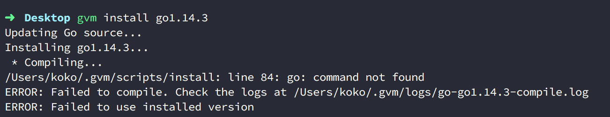
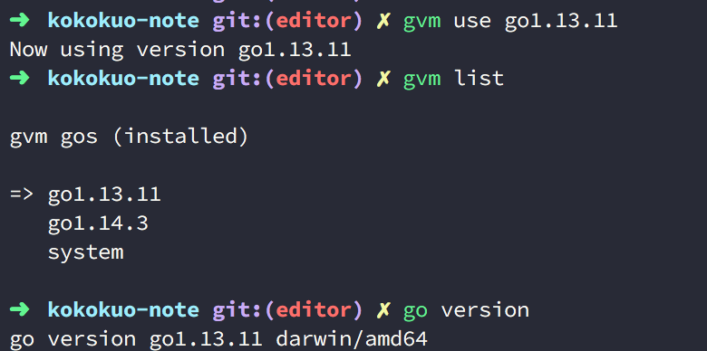
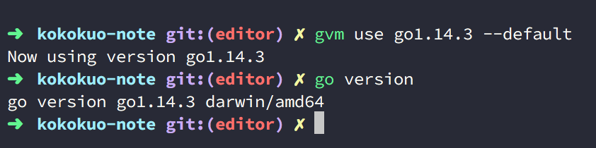
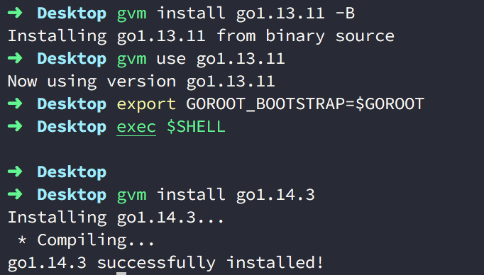

Title: Golang - 使用 GVM 管理器安裝 Golang 在 Mac 上
Date: 2019-07-13
Tags: Golang, Mac, GVM
Slug: golang-install-on-mac-with-gvm
Authors: kokokuo
Summary: 最近開始摸 Golang ( 簡稱 Go )，而正所謂預先善其事必先利其器，當然要先把環境安裝好。在 Mac 上安裝 Golang 非常容易，可以直接透過 `hombrew` 或是從 Golang 官方下載安裝即可。但是這麼做會使電腦的 Golang 的版本被限縮在某一版，如果今天從 Github 上或是與其他團隊共同開發 Golang 專案時，可能會需要同時存在不同版本，因此本篇介紹使用 Golang 版本管理器 - GVM，來俐落的安裝不同的 Golang 版本。

# 前言
---
最近開始摸 Golang，而正所謂預先善其事必先利其器，當然要先把環境安裝好。在 Mac 上安裝 Golang 非常容易，可以直接透過 `hombrew` 或是從 Golang 官方下載安裝即可。但是這麼做會使電腦的 Golang 的版本被限縮在某一版，如果今天從 Github 上或是與其他團隊共同開發 Golang 專案時，可能會需要同時存在不同版本，因此本篇介紹使用 Golang 版本管理器 - GVM，來俐落的安裝不同的 Golang 版本。

<br/>

# 透過 GVM 安裝並管理 Go 版本
---
## 1. 什麼是 GVM ( Go Version Management ) 
GVM 是一套由第三方的開源開發者們共同撰寫的 Go 語言版本管理器，能夠在系統上同時透過這套 GVM 的套件，為我們同時安裝多個不同版本的 Go ，並且可以切換要使用的版本。

這樣的管理器，如果有寫過其他語言的人一定不陌生，例如 Ruby 的 [RVM](https://github.com/rvm/rvm)，Python 的 [pyenv](https://github.com/pyenv/pyenv)，Node.js 的 [nvm](https://github.com/nvm-sh/nvm) ...等等。

而在 Go 語言上也有這樣方便好用的版本管理器，安裝非常簡單，以下我們來看一下。

## 2. 安裝 GVM

### 事前安裝 gcc
在安裝 GVM 前，須先確認是否有 gcc，若沒有則須先安裝，可以透過 Homebrew 安裝：

```bash
$ brew install gcc
```

### 安裝到 Bash 中
Mac 要安裝 GVM 無法使用 Homebrew  的指令，需要輸入一串腳本指令才行：

輸入以下指令安裝：

```bash
$ bash < <(curl -s -S -L https://raw.githubusercontent.com/moovweb/gvm/master/binscripts/gvm-installer)
```

透過上述的安裝指令，GVM 會被安裝到 `~/.gvm` 目錄下，並且自動為我們寫入以下這段指令到 bash 的用戶環境變數中：

```bash
[[ -s "/Users/<username>/.gvm/scripts/gvm" ]] && source "/Users/<username>/.gvm/scripts/gvm"
```

如下圖是 `~/.bash_profile`：


<br/>

### 安裝到 Zsh 中
若是使用 `zsh`，則可以改成下載套件並設定到 `zsh` 中：

```bash
$ zsh < <(curl -s -S -L https://raw.githubusercontent.com/moovweb/gvm/master/binscripts/gvm-installer)
```


打開 `~/.zshrc` 可以看到 `[[ -s "/Users/<username>/.gvm/scripts/gvm" ]] && source "/Users/<username>/.gvm/scripts/gvm"` ㄧ樣被寫入進去。


## 3. 啟動 GVM 安裝 Golang
在上述安裝完並檢查環境變數有指向 GVM 後，接著可以透過重新啟動 Ternimal 或是手動以 `source` 指令來啟動 GVＭ：

```bash
$ source /Users/<username>/.gvm/scripts/gvm
```

接著輸入 `gvm` 便會看到可以開始使用 GVM 版本管理器。


接著我們要來安裝需要的 Go 版本，在 GVM 有一些指令可以幫助我們檢查目前電腦上的 Go 版本、Go 釋出可以安裝的版本來讓我們選擇安裝：

### (1.) 查看可以下載安裝的 Go 版本

透過 `listall` 可以查看遠端可以下載的 Go 版本：

```bash
$ gvm listall
```


### (2.) 安裝想要的版本

```bash
$ gvm install <輸入你想要安裝的版本>
```

其他額外的參數：

```bash
Usage: gvm install [version] [options]
    -s,  --source=SOURCE      Install Go from specified source.
    -n,  --name=NAME          Override the default name for this version.
    -pb, --with-protobuf      Install Go protocol buffers.
    -b,  --with-build-tools   Install package build tools.
    -B,  --binary             Only install from binary.
         --prefer-binary      Attempt a binary install, falling back to source.
    -h,  --help               Display this message.
```

例如在這邊我安裝 1.14.3 版本：



結果卻看到錯誤的訊息，而這是因為 Go 1.4 版以後在工具鏈中移除了 C 的編譯器，並改為用 Go 寫的 C 編譯器放進去的原因。

#### Go 1.5+ 要做編譯

以下是官方套件的介紹：

> Go 1.5+ removed the C compilers from the toolchain and replaced them with one written in Go. Obviously, this creates a bootstrapping problem if you don't already have a working Go install. In order to compile Go 1.5+, make sure Go 1.4 is installed first.

因此安裝 Go 1.4 版以後的版本要改用參數 -B ，來直接安裝 binary 的版本才行：

```bash
$ gvm install [Go 版本] -B
```

### (3.) 查看目前電腦所安裝的版本

要查看已經安裝的版本，可以透過 `list` 來得知所有已經安裝的版本號。

```bash
$ gvm list
```

如下我們便會看到了已經安裝的版本。


### (4.) 指定使用的 Go 語言版本

如果要指定使用的版本 (或切換版本)，可以透過 `use` 指令來指定。

```shell
$ gvm use <已安裝要指定切換的 Go 版本>
$ gvm use go1.13.11
```

設定好後，我們可以透過 `go version` 來檢查是否找得到指定的版本：




此外透過 `gvm list` 也可以看到目前我們所使用的版本。

但是透過 `gvm use` 只能針對目前這個 Shell，所以當我們開了一個 Shell 後，便會找不到剛剛設定的 Go，如下圖我開了一個新的 `tty`：


輸入 `go version` 或 `go env` (`env` 參數可以看到 Go 所使用的環境變數，例如 Go 被安裝到哪)，你會發現找不到該 Go 版本。


那麼如果要讓指定的版本永久作用的話要如何是好？

### (5.) 指定 Go 預設使用的版本

我們可以在 `gvm use` 後便加上選擇性參數 `--default` 來告訴 GVM 這個版本被設為永久性預設的版本，當新開一個 Shell 後也會預設使用這個版本號：

```shell
$ gvm use <要指定切換的 Go 版本> --default
$ gvm use go1.14.3 --default
```



我們再次開了一個新的 Shell ，你會看到他預設指定 1.14.3 版。


### (6.) GVM 下載安裝的 Go 被放到哪裡

另外這些透過 GVM 所安裝的各個 Go 版本，會安放到哪呢？這時我們可以透過先前提到的 `go env` 查看與 Go 有關的環境變數：


如上圖你會看到被下載放置到 `~/.gvm/pkgsets` 目錄下。


進到目錄 `~/.gvm/pkgsets` 下後會看到剛剛所安裝的其他版本 Go:


### (7.) 移除指定的 Go 版本

要透過 GVM 移除 Go 很容易，只要透過以下指令：

```shell
$ gvm uninstall <要移除的版本>
```

### (8.) 移除 GVM

如果要把 GVM 整個移除可以透過 `implode` 指令移除：

```shell
$ gvm implode
```

當透過這個指令移除 GVM 後，所有透過 GVM 所安裝的 Go 版本也會移除，因為先前提到所有透過 GVM 所安裝的 Go 都會安放在 `~/.gvm/pkgsets` 目錄下。

另外如果發現 `gvm implode` 無法移除 GVM ，可以手動刪除 `.gvm` 整個目錄，並把一開始安裝時寫入到 `zsh` 或 `bash` 環境變數中的指令移除即可。

<br/>


### (9.) 指定預設編譯器來編譯未來新安裝的 Go 版本

前半段有提到，Go 在 1.5+ 版以後都要做編譯，因此如果不希望 Go 1.4 版後的語言每次安裝都要帶入參數 -B 可以先安裝 1.4 版本，並設定 `GOROOT_BOOTSTRAP`：

```bash
export GOROOT_BOOTSTRAP=$GOROOT
```

會需要做此動作，是因為 Go 1.4 以後實現了 Go 寫的 C 編譯器，並且為了讓後續的語言都通過該 1.4 版本的編譯器來編譯完新版本好的語言，因此需要設定，如此未來安裝 Go 時就需要再帶入 -B ，如下：

```bash
$ gvm install go1.4 -B
$ gvm use go1.4
$ export GOROOT_BOOTSTRAP=$GOROOT
$ gvm install go1.5
```

如下圖是安裝 1.14.3 版本的例子：




以上就是 GVM 的介紹囉。


# 參考資料
1. [GVM Github Repository](https://github.com/moovweb/gvm)
2. [GVM - Go 的多版本管理工具，使用介绍](https://dryyun.com/2018/11/28/how-to-use-gvm/)
3. [使用 gvm 管理多版本 golang](http://chen-tao.github.io/2017/09/14/Use-gvm-manage-golang-version/)
4. [Go Release History](https://golang.org/doc/devel/release.html)