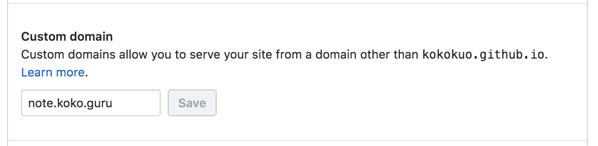
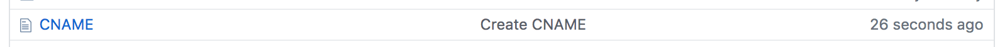
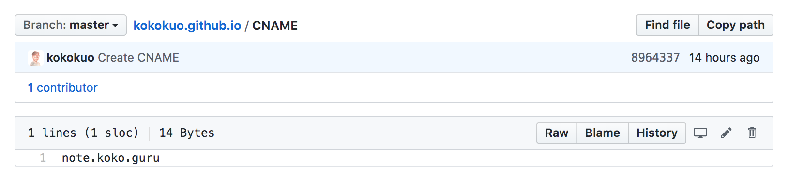
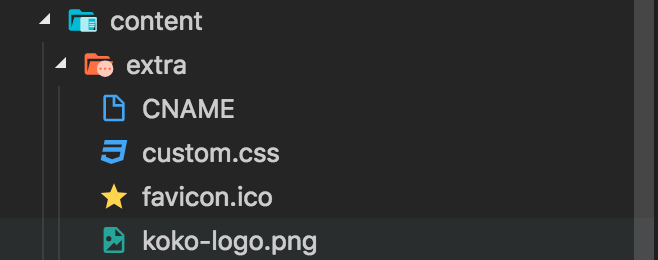
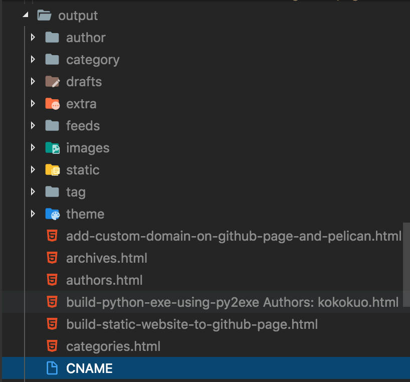
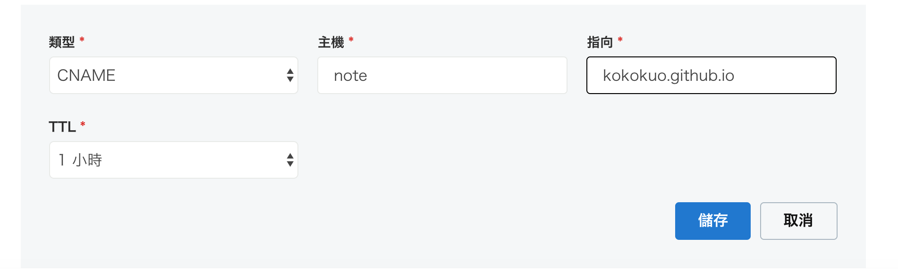
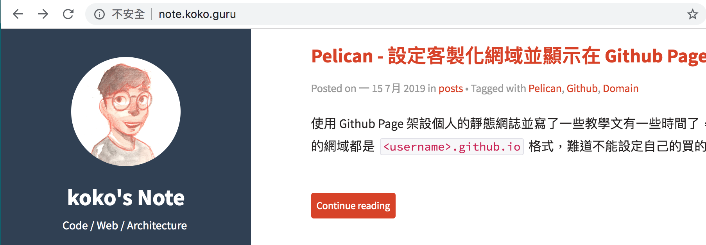
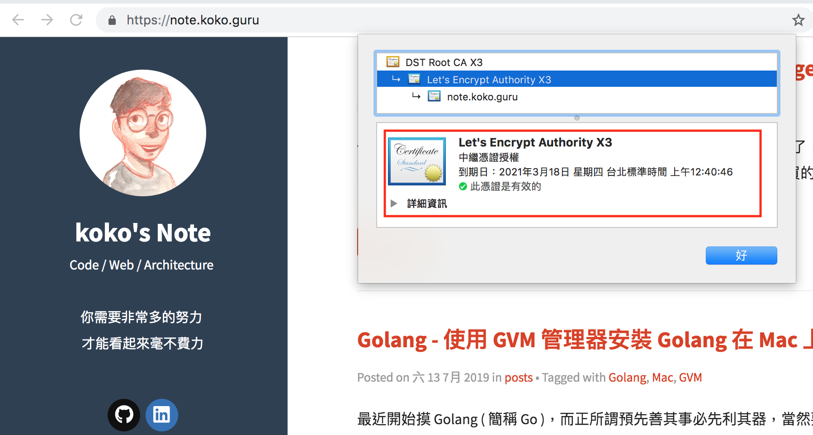

Title: Pelican - 設定客製化網域並顯示在 Github Page 上
Date: 2019-07-15
Tags: Pelican, Github, Domain
Slug: add-custom-domain-on-github-page-and-pelican
Authors: kokokuo
Summary: 使用 Github Page 架設個人的靜態網誌並寫了一些教學文有一些時間了，但是 Github Page 所架設的網誌，所使用的網域都是 `<username>.github.io` 格式，難道不能設定自己的買的網域嗎？ 那接著我們就來看看這篇吧！

# 前言
---
使用 Github Page 架設個人的靜態網誌並寫了一些教學文有一些時間了，但是 Github Page 所架設的網誌，所使用的網域都是 `<username>.github.io` 格式，難道不能設定自己的買的網域嗎？ 那接著我們就來看看這篇吧！

<br/>

# 一、設置化網域設定
---
## 1. 購買想要的域名
購買網域名稱這部分，在網路上有諸多的服務可以購買，如國產中華電信，全球較知名的網路註冊商 [Godaddy](https://tw.godaddy.com),、[NameCheap](https://www.namecheap.com/)、[Gandi.net](https://www.gandi.net)，或是熟知的幾大雲端服務也會提供，如 [AWS Route53](https://docs.aws.amazon.com/zh_cn/Route53/latest/DeveloperGuide/registrar.html)、[Google Domain](https://domains.google/#/)、Azure，甚至一些比較小眾或是特別網域才買得到註冊商，像是本人用過 [Registr.TO](https://register.to/) ... 等等，都能購買。

不過因為網路上有太多的相關文章介紹與分享，所以這邊就直接跳過此段。且由於我本人比較常用也熟悉 GoDaddy 的服務，所以接下來的設定為以 GoDaddy 為例，如果有想要了解的部分也可以在聯繫我，我會嘗試為你解答。

我從 GoDaddy 購買了 `koko.guru` 這個網域，接下來我將要設定子網域 `note.koko.guru` 來作為我 Github Page 的客製化網域。

如果沒聽過子網域的話可以看 [GoDaddy 這篇介紹](](https://tw.godaddy.com/help/what-is-a-subdomain-296))

## 2. 在 Github Page 填上想要的客製化網域
接著打開我們的 Github Page Repository，點擊右上角的 **Settings**，找到 **GitHub Pages** 區塊的 **Custom Domain**，並輸入要加入的客製化網域，如我在這裡輸入 `note.koko.guru` 並按下 **Save**。



接著當你再次回到 Repository 下的時候就會看到 `CNAME` 出現在 `master` 分支中：



點擊 `CNAME` 檔案觀看時會發現該檔案其實很單純，只是打上的我們在 **GitHub Pages** 區塊的 **Custom Domain** 所填寫的 `note.koko.guru` 內容而已。



上述這種方式雖然很簡單，但是透過 Github 的 **Custom Domain** Settings 是只有一次性的建立 CNAME 而已。

若未來我們的網誌更新，再次藉由 Pelican 提供的 `make github` 推版上去 `master` 的 Repository 時，就會被整個覆蓋掉，所以這並不是長久之計。

因此我們最好的方式是在 Pelican 的靜態網站每次更新並推版到 `master` 時把這個 `CNAME` 也放在裡面部署上去，以下來介紹如何透過 Pelican 產生。


## 3. 透過 Pelican 產生 CNAME 檔案
在 Pelican 中，我們一樣要先建立這個 `CNAME` 的檔案，並且藉由先前在 [Pelican - 常用參數設定介紹與功能設定]({filename}/posts/20190315-pelican-setting-introduction.md) 與 [Pelican - 如何客製化 Pelican Theme 的 Flex 樣式]({filename}/posts/20190318-pelican-flex-theme-custom-css.md) 文中提到的 `EXTRA_PATH_METADATA` 與 `STATIC_PATHS` ，先把自己製作的 `CNAME` 檔案放到 `extra` 目錄下：



接著設定 `EXTRA_PATH_METADATA` 與 `STATIC_PATHS`，使 `CNAME` 輸出時放到 `output` 根目錄下：

```python
# 設定哪些目錄或檔案，要被視為靜態文件，並且放置到輸出目錄下
STATIC_PATHS = [
  "images", 
  "extra"
]
# 用來設定複製到輸出目錄時，該 extra/CNAME 會被投放對應的位置，這邊設定在 根目錄
EXTRA_PATH_METADATA = {
    "extra/CNAME": {"path": "CNAME"},
    "extra/README": {"path": "README.md"},
    "extra/favicon.ico": {"path": "static/favicon.ico"},
    "extra/custom.css": {"path": "static/custom.css"},
    "extra/koko-logo.png": {"path": "static/koko-logo.png"},
}
```

最後透過 `make html` 輸出成 HTML 到 `output` 時也被放 `output` 根目錄下：



看到檔案後再執行 `make github` 推到 Github Page 即可。

但是到這一步還不夠，因為我們從網域註冊商購買的網域還沒有指向這裡，所以接著我們要在網域註冊商設定才行。


## 4. 設定網域註冊商的 CNAME 指向 Github Page


「網域註冊商」一般都會有基本的託管功能，也就是管理你過買的域名要指向哪個 IP 位置、或採用 CNAME ( 別名指向 ）、設置要讓網域給別的服務商託管、有沒有子網域設置...等等。

因為本篇不是介紹 DNS 以及設定 DNS 使用的不同種類紀錄方式，所以如果要了解可以先從 Google 的這篇認識 [DNS 基本資訊](https://support.google.com/a/answer/48090?hl=zh-Hant)

由於先前在前面的文章中，我是使用 GoDaddy 的服務，因此接下來會在 GoDaddy 中對我所購買的 `koko.guru` 設定子網域 `note.koko.guru` 並採用 CNAME 的方式指向我在 Github Page 所建立的靜態網誌 `kokokuo.github.io` ，如下圖是設定的部分：




按下儲存後，未來每當我輸入 `http://note.koko.guru` 便會指向我在 `https://kokokuo.github.io`。

另外因為我在 Github Page 中有設定 **Custom Domain** 為 `http://note.koko.guru`，因此當我輸入 `https://kokokuo.github.io` 網址時跳轉到 `http://note.koko.guru`。

接著再藉由 GoDaddy 設定 CNAME 的關係Ｍ所以指向我在 Github Page 架構的 Pelican 靜態網誌，同時網址也會顯示 `http://note.koko.guru`，如下圖：




# 二、設定 HTTPS
但是在上圖中你會發現原本使用 HTTPS 的 `https://kokokuo.github.io` SSL 安全傳輸加密協議的 Github Page 在設定成 Custom Domain 後便失效了。

這個原因是因為原本的 Github Page 網址 - `https://kokokuo.github.io` 是由 Github 提供的。

因為都歸類在 `github.io` 這個網域底下，所以 Github 可以比較容易的提供安全的 SSL 傳輸協議，例如只要購買萬用 SSL 憑證，便可以把 `github.io` 這個網域下的第一層子網域都可以看見 HTTPS。

如果沒聽過萬用 SSL 憑證的話，可以看一下 [GoDaddy 官方對萬用憑證](https://tw.godaddy.com/help/ssl-567)的介紹。

而剛好的因為我們 Github Page 使用時的網址格式 - `<username>.github.io` 都是第一層子網域，所以也可能對比上。

因此以前的話我們可能需要自己購買 SSL 協議，或是透過 [CloudFlare](https://www.cloudflare.com/zh-tw/) 來託管我們的網域，在藉由 CloudFlare 加裝 SSL 協議來達成 ( 即便這段協議是 DNS 系統到 CloudFlare 這段，對於 CloudFlare 至 Github 這段還是沒有安全協議但依然可以有一層保護 ) 。

但是因為後來有 [Let's Encrypt](https://letsencrypt.org/) 這個服務，可以幫助我們自動生成簡易且免費的 SSL 協議，因此 Github 也提供了這個功能到 Github Page 的 Custom Domain 裡面。

再次點擊自己的 Github Page 的 Repository，並點右上角的 **Settings** ，移動到 **Github Pages** 區塊並勾選 **Enforce HTTPS** ，看到打勾的符號後稍微等一下後，再次輸入網址便可以看到 HTTPS 哦！

例如我的 [https://note.koko.guru](https://note.koko.guru)，你會看到鎖頭，以及 Let's Encrypt 頒發的憑證。



<br/>

# 後記
雖然在 Github 官方的文件中有提到設定客製化網域的方式不只有 CNAME 這一種，也可以使用 A 紀錄，但在設定上會稍微繁瑣一些，所以目前主要以 CNAME 為大眾。

另外如果有人好奇為何沒有綠色鎖頭的話，那是因為 Google 官方在 2018 年 9 月後對於新版的 Chrome 都拔掉綠鎖頭的圖示了，所以如果你的 Chrome 有在更新沒看到也是很正常的，想知道這件事可以[Google 官方部落格介紹](https://blog.chromium.org/2018/05/evolving-chromes-security-indicators.html)。

那麼到這裡 Github Page 相關的設定也告一段落了，除了 Pelican 有逐漸補強會寫一些文章外，其餘會回到技術上的文章正軌，也會花一些時間把舊的兩個網誌也併過來。

<br/>

# 參考資料
1. [Quick start: Setting up a custom domain](https://help.github.com/en/articles/quick-start-setting-up-a-custom-domain)
2. [Adding or removing a custom domain for your GitHub Pages site](https://help.github.com/en/articles/adding-or-removing-a-custom-domain-for-your-github-pages-site)
3. [Github Pages 自訂域名 - 輕鬆擁有 https 綠鎖頭 (1)](https://blog.dmoon.tw/github-pages-custom-domain/index.html)