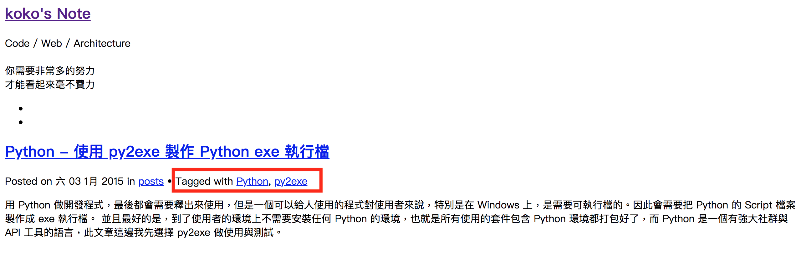

Title: Pelican - 出現 RuntimeError: File XXX.html is to be overwritten
Date: 2019-07-22
Tags: Pelican, Python
Slug: pelican-runtime-error-when-html-overwritten
Authors: kokokuo
Summary: 在使用 Pelican 撰寫 Markdown 文章並要透過 `make html && make serve` 輸出 HTML 並查看 Localhost 時，卻出現了 `RuntimeError: File XXX.html is to be overwritten` 的錯誤，由於這是沒有遇過寫網路上沒有什麼網友分享解決方法的錯誤訊息，因此稍微紀錄一下也為了之後可能遇到的其他朋友做參考。

# 前言
---
在使用 Pelican 撰寫 Markdown 文章並要透過 `make html && make serve` 輸出 HTML 並查看 Localhost 時，卻出現了 `RuntimeError: File XXX.html is to be overwritten` 的錯誤，由於這是沒有遇過寫網路上沒有什麼網友分享解決方法的錯誤訊息，因此稍微紀錄一下也為了之後可能遇到的其他朋友做參考。

<br/>

# 解析錯誤訊息
---
先讓我們來理解一下錯誤訊息的意思，這是輸入 `make html && make serve` 吐出的訊息

```bash
CRITICAL: RuntimeError: File /Users/koko/Code/SideProj/EasonBlogs/kokokuo-note/output/tag/python2.html is to be overwritten
```

從中會發現出現問題的在這個 `output/tag/python2.html` 目錄下的 HTML 檔案，根據描述


如果打開該 `python2.html` 並以 Browser 瀏覽單純的 HTML 會看到有一篇文章是指向 **Python - 使用 py2exe 製作 Python exe 執行檔**，如下圖 :



但是很奇怪的，這篇文章在當時使用的 Tag 是 `Python` 與 `py2exe`，那怎麼會被歸類在 `python2.html` 這個 `Python2` 的 Tag 呢？


為了查證與對照，所以我們先來確認一下目前在 Github 上執行正常的 [note.koko.guru](https:///note.koko.guru) 的 `Python2` Tag :


在上述用了深綠色匡起來的 Tag 標籤與網頁所看到的是正確使用 `Python2` Tag 的文章，所以換句話說問題出在標籤產生錯誤了，而且原本在 [note.koko.guru](https:///note.koko.guru) 網站上該 **Python - 使用 py2exe 製作 Python exe 執行檔** 文章是運作正常的，如下圖 :


而且在這次修改與輸出 HTML 時並沒有更動，那為何會反而這篇文章卻被放到錯誤的 Tag 中了？

其實如果稍微聯想與觀察一下原本輸出的錯誤訊息便可嘗試以推論出原因 : 

```bash
CRITICAL: RuntimeError: File /Users/koko/Code/SideProj/EasonBlogs/kokokuo-note/output/tag/python2.html is to be overwritten
```

這是因為文章的量變多，因此導致文章**可能**產生分頁並且這個分頁已不正確的命名為 `python2.html` 並把原本 `python2.html` 標籤中文章給覆蓋掉了，所以才會出現 `output/tag/python2.html is to be overwritten`。

換句話來看，也就是原本的 `/tag/python.html` 下的文章量**超過所限制的一個分頁所呈現的數量**所以才產生了 `python2.html` 這個分頁，而我們也可以對照一下原本 [note.koko.guru](https:///note.koko.guru) 網站上的 `/tag/python.html` 最後幾篇:


<br/>

那麼我們要如何解決呢？

<br/>

# 快速解決方法
---
在上述中我們有提到這個原因是因為文章量**超過所限制的一個分頁所呈現的數量**，所以我們要來問一個問題，我們原本預設的分頁參數是多少？ 又在哪設置呢？

其實這個參數就在 `pelicanconf.py` 中的 `DEFAULT_PAGINATION`，預設一般可能是 `10` 或 `15`，所以如果嘗試把這個量改成 `20` 在重跑一次呢？

```python
DEFAULT_PAGINATION = 20
```

解決了，如下圖你會看到我的 `localhost` 有出現 **Python - 使用 py2exe 製作 Python exe 執行檔** ，而且我們新文章也出現了。


但這不會是一個好的處理方式，而且 `DEFAULT_PAGINATION` 的設定不只影響到 Tag 的分頁，也影響到一般文章產生的排序分頁量，所以我們依然要解決的問題是分頁問題。

<br/>

# 設定分頁的命名格式
---
在一開始提到的當文章量**超過所限制的一個分頁所呈現的數量**時，分頁會自動產生，而原本的 `python.html` 產生了 `python2.html` 第二個分頁，但是卻與該 Tag 衝突到。

所以問題出在要如何讓分頁產生時不會與 Tag 的 HTML 檔案和 URL 衝突到才是這個核心解法。

在 Pelican 中，URL 與 HTML 檔案產生時的名稱格式是根據 [Using Pagination Patterns](http://docs.getpelican.com/en/4.1.0/settings.html#using-pagination-patterns) 參數設定中的預設參數，如下圖 :


而在文件中也有提到預設產生的結果，以及如何更改 `PAGINATION_PATTERNS` :


<br/>

# `PAGINATION_PATTERNS` 參數介紹

在 `PAGINATION_PATTERNS` 的參數設定方式會由 3 個參數值組成的 Tuple 格式來設定，其中一訓設定的順序會是 :

```bash
(minimum_page, page_url, page_save_as,)
```

這三個參數中，影響到 URL 的模樣以及分頁時，保存的標籤檔案會是 `page_url` 與 `page_save_as`。而這兩個參數會需要由一些關鍵字參數組成，如下分別介紹 :

- `{url}` : 這個變數會對應的是 `*_URL` 參數所填寫的數值，例如我的 `TAG_URL` 是 `tag/{slug}.html`，那麼便會呈現 `tag/{slug}.html` 的網址。
- `{save_as}` : 這個變數會呈現的是 `*_SAVE_AS` 參數所填寫的數值，例如我的 `TAG_SAVE_AS` 是 `tag/{slug}.html`，那麼在透過 `make html` 輸出時便會以 `{slug}.html` 的名稱產生並保存在 `tag` 目錄下。
- `{name}` : 該變數的數值會根據 `{save_as}` 的結果來擷取檔案名稱，例如範例中當透過`make html` 輸出時 `foo/bar.html`，那便會以 `foo/bar` 直接作為 `{name}`
- `{extension}` : 也就是 `{name}` 後半段的副檔名，在 `foo/bar.html` 是 `.html`
- `{base_name}` : 與 `{name}` 相同，但是如果有 `/index` 存在，會跳脫 `/index`
- `{number}` : 頁面的數值

<br/>

根據上述的間間自參數，我們來對照一下預設 `PAGINATION_PATTERNS`，當分為第一頁時，因為 `page_url` 與 `page_save_as` 皆為 `{name}{extension}` ，所以就會如同原先的 `localhost:7000/tags/python.html`，而產生的 HTML 檔案以 `python.html` 的名稱放在 `tags` 目錄下的

```python
PAGINATION_PATTERNS = (
    (1, '{name}{extension}', '{name}{extension}'),
    (2, '{name}{number}{extension}', '{name}{number}{extension}'),
)
```

<br/>

而當頁數超過一頁時，`page_url` 與 `page_save_as` 皆改變為 `{name}{number}{extension}` ，也就會讓第二頁的 URL 變為 `tags/python2.html`，而保存的 HTML 覆蓋掉了原先的 `Python2` Tag 的 HTML 檔案，也就會發生先前的錯誤訊息。

如果要更換掉預設的參數要怎麼換呢？在 Pelican 的文件中其實有給了一個範例，我們可以來研究一下 :


```python
PAGINATION_PATTERNS = (
    (1, "{url}", "{save_as}"),
    (2, "{base_name}/page/{number}/", "{base_name}/page/{number}/index.html"),
)
```

<br/>

當頁數只有第一頁時，`page_url` 是填入 `{url}`，所以會根據 `TAG_URL` 的設定值來給定 `page_url` 的網址。如果我們沒有改過 `TAG_URL` 預設值會是 `tag/{slug}.html` 所以顯示依然 `tag/python.html`。


<br/>

而 `page_save_as` 是 `{save_as}` 所以會是 `TAG_SAVE_AS` 的數值，同樣的預設沒有更改的話會是 `tag/{slug}.html`，所以會被建立為 `python.html` 檔案並保存在 `tag` 目錄下。

但是當頁數到了超過一頁時就不同了，因為 `page_url` 設定為 `{base_name}/page/{number}/`，因此根據 `{base_name}` 的描述，會顯示 `python`，而 `{number}` 會顯示 `2` ，因此網址會有大幅的改變，變成 `python/page/2`。至於 `page_save_as` 的保存方式，則是會建立一個 `python` 的目錄與 `page` 子目錄，並建立一個 `2.html` 保存該分頁的內容。

所以如果我們設定成以上的結果，把 HTML 清掉後再透過 `make clean && make serve PORT=7000` 來看看，你會發現透過 `localhost` 瀏覽 `Python` 標籤的分頁到了第二頁的確改變了 : 


而且 HTML 輸出的檔案也的確以 `2.html` 建立在 `output/python/page` 目錄下 :


<br/>

# `PAGINATION_PATTERNS` 的影響性

這也就是 `PAGINATION_PATTERNS` 參數好用的地方，方便我們定義分頁的網址與保存目錄位置。

但是像先前所說， `PAGINATION_PATTERNS` 的影響是全面性的，像上述我們依照 Pelican 給的範例修改後，不只有 Tag 部分，Category 以及 Index 都會以相同的形式呈現分頁，例如下圖是 Index 頁面的第二頁：


<br/>

# 參考資料
---
1. [Pelican - Using Pagination Patterns](http://docs.getpelican.com/en/4.1.0/settings.html#using-pagination-patterns)
2. [Error when attempting to manually overwrite a category page #1223](https://github.com/getpelican/pelican/issues/1223)


