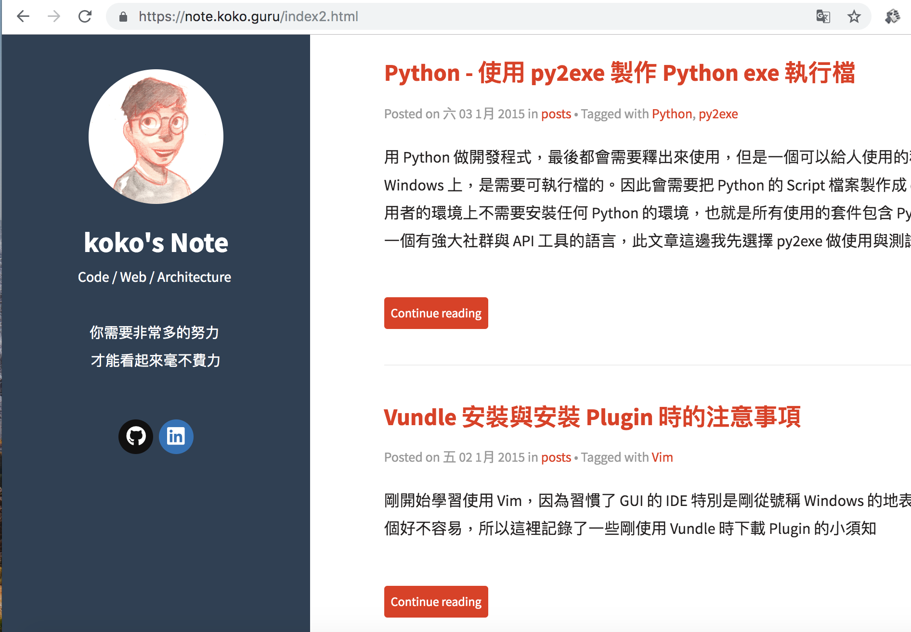

Title: Pelican - 出現 RuntimeError: File XXX.html is to be overwritten
Date: 2019-07-22
Tags: Pelican, Python
Slug: pelican-runtime-error-when-html-overwritten
Authors: kokokuo
Summary: 在使用 Pelican 撰寫 Markdown 文章並要透過 `make html && make serve` 輸出 HTML 並查看 Localhost 時，卻出現了 `RuntimeError: File XXX.html is to be overwritten` 的錯誤，由於這是沒有遇過寫網路上沒有什麼網友分享解決方法的錯誤訊息，因此稍微紀錄一下也為了之後可能遇到的其他朋友做參考。

# 前言
---
在使用 Pelican 撰寫 Markdown 文章並要透過 `make html && make serve` 輸出 HTML 並查看 Localhost 時，卻出現了 `RuntimeError: File XXX.html is to be overwritten` 的錯誤，由於這是沒有遇過寫網路上沒有什麼網友分享解決方法的錯誤訊息，因此稍微紀錄一下也為了之後可能遇到的其他朋友做參考。

<br/>

# 解析錯誤訊息
---
先讓我們來理解一下錯誤訊息的意思，這是輸入 `make html && make serve` 吐出的訊息

```bash
CRITICAL: RuntimeError: File /Users/koko/Code/SideProj/EasonBlogs/kokokuo-note/output/tag/python2.html is to be overwritten
```

從中會發現出現問題的在這個 `output/tag/python2.html` 目錄下的 HTML 檔案，根據描述


如果打開該 `python2.html` 並以 Browser 瀏覽單純的 HTML 會看到有一篇文章是指向 **Python - 使用 py2exe 製作 Python exe 執行檔**，如下圖 :


但是很奇怪的，這篇文章在當時使用的 Tag 是 `Python` 與 `py2exe`，那怎麼會被歸類在 `python2.html` 這個 `Python2` 的 Tag 呢？


為了查證與對照，所以我們先來確認一下目前在 Github 上執行正常的 [note.koko.guru](https:///note.koko.guru) 的 `Python2` Tag :


在上述用了深綠色匡起來的 Tag 標籤與網頁所看到的是正確使用 `Python2` Tag 的文章，所以換句話說問題出在標籤產生錯誤了，而且原本在 [note.koko.guru](https:///note.koko.guru) 網站上運作正常的 **Python - 使用 py2exe 製作 Python exe 執行檔** 文章，如下圖 :



在這次修改與輸出 HTML 時並沒有更動，那為何會反而這篇文章卻被放到錯誤的 Tag 中了？

其實如果稍微聯想與觀察一下原本輸出的錯誤訊息 : 

```bash
CRITICAL: RuntimeError: File /Users/koko/Code/SideProj/EasonBlogs/kokokuo-note/output/tag/python2.html is to be overwritten
```

便可嘗試以推論出原因，這是因為文章的量變多，因此導致文章**可能**產生分頁並且這個分頁已不正確的命名方式 `Python2.html` 把文章給覆蓋掉了，所以才會出現 `output/tag/python2.html is to be overwritten`。

所以我們要解決的問題是分頁問題。