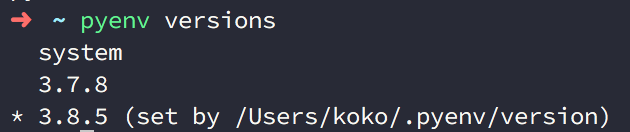
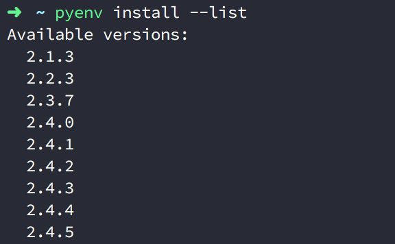
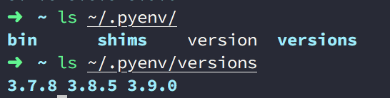
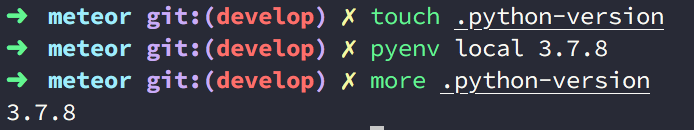
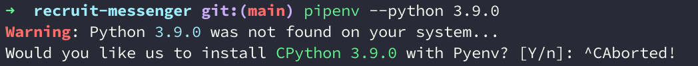

Title: Python - 使用 Pyenv 來管理多個 Python 版本的環境
Date: 2021-03-06
Tags: Python, pyenv
Category: Python
Slug: using-pyenv-to-manage-multiple-python-versions
Authors: kokokuo
Summary: 在 Python 的專案開發環境上，不論如何的演進總有虛擬環境 (virtual environment) 陪伴的我們，使我們能在不同的專案上切割出獨立的套件安裝環境。然而管理 Python 版本的問題呢？ 公司可能許多專甚至仍維持在不同的 Python 版本上（如：有的 2.7 有的 3.4)，究竟是否有一套工具能夠解決我們管理多個 Python 版本的問題呢？那麼我一定會推薦你來瞧瞧現在知名的 `pyenv` 工具。
--- 
# 前言
在 Python 的專案開發環境上，不論如何的演進總有虛擬環境 (virtual environment) 陪伴的我們，使我們能在不同的專案上切割出獨立的套件安裝環境。

然而管理 Python 版本的問題呢？在這幾年 Python 的版本從早期最受歡迎的 2.7 到 Python 3 問世，甚至不知不覺已經快速迭代到 3.9 版，因此公司可能許多專甚至仍維持在不同的 Python 版本上，有 Python 2.7 的，有 Python 3.4 的，也可能有 3.7 的。

那麼我們究竟是否有一套工具，能在一台電腦上簡單的安裝多個 Python 版本甚至方便的管理呢？那麼我一定會推薦你來瞧瞧現在知名的 [**pyenv**](https://github.com/pyenv/pyenv) 工具，因為他滿足了這些需要，甚至能跟你的專案環境綁在一起，連 Pipenv 甚至最近的 Portry 也原生支援。

# 在 Mac 上透過 Homebrew 安裝 pyenv

Mac 透過 Homebrew 安裝步驟：

```bash
$> brew install pyenv
```

初始化 `Pyenv`：
透過輸入以下指令，Pyenv 會提供要寫入到 `.bash_profile` 或 `.zshrc` 的設定參數：

```bash
$> pyenv init
# Load pyenv automatically by appending
# the following to ~/.zshrc:

eval "$(pyenv init -)"
```

例如我使用 Zsh 環境，因此開啟 `~/.zshrc`，並放入此行：

```bash
eval "$(pyenv init -)"
```

接著在終端機啟動更新後的 `.zshrc`：
```bash
$> exec $SHELL
```

透過 `eval "$(pyenv init -)"` 可以為你登入系統後就自動啟用 `pyenv` ，並且啟動 shims 和 autocompletion 功能。

接著我們可以開始使用 pyenv

顯示目前系統安裝的 Python 版本，預設是 system ( 內建的 Python )

```bash
$> pyenv versions
```



列出可安裝的 Python 版本：
```bash
$> pyenv install --list
```



如果想要設定整個系統預設的 Python 版本的話，可以使用 `pyenv global <版本號>` 指令：

```bash
$> pyenv global 3.7.0
```

如果只是暫時切換 Python 版本的話，可以輸入 `pyenv local <版本號>` 指令做切換，如此就只會影響當前 Terminal Session 的 Python 版本，例如：

如果想看到目前 Session 的 Python 版本，可以透過 `version` 這個指令查看：

```bash
$> pyenv version
```

# 透過 pyenv 安裝的 Python 版本們去哪

藉由 pyenv 安裝的各個版本 Python 都會統一放到 `PYENV_ROOT` 目錄下的 `versions` 目錄中，在 peynv 中預設的 `PYENV_ROOT` 版本會在 `~/.pyenv` 下：



而如果你想要修改，可以到進到你的 Bash 或是 zsh 設定檔中指定 `PYENV_ROOT`，並啟動更新後的設定檔：

```bash
PYENV_ROOT	~/workspace/.pyenv
```

此外你，也可以透過 pyenv root 這個指令了解目前的 `PYENV_ROOT` 指向哪裡：

```bash
$> pyenv root
```

# 指定開發專案的 Python 版本

可以在專案目錄中，建立 `.python-version` 檔案，並在內部輸入 Python 的版本號 （類似 `nvm` 的 `.nvmrc` 檔案：

```bash
$> echo [版本號] > .python-version
```

或者你也可以先建立 ，再透過 `pyenv local` 指令指定：

```bash
$> touch . python-version
$> pyenv local [Python 版本]
```



# 如何在 Pipenv 中指定已安裝在 Pyenv 的 Python 版本


首先你需要透過 pyenv 切換到你想要使用的 Python 版本，接著在該環境中，比如說 `3.9.0`，先用 `pip install pipenv` 把 Pipenv 安裝好，如此你才能在你想要的 Python 版本中使用 Pipenv。

接著可以使用以下 Pipenv 指令來指定你目前所在的 Python 環境：

```bash
$> pipenv --python [目前 Python 版本的環境]
```

然而如果你真的輸入了以下指令直接指定版本 (如 `3.9.0`)，你會發現 Pipenv 告訴你他找不到這個版本，並詢問你是否要安裝該 Python ：

```bash
$> pyenv global 3.9.0
$> pyenv versions
  system
  3.7.8
  3.8.5
* 3.9.0 (set by /Users/[username]/.pyenv/version)

$> pipenv --python 3.9.0
Warning: Python 3.9.0 was not found on your system...
Would you like us to install CPython 3.9.0 with Pyenv? [Y/n]: 
```



這是因為 Pipenv 無法識別 pyenv 所使用的 Python 版本的路徑位置 `shims`，因此我們不能這麼簡單的輸入版本號。

正確的方式要如下輸入這串執行變數 `$(pyenv which python)`  才能成功。

```bash
$> pipenv --python $(pyenv which python)

# 或是你也可以直接指定 python 執行檔在 pyenv 下的位置
$> pipenv install --python ~/.pyenv/versions/[`the version you installed`]/bin/python
```