Title: Homebrew (2) - Homebrew 常用與隱藏指令
Date: 2021-04-18
Tags: Mac, Homebrew
Category: Homebrew
Slug: homebrew-useful-command
Authors: kokokuo
Summary: 本篇繼上一篇 [Mac 上安裝 Homebrew 套件管理工具]({filename}/posts/20190306-mac-install-homebrew.md) 介紹 Homebrew 的常用指令。


# 前言
在上一篇 [Mac 上安裝 Homebrew 套件管理工具]({filename}/posts/20190306-mac-install-homebrew.md) 我們介紹了如何在 Mac 上安裝 Homebrew 後，本篇繼續介紹一些常用指令。

# 常用與隱藏指令介紹

## 列出已安裝套件與安裝位置
如果想要得知目前已經安裝的套件可以使用以下指令：

```bash
$> brew list
```
另外 Homebrew 實際的安裝位置，會放在 `/usr/local/Cellar` 這個目錄以下：

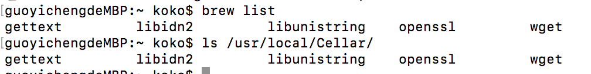

如果想要觀看已安裝套件的版本號，可以在後面加上 `--version`：

```bash
$> brew list —-versions
```

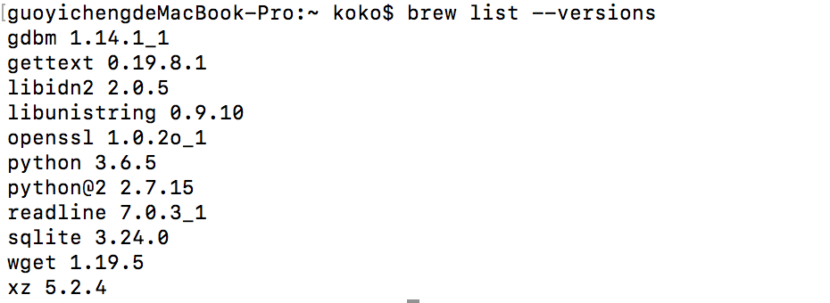

如果要查詢其中一個已經安裝的套件資訊，可以透過 `list` 指定套件：

```bash
$> brew list [套件名稱]
```

例如 `wget` 如下可以看見所有安裝的位置：

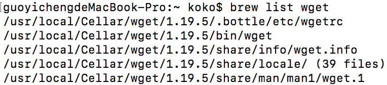

## 列出 Homebrew 中指定的套件資訊
此功能可以查詢 Homebrew 中所存在可以下載的套件資訊，包含需要的依賴套件、或是安裝後的位置、版本號與其他安裝好後的資訊等等。因此該指令不管是有安裝或未安裝的套件都可以查出相關資訊，指令如下：

```bash
$> brew info [套件名稱]
```

例如查詢 `wget` 套件的資訊：

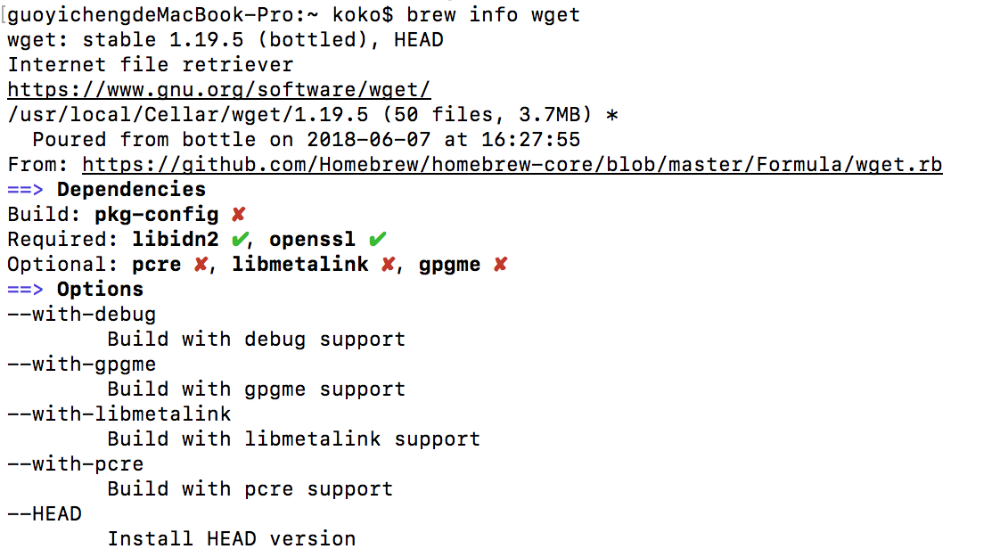

## 安裝第三方 ( Third-party ）的擴充套件

Homebrew 的 `brew` 指令預設所下載的套件來源都是來自於官方的 Github Homebrew Repository，也就是 [`homebrew/homebrew-core`](https://github.com/Homebrew/homebrew-core) 這個 Repository 。 

不過 Homebrew 為了讓更多人參與 Homebrew ，因此開放讓其他人（也就是第三方）加入製作套件，與下載第三方製作的套件，而這些套件下載的來源自來不是 Homebrew ，而是由第三方自己維護的 Repository。

[Hombrew 自己官方有的 Repository 在此](https://github.com/Homebrew)，其中常見的有：

```bash
hombrew/hombrew-cask               # Cask 應用程式軟體
hombrew/ hombrew-cask-versions     # 其他 version 的 Cask 應用程式軟體
hombrew/hombrew-cask-fonts         # 文字
```

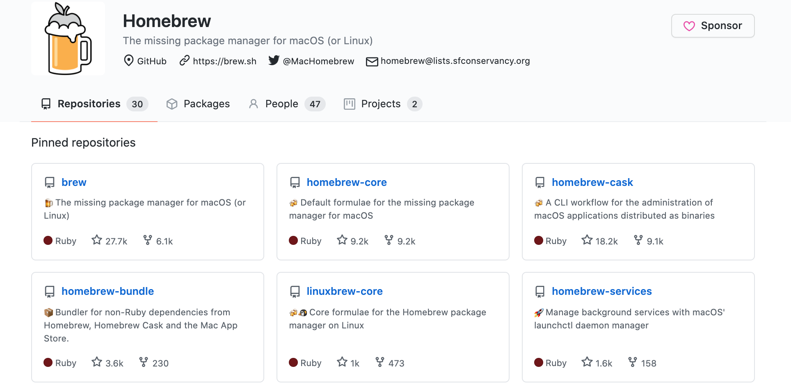

### (1.) 下載 Github 來源的第三方 Repository 擴充套件
而指令如下，如果是下載來自 Github Repository 中的 Homebrew 套件，需要提供該第三方製作者 Github 的 User 名與 Repository 位置：

```bash
$> brew tap [github user/repo]
```

### (2.) 下載其他位置的 Repository 擴充套件
如果是要下載來自其他位置的 Repo ，如下需要再帶入 URL

```bash
$> brew tap [user/repo] <URL>
```

### (3.) 直接列出已經 Tapped 的套件
如果直接輸入 `brew tap`，會自動更新與列出已經 Tapped 套件，如下：

```bash
$> brew tap
```

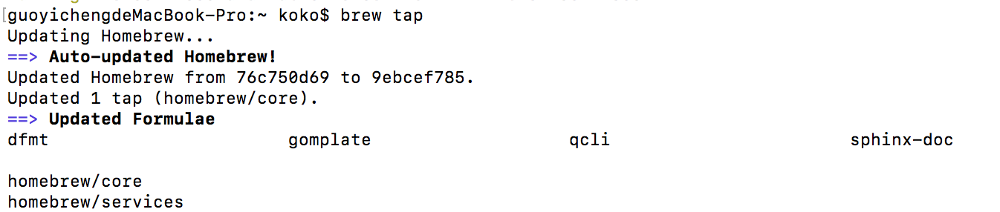


### (4.) 移除已經 tap 下載的 Repository 擴充套件
使用 `untap` 這個指令來移除下載的 Repository 擴充套件：

```bash
$ brew untap [已經 tap 安裝的repository]
```

## 4.擴充套件指令 brew services
上述的套件雖然也在 Homebrew 官方 Github 中，但卻不是 `homebrew/core` （也就是不是我們用 brew 下載的來源位置），此套件是一個擴充功能，協助在 Mac 上有統一的指令管理 services。

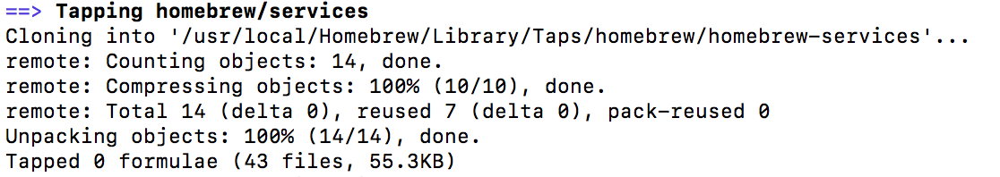

如下是該指令介紹，可以透過 brew 來管理 Mac 所有的 services 程序，重啟或是停止等等。

因為 Mac 並沒有類似的簡易指令，只有透過 `launchctl` 指令，並且還要找到來源位置才能使用，因此不好管理。

```bash
$> launchctl load/unload <path>
```

而 Homebrew 的 services 能夠非常輕鬆的管理：

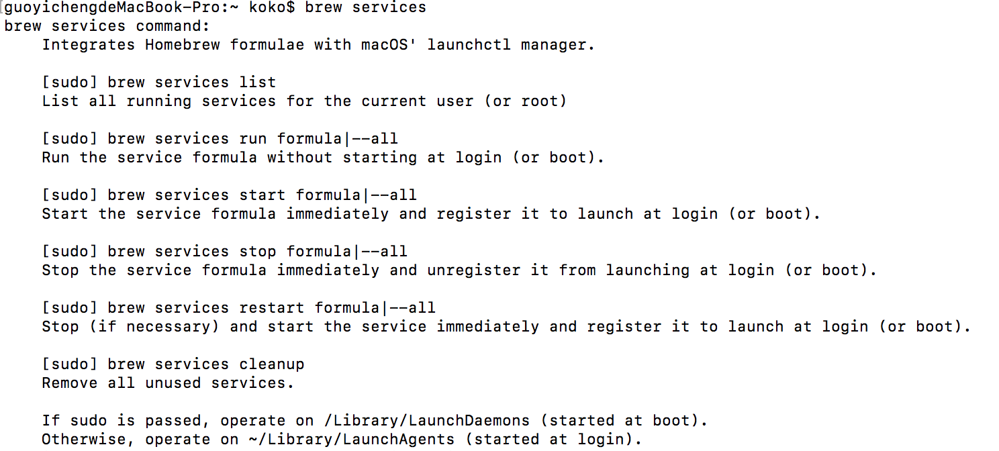

例如啟動與關閉 PostgreSQL 的背景程序，可以輸入：

```bash
$> brew services start postgresql # 請動
$> brew services stop postgresql # 關閉
```

如果要查看所有的 homebrew 支援的 services 狀態，可以透過以下指令：

```bash
$> brew services list
```

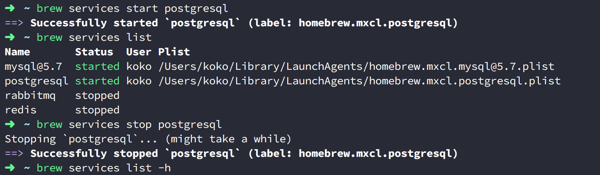

其中狀態的部分，會有 stopped, 綠色的 started 與 黃色的 started，還有 error。而黃色的 started 該顏色在 Homebrew 的代碼中表示 unknown ，而根據 stackoverflow 還有 [Github issue #3227](https://github.com/Homebrew/brew/issues/3227) 的官方解說，表示啟動戴式過程中有狀況因此啟動失敗重新啟動的意思。


## 5.列出已安裝的套件（但是沒有被其它套件相依）
可以查出哪些已經安裝的套件沒有被相依，屬於隱藏指令，如下：

```bash
$> brew leaves
```

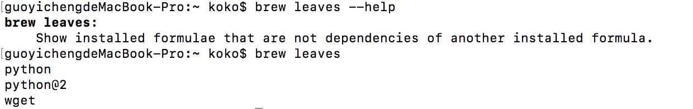

## 6.查詢所有 Homebrew 中的指令
透過此指令可以查詢出 brew 所有的指令用途，並且許多是隱藏指令，如下輸入：

```brew
$> brew commands
```

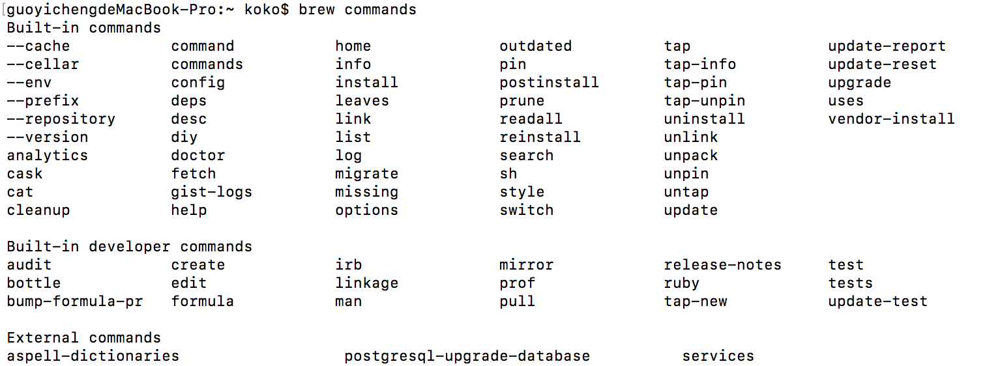

# 參考文件
1. [Homebrew 官方 Tap 介紹](https://docs.brew.sh/Taps)
2. [Homebrew 隐藏命令](http://icyleaf.com/2014/01/homebrew-hidden-commands/)
3. [Homebrew 总结](https://www.jianshu.com/p/8ad7056b243f)
4. [What is the meaning yellow service “started” status on Homebrew?](https://stackoverflow.com/questions/41873704/what-is-the-meaning-yellow-service-started-status-on-homebrew)
5. [brew services not completely started - mongodb](https://stackoverflow.com/questions/46437670/brew-services-not-completely-started-mongodb)
6. [The word "started" should be "starting", if it's in yellow, and process hasn't full started #3227](https://github.com/Homebrew/brew/issues/3227)