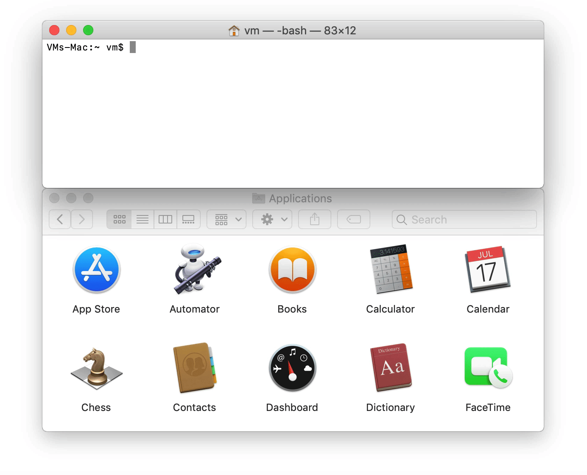
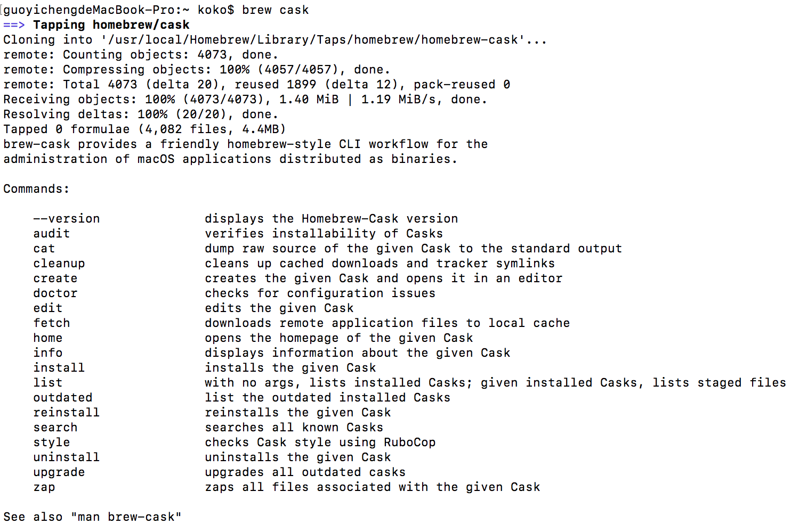
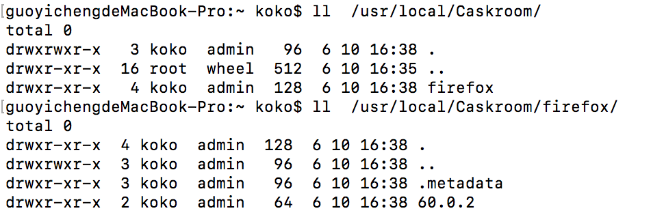
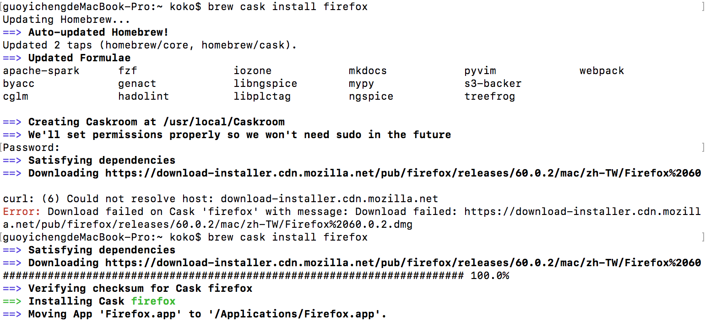
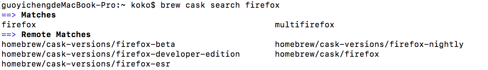
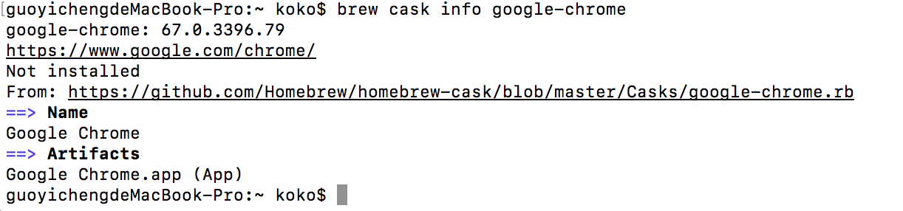
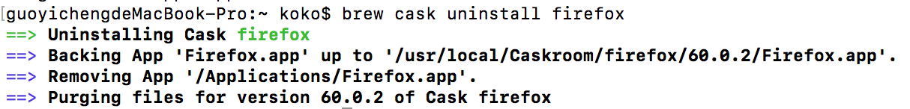

Title: Homebrew (3) - 透過 Homebrew Cask 安裝應用程式或圖形化工具
Date: 2021-04-20
Tags: Mac, Homebrew
Category: Homebrew
Slug: using-homebrew-cask-install-app
Authors: kokokuo
Summary: 前一篇 [Homebrew (2) - Homebrew 常用與隱藏指令]({filename}/posts/20210418-homebrew-useful-command.md) 我們介紹了 Homebrew 的常用指令，使你更加認識這套在 Mac 上方便管理套件指令的工具，而雖然 Homebrew 很方便，但是你會發現 Homebrew 著重在一些套件程式，比較屬於開發者在使用，而不是一般用戶想安裝在 Mac 上的應用軟體，如：Chrome、Skype 等，那有沒有可以幫忙安裝的工具呢？這時就要向你介紹 Homebrew Cask 囉，讓我來認識認識。

# Homebrew Cask 介紹
第一次看到 Homebrew Cask 時或許會覺得已經有 Homebrew 與他的 Tap 擴展指令了，那麼還需要 Homebrew Cask 的差別是什麼？

這裏回頭先介紹一下 Homebrew，Homebrew 存在的主要任務是為了可以在 Mac 上方便管理套件指令的工具，所謂的套件指令是那些需要下載 Source Code 並解壓縮，執行 ./configure && make install 後，並且同時包含相依的套件，設定好環境、編譯好的意思，而 Homebrew 使這些全部自動化，也方便移除。

因此對於開發者而言是一大福音。

而 Homebrew Cask 比較面向一般用戶，繼承了 Homebrew 方便與簡單管理的理念，而延伸強化工具。

Homebrew Cask 主要是方便下載已經編譯好的 Mac OSX 應用程式、一些圖形化軟體 （`.dmg`/`.pkg`），並且存放 Homebrew Cask 管理的目錄中，因此省去平常的下載、解壓縮、拖移與安裝等步驟。例如安裝 Chrome 或是 Atom 等軟體，並且 Homebrew Cask 中還可以安裝許多不在 App Store 的軟體工具，如下圖（來自官方 Github)：




特別是對於 Mac 而言，常常有許多應用程式軟體下載後，在移除時無法完全移除乾淨，而對於使用 Homebrew Cask 而言這將不在麻煩了。

# 安裝 Homebrew Cask
新版的 Homebrew 中， Homebrew Cask 已經整合在其中，不需要再而外透過 tap 下載 Homebrew Cask 才會出現 cask 指令，只要直接輸入安裝應用程式指令，如下載 Atom，便會直接 Tap 下載 Homebrew Cask：

```bash
$> brew cask install atom
```

或是 輸入 brew cask 即可便會自動 tap 下載：

```bash
$> brew cask
```




# Cask 下載的應用程式管理位置
在早期的 Homebrew Cask 版本中，透過 Cask 指令下載的應用程式，會放置在 `/opt/homebrew-cask/Caskroom` 中，並且建立一個 Link 放置 `~/Applications` ，但是此種方式可能會導致 Spotlight 無法查詢到。

不過新版的 Homebrew Cask 中，下載後的應用程式已經直接放置到 `~/Applications` 中，如同一般方式下載好拖移放置的方式一樣，並且會在 `/usr/local/Caskroom` 建立應用程式的相關 metadata 或設定等資料保存的目錄。

例如安裝 firefox 瀏覽器，如下安裝完後會出現在 `~/Applications` ：


同時 `/usr/local/Caskroom` 會有保存 firefox 的設定或資料的目錄產生：



# Homebrew Cask 常用指令

## (1.) 透過 Cask 安裝應用程式
如下以 firefox 為例，會看到 Homebrew Cask 的步驟中會依序建立 firefox 瀏覽器的一些應用程式資料在 `/usr/local/Caskroom` 中，並且把應用程式直接存在 `~/Applications` 下。

```bash
$> brew cask install [應用程式]
```



## (2.)搜尋欲安裝的軟體
透過 `search` 指令，與 Homebrew 的 search 指令一樣可以使用正規表達式去搜尋，以下以 firefox 為例：

```bash
$> brew cask search [搜尋的應用程式，可用正規表達式]
```



## (3.)顯示 Homebrew Cask 中指定要查詢的可安裝軟體資訊
此指令可以查看 Cask 中可以安裝的軟體資訊：

```bash
$> brew cask info [應用程式]
```

例如查看 Chrome 瀏覽器的安裝資訊：



## (4.) 移除應用程式
透過 Homebrew Cask 的移除指令可以乾淨移除軟體，包含存放在 `/usr/local/Caskroom` 中的該軟體相關保存資訊

```bash
$> brew cask uninstall [已安裝應用程式]
```

如下已移除 firefox 為例子：



移除後 `/usr/local/Caskroom` 中的 firefox 目錄也移除。


# 參考文件
1. [brew 和 brew cask 有什么区别？](https://www.zhihu.com/question/22624898)
2. [Cask 讓 OSX 安裝軟體更有效率](http://blog.visioncan.com/2014/introducing-cask/)
3. [再谈 Homebrew Cask 在 macOS 上安装应用的轻松感](https://sspai.com/post/40321)
4. [用 Brew 安装管理软件](http://phenmod.com/blog/2016/01/09/use-brew/)