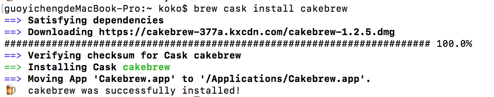
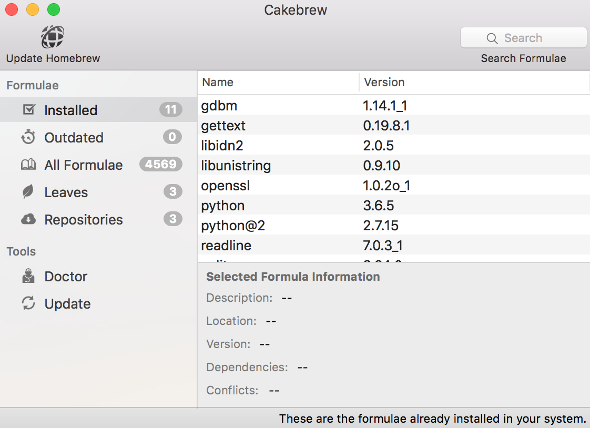
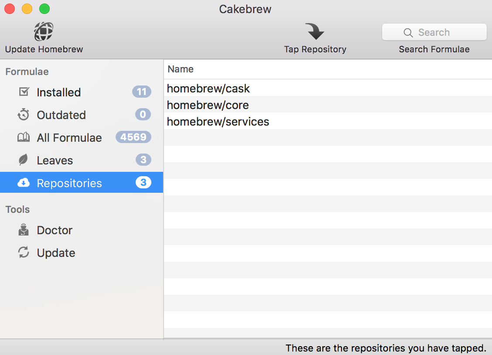
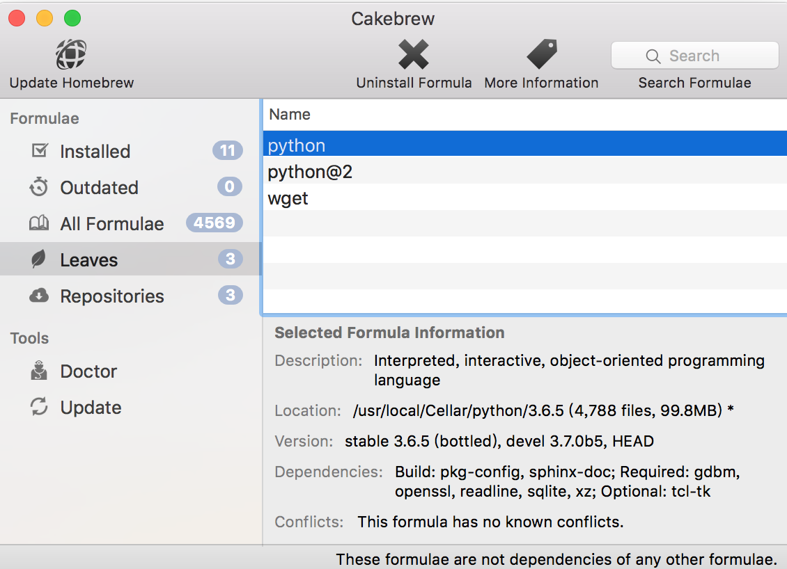

Title: Homebrew (4) - 使用 GUI 介面 Cakebrew 來操作 Homebrew 管理套件
Date: 2021-04-29
Tags: Mac, Homebrew, Cakebrew
Category: Homebrew
Slug: using-cakebrew-gui-to-manage-package
Authors: kokokuo
Summary: Homebrew 是 Mac 上非常便利與強大的安裝套件與軟體，不過會需要使用終端機 Terminal 操作，因此有網友製作出一款方便以 GUI 介紹操作 Homebrew 的美麗 GUI 軟體，也就是 Cakebrew ，以下來介紹與安裝 [Cakebrew](https://www.cakebrew.com/)。

# 前言
Homebrew 是 Mac 上非常便利與強大的安裝套件與軟體，不過會需要使用終端機 Terminal 操作，因此有網友製作出一款方便以 GUI 介紹操作 Homebrew 的美麗 GUI 軟體，也就是 Cakebrew，以下來介紹與安裝 [Cakebrew](https://www.cakebrew.com/)。

# 安裝 Cakebrew
如果已經有 Homebrew Cask ，可以透過 cask 的方式安裝：

```bash
$> brew cask install cakebrew
```

如果沒有 Homebrew Cask ，也可以透過[官網連結](https://www.cakebrew.com/)下載 `.dmg` 檔案並手動安裝。



另外，Cakebrew 主要是 GUI 的 Homebrew 管理介面，換句話說，並無法透過 Cakebrew 來安裝或管理 Homebrew Cask 安裝的軟體。

## Cakebrew 介面

以下列出已經安裝的套件，可以點選套件直接觀看套件的安裝資訊：



### 列出 Tapped 的擴充 Repository

列出 Homebrew 中所有可安裝的套件（如果有 Tapped 新的 Repository，也會顯 Tapped 的 Repo 中的套件）



### 顯示 Leaves 
Leaves 也就是沒有被其它套件相依的已安裝套件：



# 參考文件
1. [官方 Cakebrew](https://www.cakebrew.com/)
2. [如何使用 Cakebrew，美丽的 Homebrew GUI 为您的 Mac](http://www.howtoip.com/how-to-use-cakebrew-the-beautiful-homebrew-gui-for-your-mac/)