Title: Mac -  終端機改造 (1) 安裝 iTerm2
Date: 2021-04-30
Tags: Mac, iterm2
Category: iterm2
Slug: install-iterm2-on-mac
Authors: kokokuo
Summary: Mac 中內建的 Terminal 本身並沒有太多的功能，並且能夠客製化的如配色也非常少，因此此篇文章介紹如何透過 iTerm2 與 zsh 製作出好用的 Terminal 與 Bash。

# 前言
Mac 中內建的 Terminal 本身並沒有太多的功能，並且能夠客製化的如配色也非常少，因此此篇文章介紹如何透過 **iTerm2** 與 **zsh** 製作出好用的 Terminal 與 Bash。

# 步驟一：安裝 iTerm2
iTerm2 是一款 Mac 上強大的 Terminal 軟體，有著許多 Mac 內建 Terminal 沒有的特色功能或是強化功能，例如個人化的顏色設定可調性比內建的多，也可以直接透過 Tab 去選擇目錄進入，不需要都使用指令；多分頁與多視窗；也具備強大的搜尋功能，甚至 AutoComplete 也能做到下拉選單去選擇；建立不同的個人化設定並可以切換；錄製播放...等等。

因此 iTerm2 已經成為 Mac 最具指標的 Terminal ，而安裝 iTerm2 可以直接透過 Homebrew Cask 安裝來方便管理軟體，如下：

```bash
$> brew cask install iterm2
```

或是直接去官網下載：

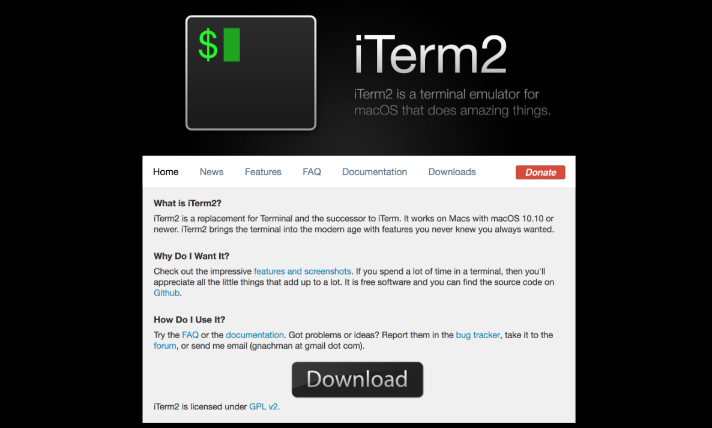


安裝完後會在應用程式中出現，打開如下：

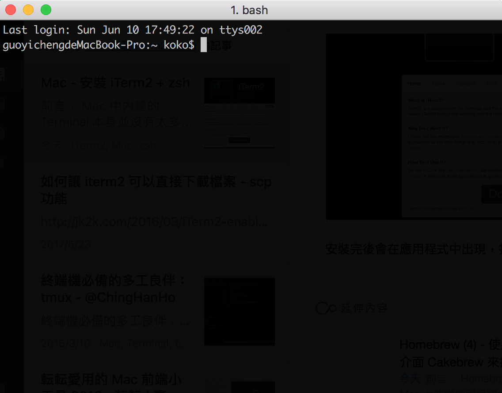

## (1.) 基本功能介紹：分頁使用
**開啟分頁**：透過 `Cmd + t` 兩個按鍵即可開啟分頁多畫面
**分頁切換**：可透過 `Cmd ＋ 方向鍵` 移動 Tab 頁
**直接分頁跳轉**：直接 `Cmd + 數字` 鍵跳到其他 Tab 頁

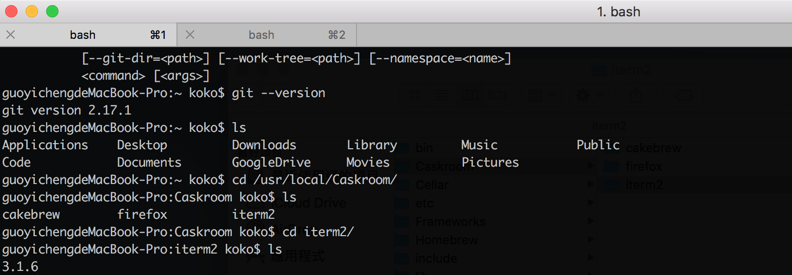

### (2.) 基本功能介紹：全域搜尋
`Cmd + f` 兩個按鍵搜尋的關鍵字會直接全部標示。

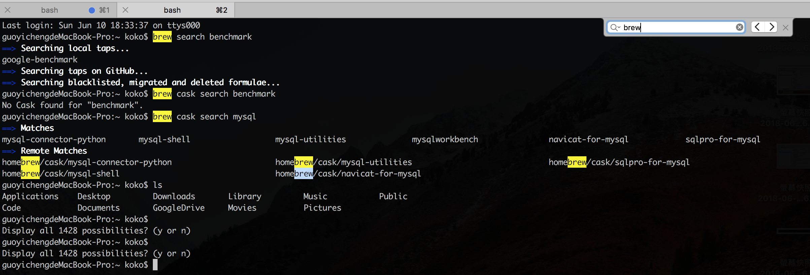

### (3.) 基本功能介紹：直接點選目錄開啟
透過 `Cmd + 滑鼠` 去按 Terminal 中指令的目錄，會直接開啟視窗。

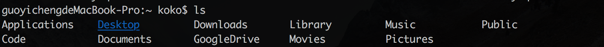

### (4.) 基本功能介紹：Auto Complete 下拉提示
透過按壓 `Cmd + ;` 兩個按鍵，會顯示 Auto Complete 的下拉選擇。

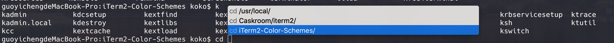

### (5.)新分頁路徑重複
當透過 `Cmd + Tab` 兩個按鍵開啟新分頁時，會顯示路徑在前一個分頁的位置，而不是 Home 目錄，如下圖：

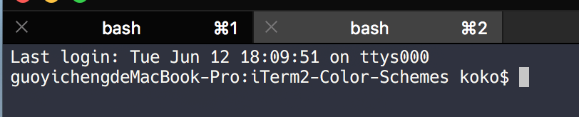

### (6.)搜尋歷史指令
透過 `Cmd + Shift + ;` 三個按鍵可以顯示歷史指令：

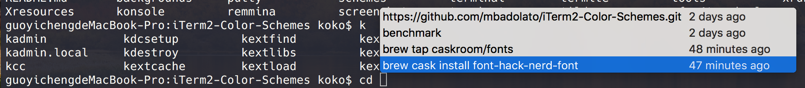

### (7.)水平與垂直切割螢幕(多 Panel)
iTerm2 也支援水平與垂直的畫面切割，每一過新的話面就是新的互動 Shell Panel，透過此方式可以多操作。
**水平切割**：`Cmd + D` 兩個按鍵
**垂直切割**： `Cmd + Shift + D` 三個按鍵
**切換顯示的 Panel**： `Cmd + Option + 方向鍵`

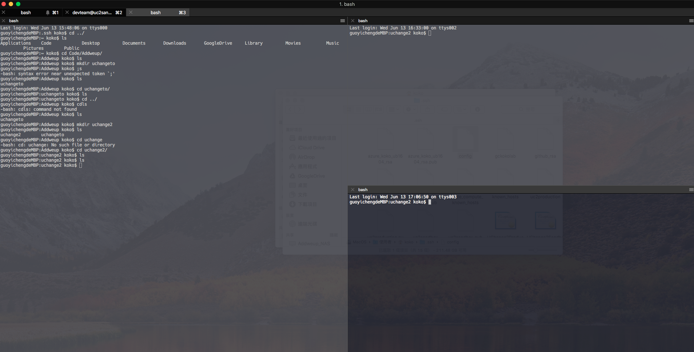


### (8.)顯示目前游標位置
有時候因為畫面資訊太多，會無法容易找到游標位置，可以透過 `Cmd + /` 兩個按鍵找出。

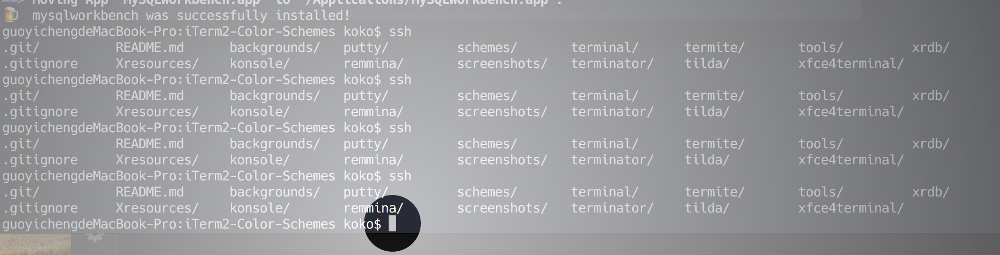


### (9.)直接往下轉到新的畫面
透過輸入 `Cmd + r` 會如同輸入 Clear 顯示新的乾淨畫面，但是與 Clear 不同的是，並不會真的清掉，只是往下滾動到新的畫面出來，如下：

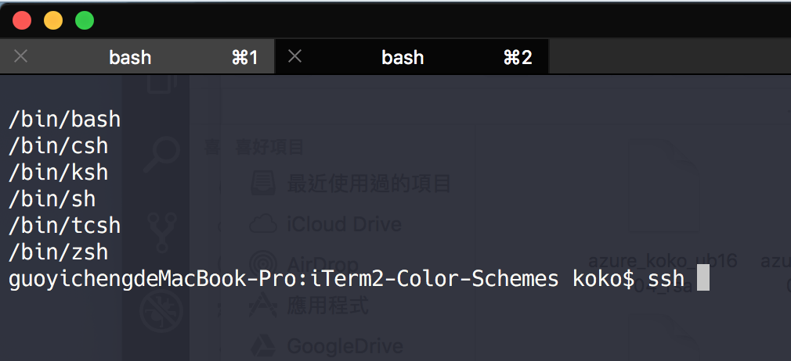

### (10.)清空當前輸入的行內容
當在輸入指令到一半時，要全部清空輸入的內容，可以透過 `Ctrl + u` 清空

### (11.)選擇便是複製
透過滑鼠拖拉想要複製的內容後，直接按著 `Cmd + 滑鼠點擊` 拖拉內容，便會複製，之後只要  `Cmd + v` 貼上即可

### (12.) 自動補齊
透過輸入 `Cmd + ;` 便會根據指令的歷史提示顯示可以自動補齊的內容

### (13.) 顯示最近的目錄
透過輸入 `Option + Cmd + /` 便會根據指令的歷史提示顯示可以自動補齊的內容

## 步驟二：設定 iTerm2
以下來客製化自己的 iTerm2 ，以下主要會設定的有 1. 建立自己的 Profile，設定 Color 、Terminal 與 Text。

### 1.建立自己的 iTerm2 Profile
點選左上角 iTerm2 選單 > Preferences > Profiles ，點選視窗左下方的 + 並建立一個自己的 Profile 如下：

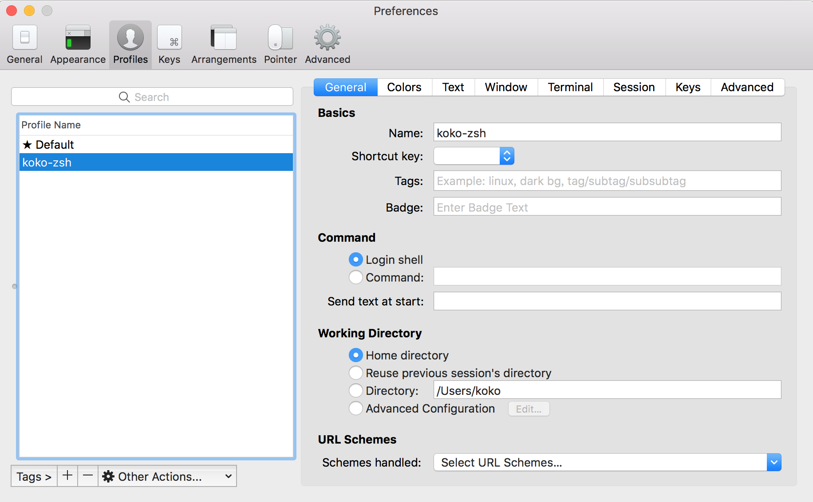

並且點選 Other Actions > Set as Default Profile 使得以後開啟 iTerm2 都以此設定檔為主：

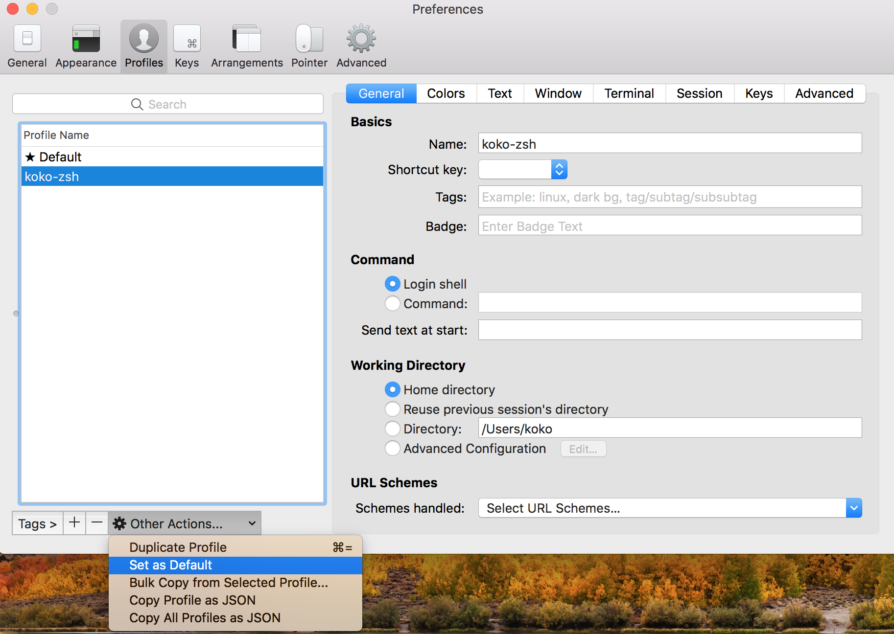

### 2.確認 Report Terminal Type 為 xterm-256color 與設定捲軸可以捲動的 Buffer 長度
設定 Report Terminal Type 為 `xterm-256color` 是為了使 iTerm2 可以使呈現的顏色較飽滿，再來設定 捲軸 Buffer 長度可以使為了要捲動回去查詢時可以直接看到紀錄 （此處不一定要設為 Unlimited scrollback)

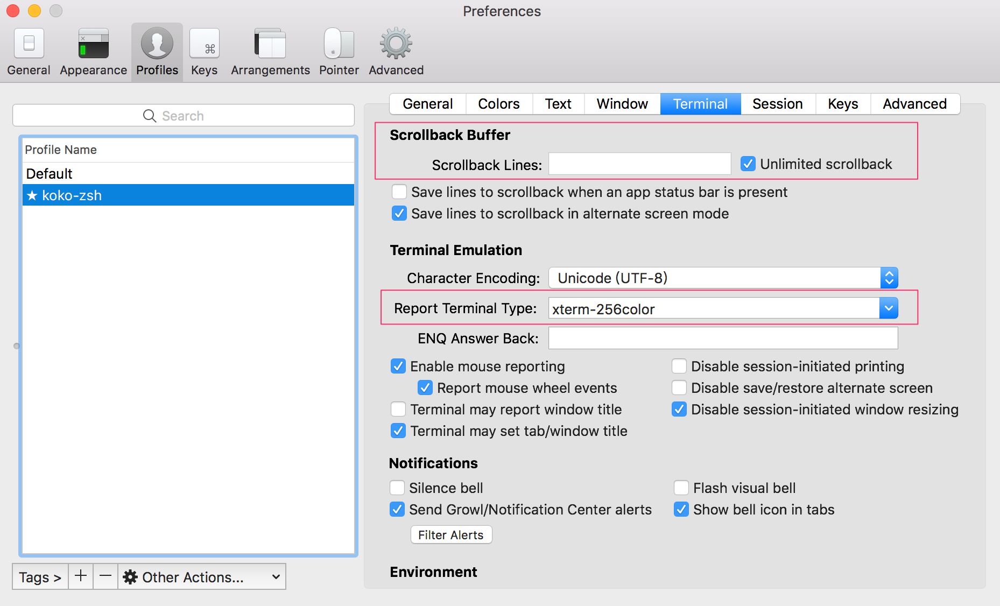

### 3.設定開啟新分頁路徑重複
點選左上角 iTerm2 選單 > Preferences > Profiles > General 的 Wording Directory 勾選 Reuse previous tab’s directory，如下圖：

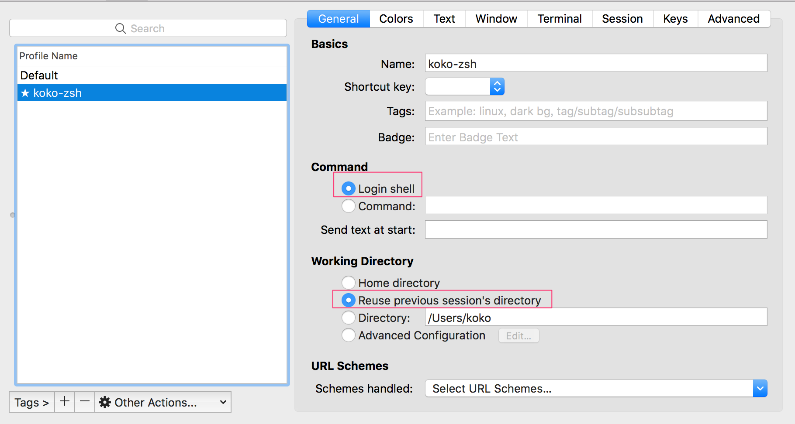

### 4.設定 Color Scheme 
點選 Colors 設定想要 Terminal 配色，此處除了內建色盤外，也提供了以個常見的知名配色，例如 Solarized Dark 等，不過如果想要有可多的配色選擇可以從 Github 上的 [iTerm2-Color-Schemes](https://github.com/mbadolato/iTerm2-Color-Schemes) 下載並 import 進去。

此處如果為了方便一同管理，可以從 git clone 此 iTerm2 Color Schemes 的檔案到 Caskroom 下 iTerm2 的資料目錄中：

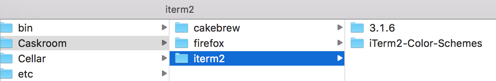

選擇目錄下的 scheme 目錄，並 import 想要的色彩方案：

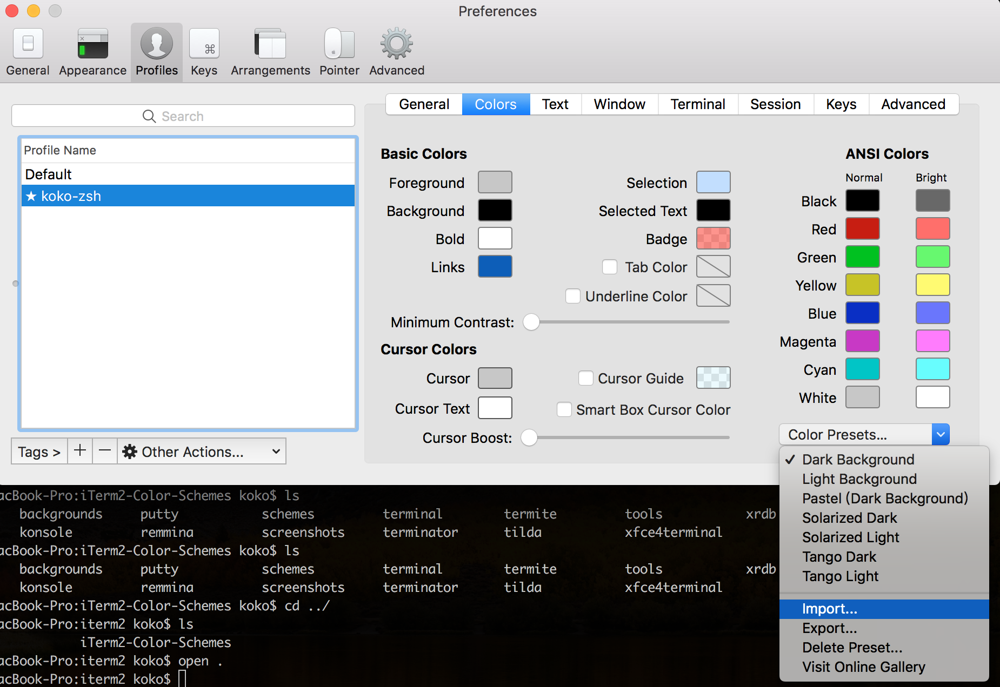

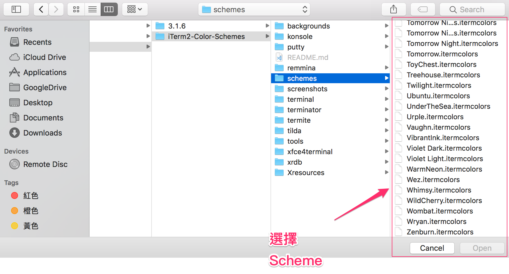

另外，Import 完後還要記得選擇新的 Scheme 才會生效。

如下，此為 匯入 **Dracula** 的 theme 後的樣貌，會發現顏色有直接變化：

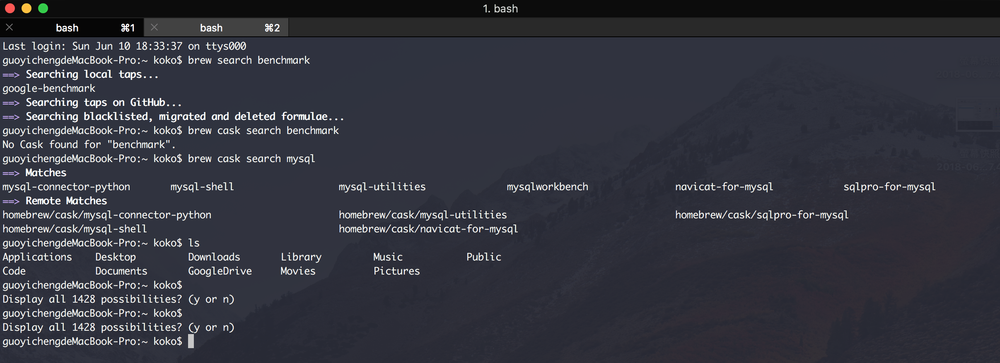

### 5.安裝與設定 Text Font 字型
後續安裝 zsh 提供的主題時，有許多的主題會應用到特殊的字體或圖示 icon，但是 iTerm2 內建中卻沒有提供，因此可能會出現亂碼或問號。

為了要解決這個問題，我們再來會需要先安裝擴充字型圖示。至於擴充字型的部分，可以到 Homebrew Cask 中尋找，在 [Homebrew Cask Fonts](https://github.com/Homebrew/homebrew-cask-fonts) 這個 Repository 可以 Tap 去下載，例如下載 `font-hack-nerd-font` 這套字體：

```bash
$> brew tap homebrew/cask-fonts
$> brew cask install font-hack-nerd-font
```

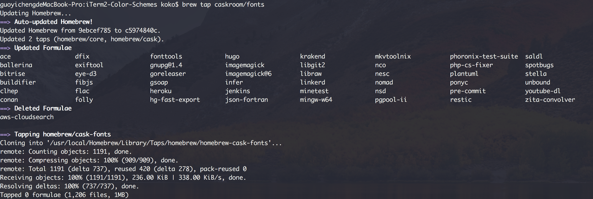

執行安裝字體：

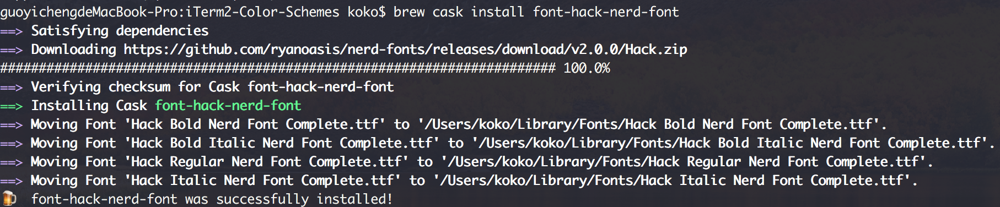

透過 Homebrew Cask 下載好字體，就會直接安裝在 Mac 內建了，因此要使用此字體只需如下點選 Change Font 尋找即可：

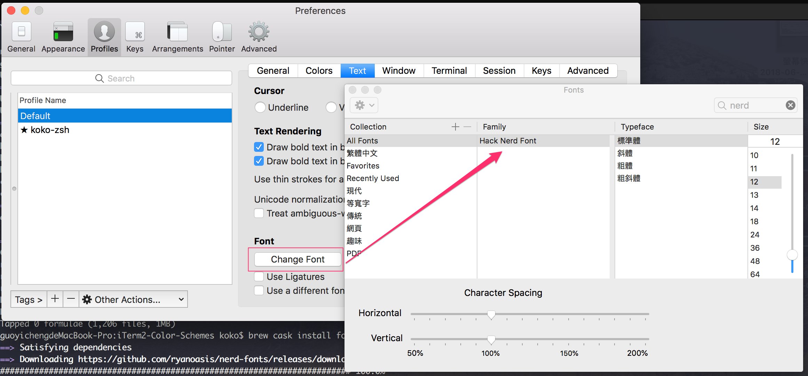

以下是使用預設與 **hack nerd font** 字體後的效果，預設的 **Monaco** 字體，更換後的 **hack nerd font** 字體：

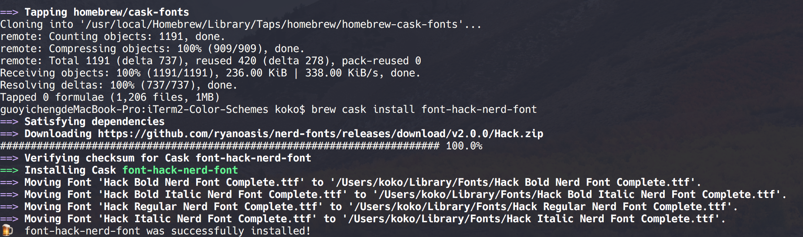

至此已經完成 iTerm2 的安裝與簡單的個性化設定，如果有需要瞭解更多的 iTerm2 功能，可以查閱[官網](https://www.iterm2.com/features.html)。


### 6. 設定鍵盤快捷鍵可以透過 `Ctrl + 左右箭頭` 文字間移動

打開 Preference > 點選 Profile 下的 Key ，選擇要編輯的，Profile Name，然後點選 Presets > **選擇 Natural Text Editing**。

完成後關掉再重開即可以在輸入的指令字串間，透過`Ctrl + 鍵盤的左右鍵`，移動到前一個文字或後一個文字；透過 Cmd + 左右鍵，則可以移動到尾端或開頭。

```bash
word backwards using Option ⌥ + ← and a word forwards using Option ⌥ + →, move to the start of the line using fn + ← and to the end of the line with fn + →. Also you can delete a word backwards using Option ⌥ + ⌫, delete the whole line using Command ⌘ + ⌫.
```

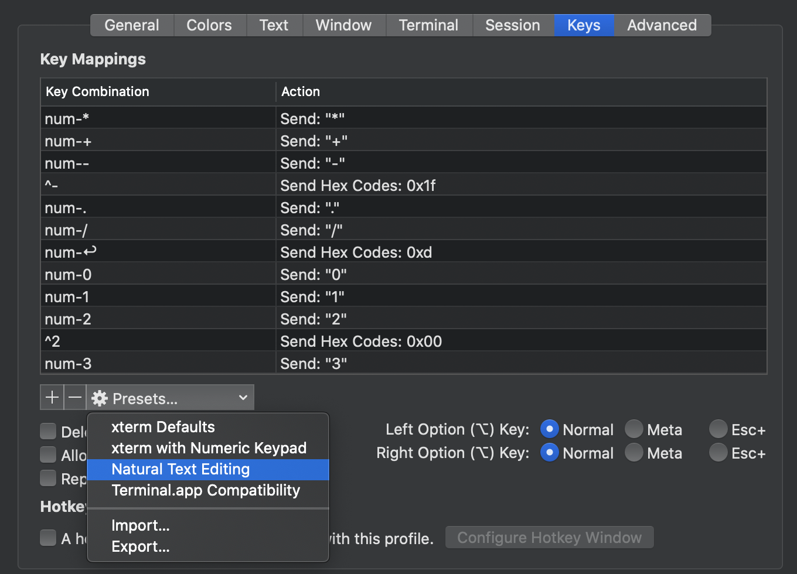

## 參考文章
1. [iTerm2 新手应知特色功能](https://www.yangzhiping.com/tech/iterm2.html)
2. [你应该知道的 iTerm2 使用方法--MAC 终端工具](http://wulfric.me/2015/08/iterm2/)
3. [macOS 好用的終端機(iterm2+zsh+oh-my-zsh)](https://andy6804tw.github.io/2018/01/01/iterm2-zsh-intro/#1-%E4%BF%AE%E6%94%B9-report-terminal-type)
4. [[心得] iTerm2 + zsh，打造更好的工作環境](http://huli.logdown.com/posts/402147-iterm2-zsh-better-environment)
