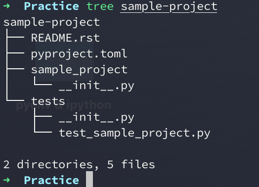
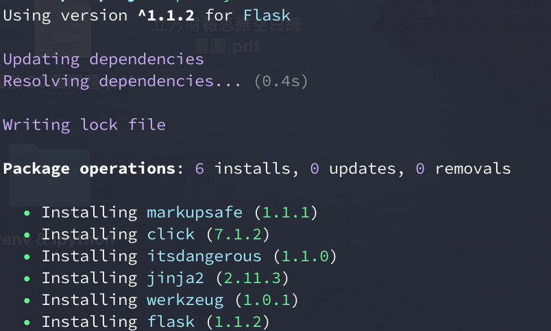
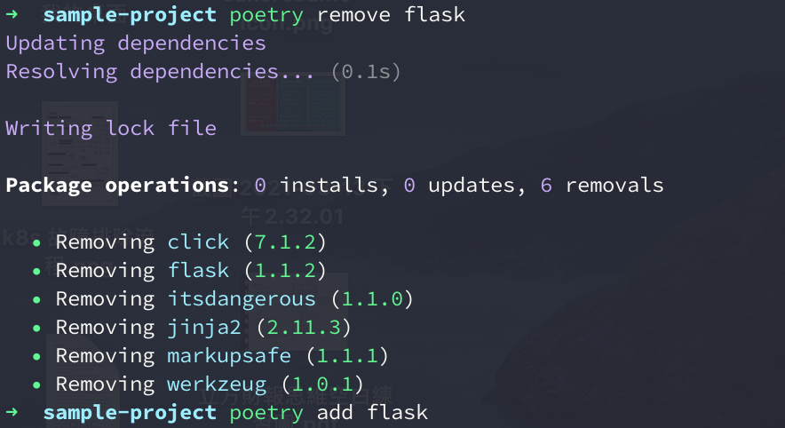
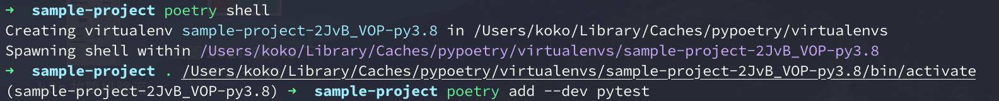
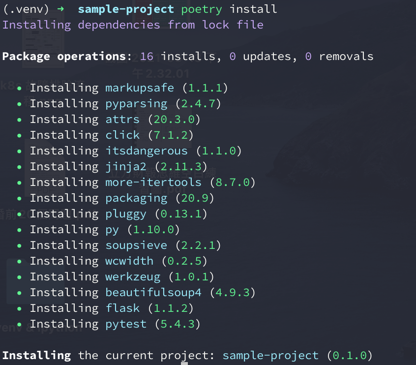

Title: Python - 取代 Pipenv 的新套件管理器 Poetry
Date: 2021-03-07
Tags: Python, pyenv, poetry
Category: Python
Slug: using-poetry-manage-python-package-environments
Authors: kokokuo
Summary: 


# 前言
說到 Python 近幾年著名的套件管理器時，肯定許多人的腦中都會想到 Pipenv，一問世便提供了許多的功能並結合了其他語言的套件件管理器優點。

Pipenv 雖然強大，卻也暴露出了一些問題如 Lock 過慢、Windows 支援性差、對 PyPI 套件打包的友善度差...等更多其他問題，甚至有越來越多人表明 [不要使用 Pipenv](http://greyli.com/do-not-use-pipenv/) 或 [pipenv 的凋零與替代方案 poetry](https://blog.gslin.org/archives/2019/12/21/9347/pipenv-%E7%9A%84%E5%87%8B%E9%9B%B6%E8%88%87%E6%9B%BF%E4%BB%A3%E6%96%B9%E6%A1%88-poetry/) 等。

同時 Pipenv 的社群維護狀況也越來越差，有許多的 PR 都沒有被 Release，導致許多貢獻者抱怨，甚至有人發出了該篇 [If this project is dead, just tell us](https://github.com/pypa/pipenv/issues/4058) issue 想知道是否專案已經不在維護。

恰好在這個時間點，名為[Poetry](https://python-poetry.org/) 的另一套虛擬環境與套件依賴管理器誕生。

雖然發展尚短，然而功能的完善程度甚至超越 Pipenv，不僅原生支援 `pyenv` 的 Python 版本路徑，也支援 PyPI 的 `setup.py` 打包功能，宛如 `Pipenv` + `Flit` 的合體，甚至能提供你處理依賴套件或 Python 版本的向下相容！

這麼優秀的套件管理器，我們怎麼能錯過忽視呢？

# Poetry 是什麼
Poetry 是一套套件依賴管理與虛擬環境隔離的工具，採用 `pyproject.toml` 來替代 `Pipfile`、`requirements.txt`、`setup.py`、`setup.cfg`、`MANIFEST.ini` 等設置文件。

支援 Mac / Linux / Windows 環境使用，透過 `poetry show --tree` 更清楚的看見套件的各個依賴關係，移除套件時能自動移除相依套件。

在套件管理上能夠對相同的套件指定不同的支援 Python 版本（如: `pytest` 可以指定 `python 2.7` 時安裝特定版號；`python 3.6` 時安裝特定版本)。

```toml
[tool.poetry.dependencies]
pytest = [
    {version = "<=6.0.0", python = "^2.7"},
    {version = "^6.2.3", python = "^3.6"}
]
```

此外若有使用 `pyenv` 時，`poetry` 的隔離虛擬環境的版本會自動採用目前 `pyenv` 所指定的 Python 版本。也支援程式的打包與發佈的功能，方便製作程式為套件本身，也可取代 `setup.py` 發布至 PyPI 上。

# 安裝 Poetry
在你目前的 Python 環境中透過 `pip` 安裝即可：

```bash
$> pip install poetry
$> poetry about

Poetry - Package Management for Python

Poetry is a dependency manager tracking local dependencies of your projects and libraries.
See https://github.com/python-poetry/poetry for more information.
```

# 使用 Poetry 管理套件

## 初始化 `pyproject.toml`
在 Poetry 中 `pyproject.toml` 如同 Pipenv 的 `Pipfile` ㄧ樣，是套件安裝與依賴的設置文件，因此如果你的專案沒有 `pyproject.toml` ，可以透過以下指令初始化建立，並詢問你一些問題 (類似 `yarn` 或 `npm`)：

```bash
$> poetry init

This command will guide you through creating your pyproject.toml config.

Package name [poetry-sample]]:
Version [0.1.0]:
Description []:  Poetry sample projecy
Author [kokokuo <v6610688@gmail.com>, n to skip]:
License []:  MIT
Compatible Python versions [^3.9]:  ^3.7
....
```

接著完成之後，你會看到你的專案中出現了 `pyproject.toml` 檔案，這就是 Poetry 使用的套件依賴管理設定文件，格式如下：

```toml
[tool.poetry]
name = "sample-project"
version = "0.1.0"
description = ""
authors = ["kokokuo <v6610688@gmail.com>"]

[tool.poetry.dependencies]
python = "^3.8"

[tool.poetry.dev-dependencies]
pytest = "^5.2"

[build-system]
requires = ["poetry-core>=1.0.0"]
build-backend = "poetry.core.masonry.api"
```

## 從頭建立帶有 `pyproject.toml` 的專案
如果你連專案都還沒有，那麼 `poetry` 也很貼心的如同 django 或是 rails ㄧ樣，提供你完整的專案目錄與 `pyproject.toml` 的建置：

```bash
$> poetry new [your project name]
```

如下例子參考：

```bash
$> poetry new sample-project
Created package sample_project in sample-project
```



## 安裝套件

如果要安裝或移除套件，在 Poetry 分別透過 `poetry add [套件]` 與 `poetry remove [套件]` 兩個指令執行： 

其中如果安裝套件時，只想要在開發環境下，發布生產環境時不打算被裝進去用，則可以透過 `poetry add --dev [套件]` 指令。

```bash
# install package
$> poetry add flask
$> poetry add --dev poetry # only install in development used
```



當你安裝完後，你會發現專案的目錄中多了 `poetry.lock`，該檔案會檢查並驗證下載的來源，同時還會記錄每個被 lock 的套件支持哪一版 Python 或其他的依賴套件：

```toml
[[package]]
name = "atomicwrites"
version = "1.4.0"
description = "Atomic file writes."
category = "dev"
optional = false
python-versions = ">=2.7, !=3.0.*, !=3.1.*, !=3.2.*, !=3.3.*"

[[package]]
name = "attrs"
version = "20.3.0"
description = "Classes Without Boilerplate"
category = "dev"
optional = false
python-versions = ">=2.7, !=3.0.*, !=3.1.*, !=3.2.*, !=3.3.*"

[package.extras]
dev = ["coverage[toml] (>=5.0.2)", "hypothesis", "pympler", "pytest (>=4.3.0)", "six", "zope.interface", "furo", "sphinx", "pre-commit"]
docs = ["furo", "sphinx", "zope.interface"]
tests = ["coverage[toml] (>=5.0.2)", "hypothesis", "pympler", "pytest (>=4.3.0)", "six", "zope.interface"]
tests_no_zope = ["coverage[toml] (>=5.0.2)", "hypothesis", "pympler", "pytest (>=4.3.0)", "six"]

,,,,
```

## 移除套件

同樣的，如果想要移除開還環境使用的套件，則是 `poetry remove --dev [套件]`：

```bash
# uninstall package
$> poetry remove flask
$> poetry remove --dev poetry  # uninstall development used package
```




你會發現在 Poetry 中，當你移除套件時，該套件所需要的依賴套件也會被ㄧ同移除。

## 顯示已安裝的套件與依賴版本
Poetry 中提供友善的查看套件安裝清單指令，你只需要透過 `poetry show` 即可快速了解已安裝的套件與描述，如下面的例子：

```bash
$> poetry show
attrs          20.3.0 Classes Without Boilerplate
click          7.1.2  Composable command line interface toolkit
flask          1.1.2  A simple framework for building complex web applications.
itsdangerous   1.1.0  Various helpers to pass data to untrusted environments and back.
jinja2         2.11.3 A very fast and expressive template engine.
markupsafe     1.1.1  Safely add untrusted strings to HTML/XML markup.
more-itertools 8.7.0  More routines for operating on iterables, beyond itertools
packaging      20.9   Core utilities for Python packages
pluggy         0.13.1 plugin and hook calling mechanisms for python
py             1.10.0 library with cross-python path, ini-parsing, io, code, log facilities
pyparsing      2.4.7  Python parsing module
pytest         5.4.3  pytest: simple powerful testing with Python
wcwidth        0.2.5  Measures the displayed width of unicode strings in a terminal
werkzeug       1.0.1  The comprehensive WSGI web application library.
```

另外，如果你也想要知道依賴的套件與版本，則可以透過 `poetry show --tree` 了解：

```bash
$> poetry show --tree
flask 1.1.2 A simple framework for building complex web applications.
├── click >=5.1
├── itsdangerous >=0.24
├── jinja2 >=2.10.1
│   └── markupsafe >=0.23
└── werkzeug >=0.15
pytest 5.4.3 pytest: simple powerful testing with Python
├── atomicwrites >=1.0
├── attrs >=17.4.0
├── colorama *
├── more-itertools >=4.0.0
├── packaging *
│   └── pyparsing >=2.0.2
├── pluggy >=0.12,<1.0
├── py >=1.5.0
└── wcwidth *
```

## 進入 Poetry 套件管理的虛擬環境

雖然在上述中，我們安裝了許多套件，但如果 `Pipenv` ㄧ樣，這些套件都被放在虛擬環境中，因此如果沒有進入到虛擬環境，你的目前專案的開發環境不會找得到你已經安裝的這些套件，而要進入虛擬環境可以透過 `poetry shell`:

```bash
$> poetry shell
```

透過上述，你會發現對於 Poetry 來說，這些虛擬環境都會在第一次執行 `poetry shell` 指令時，建置一個虛擬環境到統一的 `/Users/koko/Library/Caches/pypoetry/virtualenvs` 目錄下，並各自以專案名稱為起頭建立一個虛擬環境目錄。

例如下圖，以 `sample-project` 這個專案來說，虛擬環境的目錄名稱會是 `sample-project-2JvB_VOP-py3.8`，每第一次建立虛擬環境時名稱都會是隨機:



那麼，如果我想要指定虛擬環境在我目前這個專案中要怎麼做呢？

### 指定虛擬環境路徑在專案中
如果你不希望 Poetry 統一在他指定的路徑中管理虛擬環境的話，根據 Poetry 的文件 [Configuration](https://python-poetry.org/docs/configuration/) 提到，在 poetry config --list 可以查看對於 poetry 的設定：

```bash
$> poetry config --list
cache-dir = "/Users/koko/Library/Caches/pypoetry"
experimental.new-installer = true
installer.parallel = true
virtualenvs.create = true
virtualenvs.in-project = null
virtualenvs.path = "{cache-dir}/virtualenvs"  # /Users/koko/Library/Caches/pypoetry/virtualenvs
```

其中 `virtualenvs.in-project` 這個參數便是可以指定虛擬環境是否要建置在專中的選項，而預設都會是 `null`，如果想要更改他，可以直接修改該參數，如下：

```bash
$> poetry config virtualenvs.in-project = true # globally update
```

此外 `virtualenvs.path` 是你預設的虛擬環境建立位置（當 `in-project = null` 時）。

不過上述的行為都會**全域**影響 poetry 是否要在專案中建立虛擬環境。

若你需要 By 各個專案設定的話，那你可以在你的專案內建立一個名為 `poetry.toml` 的 poetry 設定檔，並在檔案中建立 `[virtualenvs]` 區塊並指定 `in-project = true` 即可：

```toml
[virtualenvs]
# This config will let poetry auto build virtualenv in project and create a .venv folder to install required package from proetry.toml.
in-project = true
```

更改完後，刪除目前的虛擬環境，並再次進入 shell :

```bash
$ sample-project> cd /Users/koko/Library/Caches/pypoetry/virtualenvs
$ /Users/koko/Library/Caches/pypoetry/virtualenvs> rm -rf sample-project-2JvB_VOP-py3.8

# Enter shell again to build virtual env in the project
$ sample-project> poetry shell
Creating virtualenv sample-project in /Users/koko/Code/Practice/sample-project/.venv
Spawning shell within /Users/koko/Code/Practice/sample-project/.venv
$ sample-project> . /Users/koko/Code/Practice/sample-project/.venv/bin/activate

$ (.venv) sample-project>
```

完成後，你會發現如果建立在專案中，虛擬環境的目錄預設就不會在這麼長，而是單純名為 `.venv`。

## 安裝所有配置在 pyproject.toml 的套件
由於虛擬環境只會建置在你本機上，因此當今天當你任何一個遠端的 Repository 做了 `git clone` 後，這些虛擬環境並不存在，而在 Poetry 中，如果要還原這個環境，便會需要 `pyproject.toml` 這樣的配置檔。

因此若當們需要在其系統上還原這個安裝的環境，我們可以透過 `poetry install` 來幫我們達成:

```bash
$> poetry install
```

如下圖參考：




## 總結
經過走一遍 Poetry 之後，不管你喜不喜歡他的風格，總之我是喜歡上了。不僅 lock 的速度快，也支援更多細緻的設定，`pyproject.toml` 也能指定各個套件所依賴的 Python 版本到多少，也原生支持 pyenv 目前指定的 Python 版本，`poetry show` 也很一目瞭然，幫助我在開發上加快比 Pipenv 的速度！

如果你還在使用 Pipenv 的話，那我會真心建議你，是時候該來好好認識 Poetry 這個套件依賴管理器了。

# 參考來源
- [不要使用 Pipenv](http://greyli.com/do-not-use-pipenv/)
- [pipenv 的凋零與替代方案 poetry](https://blog.gslin.org/archives/2019/12/21/9347/pipenv-%E7%9A%84%E5%87%8B%E9%9B%B6%E8%88%87%E6%9B%BF%E4%BB%A3%E6%96%B9%E6%A1%88-poetry/) 
- [If this project is dead, just tell us](https://github.com/pypa/pipenv/issues/4058)